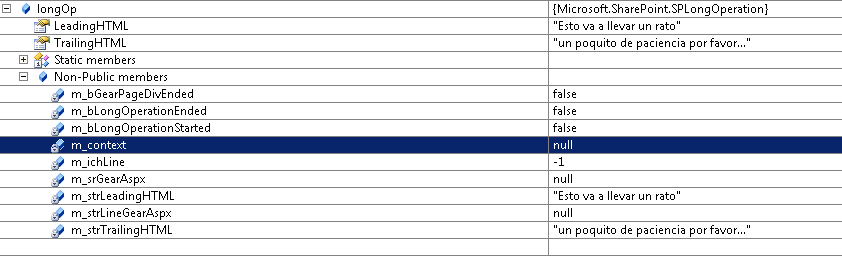
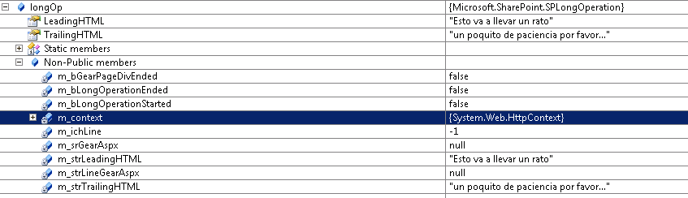

​En ocasiones cuando estamos efectuando alguna operación en SharePoint de manera programática dicha operación lleva un tiempo considerable en efectuarse, si la operación se está efectuando de forma síncrona el usuario verá que su navegador queda "congelado" mientras la operación se completa. Si en cambio, se está efectuando de forma asíncrona el usuario puede no percibir que se haya efectuado la operación.

Para informar al usuario del procesamiento, el SDK de SharePoint nos proporciona la clase **SPLongOperation** que nos permite mostrar una ventana con un mensaje informando de la operación que se está efectuando  mientras se está realizando la operación. Esta ventana es la ya conocida por los usuarios de SharePoint donde se muestra una animación y un texto.


La clase SPLongOperation es fácil de usar. En teoría basta con instanciar un objeto, fijar los textos a mostrar e invocar el método Begin(). A continuación se sitúa el código de larga duración y se acaba invocando End() ¿Fácil no?

```
using (SPLongOperation longOp = new SPLongOperation(this.Page))
```

```
{
```

```
longOp.LeadingHTML = "Esto va a llevar un rato";
```

```
longOp.TrailingHTML = "Un poquito de paciencia por favor...";
```

```
longOp.Begin();
```

```
 
```

```
// El código de larga duración va aquí
```

```
       longOp.End(this.Page);
```

```
}
```

Pero…cuando utilizamos el código anterior dentro de un EventReceiver de, por ejemplo una lista, el código anterior  falla ya que "this" no tiene la propiedad Page… ¿Qué está pasando aquí?

Los eventReceivers permiten interceptar los eventos que se producen en SharePoint para añadir o modificar funcionalidad de forma programática. Dependiendo del evento que se esté interceptando, el eventReceiver corre de forma síncrona como en el caso de ItemAdding o itemDeleting o de forma asíncrona como ItemAded o ItemDeleted.

Qué el eventReceiver se ejecute de forma síncrona implica que se ejecuta en el hilo de ejecución del GUI, si corre de forma asíncrona se lanza un hilo de ejecución distinto lo que permite al GUI progresar.

De modo que si el evento donde tenemos nuestro código de larga duración se ejecuta de forma asíncrona, no tenemos acceso al GUI lo que implica que en principio tampoco hay acceso a ese objeto page que necesitamos.

Nuestro objetivo entonces será lograr tener ese objeto Page, para ello vamos a tener que realizar un par de modificaciones:

Nuestro primer paso es lograr que el EventReceiver se ejecute de forma síncrona, si es que se ejecuta de forma asíncrona por defecto, para tener acceso al contexto. Para ello dependiendo de cómo asociemos el evento a la lista realizaremos una de estas dos opciones:

- Si se asocia desde la definición modificaremos el elements.xml añadiendo un elemento synchronization como se muestra a continuación


```
<Receiver>
```

```
    <Name>MiEventReceiverItemAdded</Name>
```

```
    <Type>ItemAdded</Type>
```

```
    <Assembly>$SharePoint.Project.AssemblyFullName$</Assembly>
```

```
    <Class>MiSolucion.MiEventReceiver.MiEventReceiver</Class>
```

```
    <Synchronization>Synchronous</Synchronization>
```

```
    <SequenceNumber>10000</SequenceNumber>
```

```
</Receiver>
```

- Si se<br />asocia de forma programática se fija la propiedad Synchronization al definir el<br />objeto SPEventReceiverDefinition


```
SPEventReceiverDefinitionCollection eventReceivers = miSPWebSite.Lists["Nombre de la lista"].EventReceivers;
```

```
 
```

```
SPEventReceiverDefinition evRec=eventReceivers.Add();
```

```
evRec.Assembly= Assembly.GetExecutingAssembly().FullName;
```

```
evRec.Class="MiSolucion.MiEventReceiver.MiEventReceiver";
```

```
 
```

```
evRec.Synchronization=SPEventReceiverSynchronization.Synchronous;
```

```
 
```

```
evRec.Type=SPEventReceiverType.ItemAdded;
```

```
evRec.Update();
```

Ya tenemos el evento ejecutándose de forma síncrona pero aún falta conseguir referencias al contexto http, si intentamos conseguir una referencia a HttpContext.Current cuando se dispara el evento veremos que nos devuelve null.

Para conseguir una referencia al contexto declaramos en la clase manejadora de los eventos una propiedad del tipo HttpContext y en el constructor es donde podemos obtener la referencia al contexto actual.

```
public class MiEventReceiver : SPItemEventReceiver
```

```
{
```

```
private SPContext _spContext;
```

```
private HttpContext _httpContext;
```

```
 
```

```
 
```

```
public MiEventReceiver()
```

```
{
```

```
_spContext = SPContext.Current;
```

```
_httpContext = HttpContext.Current;
```

```
}
```

```
// resto del manejador
```

```
}
```

Con<br />esto ya disponemos de una referencia al contexto, con ella podemos conseguir la<br />página que hemos de pasar al constructor de SPLongOperation:

```
Page pagina = (Page)_httpContext.CurrentHandler;
```

Aun así el código de SPLongOperation falla al ejecutarlo en el eventReceiver lanzando una excepción de referencia a objeto nulo. Pero, ¿No teníamos ya una referencia válida a la página?

Así es, pero si examinamos el objeto SPLongOperation veremos que una propiedad interna llamada m\_context está a null.



¿Cómo proporcionar ese contexto? No hay un método en SPLongOperation que permita fijarlo explícitamente pero resulta que esta clase usa el contexto actual para fijar internamente el valor, luego lo que tenemos que hacer es incluir antes de invocar el método Begin() la siguiente sentencia:

```
HttpContext.Current = _httpContext;
```

Tras<br />añadir esta sentencia y reexaminando el objeto vemos que ahora la propiedad<br />interna m\_context si tiene un valor distinto de null.



Ahora el código si funciona y en el navegador se muestra la ventana de proceso con los mensajes que hemos incluido.

El código final en el método (obviando control de errores etc…) es el siguiente:

```
public override void ItemAdded(SPItemEventProperties properties)
```

```
{
```

```
base.ItemAdded(properties);
```

```
 
```

```
Page pagina = (Page)_httpContext.CurrentHandler;
```

```
HttpContext.Current = _httpContext;
```

```
 
```

```
using (SPLongOperation longOp = new SPLongOperation(pagina))
```

```
{
```

```
try
```

```
{
```

```
longOp.LeadingHTML = "Procesando";
```

```
longOp.TrailingHTML = "Un poco de paciencia por favor...";
```

```
longOp.Begin();
```

```
 
```

```
// El código de larga duración va aquí ;)
```

```
CalcularElPrimerMillonDeDecimalesDePi();
```

```
 
```

```
                                          longOp.EndScript("window.frameElement.commitPopup();");
```

```
}
```

```
catch (ThreadAbortException)
```

```
{      // Este error puede ocurrir porque SPLongOperation.End efectúa una llamada interna a Response.Redirect internamente y no tiene en cuenta que se puede estar ejecutando otro código
```

```
}
```

```
}
```

```
}
```

El elemento final consiste en invocar el método EndScript en lugar de End ya que en este caso el evento que se ha escogido es el de ItemAdded lo que implica que habrá una ventana modal donde el usuario habrá introducido los datos.

Invocando longOp.EndScript("window.frameElement.commitPopup();") conseguiremos que tras la ejecución del código al usuario se le cierre la ventana modal volviendo a la ventana del navegador donde se muestra la lista.

Nuestro usuario ya estará contento al ver una ventana que relaja su impaciencia mientras efectuamos esa operación que tanto trabajo lleva.

Claro que lo siguiente que el usuario dice es: ¿Y no puedes ir cambiando el mensaje según se van haciendo cosas?

Si intentamos ir cambiando la propiedad TrailingHTML el mensaje no se actualiza. Para este refinamiento tendremos que usar la clase SPStatefulLongOperation, ya que con esta clase podemos realizar la operación informando del progreso de la misma al usuario.

En este caso el código a incluir dentro del eventReceiver es el siguiente:

```
SPStatefulLongOperation.Begin(
```

```
"Texto de cabecera", 
```

```
"<span id='trailingSpan'></span>",
```

```
(op) =>
```

```
{
```

```
op.Run((estado) =>
```

```
{
```

```
String texto = "texto a actualizar";
```

```
estado.Status ="<script type='text/javascript'>" + "document.all.item('trailingSpan').innerText = '" + texto +"';" + "</script>";
```

```
       
```

```
//aquí va parte del código de larga duración
```

```
 
```

```
.....
```

```
 
```

```
String texto = "actualizando texto..";
```

```
estado.Status ="<script type='text/javascript'>" + "document.all.item('trailingSpan').innerText = '" + texto +"';" + "</script>";
```

```
 
```

```
//más código de larga duración
```

```
});
```

```
 
```

```
op.EndScript("window.frameElement.commitPopup();");
```

```
});
```

**Alberto Carlos Escola Fiz**
Consultor técnico
[albertoescola@hotmail.com](mailto:albertoescola@hotmail.com)

