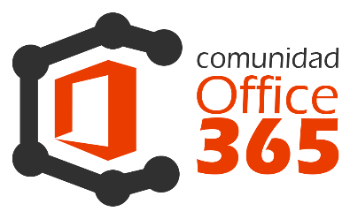
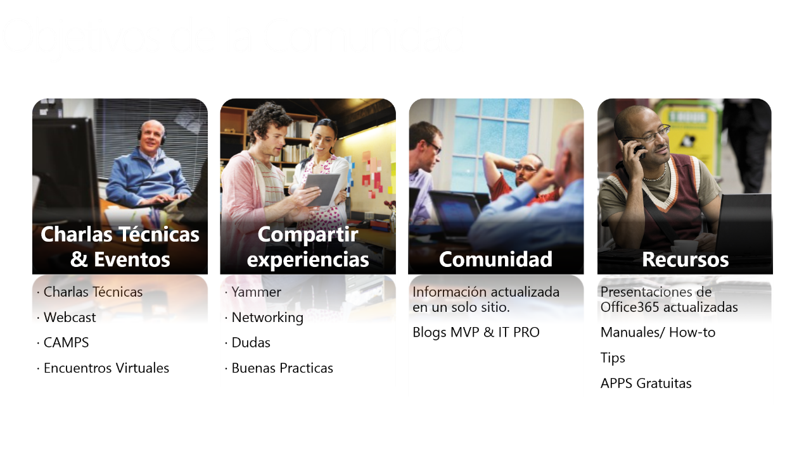
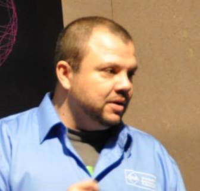
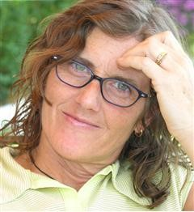

​Office 365 no es la suite de Office como muchos de los usuarios pueden entender, si es cierto que forma parte del producto, pero en realidad es un conjunto de servicios ubicados en la nube que nos permitirán aprovechar al máximo con el mínimo coste y esfuerzo de las nuevas tecnologías, ya sea una empresa, un autónomo, o un usuario particular.

Todo producto conlleva consigo una estructura detrás de sí mismo, por ejemplo, cuando *Microsoft* lanzó Microsoft Windows 8, no solo lanzó el producto, sino que además lanzo una plataforma de marketing, una de formación previa al producto, un equipo de soporte, y una comunidad basada en foros. Office 365 no podía ser menos y al igual que se hizo con Windows 8, éste también tiene su plataforma de marketing, formación previa, equipo de soporte y comunidad basada en foros a nivel internacional. Lo que ocurre es que esa comunidad basada en foros no la gestionan localmente cada sede de *Microsoft* ubicada en el país correspondiente, sino que la gestionan desde *Microsoft Corporation* y resulta a veces un poco desastre a la hora de moderar comentarios, establecer normas y controlar quien participa en ellos.

En los foros de la comunidad oficial de Office 365 en español participamos tanto *Juan Carlos Gonzalez* como yo (*Alberto Pascual*) de forma activa con diferencia al resto de contribuyentes, y viendo las necesidades y carencias que existen en esos foros, decidimos aportar nuestro granito de arena y poner en marcha el proyecto de la primera Comunidad de Office 365 de habla hispana.

**Objetivos de la Comunidad**

Esta comunidad tendría que aportar una diferencia importante con respecto a la oficial, y que menos que seleccionar a conciencia uno a uno a los mejores profesionales de cada área implicada con Office 365. Profesionales que viven día a día los más y los menos del producto y que con todo mis respetos, se ganan el título de "gurús". Pero no solo este era el objetivo, en una reunión realizamos un análisis de que debería de aportar una comunidad y el resultado fue el siguiente:

**Charlas Técnicas y Eventos**

La comunidad está realizando una **serie de WebCast de bienvenida para comprobar todo lo que se pude hacer con Office 365****.**

Pero la idea de esta comunidad no es solo realizar eventos online sino que gracias al apoyo que nos da Microsoft Ibérica, de la mano de Oscar Mozo, Ester de Nicolas y Cristina Gonzalez entre otros, vamos a tener el placer de impartir varios IT Camps en las magníficas instalaciones del Colegio Tajamar (espacio donde se celebró  la [1ª Conferencia Ibérica de SharePoint el pasado 10 de octubre)](http&#58;//www.iberiansharepointconference.com/).

**Experiencias**

A través de nuestra red de Yammer y Facebook vamos a fomentar el Networking social entre todos los miembros de la Comunidad  para poder debatir dudas, estrategias, buenas prácticas etc.

**Comunidad**

El objetivo es que la comunidad tanto en la página (próximamente) como en la redes sociales tengamos toda la información de Office 365 (Enlaces a los blogs con la información más actualizada). También queremos fomentar la parte menos técnica y vamos a celebrar dos sesiones con los principales responsables de RRHH para que podamos formarnos en esa parte no técnica tan difícil de desarrollar.

**Recursos**

Centro de documentación donde iremos poniendo toda la información más actual de nuestra comunidad, posibles APPS gratuitas, manuales, tips, etc.

**Quien forma la Comunidad Office 365**

Cualquier persona que quiera participar en la Comunidad Office 365 será bienvenido, de momento tenemos determinados responsables que hemos asignado para cada módulo dentro de Office 365:

Para Lync Online contamos con *Peter Diaz:*

*Peter Diaz*es desde 2012 MVP (Microsoft Most Valuable Professional) de Lync, cuenta con más de 10 años de experiencia en el área de Tecnología de la Información, Master en Seguridad de las TIC, se ha dedicado en los últimos 6 años a la arquitectura, preventas y gerencia de proyectos en el área de seguridad y comunicaciones unificadas.

Para SharePoint Online contamos con *Alberto Díaz Can* y *Juan Carlos Martín*:

*Alberto Diaz*, MVP de SharePoint Server, Responsable de Proyectos de desarrollo en SharePoint, .NET, aplicaciones en movilidad y todo lo relacionado con tecnologías *Microsoft*, cofundador de TenerifeDev (www.tenerifedev.com), un grupo de usuarios de .NET en Tenerife, y coordinador de SUGES (Grupo de Usuarios de SharePoint de España, [www.suges.es](http&#58;//www.suges.es/)), además de colaborador con otras comunidades de usuarios. Un asiduo conferenciante en webcast y conferencias de tecnología de habla hispana. Desde el año 2013, ha iniciado una nueva etapa como Co-Director de la revista especializada en SharePoint, CompartiMOSS.

*Juan Carlos Gonzalez*, MVP  de SharePoint Server desde el año 2008, coordinador del grupo de usuarios .NET de Cantabria ([Nuberos.Net](http&#58;//www.nuberos.es/)), cofundador del Grupo de Usuarios de SharePoint de España ([SUGES](http&#58;//www.suges.es/)) y del Grupo de Usuarios de Cloud Computing de España (CLOUDES). Desde el año 2011 participa junto con *Gustavo Vélez* y *Fabián Imaz* en la dirección de la revista CompartiMOSS.

Para la parte cliente como Microsoft Outlook, SkyDrive y SkyDrive Pro contamos con *Pilar Arguiñáriz*:

*Pilar [PALEL] Arguiñáriz,*MVP  de Outlook desde el año 2002,  La informática es su pasión desde el año 1988... Totalmente autodidacta: los libros, los grupos y foros y la práctica han sido, son y seguirán siendo sus maestros.

Para Exchange Online contamos con *Alberto Pascual:*

*Alberto Pascual*es actualmente MVP  de Office 365, MCITP Windows 2008 Enterprise Server Administrator, MCSA Windows Server 2008R2, MCTS, Microsoft Specialist en Administracion de Office365 para pequeña empresa,   IT Manager de Xion Media S.L., MAP (Most Active Professional) en 2010 y 2013 y un apasionado de Exchange Online.

Pero Office365 no es solo Lync, Exchange, Sharepoint y Outlook, a diferencia de otras comunidades (incluida la oficial de *Microsoft*), nosotros vamos más allá de lo básico:

Para el desarrollo de Apps en SharePoint, Yammer y OWA, contamos con *Adrian Diaz*,

Adrian Díaz ITPro y cofundador del grupo de usuarios de SharePoint de Levante LevaPoint. Lleva desarrollando con tecnologías Microsoft más de 10 años y desde hace 3 años está centrado en el desarrollo sobre SharePoint.

Para la parte visual de SharePoint contamos con *Santiago Porras:*

*Santiago Porras*, UX Developer, experto en desarrollo de experiencias de usuario de soluciones de cualquier ámbito y tecnología, actualmente trabajando en [SolidQ](http&#58;//www.solidq.com/). Enamorado de SharePoint desde que pude tomar contacto por primera vez, me apasionan las nuevas tecnologías y actualmente mi interés se centra en SharePoint 2010, SharePoint 2013, Windows Azure, [ASP.NET](http&#58;//www.asp.net/) MVC 4, Windows 8, Windows Phone y HTML5. Además, compagino mi vida laboral con la difusión de conocimientos y ayuda tecnológica mediante mi participación en [TenerifeDev](http&#58;//www.tenerifedev.com/), grupo de usuarios de .NET de Tenerife, como moderador de los foros de SharePoint en MSDN y TechNet.

Y como no, incorporamos a la familia de Office 365: CRM Online, Project Online y Yammer! y para ello  contamos con *Rafael Ansino Lara*:

*Rafael Ansino Lara*, Project Manager de Office 365 además de Arquitecto y Analista de Soluciones *Microsoft* en MAPFRE. Es colaborador en el grupo de Usuarios de SharePoint de Madrid (Madpoint) y Coordinador de Student Tech Club de Tajamar.

La Comunidad de Office365, pretende no solo ayudar a usuarios y administradores, sino además brindar formación y crear un networking social mediante diversas actividades que iremos anunciando a través de los diversos medio sociales:

- Twitter: @co365 ([www.twitter.com/co365](http&#58;//www.twitter.com/co365))
- LinkedIn: [www.linkedin.com/groups/Comunidad-O365-5141438/about](http&#58;//www.linkedin.com/groups/Comunidad-O365-5141438/about)
- Yammer: [www.yammer.com/comunidado365](http&#58;//www.yammer.com/comunidado365)
- Facebook: [www.facebook.com/co365](http&#58;//www.facebook.com/co365)

Algunas de las actividades que podemos desarrollar en esta comunidad son webcast, ITCamps, publicación de artículos y por supuesto contacto directo con los miembros de la comunidad. Estas actividades se irán publicando en nuestro Yammer, Twitter, Facebook y LinkedIn, así que estad atentos.

**Alberto Pascual**
 MVP Office365
 Twitter: @guruxp
 E-mail: [a.pascual@outlook.com](mailto&#58;a.pascual@outlook.com) 
 Blog: [http://blogs.itpro.es/guruxp](http&#58;//blogs.itpro.es/guruxp)

**Rafael Ansino Lara**
 Twitter: @ransino
 E-mail: [rafael.ansino@live.com](mailto&#58;rafael.ansino@live.com) 
 Blog: [http://geeks.ms/blogs/ransino](http&#58;//geeks.ms/blogs/ransino)

