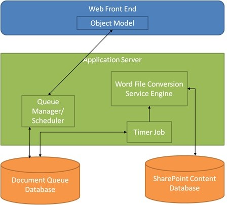
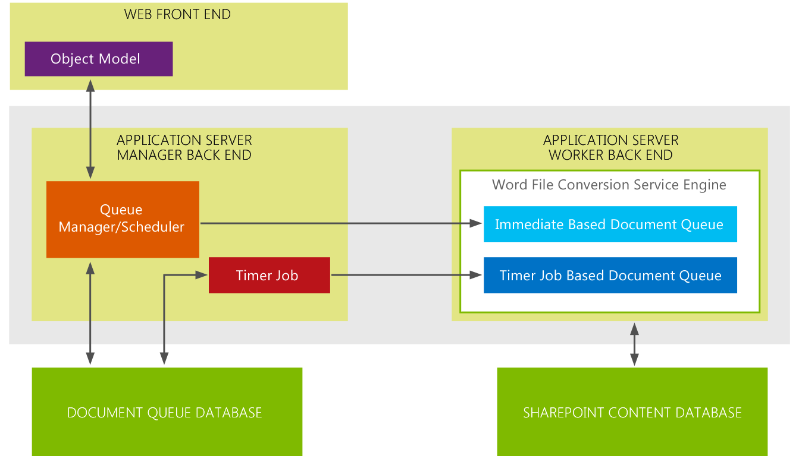

​Como novedad en SharePoint 2010 nos encontramos un nuevo servicio de conversión de documentos Word. Este nos permitía convertir documentos entre diferentes versiones de Word o convertirlo los documentos Word a PDF o XPS, todo esto, sin necesidad de tener Office instalado en el servidor.

El servicio de conversión de documentos trabaja utilizando un Timer Job de SharePoint que gestiona la cola de conversión de documentos, por lo que los documentos tienen que estar alojados en una biblioteca de SharePoint y se convierten de forma asíncrona, en background.



Para convertir documentos, tenemos que crear un trabajo de Conversión de documentos y añadir al Job de conversión los ficheros a convertir o especificarle una librería de documentos para convertir cualquier documento que exista en ella.

Desde una solución de SharePoint, agregamos la referencia al ensamblado Microsoft.Office.Word.Server.dll que se encuentra en la carpeta ISAPI de la instalación de SharePoint, y utilizamos el siguiente código que crear el trabajo de conversión:

```
//Instanciamos un job de conversión
```

```
var conversionJob = new ConversionJob("Word Automation Services");
```

```
//Especificamos el formato a convertir y el comportamiento de guardado
```

```
conversionJob.Settings.OutputFormat = SaveFormat.PDF;
```

```
conversionJob.Settings.OutputSaveBehavior = SaveBehavior.AlwaysOverwrite;
```

```
//Necesita de un usuario de contexto de ejecución para la conversión
```

```
conversionJob.UserToken = SPContext.Current.Web.CurrentUser.UserToken;
```

```
 
```

```
var web = SPContext.Current.Web;
```

```
var sourceLibrary = web.Lists["Source"];
```

```
var destinationLibrary = web.Lists["Destination"];
```

```
//Utilizamos uno de los métodos que permite añadir una biblioteca de origen y destino
```

```
conversionJob.AddLibrary(sourceLibrary, destinationLibrary);
```

```
//También podríamos convertir documentos con el siguiente método
```

```
//conversionJob.AddFile(inputFile, outputFile);
```

```
 
```

```
conversionJob.Start();
```

Cuando se ejecuta el método **Start** el servicio de conversión encola los documentos que se van a convertir y le cede el trabajo al servicio de conversión que irá convirtiendo documentos en la medida de que tengas recursos disponibles para ello.

SharePoint 2013 trae algunas novedades en el servicio Word Automation Service, que es el encargado del tratamiento de documentos Word.



Como podemos ver en el diagrama anterior, se ha cambiado ligeramente la arquitectura del servicio para contemplar una nueva cola de documentos llamada "Immediate Based Document Queue". Esta nueva cola, nos permite realizar conversiones On-Demand de documentos.

**Conversión de documentos On-Demand**

Con SharePoint 2013 podemos convertir documentos bajo demanda, esto es, podemos permitir a un usuario convertir documentos al instante, sin necesidad de tener que esperar a que se ejecute el trabajo programado de conversión.

```
string inputFile = "http://sharepoint/documentos/factura.docx";
```

```
string outputFile = "http://sharepoint/documentos/factura.pdf";
```

```
 
```

```
var syncConverter = new SyncConverter("Word Automation Service");
```

```
syncConverter.Settings.OutputFormat = SaveFormat.PDF;
```

```
syncConverter.Settings.OutputSaveBehavior = SaveBehavior.AlwaysOverwrite;
```

```
var conversionItemInfo = syncConverter.Convert(inputFile, outputFile);
```

A diferencia del trabajo de Conversión habitual, este proceso sólo permite convertir un único documento, con lo que no se puede especificar una biblioteca de documentos a convertir.

**Conversión de documentos en memoria o Streams**

Además de poder hacer la conversión bajo demanda, Word Automation Services nos permite, desde SharePoint 2013, hacer conversión en memoria de documentos que no residen en SharePoint, por ejemplo, un documento que sube un usuario y que todavía no se ha guardado en SharePoint.

```
if (FileUpload1.HasFile)
```

```
{
```

```
    var fileStream = new MemoryStream(FileUpload1.FileBytes);
```

```
    var convertStream = new MemoryStream();
```

```
 
```

```
    var syncConverter = new SyncConverter("Word Automation Service");
```

```
    syncConverter.Settings.OutputFormat = SaveFormat.PDF;
```

```
    syncConverter.Settings.OutputSaveBehavior = SaveBehavior.AlwaysOverwrite;
```

```
    var conversionItemInfo = syncConverter.Convert(fileStream, convertStream);
```

```
}
```

**Conclusiones**

Dos métodos, asíncrono y síncrono que permiten convertir documentos Word. Todo esto sin necesidad de instalar las API de Word en el servidor y utilizando los recursos de SharePoint para la conversión de documentos. Pensemos en tener un documento que convierte documentos definitivos en PDF para guardarlos en un histórico, mediante un Event Receiver que convierte los documentos que se crean en la biblioteca de documentos. También pensemos en darle la posibilidad al usuario de realizar la conversión de un documento cuando lo selecciona para subir en SharePoint.

Todo esto, combinado con el OpenXML SDK que nos permite crear y modificar documentos Word, nos abre un mundo de posibilidades de tratamientos de documentos Word, al que le podemos añadir PowerPoint desde el nuevo servicio de conversión que vienen en SharePoint 2013.


**Alberto Diaz Martin**
 MVP SharePoint
 [adiazcan@hotmail.com](mailto:adiazcan@hotmail.com) 
 @adiazcan
 [http://geeks.ms/blogs/adiazmartin](http://geeks.ms/blogs/adiazmartin)

 
 
import LayoutNumber from '../../../components/layout-article'
export default LayoutNumber
