​​Business Connectivity Services (BCS) es un componente de SharePoint que permite exponer datos provenientes de otros sistemas (bases de datos, aplicaciones corporativas, servicios online…) dentro de SharePoint como listas externas. El usuario puede interactuar con las listas externas con una interfaz de usuario igual que la de SharePoint, reduciendo la fatiga cognitiva o el esfuerzo necesario para consumir la información. Además, podemos exponer los datos de listas externas como columnas de búsqueda en SharePoint, lo que suele ser útil para mantener los listados maestros de clientes, proveedores o pedidos coherentes y no duplicados.

Sin embargo, hay una falta de información casi total sobre el tratamiento de datos binarios en BCS. Dado que en un reciente proyecto me vi implicado de lleno en el tratamiento de ficheros adjuntos en entidades de BCS, he creído conveniente hacer un artículo para aclarar conceptos entorno a este tema.

En este artículo no trataré los temas básicos de BCS como por ejemplo exponer entidades simples. Hay muchos artículos al respecto y en los números anteriores de CompartiMOSS hay ejemplos de ello.

**Usando SharePoint Designer**

Si nuestros datos binarios están en una tabla de base de datos, estamos de suerte (relativa). Podemos usar SharePoint Designer para modelar el tipo de contenido externo para SharePoint y ahorrarnos tener que diseñar los metadatos manualmente.

Lo de suerte relativa viene por un pequeño inconveniente de SharePoint Designer y es que nos oculta los campos binarios y las operaciones binarias por defecto. Sin embargo, podemos editar el fichero de modelo que nos genera la herramienta y añadir manualmente la operación y el campo que falta.

Como punto de partida tenemos una base de datos llamada PhotoDB con una tabla llamada Photos y un esquema sencillo, como se muestra en la siguiente pantalla:

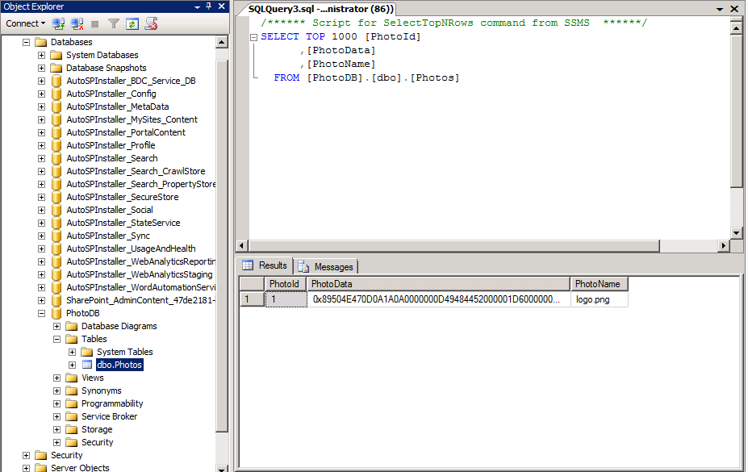

En la tabla tenemos sólo tres campos: el ID de la foto (PhotoId), el nombre del fichero de la foto (PhotoName) y los datos binarios de la foto (PhotoData).

Abrimos SharePoint Designer, abrimos el sitio donde queremos exponer la lista de fotos y vamos a la pestaña de tipos de contenido externos.

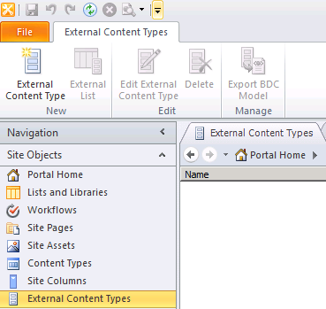

Vamos a crear el tipo de contenido externo. Para ello clicamos el botón de crear nuevo tipo de contenido externo. Nombramos el tipo de contenido como Fotos y procedemos a diseñar sus operaciones.

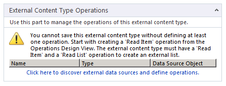

Clicamos en el enlace azul que nos permite descubrir los orígenes de datos externos y apuntamos a nuestra base de datos PhotoDB. Una vez creada, nos situaremos en la tabla Photos y generaremos las operaciones Read Item y Read List, obligatorias para BCS, clicando con el botón derecho del ratón encima del nombre de la tabla.

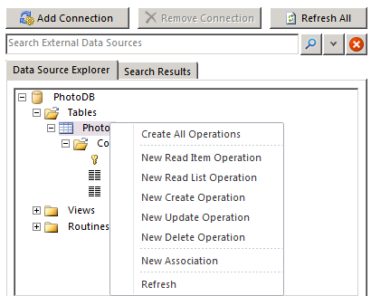

Aceptaremos todas las opciones por defecto y tendremos una pantalla como la siguiente:

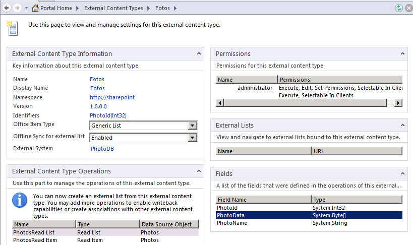

Ya tenemos generado nuestro modelo de BCS. Vamos a SharePoint y creamos una lista externa de ese nuevo tipo generado por SharePoint llamado Fotos. Podemos ver que en la lista se muestran los campos PhotoId y PhotoName, pero el campo binario no aparece.

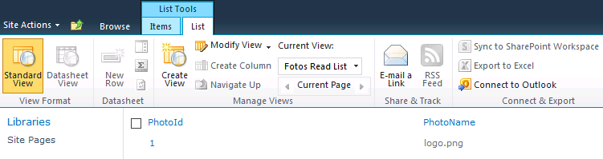

¡Qué no cunda el pánico! Como he dicho antes, falta un pequeño retoque para que BCS reconozca nuestro campo binario perdido. Tenemos que editar el fichero de modelo de metadatos manualmente.

Vamos a SharePoint Designer, dentro del apartado de tipos de contenido externos y exportamos el modelo que ha generado SharePoint Designer. Lo abrimos en Visual Studio como un fichero XML.

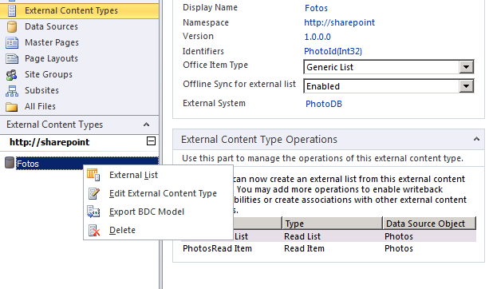

Es un fichero que describe nuestro modelo de datos BCS. Dentro de él están las propiedades de la entidad "Photo" de la base de datos, y las descripciones de los métodos PhotosRead List y PhotosRead Item.

Para exponer los datos binarios, tenemos que añadir un tercer método PhotosReadStream con una instancia del tipo StreamAccessor. En términos de BCS, el *método* define los metadatos como los tipos de datos de entrada y salida, así como la cadena SQL de la invocación del método; y la *instancia* define el rol del método en BCS: devolver entidades (*Finder*), devolver una entidad (*SpecificFinder*) o devolver datos binarios (*StreamAccessor*).

Colapsamos los dos métodos existentes y añadiremos el tercer método después de los dos nodos de tipo Method.

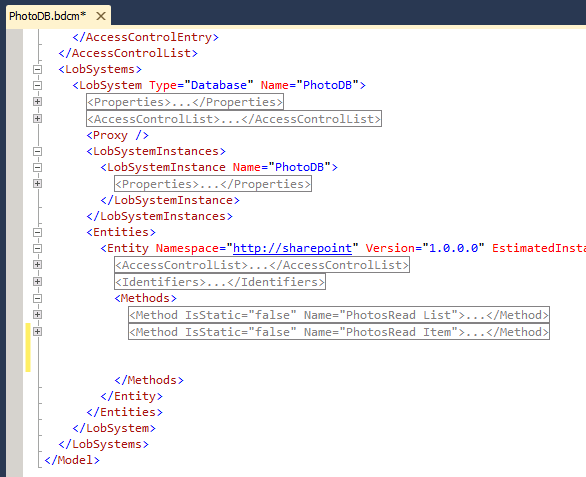

Insertamos el texto siguiente:

```
<Method IsStatic="false" Name="PhotosReadStream">
```

```
  <Properties>
```

```
    <Property Name="RdbCommandType" Type="System.Data.CommandType, System.Data, Version=2.0.0.0, Culture=neutral, PublicKeyToken=b77a5c561934e089">Text</Property>
```

```
    <Property Name="RdbCommandText" Type="System.String">SELECT [PhotoData] FROM [dbo].[Photos] WHERE [PhotoId] = @PhotoId</Property>
```

```
    <Property Name="BackEndObjectType" Type="System.String">SqlServerTable</Property>
```

```
    <Property Name="BackEndObject" Type="System.String">Photos</Property>
```

```
    <Property Name="Schema" Type="System.String">dbo</Property>
```

```
  </Properties>
```

```
  <Parameters>
```

```
    <Parameter Direction="In" Name="@PhotoId">
```

```
      <TypeDescriptor TypeName="System.Int32" IdentifierName="PhotoId" Name="PhotoId" />
```

```
    </Parameter>
```

```
    <Parameter Direction="Return" Name="PhotosReadStream">
```

```
      <TypeDescriptor TypeName="System.Data.IDataReader, System.Data, Version=2.0.0.0, Culture=neutral, PublicKeyToken=b77a5c561934e089" IsCollection="true" Name="PhotosReadStream">
```

```
        <TypeDescriptors>
```

```
          <TypeDescriptor TypeName="System.Data.IDataRecord, System.Data, Version=2.0.0.0, Culture=neutral, PublicKeyToken=b77a5c561934e089" Name="PhotosReadStreamElement">
```

```
            <TypeDescriptors>
```

```
              <TypeDescriptor TypeName="System.Byte[]" Name="PhotoData" />
```

```
            </TypeDescriptors>
```

```
          </TypeDescriptor>
```

```
        </TypeDescriptors>
```

```
      </TypeDescriptor>
```

```
    </Parameter>
```

```
  </Parameters>
```

```
  <MethodInstances>
```

```
    <MethodInstance Type="StreamAccessor" Name="PhotosReadStream"
```

```
                    ReturnTypeDescriptorPath="PhotosReadStream[0].PhotoData"
```

```
                    ReturnParameterName="PhotosReadStream"
```

```
                    Default="true" DefaultDisplayName="Photo">
```

```
      <Properties>
```

```
        <Property Name="FileNameField" Type="System.String">PhotoName</Property>
```

```
      </Properties>
```

```
    </MethodInstance>
```

```
  </MethodInstances>
```

```
</Method>
```

Aquí vemos que se define la un método que devuelve el campo binario de una sola foto, que se identifica con un parámetro de entrada PhotoId y que se utiliza en la consulta SQL. La propiedad FileNameField nos permite especificar una columna de la tabla que será la que proporcione el nombre del fichero cuando descarguemos los datos binarios. En el próximo artículo veremos más opciones de los métodos StreamAccessor.

Para importar el fichero, iremos a Administración Central de SharePoint y en Aplicaciones de servicio buscaremos la aplicación de servicio de conectividad a datos empresariales. Allí borraremos el modelo y el tipo de contenido existente (se tienen que hacer los dos), y luego elegiremos la vista de Modelos BDC y clicaremos en Importar en la Ribbon. Elegimos el fichero acabado de modificar y si no hemos cometido errores en la importación del modelo, veremos que el nuevo modelo está ya cargado en SharePoint.

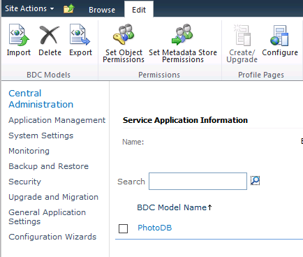

Ahora recreamos la lista externa Fotos con este tipo de datos y vemos que tenemos exactamente el mismo aspecto que antes, sin los campos de tipo binario. ¿Qué ha pasado?

Muy sencillo, SharePoint sólo muestra los datos binarios en la WebPart de tipo "Lista de datos empresariales" y sólo si se marca la casilla "Mostrar los campos binarios" (Display stream fields). Ponemos una WebPart de este tipo en una página en SharePoint y la configuramos.

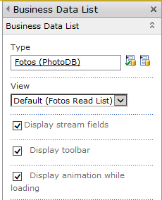

Ahora tenemos un enlace en cada fila de la lista (que antes no salía) y que dice que cliquemos allí para bajar la foto.

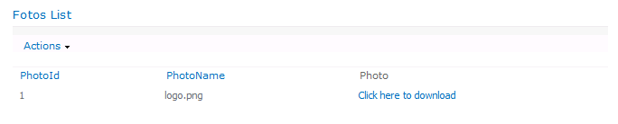

Si lo clicamos veremos que la foto se descarga en toda su gloria binaria.

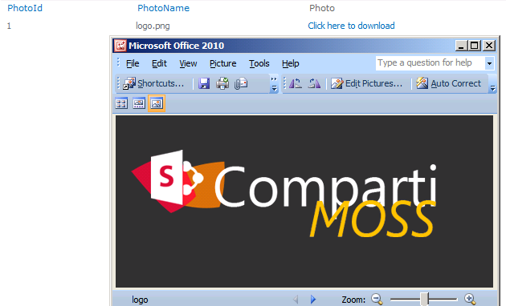

**Conclusión**

En este artículo hemos visto cómo acceder a los datos de tipo binario en una base de datos. En el próximo artículo veremos cómo acceder a los datos binarios en un conector BCS de tipo ensamblado de .NET.

La utilidad de acceso a datos binarios no está solo en las fotos, sino que podemos exponer a SharePoint documentos, plantillas y cualquier tipo de fichero que esté representando como un conjunto de bytes con un nombre y un tipo.

El fichero modelo BCS de este artículo está disponible en [http://sdrv.ms/1afgn0v](http&#58;//sdrv.ms/1afgn0v).


**Edin Kapić**
Arquitecto SharePoint
[edin.kapic@spenta.es](mailto&#58;edin.kapic@spenta.es) 
 @ekapic
[http://www.spenta.es](http&#58;//www.spenta.es/)

