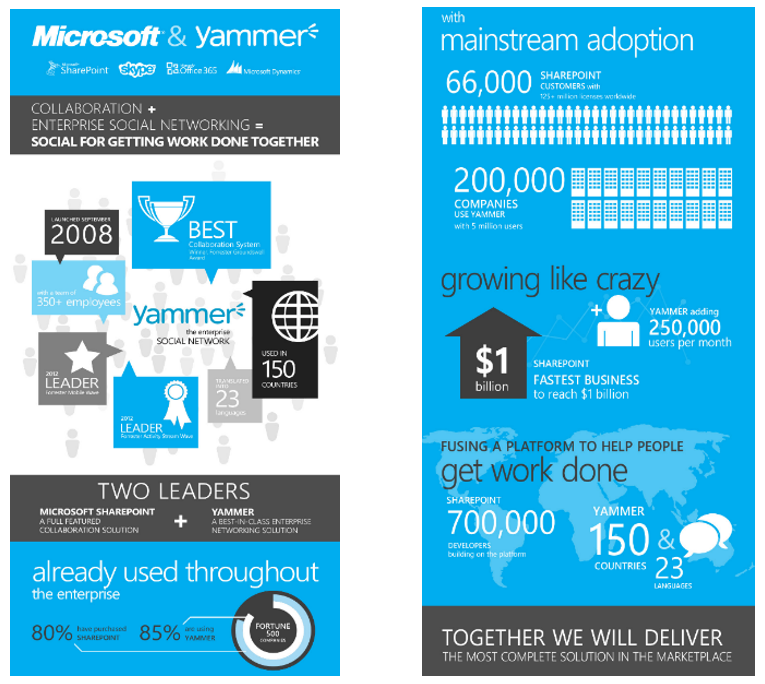
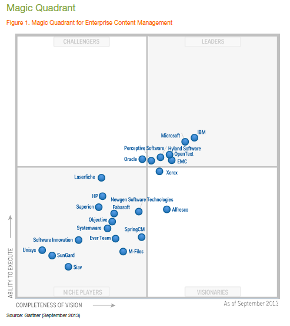
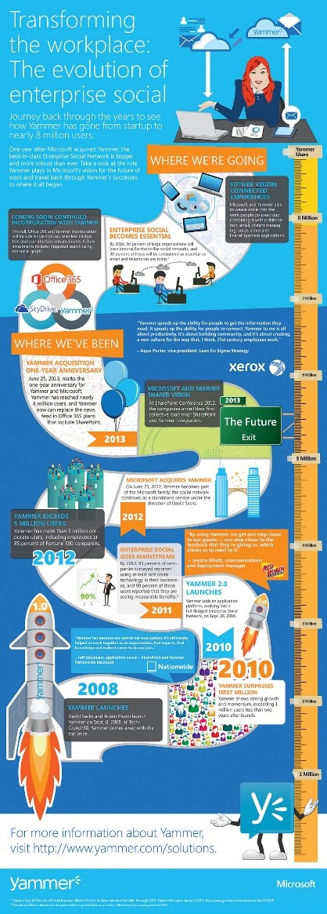

Mucho se viene hablando en los últimos tiempos sobre el valor que agrega a las empresas disponer de un entorno colaborativo social interno, es decir una "Intranet Social". Las intranets corporativas existen desde hace 20 años y su función principal ha sido la de informar a los empleados, transmitiendo la información usando una modalidad *top-down*. Sin embargo, los cambios culturales en el entorno instan cada vez más a las personas a participar en redes sociales y otros medios caracterizados por su horizontalidad y dinamismo, haciendo que las intranets tradicionales hayan llegado a su fin para dar comienzo a un nuevo tipo de intranet donde la colaboración, la comunicación en todo sentido, la construcción de conocimiento y la innovación son sus fortalezas principales. Esto ya está pasando, las Intranets Sociales ya han salido del laboratorio y de los primeros experimentos y han alcanzado cierto nivel de madurez. En la Iberian SharePoint Conference (iberiansharepointconference.com) celebrada en Madrid en octubre pasado escuchamos a uno de los oradores pronunciar una frase que resume el cambio cultural:

*"****tenemos mejores herramientas de colaboración social en casa que en la empresa y estamos perdiendo dinero por ello****" (Jordi Plana)*

Si bien es cierto que los tiempos de adopción de los nuevos modelos de colaboración en las empresas nunca van a ir al ritmo que en la vida particular, también es cierto que existen modelos que ya han sido probados y se encuentran maduros para ser utilizados en las organizaciones. El cambio cultural ya se ha producido y existe una fuerte convicción de que aquellas empresas que no adopten este nuevo modelo de gestión estarán un paso por detrás en un par de años.

**Pero, ¿qué significa introducir elementos sociales en las redes corporativas?**

Ni más ni menos que eso, introducir elementos de la Web 2.0 en la intranet. Los elementos más comunes que usamos son:

- Blogs
- Microblogging
- Wikis
- Foros
- Crowdsourcing
- Chat
- Liking & sharing
- Valoración de todo el contenido (ratings)
- Confianza, reputación y premios sociales
- Comentarios sobre todo el contenido
- Perfiles individuales de los empleados
- Actualizaciones de Estado de las personas
- Calendarios compartidos

Nos apoyaremos en la definición que se da en el libro "[INTRANET SOCIAL. Colaboración, Transparencia y Comunicación](http://www.adesis.com/pdf/LIBRO_BLANCO.pdf)" de la consultora Adesis (te recomendamos que lo leas si quieres profundizar sobre aspectos organizacionales de una implantación de Intranets Sociales). Definimos la Intranet Social como:

- Una plataforma tecnológica que presenta un modelo de contribución abierta, donde todos los empleados y trabajadores de la empresa, pueden aportar contenidos. Para ello es esencial que, independientemente de su rango o puesto, todos puedan publicar sin tener que pasar por un proceso de aprobación engorroso.
- Un entorno donde comentar amigablemente. Si tiene una intranet social, es para que los empleados puedan compartir sus conocimientos y opiniones, ¿no? Fomente los comentarios y discusión para conseguir un ambiente abierto.
- Una herramienta de información de y entre empleados. Muchas personas usan intranets sociales para conocer más acerca de sus compañeros de trabajo, ya que permite conocer los perfiles de los diferentes empleados, cuáles son sus funciones en la compañía, su experiencia, etc. Y donde los empleados pueden votar o compartir el contenido.
- Una herramienta que permite crear o adaptar procesos para una mejor gestión e integración de las tareas diarias de los diferentes departamentos. Por ejemplo, permite determinar los roles y funciones de los distintos players como diferenciar el papel entre los administradores y los editores de contenido.
- Es una herramienta que permite medir, asimismo, valorar la gestión de las actividades relacionadas con la intranet (por ejemplo, si se están haciendo bien las tareas relacionadas con ésta).
- El mapa de procesos es un inventario gráfico o diagrama de valor que ayuda a posicionar las distintas actividades de la intranet. El modelo te facilita la gestión para la evolución.

Una intranet social es, por tanto, una herramienta corporativa y operativa, centrada en el usuario, usable, móvil y accesible. Conceptualmente el tema es simple, pero ¿tiene sentido implantar una? ¿existen riesgos? Hablemos un poco sobre ello.

**¿Existen riesgos en dar tanta voz a los empleados? ¿Qué gana la empresa?**

Éstas son las dos preguntas que siempre nos hacen los usuarios cuando proponemos un proyecto de implantación de una Intranet Social.

Ciertamente percibimos algo de incertidumbre en los directivos de las empresas en donde proponemos implantar intranets sociales. En cierto modo lo comprendemos, al fin, la empresa está dando herramientas para expresar opiniones a los empleados, abiertamente y sin controles previos. Sin embargo nuestra experiencia y los estudios que existen demuestran todo lo contrario. Para comenzar, el hecho de que los empleados tengan la idea de que pueden expresar algo y serán "leídos" es muy potente para hacer aflorar el conocimiento y convicciones de los estratos inferiores de la organización. Además, está demostrado que los empleados son muy conscientes de que lo que escriben no queda en el anonimato, ellos están identificados en lo que escriben.

El segundo aspecto que comúnmente discutimos con las organizaciones antes de una implantación es el retorno de la inversión (ROI) de estos proyectos. Cada caso es particular, pero nos gusta dividir su cálculo en:

- Métricas de costes/beneficio tradicionales de implantaciones de intranets.
    - Costes: Consultoría, Infraestructura, Licenciamiento, Desarrollo, Testing, Implementación, Formación, Puesta en Marcha y Mantenimiento.
    - Beneficios: Movilidad, Formativos, logísticos, Organizacionales, Tiempo, etc.
- Además de las métricas cuantitativas que se usen para calcular el ROI de los proyectos de intranets tradicionales, hay que considerar métricas cualitativas derivadas del aspecto social. Aquí van algunos ejemplos:
    - Descubrimiento de talentos ocultos dentro de la organización.
    - Productividad, incluso en horarios extra-laborales.
    - Sinergia entre equipos/especialistas de la organización.

**Necesidades de negocio, no herramientas ni modas**

Relacionado a lo expresado anteriormente sobre el ROI, también nos gusta remarcar la importancia de que los proyectos de implantación de intranets sociales se centren en las necesidades del negocio. Es importante hacer un estudio previo para determinar cuáles de las múltiples herramientas que hemos mencionado realmente aportan valor a la empresa. Twitter y el microblogging molan, pero ¿realmente lo necesitamos? En este caso particular, el microblogging es muy valioso para equipos multidisciplinares que no comparten una ubicación física aporten distintos enfoques sobre un proyecto o problema, "*me he encontrado este post en un blog en internet que habla sobre el tema que estamos tratando, ¿qué hago? ¿Se lo envío por mail a todos los participantes del equipo? ¿Nos ponemos a responder y a opinar contestando infinitamente a ese mail?*" Esta situación es típica, una herramienta de microblogging sería una solución ideal.

***Engagement*****y*****Gamification*****como factores clave**

La tendencia ya no es esperar a que los empleados vayan a la intranet, sino hacer que la intranet "vaya al empleado". *Engagement* es un término de moda que puede asociarse a compromiso o implicación utilizado en el ámbito de las relaciones laborales y la cultura organizacional que se identifica con el esfuerzo voluntario por parte de los trabajadores de una empresa o miembros de una organización. Un trabajador *engaged* (comprometido o implicado) es una persona que está totalmente implicada en su trabajo y entusiasmada con él. Cuando tiene oportunidad, actúa de una forma que va más allá de los intereses de su organización. Uno de los objetivos principales de la implantación de aspectos sociales en una intranet es justamente lograr este tipo de compromiso por parte de los empleados. Otro factor clave es el uso de técnicas de *Gamification* dentro de las intranets sociales. Con *Gamification* nos referimos al el uso del pensamiento y la mecánica de jugabilidad en contextos ajenos a los juegos, con el fin de que las personas adopten cierto comportamiento. En las intranets sociales proporciona estrategias para permitir a los usuarios ganar puntos o insignias de su actividad. ¿Quiénes son los héroes en la intranet? ¿Qué personas entregan mejores conocimientos y contribuyen más a menudo?

**Del "*****Just Do It!*****" a la solución organizada**

Según un estudio presentado por el Nielsen Norman Group (www.nngroup.com/articles/intranet-social-features/), en los últimos años se ha consolidado un cambio en las organizaciones hacia una mejor organización y gestión de las características sociales en las intranets sociales. Es decir, antes se tendía más a seguir un enfoque *just do it* (simplemente hazlo) y ver qué pasa. Actualmente las organizaciones implementan cada vez más un enfoque de (a) Definir si una herramienta o característica social aportará valor (b) Implementarla y (c) Medir los resultados para evaluar si realmente aporta el valor esperado. Este cambio cobra sentido si se comprende que la tecnología y lo que sabemos sobre la dinámica social ha evolucionado en los últimos años. Analicemos esta evolución y tendencia con estadísticas.

**12 estadísticas interesantes sobre las Intranets Sociales**

Sin ánimo de que se asuman como la verdad absoluta, presentamos aquí un conjunto de estadísticas que permiten entender algunos de los síntomas que estamos viendo en el mercado (y en nuestros clientes):

1.       Sólo el 10% de las organizaciones tienen una intranet verdaderamente social. (Fuente: www.prescientdigital.com/downloads/social-intranet-study-2012-summary-report)

2.       Sin embargo, el 87% de las organizaciones encuestadas ya han implementado al menos una de las herramientas sociales más comunes. (Fuente: www.prescientdigital.com/downloads/social-intranet-study-2012-summary-report)

3.       Herramientas más comunes. Las cinco herramientas de medios sociales más populares son la mensajería instantánea, blogs, foros de discusión, wikis y comentarios de usuarios:

    1. 76% de las organizaciones tiene la mensajería instantánea.
    2. 75% de las organizaciones tienen blogs.
    3. 70% de las organizaciones tienen foros de discusión.
    4. 67% de las organizaciones tiene wikis.

(Fuente: www.prescientdigital.com/downloads/social-intranet-study-2012-summary-report)

4.       El 62% de los usuarios de las intranets sociales proceden de empresas. Un 10%, de instituciones educativas y otro 10%, de proveedores relacionados con la sanidad. (Fuente: http://www.theitsmreview.com/2013/03/top-10-social-intranet-trends/)

5.       No es necesario trabajar en una gran corporación para utilizar este tipo de soluciones. La intranet media creada en el producto Bitrix24 (un servicio cloud de intranets sociales) es de 10 usuarios.  (Fuente: http://www.theitsmreview.com/2013/03/top-10-social-intranet-trends/)

6.       Los países emergentes están a la última. Según el país de origen, los usuarios de las intranets sociales proceden de EEUU, Rusia, India, Brasil, Reino Unido, Filipinas, Alemania, China, Indonesia, y Canadá. (Fuente: http://www.theitsmreview.com/2013/03/top-10-social-intranet-trends/)

7.       Es cierto, el escepticismo acerca de la intranet social aún existe. El 87% de los usuarios de la intranet social apoyan esta iniciativa, les gusta la idea de tenerla y consideran que aumentará la productividad de los empleados. Por el contrario, tan sólo un 13% prefiere el concepto de la clásica intranet, considerando que las características sociales no aportan valor. (Fuente: http://www.theitsmreview.com/2013/03/top-10-social-intranet-trends/)

8.       La intranet social está cambiando los patrones de trabajo. El 60% de los usuarios de Bitrix24 (un servicio cloud de intranets sociales) acceden al portal corporativo al menos una vez durante el fin de semana, mientras que un 12% acceden a su portal en Navidad. (Fuente: http://www.theitsmreview.com/2013/03/top-10-social-intranet-trends/)

9.       Coste. La mayoría de las organizaciones asignan bajo presupuesto en sus empresas las herramientas de medios sociales. Muchas organizaciones que implementan herramientas de medios sociales con inversiones de u$s 10.000 o menos:

    1. 47% han gastado menos de u$s 10.000.
    2. 30% han gastado entre u$s 10.000 y u$s 99.999.
    3. 23% han gastado u$s 100.000 o más.

(Fuente: www.prescientdigital.com/downloads/social-intranet-study-2012-summary-report)

10.   Satisfacción. Los ejecutivos y empleados por igual están poco entusiasmados con sus medios de comunicación social de la empresa:

    1. El promedio de satisfacción sobre las redes sociales internas es de 4,5 sobre 10.
    2. De los empleados que trabajan con herramientas de intranet sociales, sólo el 22% de ellos evalúa su experiencia como buena o muy buena. De los ejecutivos que trabajan con herramientas de intranet sociales, sólo el 17% de ellos evalúa su experiencia como buena o muy buena.

(Fuente: www.prescientdigital.com/downloads/social-intranet-study-2012-summary-report)

11.   Según un informe de Gartner, el 80% de los esfuerzos de las empresas en material de interacción social no obtendrá los objetivos esperados. (Fuente: jboye.com/blogpost/social-intranet-unlocks-knowledge-and-creates-value)

12.   Sobre Microsoft, SharePoint y Yammer. No te daremos estadísticas de uso de SharePoint, ya las conoces. Solo nos interesa que sepas que Microsoft ha comprado en 2012 Yammer, aquí van algunos números (hablaremos de Yammer más adelante en este artículo).

    1. Microsoft compró Yammer en 2012 por 1200 millones de dólares.
    2. Yammer fue lanzado en 2008. En 2012 (4 años después) ostentaba estos números:
        1. Usado por el 85% de las empresas del Fortune 500.
        2. Usado en 150 países.
        3. Traducido a 23 idiomas.
        4. 200.000 empresas usando Yammer
        5. 250.000 nuevos usuarios por mes.

Son números impresionantes. La fuente es: www.microsoft.com/en-us/news/press/2012/jun12/06-25msyammerpr.aspx y para completar los datos, aquí dejamos esta infografía de Microsoft.

**¿Cómo está posicionado SharePoint en el mercado?**

SharePoint se encuentra desarrollando el aspecto social de las intranets desde hace ya varios años. Antes mencionábamos que más del 80% de las empresas de la lista Fortune 500 han comprado SharePoint y que el 22% de los empleados de estas empresas lo utilizan diariamente. Además, SharePoint se encuentra posicionado en los primeros puestos del cuadrante mágico de Gartner de los gestores de contenidos empresariales (ECM), desde hace años. Aquí está la última versión de este cuadrante.

 .

Según las conclusiones de este estudio:

"*Gartner ha detectado tendencia hacia la migración a SharePoint 2013 en empresas donde SharePoint ya está funcionando. Esto demuestra mejoras en una serie de áreas, incluyendo la búsqueda integrado y las**interacciones sociales**.*"

En lo estrictamente social, existen muchos competidores que se han enfocado en ofrecer funcionalidades sociales para empresas, por ejemplo: Bitrix24. Sin embargo, también es cierto que una de las empresas que más había crecido en este ámbito en los últimos años ha sido adquirida por Microsoft: Yammer. Hablaremos de Yammer más adelante. Veamos cuál es la oferta de características sociales que propone SharePoint 2013.

**Algunas características sociales de SharePoint 2013**

Para ser honestos, existe una brecha entre las intenciones de Microsoft con respecto la inclusión de características sociales *out-of-the-box* y lo que realmente se ha hecho. Al menos en SharePoint 2013. Al final, existe una sensación de que las características sociales que se han logrado incluir en esta versión no han estado a la altura de las expectativas generadas. Esto es muy fácil de explicar si se analiza el ciclo de vida del producto. Es decir, cuando Microsoft congeló los requisitos de SharePoint 2013 (años antes), aún la tendencia no estaba totalmente definida. Es por ello que partners que se encuentran ofreciendo soluciones sociales que se montan sobre SharePoint están teniendo bastante éxito. Por citar un caso: la empresa Beezy.

Más allá de este análisis, veamos qué ofrece SharePoint 2013 en el aspecto social. Haremos un resumen y luego te daremos referencias en MSDN, Technet y esta revista. La documentación existente es buena y no tiene sentido que lo desarrollemos en este artículo.

- La introducción de los Sitios de la comunidad ofrece una experiencia de foro que categoriza los debates por asuntos y conecta a los usuarios que buscan o tienen los conocimientos necesarios sobre esos asuntos.
- Además, el nuevo Portal de comunidad permite una página de resultados de comunidades basado en búsquedas que los usuarios pueden descubrir y explorar desde un vínculo en la sección Mis sitios.
- Las mejoras a Mis sitios ofrecen, a su vez, un flujo de trabajo más intuitivo en el que los usuarios pueden desarrollar sus perfiles personales, almacenar contenido y mantenerse al día de las actividades que les interesan mediante el uso del nuevo microblog y la experiencia de las fuentes.
- Yammer y su integración en SharePoint.

Te aconsejamos que visites estos sitios para obtener más información sobre este tema:

- NOVEDADES EN SOCIAL ENTERPRISE DE SHAREPOINT 2013 -- CompartiMOSS Nro 13 ([http://www.compartimoss.com/pdf/CompartiMOSS\_13a.pdf](/pdf/CompartiMOSS_13a.pdf))
- Planear la colaboración y los sistemas sociales en SharePoint Server 2013 ([http://technet.microsoft.com/es-es/library/ee662531.aspx](http://technet.microsoft.com/es-es/library/ee662531.aspx))
- Vídeo: Resumen de los sistemas sociales en SharePoint Server 2013 ([http://technet.microsoft.com/es-es/library/jj219629.aspx](http://technet.microsoft.com/es-es/library/jj219629.aspx))
- Terminología y conceptos de los sistemas sociales en SharePoint Server 2013 ([http://technet.microsoft.com/es-es/library/jj219804.aspx](http://technet.microsoft.com/es-es/library/jj219804.aspx))
- Novedades para desarrolladores en características sociales y de colaboración en SharePoint 2013 ([http://msdn.microsoft.com/es-es/library/jj163783.aspx](http://msdn.microsoft.com/es-es/library/jj163783.aspx))

**Yammer y la evolución del aspecto social dentro de SharePoint**

Yammer se define como una Red Social Corporativa. Fue fundada en 2008 y adquirida por Microsoft en 2012. Aquí ([http://www.microsoft.com/en-us/news/press/2012/jun12/06-25msyammerpr.aspx](http://www.microsoft.com/en-us/news/press/2012/jun12/06-25msyammerpr.aspx)) puedes encontrar más información sobre esta adquisición. Los planes de integración de Yammer dentro de SharePoint se encuentran evolucionando constantemente, pero todo indica que Yammer será una pieza clave en el futuro de las características sociales de SharePoint y de Microsoft en general. Según hemos escuchado a Oscar Mozo Rivera (Product Marketing Manager de Microsoft) en la Iberian SharePoint Conference: "*Yammer no es simplemente una pieza más dentro de la estrategia social corporativa de Microsoft. Yammer es en realidad el conductor de esta estrategia.*". Aunque estas palabras no concretan las acciones, si dan directrices claras sobre las intenciones de Microsoft con respecto a Yammer.

Mirando ya a la documentación oficial, nos encontramos con otra de estas infografías bonitas de Microsoft sobre la evolución del producto y (lo poco que realmente sabemos sobre) sus planes futuros: (fuente: [http://www.microsoft.com/en-us/news/presskits/office/docs/index.html](http://www.microsoft.com/en-us/news/presskits/office/docs/index.html))

**Conclusiones**

Entonces, las intranets sociales ¿son el futuro de las intranets? Llegados a este punto, después de dar tantas estadísticas y números objetivos, vamos a dar una opinión subjetiva:

SI, consideramos que la inclusión de aspectos sociales en las intranets, en realidad en la empresa, llegó para quedarse. No nos imaginamos un futuro evolutivo de las intranets en el cual no existan interacciones sociales. No tiene sentido. La sociedad ya ha evolucionado en este sentido y las empresas tendrán que hacerlo. Podemos arriesgarnos en esta aseveración. Y vamos un poco más lejos, consideramos que no hay que esperar al futuro… Las empresas están demandando el cambio hacia las intranets sociales ahora mismo. Por supuesto quedan incógnitas: cuáles serán las herramientas que triunfarán, qué consecuencias traerán estos aspectos sociales al modelo de gestión de cada empresa o cual será el futuro de la integración de Yammer - SharePoint son cuestiones que (en el momento de escribir este artículo) todavía no tenemos claro. Sin embargo, consideramos que es un buen momento para plantearse una implantación de o una migración hacia una intranet social. Después de todo, no hay mejor camino, que el que se hace al andar.

**Mariano Minoli**
Doctor (Ph.D.) software engineering
[mariano.minoli@essentit.com](mailto:mariano.minoli@essentit.com) 
@marianominoli

**Carlos Javier Broggi**
Ingeniero en Sistemas de Información
[javier.broggi@essentit.com](mailto:javier.broggi@essentit.com) 
@gringobroggi
[www.essentit.com](http://www.essentit.com/)

