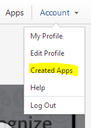
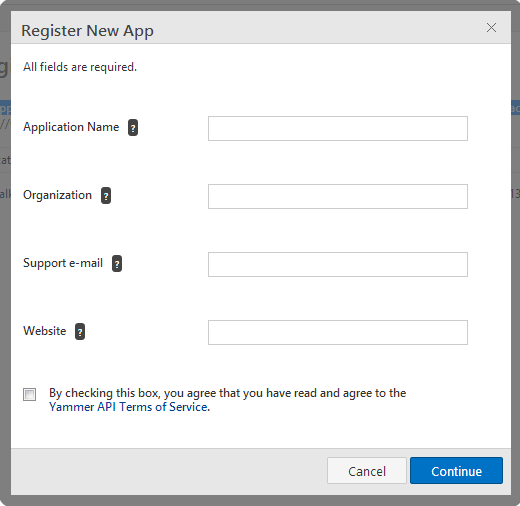
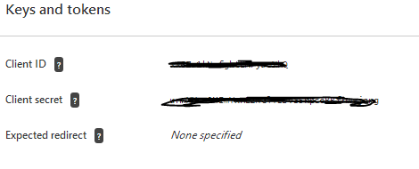
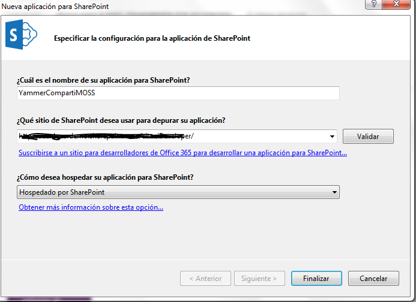
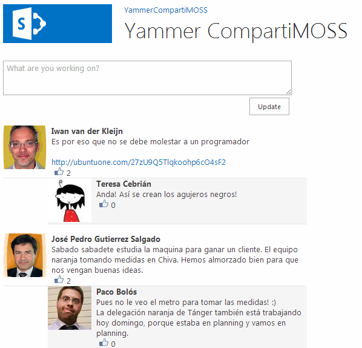

import ArticleHeader from '../../../components/article-header'

<ArticleHeader frontmatter={props.pageContext.frontmatter} />


​Yammer desde que fue adquirida por Microsoft (por una cantidad cercana  a los 1.000 millones de euros) es uno de los productos que más miradas tiene puestas sobre él, sobre todo, las dudas giran en torno a  cuál va a ser su integración con el resto de productos incluidos dentro de Office 365. Pero más allá de lo que depare el futuro, Yammer ya incorpora una serie de herramientas para poder hacer uso de la información de la plataforma en nuestros desarrollos. Dicha información se puede usar desde cualquier plataforma y dispositivo, pero naturalmente nos vamos a centrar en cómo explotarla en nuestros desarrollos para SharePoint.

En primer lugar, tenemos que tener claro qué es lo que es lo que podemos hacer y qué es lo que no podemos hacer cuando estamos implementando una aplicación utilizando Yammer.  A Yammer como tal no le podemos incluir ninguna funcionalidad nueva, es decir, NO podemos añadir ningún nuevo funcionamiento a Yammer. Por ejemplo, que cuando se suba un documento a Yammer que se suba directamente a una biblioteca de SharePoint o que le llegue una notificación a determinada persona. Esto no lo podemos hacer.

¿Qué es lo que podemos hacer con Yammer?  Podemos utilizar Yammer de la misma forma que se desarrollan herramientas/aplicaciones para Twitter, Facebook, y el resto de redes sociales que hay en el mercado. Hacer uso de la información que hay en ella tiene la finalidad de adaptarla a nuestros requisitos. Yammer no tiene sentido en el contexto de una plataforma que lo hace todo, su funcionalidad es la de fomentar la colaboración entre los integrantes de un equipo, organización, etc. Por tanto, desarrollar herramientas basadas en Yammer tiene sentido en el caso de dotar este aspecto social a nuestro desarrollo.

**Requisitos Previos**

Para poder desarrollar sobre Yammer, debemos tener una versión de pago de Yammer (bien tenerlo de forma individual o bien en uno de los planes de Office 365). Con esto nosotros podemos crear "Apps de Yammer" y hacer uso de las herramientas de desarrollos (SDK) disponibles para Yammer.

**Empezando a utilizar Yammer en nuestra APP**

En este artículo vamos a desarrollar una APP de tipo SharePoint Hosted en la que vamos a consultar la información relativa al Feed de Yammer, asimismo, vamos a introducir un comentario en la red de Yammer. Del mismo modo, realizaremos un repaso a todas las opciones posibles que tenemos haciendo uso de la API REST de Yammer.

**¿Por dónde empezar?**

Para empezar a utilizar la API REST de Yammer o bien el SDK de Yammer, en primer lugar tendremos que indicar a Yammer que vamos a desarrollar una APP que se va a comunicar con Yammer.  Este concepto se denomina APP en Yammer. Estas Apps no están almacenadas en ninguna tienda ni tienen ningún tipo de requisito en cuanto al lenguaje en el que se implementa la misma.  De la tal forma que, estas Apps una vez las definimos, solamente la podemos utilizar en nuestra propia red de Yammer. Por lo que, si nuestro objetivo es hacer una APP que salga en un tipo de mercado como pueda ser la Office Store o la Windows Store, deberemos solicitarle a Yammer que nuestra aplicación pueda ser utiliza en todas las redes de Yammer. Apps de este tipo, por ejemplo, son las Aplicaciones de Escritorio de Yammer, las aplicaciones para los diversos tipos de dispositivos móviles, etc. Se pueden consultar estas aplicaciones en la siguiente url [https://www.yammer.com/ /apps?from=nav](https&#58;//www.yammer.com/%20/apps?from=nav)

**¿Cómo Creamos una APP de Yammer?**

Accedemos a nuestra red de Yammer. A continuación, en la parte de nuestro login tenemos la opción de crear la APP.



Ahora registramos el nombre de la APP que vamos a crear:



Una vez rellenados los datos, se visualiza una pantalla con las llaves y los Tokens necesarios para poder utilizar Yammer en nuestros desarrollos.



Registrar la APP dentro de Yammer nos permite utilizar el SDK de Yammer y su API REST en nuestros desarrollos.

**SDK de Yammer**

El SDK de Yammer solo dispone de implementaciones en JavaScript, Ruby y Python. Por lo tanto, si vamos a utilizar estos lenguajes de programación, tendremos la ventaja de que ya tenemos implementada la Autenticación de nuestra App contra Yammer. Y también tenemos incorporado el poder hacer peticiones a la API REST encapsuladas de forma que no tenemos que preocuparnos por evitar las peticiones de tipo Cross-Domain. Es decir, nos evita muchos quebraderos de cabeza en nuestros desarrollos.

**API REST**

Yammer proporciona una interfaz RESTfull a los recursos de la interfaz web Yammer, por ejemplo: mensajes, usuarios, grupos, etc. Una vez que la aplicación ha autenticado un usuario Yammer, puede llamar a un punto final de la API REST utilizando el token de acceso obtenido y obtener los recursos correspondientes.

La principal ventaja de utilizar la API REST de Yammer es que la podemos utilizar independientemente del lenguaje que vayamos a utilizar. Aunque su principal desventaja es que tendremos que implementarnos la autenticación y la forma en la que vamos a realizar las llamadas para evitar que el propio navegador nos bloquee estas peticiones.

Para este ejemplo vamos a utilizar el SDK de Yammer para JavaScript ya que vamos a hacer una Aplicación SharePoint-Hosted.  Y vamos a consumir la API REST desde este SDK para evitar tener problemas de Cross-domain y que nos bloqueen las peticiones que realizamos.

¿Qué son los problemas de Cross-Domain?  Los navegadores, por cuestiones de seguridad, bloquean todas las peticiones realizadas mediante XMLHttpRequest a dominios que no sean el que aloja la página desde la que se está usando.

Para evitar estos problemas, podemos hacer uso de peticiones JSONP, pero no entran dentro del alcance de este artículo.

**Peticiones a la API REST**

**1.- Sobre los Mensajes de Yammer:**

1. Todos los mensajes públicos de la red Yammer del usuario actual. Corresponde a las conversaciones "All" en la interfaz web de Yammer.

```
GET https://www.yammer.com/api/v1/messages.json
```

2. El Feed del usuario, que corresponde a una mezcla con las conversaciones "TOP" y las conversaciones de tus seguidores.

```
GET https://www.yammer.com/api/v1/messages/my_feed.json
```

3. El Feed de tus “seguidores”, que son conversaciones de personas, topics y documentos que el usuario sigue.

```
GET https://www.yammer.com/api/v1/messages/following.json
```

4.  Todos los mensajes enviados por el usuario.

```
GET https://www.yammer.com/api/v1/messages/sent.json
```

5.  Los mensajes privados recibidos por el usuario.

```
GET https://www.yammer.com/api/v1/messages/private.json
```

6.  Todos los mensajes recibidos por el usuario.

```
GET https://www.yammer.com/api/v1/messages/received.json
```

A todas estas peticiones se le pueden añadir los siguientes parámetros:

- **older\_than**: Retorna mensajes anteriores al ID de mensaje especificado como una cadena numérica. Esto es útil para paginar mensajes. Por ejemplo, si se están viendo 20 mensajes y el más antiguo es el número 2912, se puede agregar "? Older\_than = 2912" a su solicitud de obtener los 20 mensajes anteriores a los que se está viendo.
- **newer\_than:**Entrega mensajes más nuevos que el ID de mensaje especificado como una cadena numérica. Esto se debe utilizar cuando la votación para nuevos mensajes. Si se está buscando en los mensajes, y el mensaje más reciente devuelto es 3516, se puede hacer una petición con el parámetro "? Newer\_than = 3516" para asegurarse de que no recibe copias duplicadas de mensajes ya en su página.
- **threaded=[true | extended]:**  threaded=true indica que solamente se muestra el primer mensaje de cada hilo. Threaded=extended devolverá los mensajes del thread con la actividad más reciente, así como los dos mensajes más recientes de dicho thread.
- **Limit:**indica el número de elementos que devuelve.


**Modificaciones sobre Mensajes:**

1.- Crear un nuevo Mensaje.

```
POST https://www.yammer.com/api/v1/messages.json
```

2.- Eliminar un Mensaje (creado por el usuario que realiza la petición).

```
GET https://www.yammer.com/api/v1/messages/sent.json
```

A estas peticiones les tenemos que añadir una serie de parámetros con la finalidad de indicar si se lo queremos enviar a un determinado usuario, que se muestre en un determinado hilo/grupo etc. Estos son los parámetros que podemos utilizar:

- **Body**: El texto del mensaje.
- **group\_id**: El ID del grupo donde queremos que se muestre el mensaje posteado
- **replied\_to\_id**: El ID del mensaje en el que se va a contestar
- **direct\_to\_id**: Enviar un mensaje privado al usuario indicado.
- **Topicn**: Topics que están aplicados en este mensaje.


**Ver todos los mensajes de un determinado Hilo:**

Para ello es necesario el ID del thread que queremos visualizar.

```
GET https://www.yammer.com/api/v1/threads/[:id].json 
```

**Like:**

1) Indica que el mensaje especificado le gusta al usuario actual.

```
POST https://www.yammer.com/api/v1/messages/liked_by/current.json?message_id=[:id] 
```

2)  Elimina el Like dado con anterioridad

```
DELETE https://www.yammer.com/api/v1/messages/liked_by/current.json?message_id=[:id]
```

**2.- Usuario de Yammer**

1. Obtener todos los usuarios de la red de Yammer.

```
GET https://www.yammer.com/api/v1/users.json
```

2.  Ver todos los datos del usuario Actual.

```
GET https://www.yammer.com/api/v1/users/current.json
```

3.  Ver la información de un determinado usuario.

```
GET https://www.yammer.com/api/v1/users/[:id].json
```

4. Usuarios en un determinado grupo.

```
GET https://www.yammer.com/api/v1/users/in_group/[:id].json
```

5.  Crear un nuevo usuario

```
POST https://www.yammer.com/api/v1/users.json
```

6.  Actualizar información del usuario

```
PUT https://www.yammer.com/api/v1/users/[:id].json
```

7.  Eliminar un determinado usuario

```
DELETE https://www.yammer.com/api/v1/users/[:id].json
```

Estas peticiones se le pueden añadir los siguientes parámetros:

- p**age:** Paginar los usuarios de la red. En cada página se muestran 50 usuarios.
- **letter:** Devuelve los usuarios cuyo nombre de usuario comiencen con el siguiente carácter.
- **sort\_by=[ messages | followers ]:** Los resultados se devolverán ordenados por el número de usuarios o el número de seguidores, en lugar del comportamiento predeterminado que es ordenado alfabéticamente.
- **reverse=TRUE:** Devuelve los resultados en orden inverso


**3.- Notificaciones**

Una notificación es cada vez que otro usuario de Yammer te ha mencionado en un POST, o bien le ha gustado algo que has añadido o bien tienes un nuevo seguidor. Para consultar las notificaciones desde la última vez que se accedió a Yammer:

```
GET https://www.yammer.com/api/v1/streams/notifications.json  
```

**4.- Sugerencias**

Al igual que en otras redes sociales, Yammer también te puede dar sugerencias sobre determinados Grupos o usuarios que te pueden gustar. Para mostrar las sugerencias:

```
GET https://www.yammer.com/api/v1/suggestions.json
```

Si alguna de las sugerencias ya no la queremos ver más, también podemos eliminar dicha sugerencia, para ello:

```
DELETE https://www.yammer.com/api/v1/suggestions/[:id].json
```

**5.- Otras funcionalidades soportadas en la API y que pueden resultar útiles**

**Autocompletar**: La función de autocompletado es útil para dar sugerencias a los usuarios cuando comienzan a escribir algo que se ve como el nombre de un grupo, usuario o tema. Esto es muy útil en la redacción de mensajes en su aplicación. Si el usuario comienza a escribir Hola, @ kg y hace una pausa de una fracción de segundo, se puede enviar la cadena kg y pedirá al usuario el nombre de usuario para completar lo que está escribiendo.

```
GET https://www.yammer.com/api/v1/autocomplete/ranked
```

Parámetros:

- **prefix= cadena:** La cadena que debe de coincidir con los campos de búsqueda especificado en el modelo. Por ejemplo especificando el parámetro prefix='ab' devolverá los resultados de autocompletado para los modelos cuyos campos comiencen por 'ab'
- **models=modelName:count:**  Se almacena una lista de modelos separadas por comas y el resultado debería de devolver para cada modelo. El formato especificado es el siguiente: modelName1:count, donde count es un número entero y modelName puede ser lo siguientes valores: user, group, topic, file, page (note), open\_graph\_object, department, external\_network, domain


**Búsqueda:**El recurso de búsqueda devolverá una lista de mensajes, los usuarios, los temas y los grupos que responden a la consulta de búsqueda del usuario

```
GET https://www.yammer.com/api/v1/search.json
```

Parámetros:

- **Search:** La consulta que vamos a realizar.
- **page**: Muestra solo 20 resultados de cada tipo de resultados por cada página, pero el total re registros se devolverá en cada consulta. Page=1 devolverá los elementos 1-20, page=2 devolverá del 21-30.
- **num\_per\_page**: Permite modificar el número de elementos de cada tipo por página el máximo es 20 (valor por defecto).


**Empezar el desarrollo**

Una vez destripada la API REST y el SDK vamos a llevar a cabo un ejemplo práctico de cómo utilizar Yammer en una APP de SharePoint. Vamos a desarrollar una APP de tipo SharePoint Hosted, en la que vamos a mostrar el Feed principal de Yammer y vamos a poder enviar mensajes desde nuestra APP de una forma relativamente simple

Para ello abrimos Visual Studio 2012, y seleccionamos un proyecto de este tipo:



Una vez en nuestro proyecto en la página default.aspx añadimos las referencias al SDK de Yammer de la siguiente forma:

```
<script type="text/javascript" data-app-id="dataobtenidoanteriormente"  src="https://assets.yammer.com/platform/yam.js"></script>
```

A continuación, dentro de nuestro App.js vamos a invocar a la autentificación de Yammer, de la siguiente forma:

```
$(document).ready(function () {
```

```
 
```

```
    yam.connect.loginButton('#yammer-login',
```

```
        function (resp) {
```

```
 
```

```
            if (resp.authResponse) {
```

```
                                
```

```
                $("#yammer-login").empty();
```

```
            }
```

```
            else {
```

```
                alert("Error: Not login in Yammer");
```

```
            }
```

```
        });
```

```
});
```

Este código lo único que hace es llamar a la autenticación "oficial" de Yammer. Por defecto en muestra Aplicación se muestra un "Botón de Login en Yammer". Una vez se hace clic sobre el botón se piden las credenciales del usuario. Introducido el usuario y la contraseña, Yammer solicita al usuario si autoriza a tu Aplicación a utilizar Yammer. Yammer utiliza autenticación basada en OAuth de la misma forma que las Apps de SharePoint. Una vez nuestra APP esta autenticada en Yammer se ejecutará las instrucciones que hemos añadido en el caso de que se produjera con éxito el login. En este caso, se ocultará el botón de Login, debido a que ya nos hemos autenticado.

Una vez nos hemos autenticado, ya podemos realizar consultas a la API REST, en este caso, vamos a solicitar que nos muestre el feed. Para ello, vamos a implementarnos una función en la que realizaremos esta petición a la API REST. Por defecto, el SDK de Yammer para JavaScript tiene una función "yam.request" que la podemos utilizar para hacer peticiones HTTP sin ningún tipo de restricción en los navegadores. Para ello implementaremos la siguiente función:

```
function GetFeedYammer()
```

```
{
```

```
    yam.request(
```

```
{
```

```
    url: 'https://www.yammer.com/api/v1/messages.json?threaded=extended&exclude_own_messages_from_unseen=true',
```

```
    method: "GET",
```

```
    success: function (data) {
```

```
        RequestFeedYammer(data);
```

```
    },
```

```
    error: function (data) {
```

```
        Error(data);
```

```
    }
```

```
}
```

```
);
```

```
}
```

Una vez la petición se realiza de forma afirmativa. Mostramos los datos en la APP implementando la función RequestFeedYammer.

```
function RequestFeedYammer(data)
```

```
{    
```

```
    var stringData = JSON.stringify(data);
```

```
    var jsonObject = JSON.parse(stringData);
```

```
    var thread = jsonObject.messages;
```

```
    var threadExtend = jsonObject.threaded_extended;
```

```
    var feedContent = "";
```

```
    for (var i = 0; i < thread.length; i++) {
```

```
       var time = DistingDate(thread[i].created_at);
```

```
        feedContent = ' <div class="contestacion">' +
```

```
                       '<div class="todo">' +
```

```
                        '<div class="Nombre"><strong>' + data.full_name + '</strong></div>' +
```

```
                      '  <div class="texto">' + thread[i].body.rich + '</div>' +
```

```
                      '  <div class="like opciones">' + thread[i].liked_by.count + '</div></div></div>';        
```

```
        
```

```
        var response = threadExtend[thread[i].id];        
```

```
        if (response != undefined) {
```

```
            for (var j = 0; j < response.length; j++) {
```

```
                var timeRes = DistingDate(response[j].created_at);
```

```
                feedContent += ' <div class="respuesta">' +
```

```
                                 '<div class="todo">' +
```

```
                                   '<div class="Nombre"><strong>' + dataResponse.full_name + '</strong></div>' +
```

```
                                 '  <div class="texto">' + response[j].body.rich + '</div>' +
```

```
                                 '  <div class="like opciones">' + response[j].liked_by.count + '</div></div></div>';
```

```
                                
```

```
            }
```

```
        }
```

```
        $("#MyFeed" + i).empty();
```

```
        $("#MyFeed" + i).html(feedContent);
```

```
    }  
```

```
}
```

Ahora para que el código introducido funcione a la perfección tendremos que indicar la estructura del HTML que va a tener nuestra aplicación. Para ello, con el siguiente HTML tenemos suficiente

```
<div class="izquierda">
```

```
     <span id="yammer-login"></span>        
```

```
    </div>
```

```
   
```

```
    <div class="centro">
```

```
    <div id="Status">
```

```
        <div class="txtStatus">
```

```
            <textarea id="post" style="width:465px" rows="3" cols="60" class="k-textbox" placeholder="What are you working on?"> </textarea>                  
```

```
        </div>
```

```
     
```

```
        <div class="btnUpdate">
```

```
            <input id="btnPost" type="button" onclick="postToMyFeed();" value="Update" />            
```

```
        </div>
```

```
        <div id="MyFeed">
```

```
        <div id="MyFeed0">
```

```
        </div>
```

```
        <div id="MyFeed1">
```

```
        </div>        
```

```
        <div id="MyFeed2">
```

```
        </div>
```

```
        <div id="MyFeed3">
```

```
        </div>
```

```
        <div id="MyFeed4">
```

```
        </div>
```

```
        <div id="MyFeed5">
```

```
        </div>
```

```
        <div id="MyFeed6">
```

```
        </div>
```

```
        <div id="MyFeed7">
```

```
        </div>
```

```
        <div id="MyFeed8">
```

```
        </div>
```

```
        <div id="MyFeed9">
```

```
        </div>
```

```
    </div>
```

```
   
```

```
    </div>
```

```
    </div>
```

Si ejecutamos nuestra aplicación se visualiza el siguiente resultado:



Para finalizar este ejemplo práctico vamos a ver cómo podemos introducir un post en el Feed de Yammer de una forma muy simple. Para ello, tenemos que realizar la siguiente llamada:

```
function postToYammer(valor) {
```

```
    yam.request(
```

```
  {
```

```
    url: "https://www.yammer.com/api/v1/messages.json"
```

```
    , method: "POST"
```

```
    , data: { "body": valor }
```

```
  }
```

```
);
```

**Conclusión**

A pesar de que Yammer es un producto de reciente incorporación dentro de la plataforma Office 365, Yammer como tal es un producto bastante maduro, que no está en una versión beta ni mucho menos. Ofrece muchas soluciones y tiene unos sólidos cimientos para poder utilizarlo en nuestros desarrollos.

Bajo mi humilde punto de vista, la API REST de Yammer está mucho mejor implementada que la API Social incluida en SharePoint. Las dudas de realizar cualquier desarrollo utilizando Yammer es la incógnita que tenemos sobre la integración que tiene Yammer con el resto de productos de Office 365. Pero si, por lo que parece, Yammer va a ser la red social de todos los productos de Office 365 no creo que esta API sufra ninguna modificación, y conforme se vayan incorporando nuevas características éstas se irán incorporando en la API Rest.

**Adrián Diaz Cervera**
SharePoint Architect en Encamina
MCPD SharePoint 2010 MAP y MCC 2012 
[http://blogs.encamina.com/desarrollandosobresharepoint](http&#58;//blogs.encamina.com/desarrollandosobresharepoint) 
[http://geeks.ms/blogs/adiazcervera](http&#58;//geeks.ms/blogs/adiazcervera)  
[adiaz@encamina.com](mailto&#58;adiaz@encamina.com) @AdrianDiaz81

