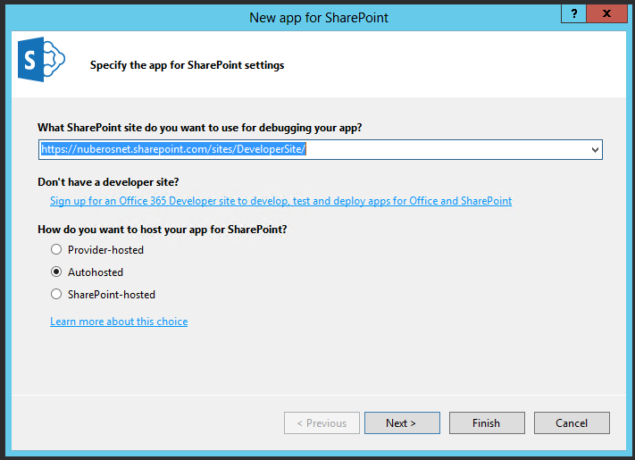

import ArticleHeader from '../../../components/article-header'

<ArticleHeader frontmatter={props.pageContext.frontmatter} />

​Al igual que en la versión Preview de VS 2013, la versión RTM (Ready To Manufature) del IDE incluye de serie la última versión de las herramientas de desarrollo Office Tools para Visual Studio. Por lo tanto, sin necesidad de instalar componentes adicionales se puede comenzar a crear tanto Soluciones como Aplicaciones tanto para SharePoint 2013 On-Premise como para SharePoint Online en Office 365. Para crear Soluciones de SharePoint, se dispone (Imagen 1) de las mismas plantillas de proyecto existentes en VS 2012.

Lo mismo se puede decir para las plantillas de elemento de proyecto que se puede agregar en un proyecto de Solución de SharePoint 2013. La Imagen 2 muestra los artefactos disponibles para agregar al proyecto.

**Novedades en la creación de Aplicaciones para SharePoint 2013 (On-Premise y Online)**

Si la creación de Soluciones para SharePoint no presenta novedades, la creación de Aplicaciones para SharePoint 2013 si incorpora algunos cambios interesantes en la versión RTM de VS 2013 con respecto a la versión Preview:

- Para empezar, VS 2013 nos permite elegir entre dos tipos de plantillas para crear Aplicaciones para SharePoint: "App for SharePoint 2013" y "Cloud Business App".  El primer tipo de plantilla permite crear aplicaciones "clásicas" para SharePoint. En cambio, el segundo tipo permite crear Aplicaciones de negocio utilizando las capacidades de la tecnología LightSwitch, pero sin tener que hacer configuraciones adicionales para poder desplegar las Aplicaciones creadas en SharePoint: se incluye de serie el despliegue de la aplicación creada tanto en SharePoint 2013 On-Premise como en SharePoint Online.

- La plantilla "App for SharePoint 2013" permite crear Aplicaciones de SharePoint de acuerdo a uno de los tres tipos de hosting disponibles: "Hospedadas por SharePoint", "Autohospedadas" y "Hospedadas por el proveedor". Para cualquiera de los tres tipos de Aplicaciones, es necesario especificar la Url del sitio de SharePoint que se va a utilizar para depurar y a continuación elegir el tipo de hosting de la aplicación que se indica mediante un control de tipo "Radio Button". Adicionalmente, se disponen de un par de enlaces para facilitar estas configuraciones.

- Para continuar con el asistente,  hay que hacer clic en el botón  "Next" de forma que se presenta la segunda novedad en el desarrollo de Aplicaciones para SharePoint: para Aplicaciones de tipo "Autohospedadas" u "Hospedadas por el proveedor" es posible seleccionar el tipo de aplicación web que se va a crear. Como se aprecia en la Imagen 5, se puede elegir entre aplicación web de formularios ASP.NET o bien aplicación web ASP.NET MVC. Por lo tanto, las herramientas de desarrollo de Office para VS 2013 RTN incorporan de serie soporte directo para añadir aplicaciones web ASP.NET MVC (en su última versión) en Aplicaciones de SharePoint. Elegimos este tipo y pulsamos "Next".

- Cuando el proyecto se ha creado, se puede comprobar que la solución de VS 2013 dispone de dos proyectos: el de Aplicación de SharePoint y el proyecto ASP.NET MVC. El proyecto de ASP.NET MVC incorpora dos novedades en cuanto a artefactos se refiere. Por un lado, una nueva versión de una pequeña librería JavaScript con nombre "spcontext.js" que facilita el trabajo de lectura de parámetros de la Url de la aplicación. Por otro, una nueva versión del helper "SharePointContex.cs" que proporciona clases y métodos para facilitar el trabajo con tokens de contexto entre peticiones de página de la aplicación. Además, se ha creado un paquete específico de NuGet para facilitar que se pueda usar tanto en proyectos de Apps para SharePoint en VS 2013 como en VS 2012:

[http://www.nuget.org/packages/AppForSharePointWebToolkit/](http&#58;//www.nuget.org/packages/AppForSharePointWebToolkit/)

Si se revisa el nuevo helper "sharepointcontext.cs" se puede comprobar que, entre otros elementos, contiene dos clases abstractas: "SharePointContext" y "SharePointContextProvider". Como se comentó en CompartiMOSS 17, la primera de las clases facilita la administración y uso de los tokens de contexto entre peticiones de página de la Aplicación. La segunda se encarga de proporcionar instancias de "SharePointContext". Este helper está disponible de forma general para aplicaciones de tipo Autohospedado y Hospedadas por el proveedor. En cambio, la librería "spcontext.js" es específica de proyectos web de tipo ASP.NET MVC.

- Finalmente, para probar la Aplicación es suficiente con pulsar F5 en VS 2013 de forma que se despliega en modo depuración la aplicación ASP.NET MVC creada y que hace uso de la última versión de ASP.NET MVC: la versión 5.

**Creación de Aplicaciones de tipo "Cloud Business App"**

Junto con la posibilidad de utilizar ASP.NET MVC 5 en Aplicaciones de tipo "Autohospedadas" y  "Hospedadas por el proveedor", la otra gran novedad que incorpora VS 2013 es la plantilla para crear Aplicaciones de tipo "Cloud Business App". Esta plantilla facilita crear aplicaciones "Hospedadas por el proveedor" en las que inicialmente no es necesario añadir ningún tipo de programación ya que las Aplicaciones se pueden modelar completamente con la ayuda de asistentes y diseñadores:

- Al seleccionar en VS 2013 la plantilla "Cloud Business App", se inicia un asistente en el que simplemente tenemos que indicar la URL del sitio de desarrollador de SharePoint Online en Office 365 dónde vamos a desplegar la aplicación para su prueba y depuración.
- Una vez que concluye el proceso de creación del proyecto, veremos cómo VS 2013 crea cuatro proyectos para la Aplicación:
    - El proyecto de "Cloud Business App".
    - El proyecto relativo a la interfaz de usuario que incluye en su nombre ".HTMLClient".
    - El proyecto relativo a la capa de aplicaciones y de datos que incluye en su nombre ".Server".
    - Y finalmente, el proyecto de Aplicación de SharePoint.

- Junto con esta estructura de proyectos, VS 2013 muestra el diseñador de la Aplicación que consiste en una superficie de diseño en la que podemos empezar a definir las entidades de negocio que se van a utilizar. Tanto las entidades como las pantallas para interactuar con las mismas se van crear con la ayuda de asistentes visuales y un resultado inicial de Aplicación es el que se muestra en la Imagen 9 (Nota**:** No se detalla el proceso para crear las entidades y pantallas, ya que será cubierto en el próximo número de CompartiMOSS).

**Nuevas opciones de depuración**

Las herramientas de desarrollo de Office para VS 2013 incluyen la posibilidad de depurar flujos de trabajo en Aplicaciones utilizando el Service Bus de Windows Azure. De esta forma, es posible depurar no solo manejadores de eventos remotos, sino también flujos de trabajo que se estén ejecutando bajo el contexto de una Aplicación. Para poder hacer uso de esta nueva opción de depuración, hay que acceder a la sección SharePoint de las propiedades del proyecto y realizar las siguientes configuraciones:

- Marcar las dos opciones relativas a depuración de flujos de trabajo por un lado ("Enable Workflow debugging" en la Imagen 10), y de habilitar la depuración remota por otro ("Enable debugging via Windows Azure Service Bus").
- Añadir la cadena de conexión relativa al Service Bus de Windows Azure que se va a utilizar para la depuración.

**Novedades en la publicación de aplicaciones**

La publicación de aplicaciones para SharePoint 2013 con VS 2013 RTM incorpora el "Administrador de publicación" qué facilita el empaquetado de los distintos componentes que la conforman de manera qué esté lista para ser publicada. Esta utilidad contiene enlaces diversos a recursos que se pueden necesitar durante la publicación de la aplicación. La Imagen 11 muestra el aspecto del Administrador de publicación para aplicaciones de SharePoint de tipo "Hospedadas por SharePoint" y "Autohospedadas". Como se puede apreciar, se dispone de un enlace "Package app" qué permite generar el archivo ".app" de la aplicación. El enlace "View the Seller Dashboard" es un acceso directo al Panel del Vendedor del Office Store.

En cambio, para aplicaciones de SharePoint de tipo "Hospedadas por el proveedor" (como por ejemplo las aplicaciones creadas con la plantilla Cloud Business App) se disponen de los siguientes elementos de configuración/información adicionales:

- *Current profile*, Permite indicar perfil de publicación de la aplicación web de la aplicación. Puede ser un nuevo perfil de Windows Azure Web Sites o uno existente.
- *Deploy your web project*, que facilita el despliegue de proyecto web de la Aplicación utilizando el correspondiente asistente.

**Conclusiones**

La versión RTM de Visual Studio 2013 incorpora algunas novedades para la creación de aplicaciones para SharePoint 2013 On-Premise y Online en Office 365 con respecto a las versiones Preview y RC (Release Candidate) del IDE. Así, se incluye soporte directo a la creación de aplicaciones web ASP.NET MVC en aplicaciones de tipo "Autohospedado" y "Hospedadas por el proveedor". Adicionalmente, la plantilla "Cloud Business App" permite crear y publicar rápidamente Aplicaciones de negocio sin necesidad de desarrollar. La depuración de la lógica definida en Aplicaciones se beneficia de la nueva característica de depuración de Flujos de Trabajo por medio del Service Bus de Windows Azure. Finalmente, se incorpora la utilidad "Administrador de publicación" para facilitar la publicación de aplicaciones en el catálogo corporativo o en el Office Store.

**Referencias**

[1]          Post "Announcing Visual Studio 2013 RTM" del blog Apps for Office & SharePoint. [http://blogs.msdn.com/b/officeapps/archive/2013/10/17/announcing-visual-studio-2013-rtm.aspx](http&#58;//blogs.msdn.com/b/officeapps/archive/2013/10/17/announcing-visual-studio-2013-rtm.aspx)

[2]          CompartiMOSS # 17. Novedades en las herramientas de desarrollo de Office para Visual Studio 2013. [http://www.compartimoss.com/revistas/numero-17/novedades-herramientas-desarrollo-office-visual-studio-2013](/revistas/numero-17/novedades-herramientas-desarrollo-office-visual-studio-2013)

**Juan Carlos González Martín**
MVP de SharePoint Server |Arquitecto de Soluciones en LKS
 E-Mail de Contacto: [jc.gonzalez@lks.es](mailto&#58;jc.gonzalez@lks.es)  
Twitter: @jcgm1978
 Blog: [http://geeks.ms/blogs/jcgonzalez](http&#58;//geeks.ms/blogs/jcgonzalez)  
Web: [www.lks.es](http&#58;//www.lks.es/)

