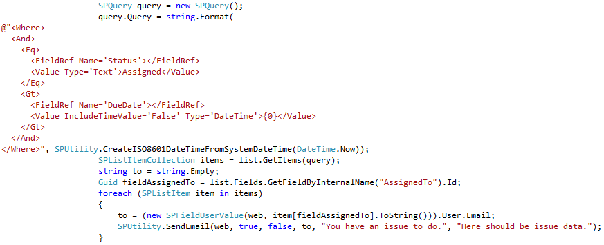

¡Despierta! ¡Despierta! ¡Despierta! - Por favor, no... diez minutos más, por favor... - Está bien, como quieras, diez minutos más. Muchos de nosotros tenemos este tipo de conversaciones con nuestros despertadores cada mañana. Por lo general, las personas apagan la alarma o simplemente la ignoran y después de varios minutos, esta vuelve a sonar. Pero, ¿Qué pasaría si no lo hace? La respuesta es muy simple - en la mayoría de los casos, el resultado sería seguir durmiendo y llegar tarde al trabajo. Esto es algo típico para el individuo común. Funciona de esta manera cuando te despiertas, pero no sólo en esta situación. Pensemos en un contexto en el que alguien quiere algo de ti, por ejemplo, tu amigo necesita de tu ayuda. Él te llama a mediodía y te pregunta si le puedes ayudar con su computadora. Tú le dices que te llamarás por la noche y que entonces lo ayudarás, pero por lo general te olvidas de esto. No vas a recordar ayudarlo, a no ser que te llame nuevamente más tarde.

¿En qué otro tipo de situaciones la gente funciona de esta manera? Por supuesto, en el entorno profesional. Recibes un correo electrónico del sistema con información sobre algún asunto que hay que hacer. Tú estás trabajando en otros asuntos y te gustaría hacerlo más tarde. A veces, te darás cuenta de eso y será suficiente, pero en muchos casos te olvidarás de ello. Lo mejor sería si alguien te lo recordara más tarde. Un simple recordatorio funcionaría. Especialmente si eres el jefe, entonces debes estar cansado de estar recordándole a la gente sobre su trabajo todo el tiempo y te gustaría que tu SharePoint lo haga por ti.

En este artículo voy a describir varias formas de lograr esto. Te voy a mostrar las diferencias entre ellas, sus ventajas y desventajas. Después de leer este artículo sabrás qué método se ajusta mejor a tus necesidades y como lograrlo.
**El entorno**
Para empezar necesitamos de un contexto - que sea el sitio Web de SharePoint con una simple lista. La lista contiene algunos temas asignados a diferentes personas. Hay un campo de usuario que contiene el nombre de una persona a quien se le asigna un número y una fecha de vencimiento para este asunto de trabajo. La lista es la siguiente:

**Escenario**
¿Cómo te parece que sería el típico escenario? Tenemos algunos problemas (tareas, asuntos, elementos de trabajo, etc.) y nos gustaría informar a un usuario de que él tiene algo pendiente de hacer. Nos gustaría seguirlo notificando hasta que comience a trabajar en ese asunto. Pero, ¿Qué debemos hacer si se acerca la fecha del plazo para su realización? Entonces será mejor si la persona que creó el problema está en pleno conocimiento sobre esto. Así que necesitamos un mecanismo que envíe un correo electrónico al usuario asignado todos los días, hasta que empiece a trabajar en el asunto (podemos debatir luego lo qué significa) o cuando la fecha de vencimiento se acerca y otro al usuario que creó el asunto.

**La primera idea**

Cuando se piensa en notificaciones, lo primero que se nos viene a la mente es un sistema de alertas. En un navegador, puedes simplemente establecer una alerta en una biblioteca o en un artículo para que te informe a ti (o a otras personas) sobre los asuntos seleccionados. Sin embargo, en nuestro escenario la principal ventaja es también la principal desventaja. Las alertas funcionan sólo cuando sucede algo: se agrega un elemento, se cambia, se borra, etc. Así que vamos a obtener información cuando se crea un elemento, pero después, si queremos recordar a un usuario de que su asunto está pendiente, las alertas no son suficientes. Necesitamos algo más potente.

**El típico segundo paso**

Por lo general, cuando no hay la posibilidad de hacer algo a través del navegador, el segundo paso es hacer uso de SharePoint Designer. En esta herramienta podemos crear flujos de trabajo declarativos. Para escenarios simples funciona muy bien, ya que no es difícil, SharePoint Designer probablemente será la herramienta adecuada para nuestras necesidades.

¡Vamos a intentarlo!

Los flujos de trabajo de SharePoint Designer pueden incluir varias actividades interesantes, como:

- Enviar correos, con la posibilidad de seleccionar como destinatario al Autor del Asunto y al Asunto Actual
- Si la actividad, puede comprobarse y variar en valores de los campos del Asunto actual.
- Actividades de Pausa - para esperar un período de tiempo y otras por esperar hasta la fecha seleccionada, la que puede ser buscada a partir del Asunto Actual.

Estamos en el camino correcto. Poniendo todo eso junto, tendremos el siguiente flujo de trabajo:

El flujo de trabajo envía un correo electrónico después de crear un asunto (¡Genial!), espera hasta la fecha de plazo de vencimiento y notifica al autor del Asunto que este aún no ha sido recogido (¡Aún más genial!). Pero espera, ¿Qué es lo más importante? -  ¿Un recordatorio diario?

Desafortunadamente, no podemos hacer esto. En SharePoint 2010 Microsoft no incluyó en SharePoint Designer una actividad de bucle, que es la que realmente necesitamos para tener recordatorios diarios. Con ella podemos hacer un seguimiento constante hasta una fecha determinada (fecha, hora exacta, fecha de vencimiento) o un cambio en la columna del estado de actividad. Ahora podemos hacer algunos arreglos, como pausar la actividad para una revisión. De esta manera el flujo de trabajo espera, chequea, espera, chequea. Pero sólo por un número determinado de veces. Este proceso podría caber en algunos escenarios, pero en la mayoría de los casos, no sería factible. Tendríamos que encontrar otra manera de hacerlo.

**Un arma grande**

Como dice la gente, la tercera es la vencida. Ahora sí tenemos que cumplir nuestra tarea. Hemos utilizado un navegador – y no hemos tenido ningún resultado, SharePoint Designer – ha sido casi perfecto, pero no del todo. ¿Qué más podemos hacer? ¿Qué herramienta nos queda? Tenemos una tercera opción, la más poderosa, pero también la más lenta - Visual Studio. Para utilizar Visual Studio y desarrollar soluciones de SharePoint, necesitamos un programador, por lo que la descripción que sigue fue escrita teniendo en mente a los programadores. Otros usuarios de SharePoint lo pueden encontrar demasiado exigente.

¿Qué necesitamos para una solución que funcione en nuestro escenario? Primero necesitamos algo que funcione repetidamente (a diario), que  revise nuestras tareas y envíe mensajes, de ser necesario. En SharePoint hay una gran herramienta para estos casos – los trabajos de temporizador (Timer Jobs). Podemos desarrollar código personalizado que se ejecute en intervalos de tiempo seleccionados. Así que hagámoslo.

En principio tenemos que contar con un proyecto de tipo SharePoint (por ejemplo, SharePoint 2013 - Proyecto vacío) implementado como una solución de granja. Entonces podemos crear una clase específica para nuestro trabajo del contador de tiempo. Esta clase debe heredarse de SPJobDefinition. Recuerde que debe crear dos constructores: uno con los parámetros para inicializar una nueva instancia en tu código y uno sin parámetros para SharePoint - es necesario para la deserialización. Toda la clase se vería así:

El siguiente paso será el método de llenando de la Ejecución. Tenemos que abrir objetos como SPSite, SPWeb y SPList - aquellos en los que almacenamos nuestros asuntos.

Ahora podemos cargar todos los problemas que están en espera de ser recogidos. Para ello, haremos uso de SPQuery, que recogerá  cada elemento que tenga un Estado Asignado y  una Fecha mayor a la fecha de hoy. Por cada artículo, nosotros vamos a enviar un correo electrónico a la persona Asignada a persona con una notificación.

Debemos hacer algo similar para las cuestiones que están pasadas la fecha de vencimiento, pero esta vez vamos a enviar e-mails a los autores de los documentos.

 Necesitamos también un pequeño código para instalar y desinstalar el trabajo de temporizador. Este código se puede iniciar desde una característica de granja o desde una página de configuración.

Así que - por fin tenemos nuestra solución que es adecuada para nuestro escenario, que recerca a la gente sobre sus asuntos todos los días y al autor después de vencido el plazo de finalización. ¡Eso es genial! Y no es muy complicado. ¿Verdad?

Espera - tenemos una solución codificada (para lo que debemos ser programadores o contar con el apoyo de uno), que contiene datos codificados sobre un sitio, una lista, contenidos de correo, etc.  Si algo cambia, necesitamos actualizar la solución y volver a implementarla. Esto toma tiempo. Además no tenemos nada para configurar la solución, la instalación del contador de tiempo, etc.  Entonces, ¿Cuáles deben ser los siguientes pasos? Para disponer de una solución completa, es necesario, como mínimo:

- La característica de granja, para la instalación/desinstalación del trabajo de temporizador.
- La página de configuración (debes decidir dónde ponerlo – una granja, una página Web) con la posibilidad de al menos configurar e-mails, una página y una lista.
- Alguna base de datos donde guardar tus datos de configuración.

Además necesitas tomar algunas decisiones de cómo exactamente te gustaría que funcione. Hay que recordar que nuestra situación es muy simple. Las grandes empresas pueden tener políticas muy específicas sobre los recordatorios, por lo que puedes tener mucho trabajo con escenarios complicados y puede ser necesario crear soluciones personalizadas para los diferentes departamentos. Podría tomar desde varias horas hasta varios días. Suena ridículo para una tarea tan simple. ¿Debería haber algún método más sencillo, no?

**Otras opciones**

Sí. Alguien ya ha reflexionado ante esto y ha desarrollado algunas ideas. Hay muchas soluciones para SharePoint y algunas de ellas pueden ser útiles para nuestro escenario. Voy a demostrar que algunas soluciones no sólo apoyan nuestro escenario, pero también apoyan los procesos de los cuales forma parte este escenario - permite desarrollar mucho más que tan sólo los recordatorios. Voy a presentar sus ventajas - lo que se puede hacer con ellas en el contexto de los recordatorios – y las  desventajas - lo que no se puede hacer.

**Mucho más simple**

En su página, ellos dicen "Flujo de trabajo para todos" - vamos a ver si es para nosotros también. Nintex Workflow, porque de esto es de lo que estamos hablando, es una herramienta de flujo de trabajo de SharePoint que permite crear secuencias avanzadas de flujos de trabajo. Este tipo de flujo de trabajo es similar a los que se pueden crear con SharePoint Designer, pero en comparación con SP Designer tenemos muchas mejoras, como actividades más potentes. En nuestro escenario podemos usar actividades similares a las de Designer, como Enviar Notificaciones (es decir, enviar un correo electrónico) y Pausa (es decir, retrasar). Una cosa más que nos permite apoyar el escenario discutido es la actividad de bucle. Ahora podemos enviar un correo electrónico y esperar hasta su fecha de vencimiento o hasta que la persona asignada recoja el problema. Si se cumple una de las condiciones de flujo de trabajo, se puede seguir adelante y se puede revisar si hay la necesidad de enviar la información al Autor (es decir, cuando un problema no se recoge y se pasa la fecha plazo). Nuestro flujo de trabajo se verá así:

Como se puede ver, hemos logrado nuestro objetivo. Se cumplió con el escenario. Tiempo de desarrollo: menos de una hora. ¡Genial! ¿No es así? Casi. En la mayoría de las situaciones funciona muy bien, pero ¿Qué pasa si nos gustaría que este flujo de trabajo administre aún más nuestro proceso de asuntos? Sería complicado, ya que el flujo de trabajo no sabe cuándo un usuario coge un problema. Se espera día a día y sólo se ve el día en el que un tema es recogido. ¿Qué pasa si queremos enviar un e-mail a un autor cuyo asunto es recogido – porque esto es requerido por muchas empresas. O si nos gustaría enviar de regreso un asunto al autor para actualizarlo o si después de completada la edición, el autor decide dárnosla de nuevo? Nos gustaría volver a reasignarla y siempre tener recordatorios - para la persona signada y también para el autor. Como he mencionado, es una tarea bastante complicada.

**Simple y potente**

La otra solución que me gustaría describir se llama Datapolis Workbox. Consiste en un diseñador gráfico de flujos de trabajo para flujos de trabajo de máquinas de estados en SharePoint, que permite crear y administrar flujos de trabajo avanzados. ¿Qué significa "Máquina de Estado"? Simplemente eso: nos va a ayudar a apoyar los escenarios avanzados mucho más complejos que los descritos al principio. Vamos a comprobar a cuál de los escenarios anteriores le puede dar soporte.

Datapolis Workbox, como he mencionado anteriormente, tiene una gran ventaja. Como se trata de una solución de flujo de trabajo de máquina de estado, tiene estados. Cada estado tiene un nombre que se muestra en una columna especial. Así que no tenemos que crear una columna de estado personalizado como en los ejemplos anteriores, ya que esta se creará automáticamente.

¿Qué estados requerimos? Por supuesto "asignados" (y tal vez unos pocos más para los escenarios más complicados, pero vamos a volver a ellos más tarde). Construyamos primero nuestro escenario simple:

Ahora tenemos estados Asignados y dos acciones - Recordar e Iniciar a trabajar en el asunto. ¿Cuáles son estas acciones? Son transiciones de un estado a otro, las que pueden ser invocadas manualmente por el usuario o automáticamente por el sistema. Las acciones pueden incluir algunas actividades como el envío de un e-mail, etc. Cuando se añade un nuevo elemento, nuestro flujo de trabajo inicia automáticamente y pasa al estado asignado. En SharePoint se ve así:

Así, un usuario puede simplemente hacer clic en Iniciar trabajos en el asunto y moverse al flujo de trabajo del siguiente estado (que es el estado final en este caso). Este movimiento incluye, como he mencionado anteriormente, algunas de las actividades que van a, por ejemplo, enviar un correo electrónico o actualizar un elemento (o hacer muchas otras cosas).

Pero espera – ¿Qué pasa con nuestros recordatorios? ¿Dónde están? Tendremos recordatorios - simplemente tenemos que ponerlos en marcha. Para ello vamos a utilizar la acción de bucle (volver al mismo estado). Datapolis Workbox le permite configurar algo que se llama el contador de tiempo automático. Este mecanismo ofrece la posibilidad de lanzar una acción automáticamente después de (o en) el tiempo seleccionado o si se cumplen las condiciones elegidas. La configuración es muy simple - sólo hay que hacer clic en una acción, luego en el botón del auto-contador de tiempo y luego en "Agregar un nuevo contador automático". Entonces la siguiente ventana se abrirá.

Aquí puedes definir condiciones que no necesitamos en nuestro ejemplo.

La acción editada contendrá una actividad (véase la foto de abajo) que revisa si ya pasó la fecha de vencimiento. Si ya pasó, se envía un e -mail al autor. Si no se envía un e -mail a la persona asignada.

Entonces, ¿Cómo funciona ahora? El sistema comprueba a diario si se ha pasado el plazo de vencimiento y envía un correo electrónico - al autor o a la persona asignada. Si un asunto no está asignado a nadie, no se envía ningún correo electrónico. Así que podemos celebrar - Hemos logrado nuestro escenario.

Pero si es igual al de antes ¿Por qué lo hicimos? ¿Hay alguna razón? Sí, por supuesto que sí. Ahora podemos dejar de esperar y desarrollar nuestro flujo de trabajo, para que pueda soportar todo el proceso. Este flujo de trabajo no realiza sólo una actividad en espera. Sino que espera varias cosas a la vez – el contador da tiempo automático, que inicia la acción "Recordar" o el usuario que inicia la acción "Trabajo Inicio en Asunto". Y se puede esperar aún más. Por ejemplo, podemos cambiar el flujo de trabajo a otro estado automáticamente si se pasa el plazo de vencimiento, entonces se comienza recordando al autor en otro estado y si el autor cambia algo o solicita algún trabajo adicional, se puede volver al estado anterior y empezará de nuevo a recordarle a la persona asignada . En situaciones de vida real más complejas, el flujo de trabajo podría verse de la siguiente manera:

Contiene todo el proceso que apoya a la asignación, el trabajo y el control del problema. Permite también solicitar trabajos adicionales (a la persona Asignada) y más información (al Autor). También maneja varias situaciones de recordatorios a la persona Asignada o al Autor (cuando se pasa la fecha de vencimiento o cuando hay una solicitud de información adicional). Por otra parte, como se puede ver (ver los iconos azules del reloj sobre las acciones que simbolizan el contador de tiempo automático) el flujo de trabajo se mueve automáticamente hacía "Fecha de vencimiento pasada" si la fecha limite pasó (el contador ajustado a la fecha cargada del asunto Actual).

Hay que recordar que en la vida real, también tendrás que crear roles en un proceso. Es bastante difícil de manejarlos de forma dinámica en SharePoint, pero en esta situación puedes simplemente añadir funciones, que se llenan de forma dinámica en las actividades especiales y las puedes usar en acciones, de tal manera que sólo aquellos que deberían ver algunas de las acciones, las verán.

Por lo tanto – haciendo un resumen - hemos logrado nuestro escenario. Nos tomó un tiempo similar a la herramienta anterior - unas decenas de minutos. La ventaja aquí, es que en las próximas decenas de minutos podemos hacer una solución muy compleja que tomaría días o incluso semanas codificar.

**¿Una respuesta simple?**

Cuando necesitamos recordatorios ¿Hay una respuesta sencilla sobre cuál es la herramienta que deberíamos usar? ¿Qué piensas? - claro que no. Siempre depende de lo que se necesite. Así que vamos a resumir nuestra investigación y echar un vistazo a las herramientas que hemos utilizado:

- Navegador - se pueden configurar alertas a través de él. Es suficiente para escenarios muy sencillos, cuando se desea ver los cambios en la lista o en la biblioteca.
- SharePoint Designer - más eficaz, pero soporta solo flujos de trabajo secuenciales simples, sin repetición de recordatorios.
- Codificación en Visual Studio - Satisface todos los escenarios, y tu tiempo también. Úsalo cuando necesites soluciones muy personalizadas.
- Nintex - Apoya la fácil creación de recordatorios avanzados y también da la posibilidad de desarrollar flujos de trabajo secuenciales.
- Workbox - Permite crear recordatorios múltiples dentro de flujos complejos de trabajo de máquinas de estados de manera simple.

Parece que hay una respuesta sencilla sobre que herramienta utilizar, dependiendo de las necesidades, pero no es así. Es muy fácil elegir una herramienta equivocada, por lo que siempre se debe pensar y analizar que  quizás algunas necesidades pueden cambiar ¿Tal vez no necesitas algo tan complicado? ¿Quizás se podría discutir de cómo realmente se debe recordar a la gente acerca de sus tareas? O ¿Tal vez puedas crear una solución parcial con una herramienta de flujo de trabajo de terceros y parcialmente mediante codificación? Recuerda que una buena herramienta puede ahorrarte mucho tiempo. Saber cómo quieres lograr la solución y escoger la herramienta adecuada, incluso si no es la mejor del mercado, aunque sea la mejor para el proyecto actual, te puede ahorrar mucho tiempo y te puede conducir realmente al éxito.

**Tomasz Głogosz**
Project manager and senior .NET architect
[tomasz.glogosz@datapolis.com](mailto&#58;tomasz.glogosz@datapolis.com)

