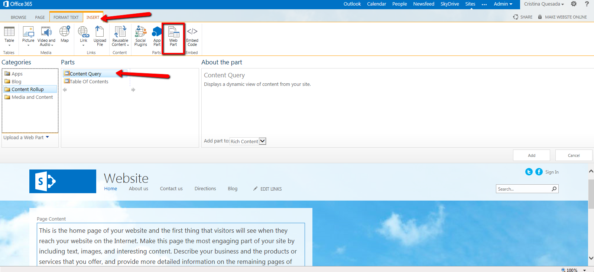

​Un sitio web en SharePoint Online es ideal para las organizaciones identificadas como pequeñas y medianas, ya que se podrán tener herramientas de diseño de fácil uso para crear y mantener un sitio web en Internet. Si, por el contrario, se necesita un sitio web grande o complejo (como administración de contenido web, sitios multilenguaje o comercio en línea), se puede utilizar un sitio de publicación en Internet en SharePoint Server.

El sitio en SharePoint Online es un sitio que puede personalizarse con tan solo un explorador web.

Para poder comenzar a trabajar un sitio web en SharePoint Online, basta con registrarse en Office 365 y se  puede comenzar a trabajar en las siguientes opciones: añadir y editar páginas, cambiar el tema del sitio, optimizar el sitio, agregar aplicaciones de redes sociales y mucho más. Incluso puede usar funciones de diseño de sitio avanzadas como el Administrador de diseño para crear un diseño personalizado desde cero.

**Novedades del Sitio Público en SharePoint Online:**

Es importante mencionar que para aquellos portales en los que se requiera o necesite utilizar WebParts (Por ejemplo: Content Query), están deshabilitados algunos de los WebParts para los Sitios Web de SharePoint Online. Para hacer uso de estos se pueden exportar e importar y así contar con ellos dentro del sitio.

Para importarlo podemos ir a un Team Site de SharePoint Online, dirigirnos a Settings - Site Settings - en la sección "Web Designer Galleries" - seleccionar WebParts:

Estando en el listado de WebParts, seleccionamos el que necesitamos, lo descargamos y lo guardamos en nuestra máquina:

Para agregarlo en el Public Website de SharePoint Online, se quitó el acceso al WebParts Gallery por lo que debemos acceder a través del siguiente link:

En esta galería observaremos menos Web Parts.

Vamos a cargar el WebPart que deseamos tener dando clic en "Upload document":

Se busca el Web Part donde lo descargamos anteriormente:

Verificamos los datos del WebPart y damos clic en "Save".

Ahora lo podremos visualizar en el listado y ya está listo para ser utilizado en nuestra Página Web Pública.

El Sitio de publicación en Internet mediante SharePoint Server 2013 es recomendado para grandes organizaciones que necesitan sitios sólidos y de escala empresarial con administración de contenido web, capacidades de comercio, variaciones multilenguaje, línea de integración empresarial y mucho más.

**Comparación de características de sitios web:**

|  **función** | **Sitio web de SharePoint Online** | **SITIO WEB EN SHAREPOINT SERVER** | **Resumen de funciones** |
| --- | --- | --- | --- |
| Edición de páginas basada en explorador | **X** | **X** | Cree y edite páginas web con tan solo utilizar un explorador web  |
| Páginas de publicación | **X** | **X** | Use páginas de publicación de SharePoint Con borradores, revisiones, etc. |
| Páginas maestras y diseños | **X** | **X** | Acceso a páginas maestras y diseños de página de publicación |
| Administrador de diseño | **X** | **X** | Herramientas avanzadas de diseño web para crear y personalizar sitios web. (Consulte la nota). |
| Apariencias diseñadas | **X** | **X** | Galería de temas que se pueden aplicar y modificar para el sitio web |
| Navegación basada en términos | **X** | **X** | La navegación del sitio web está basada en conjuntos de términos de SharePoint |
| Direcciones URL descriptivas | **X** | **X** | Direcciones URL fáciles de leer que describen la página (como sitioweb.com/contacto) |
| Representaciones de imágenes | **X** | **X** | Representa una imagen en formas distintas según plantillas de imágenes |
| Configuración de SEO | **X** | **X** | Optimiza la apariencia del sitio en resultados de motores de búsqueda públicos |
| Hospedado en línea | **X** |  | El sitio web está en línea, en la nube en todo momento, no es necesario realizar ninguna transferencia |
| Funciones de sitio web público | **X** | ​ | Más temas, funciones del sitio, redes sociales, CSS integrado, etc. |
| Catálogo de soluciones de aplicaciones | **X** | ​ | Capacidad para buscar instalar aplicaciones para sitios web desde el Catálogo de soluciones de SharePoint |
| Dirección del sitio, herramientas de dominios | **X** |  | Herramientas en línea para administrar la dirección URL del sitio web y los nombres de dominio |
| Uso compartido externo | **X** |  | Capacidad para compartir de forma segura con revisores y diseñadores externos |
| Plantillas de publicación |  | **X** | Plantillas del sitio que puede usar para crear un nuevo sitio web público |
| Subsitios, jerarquías de sitios |  | **X** | Capacidad para crear jerarquías de sus sitios que forman el sitio web |
| Tipos de contenido, columnas, campos |  | **X** | Colecciones reutilizables de metadatos para categorías de elementos o documentos. |
| Funciones de búsqueda |  | **X** | Búsqueda personalizable con reglas de consulta, orígenes de resultados y tipos de resultados |
| Elementos web de lista y biblioteca |  | **X** | Capacidad para agregar elementos web de lista con biblioteca a una página con vistas personalizadas |
| Elementos web de búsqueda de contenido |  | **X** | Aplica estilos y representaciones a contenido dinámico en SharePoint |
| Publicación entre sitios |  | **X** | Compatible con varias colecciones de sitios con reutilización y entrega de contenidos |
| Variaciones, traducciones |  | **X** | Sincroniza contenido de una ubicación de origen a otras ubicaciones según el público |
| Páginas del catálogo |  | **X** | Representa contenido del catálogo basado en búsquedas en páginas de publicación |
| Servicios de conectividad empresarial |  | **X** | Integra orígenes de datos y servicios externos en el sitio |
| Flujos de trabajo de publicación |  | **X** | Cree y personalice flujos de trabajo que controlen cuándo se publica contenido |
| Procesamiento de análisis, recomendaciones |  | **X** | Agregue y configure eventos de uso personales y genere informes a partir de estos |

**Conclusiones**

1. SharePoint Online, nos brinda facilidad de implementación, ahorro en tiempos de instalación y configuración pero debemos estar conscientes que a nivel de administración tendremos menor acceso.
2. SharePoint Server 2013, nos brinda un total control de la consola de la Administración Central pero es de suma importancia contar con la infraestructura necesaria para la activación de los servicios requeridos y su buen funcionamiento.
3. Podemos desarrollar una plataforma "híbrida" en donde podamos rescatar las virtudes de ambos productos según sean las necesidades.

Lo más importante es validar las necesidades de nuestro negocio para optar por la mejor plataforma de SharePoint y poder potenciar la comunicación y la colaboración en la organización.

**Cristina Quesada Calderón**
Consultora en Tecnologías SharePoint en Grupo CMA
[cristi\_q@hotmail.com](mailto:cristi_q@hotmail.com) 
@cris\_quesada

 
 
import LayoutNumber from '../../../components/layout-article'
export default LayoutNumber
