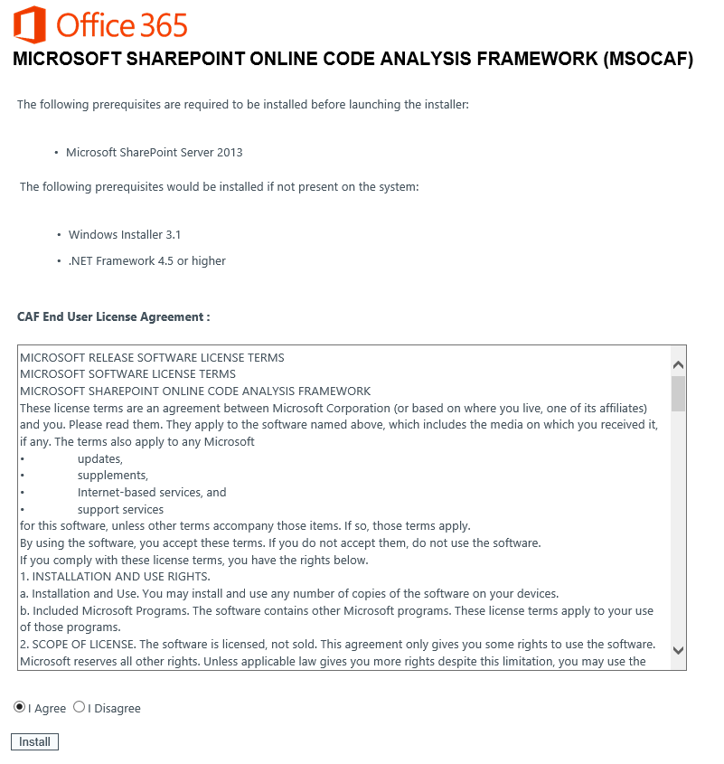
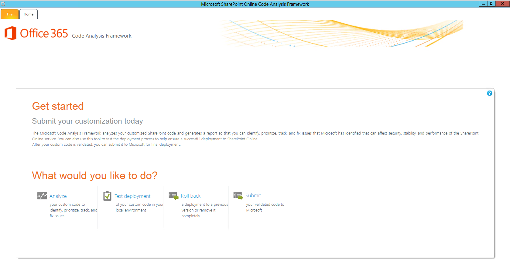
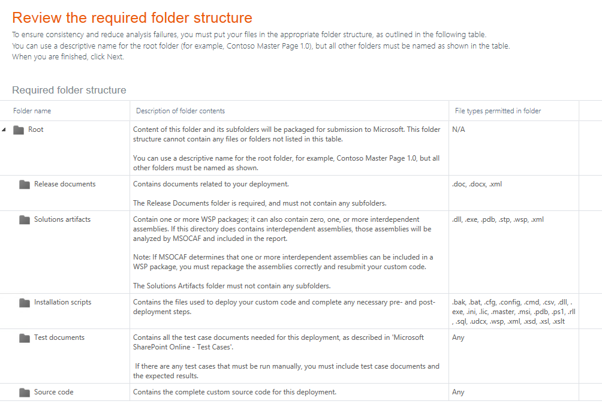
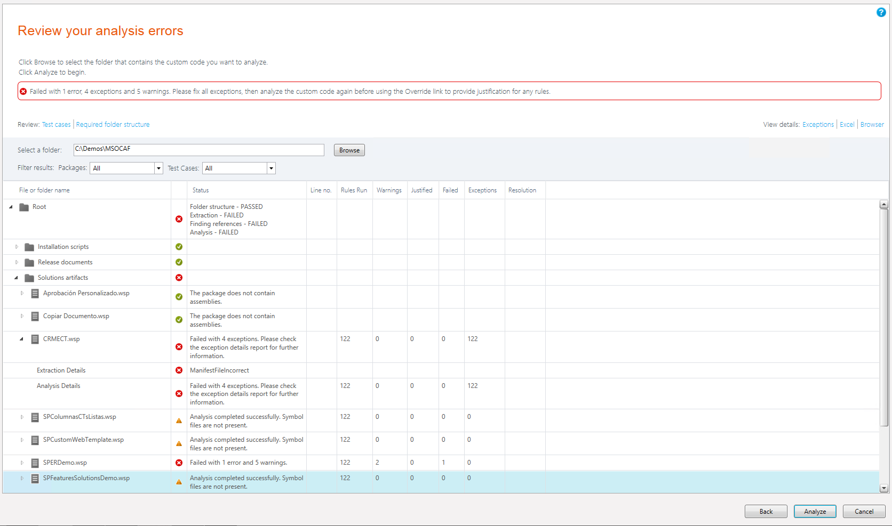
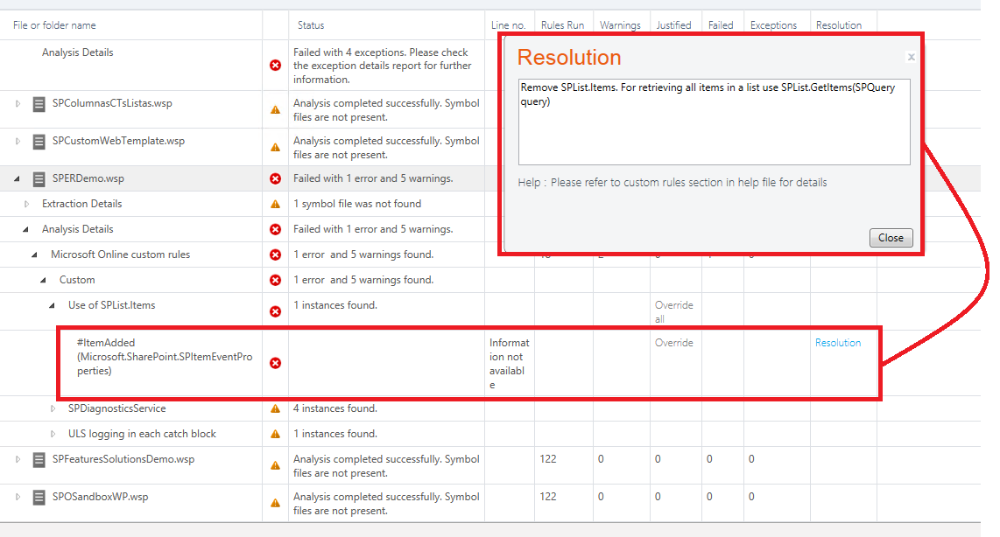
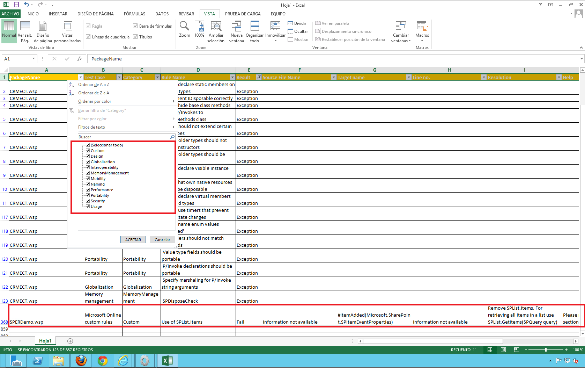
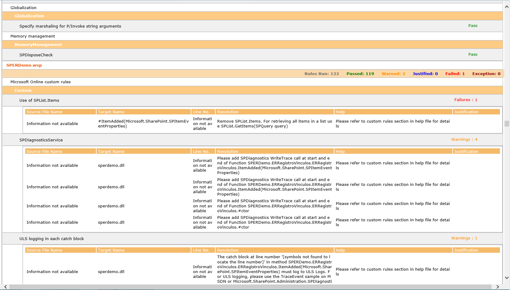

En este artículo vamos a ver cómo podemos utilizar MSOCAF para determinar la calidad de las soluciones para SharePoint 2013 que se han desarrollado a partir del análisis de esta herramienta que proporciona información a distintos niveles:

- **Excepciones**, que identifican aquellas situaciones en las que MSOCAF no ha sido capaz de realizar el análisis de los componentes que las producen.
- **Errores encontrados** en las soluciones a partir de la aplicación de una serie de reglas que permiten detectar problemas de rendimiento (como por ejemplo una mala gestión de memoria en el código), de seguridad, uso de malas prácticas en el desarrollo (como una gestión de excepciones inadecuada), etc.
- **Advertencias**de posibles problemas que podrían ocasionar los desarrollos. Las mismas reglas que se aplican para la detección de errores son aplicados a este nivel.
- Aquellos componentes que han sido analizados y en los que no se han generado errores ni advertencias de posibles errores.

Para poder obtener esta información, MSOCAF se apoya sobre herramientas conocidas como FxCop, CAT.Net y SPDisposeCheck que permiten identificar los errores y problemas en los componentes desarrollados.

**Instalación de MSOCAF**

Para comenzar a utilizar MSOCAF para analizar soluciones SharePoint 2013, el primer paso necesario pasa por descargar la herramienta e instalarla en el entorno de desarrollo de SharePoint 2013:

- MSOCAF está disponible para descarga a través del siguiente enlace: [https://caf.sharepoint.microsoftonline.com/](https&#58;//caf.sharepoint.microsoftonline.com/). En la página correspondiente, se muestra información relativa a MSOCAF y las versiones disponibles: MSOCAF para SharePoint 2010 y MSOCAF para SharePoint 2013.
- La página de descarga de MSOCAF, [https://caf.sharepoint.microsoftonline.com/O15Upgrade.aspx](https&#58;//caf.sharepoint.microsoftonline.com/O15Upgrade.aspx), informa por un lado sobre los pre-requisitos necesarios para utilizar la herramienta: Microsoft SharePoint Server 2013, Windows Installer 3.1 y .NET Framework 4.5 o posterior. Y por otro, sobre el correspondiente acuerdo de licencia que tiene que ser aceptado como paso previo a la descarga de la utilidad.

- Una vez descargado el instalador de MSOCAF, el proceso de instalación indica en primer lugar que se necesita instalar dos componentes: MSOCAF Event Source y Microsoft Enterprise Library 4.1. Confirmamos la instalación de los mismos, de forma que a continuación comience la instalación de MSOCAF a partir del correspondiente paquete de ClickOnce.
- El proceso de instalación concluye añadiendo un acceso directo a MSOCAF en el escritorio del entorno de desarrollo de SharePoint 2013 y lanzando la aplicación para comenzar a utilizarla.

Antes de comenzar a utilizar MSOCAF para analizar soluciones SharePoint, es recomendable revisar el archivo de ayuda que acompaña a la herramienta en el que se detalla el funcionamiento de la utilidad, las reglas que se aplican en el análisis y el detalle de las mismas, etc. Por ejemplo, la regla personalizada "Use of SPList.Items" ofrece el siguiente detalle:
 

|  **(a) Check for Use of SPList.Items**   If any of the instructions contains the SPList.Items object, MSOCAF will generate an error.   **If you encounter problems****:**   Remove the SPList.Items object from the instructions. For retrieving items in a list, use SPList.GetItems (SPQuery query).For more details, see the MSDN article  [Best Practices: Common Coding Issues When Using the SharePoint Object Model](http&#58;//msdn.microsoft.com/en-us/library/bb687949.aspx) .  |
| --- |

 

**Uso de MSOCAF**

Utilizar MSOCAF para analizar soluciones SharePoint es realmente sencillo e implica seguir una serie de etapas definidas en la herramienta:

- El proceso comienza en la pantalla de inicio de MSOCAF (Imagen 1) y la opción "Analyze". A continuación se muestra una pantalla en la que se establece la estructura de carpetas que MSOCAF necesita para realizar el análisis de las soluciones.

Por lo tanto, es necesario crear la estructura de carpetas que muestra la Imagen 3 y añadir en cada carpeta el contenido apropiado de acuerdo a la información del asistente de MSOCAF. Evidentemente, la carpeta más importante es "Solutions artifacts" ya que contiene las componentes a analizar (Nota: Elementos con extensión .WSP, .dll, .exe, .pdb, .stp y .xml)

- A continuación, el asistente de uso de MSOCAF presenta una pantalla en la que se listan las distintas reglas que se van a utilizar en el análisis de los componentes SharePoint. Las reglas se muestran agrupadas por categorías que identifican el tipo de análisis que realizan y los problemas / advertencias que permiten localizar. En total, MSOCAF define 12 categorías de reglas que internamente hacen uso de las herramientas de análisis mencionadas (FxCop, SPDisposeCheck y CAT.NET): Design, Globalization, Interoperability, Mobility, Naming, Performance, Portability, Usage, Memory Management, Security, Microsoft Online Custom Rules y SharePoint 2013 Upgrade  Rules.
- El siguiente paso del asistente consiste en especificar la ruta con la estructura de carpetas que necesita MSOCAF para realizar en análisis. A continuación, para comenzar el proceso basta con presionar el botón "Analyze" disponible en esta pantalla. A este nivel, si por ejemplo MSOCAF detecta problemas en la estructura de carpetas, mostrará un primer mensaje de error a pesar del cual se puede seguir adelante con el análisis. Por ejemplo, si la carpeta de "Release documents" está vacía, es motivo para que se produzca un error en MOSCAF.
- A partir de este punto es cuando comienza el proceso de análisis de los artefactos SharePoint,  sin duda el gran valor añadido que aporta MSOCAF, la revisión de los resultados del proceso de análisis y la solución de los errores y problemas identificados.
- Por ejemplo, en el ejemplo de análisis de este artículo, se han analizado un total de 9 paquetes .WSPs y MSOCAF genera un informe con advertencias y errores en los mismos que será necesario solucionar antes de realizar cualquier pase a pre-producción o producción de dichos compontes.

Como se puede apreciar, otro aspecto interesante del informe es que se pueden aprender buenas prácticas para el desarrollo de soluciones SharePoint, siempre en el caso en el que no se esté haciendo uso de las mismas y  en aspectos como la gestión de excepciones, evitar el uso de palabras reservadas en el código, etc.

**Notas:** Cuando se menciona que es necesario (recomendable) solucionar los errores y problemas encontrados, es importante recordar que MSOCAF es utilizado por Microsoft para dar de pasos los desarrollos de terceros para Office 365 por lo que los resultados derivados del análisis con MSOCAF son sin duda una buena medida de la calidad de los componentes desarrollados.

- Dependiendo del tipo de error detectado por MSOCAF, la propia ventana de resultados proporciona información más o menos detallada del mismo e incluso su resolución.

**Análisis detallado de los resultados de MSOCAF**

Para realizar un análisis más detallado de los resultados generados por MSOCAF, la herramienta proporciona tres capacidades de serie que proporcionan un mayor detalle en el análisis:

- Excepciones, proporciona un informe detallado (en formato .xml) de las excepciones producidas en el análisis de los componentes.
- Exportación a formato Excel, que permite generar un documento Excel con información detallada sobre los errores y advertencia generadas por MSOCAF tras analizar los componentes. El archivo Excel que genera MSOCAF permite conocer problemas y advertencias generadas en base a distintos casos de tests que aplica MSOCAF: diseño, gestión de memoria, etc. Además, se puede hacer uso de las capacidades de filtrado de Excel para ir acotando los problemas detectados.

- Exportación a formato "Browser", que permite visualizar para cada regla de análisis aplicada por MSOCAF los problemas y advertencias que se han encontrado.

**Conclusiones**

El desarrollo para plataforma SharePoint, como ocurre para cualquier otra plataforma, debería implicar aplicar una serie de estándares de calidad que muchas veces son obviados lo que conlleva a que se puedan desplegar en entornos de pre-producción y producción componentes con errores, en los que no se hagan uso de buenas prácticas, etc. Afortunadamente, la incorporación de herramientas como MSOCAF al proceso de desarrollo de soluciones SharePoint permite detectar este tipo de situaciones y solucionarlos siguiendo las recomendaciones que la propia herramienta incluye de serie.

**Juan Carlos González Martín**
 MVP de SharePoint Server |Arquitecto de Soluciones en LKS
 E-Mail: [jc.gonzalez@lks.es](mailto&#58;jc.gonzalez@lks.es)  
Twitter: @jcgm1978 
 Blog: [http://geeks.ms/blogs/jcgonzalez](http&#58;//geeks.ms/blogs/jcgonzalez)  
Web: [www.lks.es](http&#58;//www.lks.es/)

