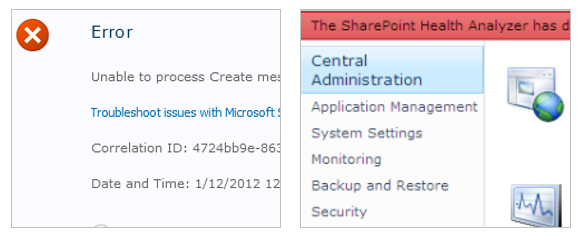
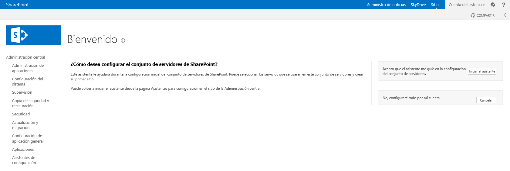
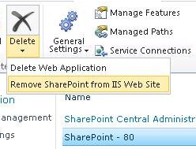
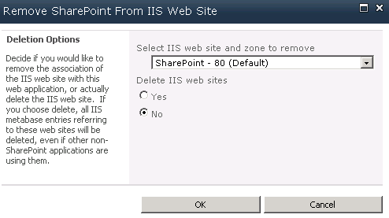
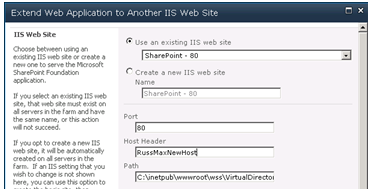

"*¡Maldito SharePoint!*", "*Es una basura*", "*Odio a SharePoint*" … Son frases que solemos escuchar en un ataque de desesperación ante un problema con SharePoint. Los desarrolladores y administradores de IT debemos luchar día a día con extraños problemas que pueden provocar que lleguemos a desesperarnos e incluso a odiar a esta plataforma.

Pero… ¿tenemos siempre la razón? ¿Hay que culpar a SharePoint de todos nuestros problemas? ¿No tendremos nosotros parte de la culpa? Está demostrado que un alto porcentaje de los errores de SharePoint son debidos a una mala instalación, configuración o desarrollo. En el presente artículo trataremos errores muy comunes a la hora de instalar y configurar SharePoint y veremos cómo se debe planear y configurar una buena arquitectura.


**Cometemos errores**

En aproximadamente 30 minutos es posible instalar y configurar una granja de servidores de SharePoint. Microsoft nos proporciona una serie de asistentes rápidos para realizar estas tareas para que, con poco conocimiento podamos montar servidores para pruebas o desarrollo. ¡Pero atención! Cuando instalemos una granja en producción debemos ser extremadamente cuidadosos. En estos casos no basta con asistentes, hay muchas cosas a tener en cuenta como cuentas administrativas, servidores, caché, aplicaciones, URL… Es necesario conocer muy a fondo la plataforma si queremos montar un entorno estable.



Inspirándome en un post de Todd O. Klindt para SharePoint 2010, quiero presentaros los 10 errores más comunes en la instalación de SharePoint 2013.

**Error #1: Instalar todo con una cuenta**

Es posible instalar y configurar una granja de SharePoint utilizando una única cuenta para todo, pero el sistema se puede volver muy vulnerable. Quien conozca esta contraseña, podrá hacer cualquier cosa en la granja. Además, el Health Analyzer de la granja mostrará continuamente errores y podemos perder el soporte con Microsoft.

Aquí se detallan las diferentes cuentas administrativas necesarias para instalar y configurar una granja de SharePoint y los permisos necesarios:

[http://www.sinsharepointnohayparaiso.com/Blog/Entrada/92/Cuentas-administrativas-para-instalar-configurar-SharePoint-2013](http://www.sinsharepointnohayparaiso.com/Blog/Entrada/92/Cuentas-administrativas-para-instalar-configurar-SharePoint-2013)

De todas estas, las mínimas son:

- **Cuenta de instalación (spsetup)**: Con esta cuenta se instala SharePoint en los servidores y se ejecuta el asistente de configuración de la granja (no confundir con la cuenta de acceso a base de datos, que se rellena en este asistente). Posteriormente, tendrá suficientes privilegios para configurar la granja y ejecutar PowerShell.
- **Cuenta de acceso a base de datos (spfarm)**: Esta cuenta se configura en el asistente de creación de la granja para conectar a  base de datos. Será administrador de la granja y se impersonará en SharePoint como "Cuenta del Sistema". Es también la cuenta del pool de aplicación del IIS de la Administración Central y cuenta del servicio de timers.
- **Cuenta para "pool de aplicación" de las aplicaciones de contenido (sppool)**: las aplicaciones de contenido deben tener un "pool de aplicación" en IIS que se ejecute con una cuenta específica. Se recomienda una cuenta por aplicación de SharePoint (sppool1, sppool2, sppool3…).
- **Cuenta para el "pool de aplicación" de las aplicaciones de servicio (spservices)**: las aplicaciones de servicio (Excel, PerformancePoint, metadatos administrados…) deben tener un "pool de aplicación" en el IIS que se ejecute con una cuenta distinta a la del pool de las aplicaciones de contenido.


Aunque estas sean las mínimas, es recomendable configurar todas (cuentas para el crawl, para el pool de búsquedas, pool de MySite, para perfiles, caché, desatendidas para Excel, Visio y PerformancePoint, …).

**Error #2: Usar el asistente de configuración de la granja**

Este asistente crea todas las aplicaciones de servicio y de contenido para la granja de SharePoint.



Tras usarlo, todo funciona aparentemente, pero hay problemas:

- Determinadas aplicaciones de servicio no tienen los permisos/seguridad configurados correctamente.
- Los nombres de las bases de datos son largos e incómodos. Y si SharePoint está en un idioma distinto al inglés, pone unas bases de datos con el título en inglés y otras en el otro idioma.
- Se crea el MySite dentro de la aplicación de contenido colgando del path "/my" cuando lo recomendable es crearla como aplicación aparte.


**Error #3: Requisitos de hardware incorrectos**

Todas las máquinas del entorno deben cumplir con el mínimo de TechNet: [http://technet.microsoft.com/es-es/library/cc262485.aspx](http://technet.microsoft.com/es-es/library/cc262485.aspx)

En cuanto a memoria, si SharePoint tiene poca RAM apaga funcionalidades, cachea menos en los pool de aplicación del IIS y los reinicia con más frecuencia. Además, los procesos de búsqueda en 2013 consumen mucha memoria RAM.

En cuanto a discos duros, es recomendable separarlos al menos de la siguiente forma:

- **Sistema**: sólo para el Sistema Operativo.
- **Paginación**: debe una capacidad del doble de la memoria RAM.
- **Binarios y LOG**: disco en el que se instalará SharePoint y se almacenarán los LOG.


En base de datos, la separación ideal para un buen rendimiento sería tener separados estos siete discos:

- Disco del sistema.
- Binarios (instalación de SQL Server) e instancia.
- Archivos MDF de las bases de datos de contenido.
- Archivos LDF de las bases de datos de contenido.
- Archivos MDF de búsquedas y rastreo.
- Archivos LDF de búsquedas y rastreo.
- TempDB.


**Error #4: Mal funcionamiento o configuración de SQL Server**

El rendimiento y velocidad de SharePoint se puede ver muy afectado si SQL Server no funciona de manera óptima. Hay que dedicar mucho esfuerzo y dedicación a configurar los servidores de SQL Server para conseguir un entorno robusto. Debemos asegurarnos que se cumplen los requisitos mínimos de hardware ([http://technet.microsoft.com/es-es/library/cc262485.aspx](http://technet.microsoft.com/es-es/library/cc262485.aspx)) y que analizamos correctamente las capacidades de SQL Server ([http://technet.microsoft.com/es-es/library/cc298801(v=office.15).aspx)](http://technet.microsoft.com/es-es/library/cc298801%28v=office.15%29.aspx%29).

Como recomendación adicional, es bueno configurar la conexión entre SharePoint y SQL Server utilizando un SQL Alias. Un alias es un nombre por el cual un servidor identifica a una instancia de SQL Server. Cuando se conecte SharePoint a SQL Server, se puede usar un alias en vez del nombre concreto SERVIDOR\INSTANCIA. De esa forma, si en el futuro se cambia el servidor de SQL Server o se sustituye por otro entorno, no afecta a SharePoint, ya que basta con reconfigurar el alias.

**Error #5: Configuración a mano de los IIS**

Hay determinados cambios en las aplicaciones web que estamos malacostumbrados a hacerlos directamente sobre la consola de IIS o sobre el web.config. Cambiar determinados parámetros a mano puede darnos problemas.

Es posible evitar el tocar a mano un web.config en la mayoría de las ocasiones:

- Si se quiere registrar una DLL en el web.config, se debe llevar en un paquete WSP, que actualice las referencias en el web.config de forma automática.
- Si se quiere añadir datos clave-valor, en vez de meter entradas a mano en la sección de appsettings del web.config, pueden usarse Property Bags de SharePoint.
- Si se quiere realizar cualquier otra modificación en el web.config, puede hacerse un WSP que lance un código que use la clase SPWebModification de la API para modificarlo. Ejemplos en [http://www.codeproject.com/Articles/390545/SharePoint-web-config-modifications](http://www.codeproject.com/Articles/390545/SharePoint-web-config-modifications).


Si se añade un nuevo servidor frontal web a la granja de SharePoint, puede que cree las aplicaciones y no añada personalizaciones a mano del web.config. En cambio, si hemos usado WSP para añadirlas, SharePoint desplegará los WSP y se añadirán los cambios.

Del mismo modo, no se debe cambiar a mano el host header de una aplicación SharePoint en el panel de administración de IIS. Cuando se crea una aplicación con host header, el host header se graba en el objeto SPWebApplication que está en la tabla de objetos de la base de datos de configuración. Si se intenta cambiar a mano el host header cambiándolo en los "Alternate Access Mappings" y en el panel de IIS, haremos que no se actualice el valor en el objeto. Si se intenta añadir un nuevo servidor a la granja, no cogerá los valores correctos. Y si, accidentalmente bajamos el servicio de SharePoint "Microsoft SharePoint Foundation Web Application" de un frontal web y lo volvemos a arrancar, perderemos también esta configuración.

Para cambiar el host header de una aplicación web ya existente, podemos hacerlo mediante PowerShell o desde la Administración Central. Para ello, seleccionamos la opción "Remove SharePoint from IIS Web Site", que permite desasociar la aplicación SharePoint del IIS (Imagen 4):



Seleccionamos el sitio del que desasociarnos. Cuidado, si está extendida la aplicación sólo nos desasociaremos de uno. Hay que marcar que no queremos borrar el sitio físico de IIS (Imagen 5):



​Una vez hecho esto, en la Administración Central, seleccionamos la aplicación y pulsamos el botón de extender en la ribbon. Seleccionaremos la aplicación ya existente y le pondremos el nuevo host header (Imagen 6):



Podemos comprobar el valor del objeto SPWebApplication de la base de datos de configuración con las siguientes líneas de PowerShell:

```
$app = GetSPWebApplication "http://miaplicacion" 
```

```
$iissettings = $app.GetIisSettingsWithFallback("Default") 
```

```
$iissettings.ServerBindings
```

**Error #6: Excedernos o quedarnos cortos con los pool de aplicación**

Las aplicaciones web se ejecutan dentro de un "pool de aplicación" (application pool en inglés), que es un proceso (W3WP.exe) que se ejecuta en el servidor. En el caso de las aplicaciones SharePoint, debemos seguir una serie de recomendaciones:

- Ejecutar las aplicaciones de servicio sobre "pool de aplicación" distintos a los de las aplicaciones de contenido.
- En el caso de aplicaciones de servicio, se recomienda que la aplicación de servicio de búsquedas use un pool distinto al del resto con una cuenta distinta.
- En el caso de las aplicaciones de contenido, se recomienda que cada una utilice un pool de aplicación distinto con una cuenta distinta (ver error #1).


El convenio para los "pool de aplicación" de las aplicaciones de servicio que me gusta es el que se sigue en proyectos como el de AutoSPInstaller. Consiste en crear cuatro "pool de aplicación" con las cuentas que se indica y añadir los distintos servicios al crearlos:

- **SecurutyTokenServiceApplicationPool*****[user: spfarm]***
    - Security Token Service Application
- **SharePoint Hosted Services*****[user: spservices]***
    - App Management Service Application
    - Business Data Connectivity Service Application
    - Excel Services Application Web Service Application
    - Machine Translation Service
    - Managed Metadata Service
    - PerformancePoint Service Application
    - PowerPoint Conversion Service Application
    - Secure Store Service Application
    - Microsoft SharePoint Foundation Subscription Settings Service Application
    - User Profile Service Application
    - Visio Graphics Service Application
    - Word Automation Services
    - Work Management Service Application
- **SharePoint Search Application Pool*****[user:spsearch]***
    - Search Administration Web Service Application
    - Search Service Application
- **SharePoint Web Services System*****[user: spfarm]***
    - Application Discovery and Load Balancer Service Application


**Error #7: Dejar la configuración por defecto de base de datos que hace SharePoint**

Cuando SharePoint crea las bases de datos, toma algunas decisiones que pueden afectar al rendimiento:

- Establece el autogrow de bases de datos a 1 MB. Esto provoca bajo rendimiento (con casi cada carga de info la base de datos crece) y que haya diminutos trozos de 1 MB que forman parte del archivo de la base de datos a lo largo de todo el disco.
- El Recovery Model se configura a "full". Si no se maneja bien, los archivos ldf llenarán el disco duro.


**Error #8: No habilitar el cacheo de BLOB**

El cacheo de BLOB se utiliza para guardar temporalmente en disco objetos binarios (como imágenes y videos) que se utilizan frecuentemente para mejorar el rendimiento de la granja y de la aplicación. Por defecto está deshabilitado y es muy útil, sobretodo en aplicaciones con muchas imágenes y vídeo. Para configurar: [http://www.gavd.net/servers/sharepointv4/spsv4\_item.aspx?top=inf&itm=1468](http://www.gavd.net/servers/sharepointv4/spsv4_item.aspx?top=inf&amp;itm=1468)

**Error #9: usar la cuenta spfarm para todo**

La cuenta de conexión a base de datos (generalmente llamada spfarm) es la cuenta usada en el asistente de creación de la granja para conectar a  base de datos. Tras esta configuración, esta cuenta se convierte en el administrador de la granja que se impersona en SharePoint como "Cuenta del Sistema". Es también la cuenta del pool de aplicación del IIS de la Administración Central y cuenta del servicio de timers.

Una vez configurada esta cuenta, la recomendación es no utilizarla. De hecho, no debe ser administrador local en los servidores de SharePoint, luego su uso puede ser hasta incómodo. Si se requiere hacer operaciones con configuración o mantenimiento sobre la granja vía Administración Central o PowerShell, hay dos opciones más recomendables:

- Utilizar la cuenta de instalación (generalmente llamada spsetup), ya que tiene permisos suficientes para ejecutar cualquier operación administrativa de PowerShell.
- Dar permiso a otra cuenta en las bases de datos que se desee mediante el comando [Add-SPShellAdmin](http://technet.microsoft.com/es-es/library/ff607596.aspx) (**nunca a mano en SQL Server**).


**Error #10: No hacer que los servidores SharePoint apunten a sí mismos**

Es recomendable jugar con el fichero de host de Windows (C:\Windows\System32\Drivers\etc\hosts) para hacer que los frontales web apunten hacia sí mismos para las aplicaciones web que contienen. De esta forma, si hay errores o un mal despliegue, sabremos que en cada servidor estamos probando su propia aplicación web y no otra a la que nos esté llevando el balanceador.

Del mismo modo, si hacemos que el servidor que rastrea el contenido para búsquedas apunte a sí mismo, podemos evitar molestar a los DNS y no provocar tráfico en la red, con lo que puede mejorar el rendimiento.

**En la próxima entrega…**

En la próxima parte del artículo veremos las mejores recomendaciones para estructurar una granja de SharePoint. Veremos las distintas opciones que tenemos para añadir, quitar y estructurar los servidores, modelos y arquitecturas de referencia en los que basarse y recomendaciones a la hora de configurar el entorno.


**Miguel Tabera Pacheco**
 SharePoint Server MVP 
[miguel.tabera@outlook.com](mailto:miguel.tabera@outlook.com) 
@migueltabera
 [http://www.sinsharepointnohayparaiso.com](http://www.sinsharepointnohayparaiso.com/)

