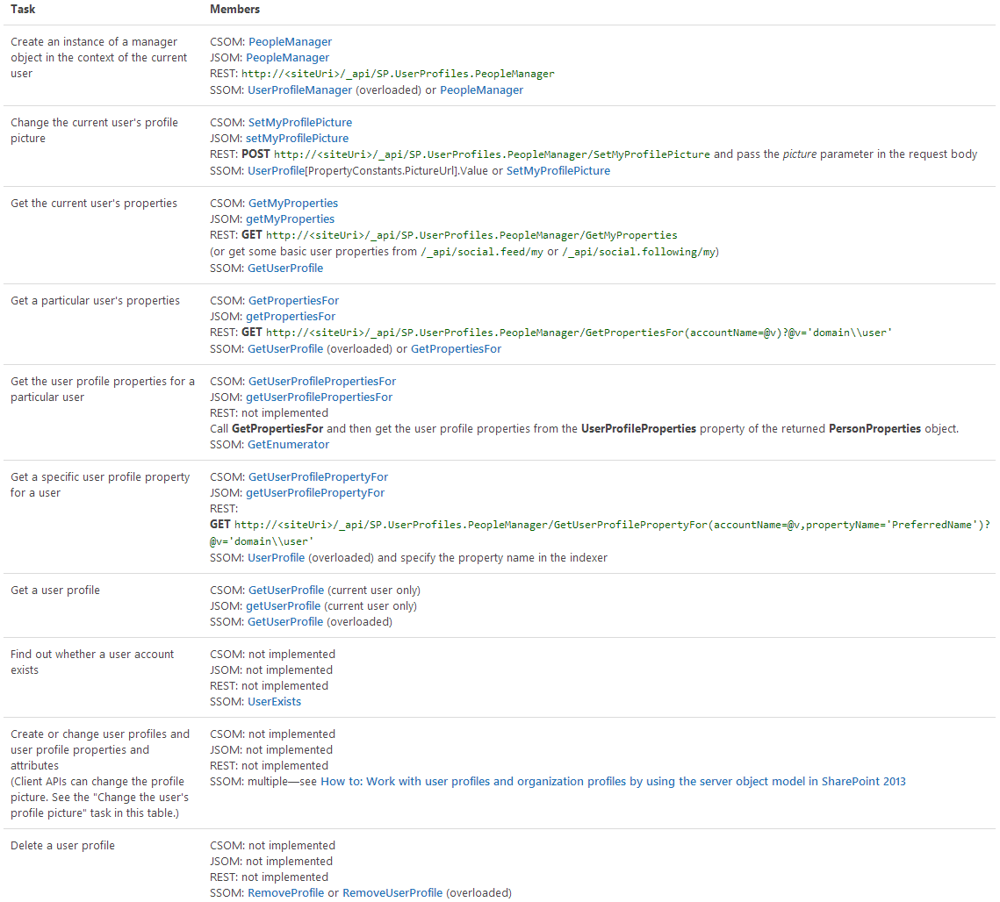
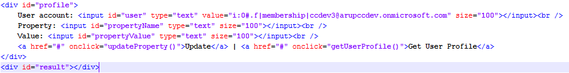
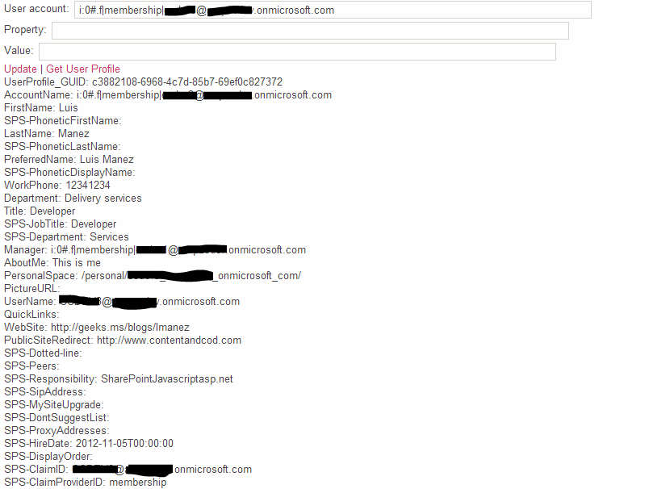

SharePoint 2013 nos ofrece una nueva interfaz REST para poder realizar un gran número de operaciones desde el lado cliente. En el caso de los perfiles de usuario, tan solo podemos realizar operaciones de consulta, así como actualizar la foto del usuario. En este enlace tenemos más información sobre el uso de la interfaz REST en perfiles de usuario:

[http://msdn.microsoft.com/en-us/library/office/jj163800.aspx](http://msdn.microsoft.com/en-us/library/office/jj163800.aspx)

En especial, la siguiente tabla es bastante aclarativa al respecto de las operaciones a realizar y las URL REST a utilizar:



Ahora bien, si queremos actualizar el perfil de usuario, tendremos que volver a utilizar el antiguo servicio web *userprofileservice.asmx* y para ello, nos facilitara bastante la vida el pluggin de jQuery SPServices:

[http://spservices.codeplex.com/wikipage?title=$().SPServices&referringTitle=Documentation](http://spservices.codeplex.com/wikipage?title=%24%28%29.SPServices&amp;referringTitle=Documentation)

El siguiente snippet de código muestra un ejemplo de cómo podemos obtener el perfil de usuario a través de SPServices. Este código se puede incluir en un *Script Editor Web Part* y previamente deberemos asegurarnos que hemos subido los ficheros JavaScript necesarios a SharePoint, y que los referenciamos dentro del *Script Editor Web Part*.

```
<script type="text/javascript" src="https://lmdev.sharepoint.com/sites/test1/Style%20Library/jquery.SPServices-2013.01.js"></script>
```



```
function getUserProfile() {
```

```
    var accountName = $("#user").val();
```

```
    $().SPServices({
```

```
        operation: "GetUserProfileByName",
```

```
        AccountName: accountName,
```

```
        completefunc: function (data, status) {
```

```
            var profile = {};
```

```
            var profileInfo = "";
```

```
            $(data.responseText).find("PropertyData").each(function (idx, val) {
```

```
                var $val = $(val);
```

```
                var name = $val.find("Name").text();
```

```
                var value = $val.find("Value").text();
```

```
                profile[name] = value;
```

```
                profileInfo += name + ": " + value + "<br />";
```

```
            });
```

```
 
```

```
            $("#result").html(profileInfo);
```

```
        }
```

```
    });
```

```
}
```

Y en la siguiente imagen vemos el resultado de la llamada (por facilitar la lectura no están incluidas todas las propiedades):



Y el siguiente snippet, es donde podemos actualizar las propiedades del perfil de usuario:

```
function updateProperty() {
```

```
    var accountName = $("#user").val();
```

```
    var propertyName = $("#propertyName").val();
```

```
    var propertyValue = $("#propertyValue").val();
```

```
 
```

```
    var propertyData = "<PropertyData>" +
```

```
    "<IsPrivacyChanged>false</IsPrivacyChanged>" +
```

```
    "<IsValueChanged>true</IsValueChanged>" +
```

```
    "<Name>" + propertyName + "</Name>" +
```

```
    "<Privacy>NotSet</Privacy>" +
```

```
    "<Values><ValueData><Value xsi:type=\"xsd:string\">" + propertyValue + "</Value></ValueData></Values>" +
```

```
        "</PropertyData>";
```

```
 
```

```
    $().SPServices({
```

```
        operation: "ModifyUserPropertyByAccountName",
```

```
        accountName: accountName,
```

```
        newData: propertyData,
```

```
        completefunc: function (xData, Status) {
```

```
            var result = $(xData.responseXML);
```

```
            $("#result").html(result);
```

```
        }
```

```
    });
```

```
}
```

Como podemos observar, necesitamos preparar cierto XML, que es utilizado en el SOAP Envelope del servicio web.

Con este código podemos actualizar propiedades del perfil de usuario desde código cliente, pero cabe resaltar que solo se puede actualizar el perfil del usuario logado actualmente, es decir, el usuario que está ejecutando la página. También cabe destacar que no todas las propiedades pueden ser actualizadas, ya que dependerá de si dicha propiedad es sincronizada, en cuyo caso no podrá ser actualizada, o si la propiedad se ha definido para que el usuario no la pueda actualizar.

Con este código ya hemos conseguido una importante mejora respecto a la interfaz REST, pero en muchos escenarios, lo que necesitaremos es actualizar varios perfiles de usuario, no solo el del usuario logado, por ejemplo, en procesos de migraciones de usuarios a SharePoint Online.

En SharePoint Online, tenemos la restricción de que nuestras soluciones deben ser en modo Sandbox, así que no podemos ejecutar código de servidor que utilice la DLL de los User Profile. Sin embargo, podemos invocar el servicio web de los User Profile desde un script PowerShell y hacerlo de tal manera que permite actualizar cualquier perfil de usuario.

El siguiente código es un ejemplo de cómo hacerlo:

```
$user = "user@name.onmicrosoft.com" $password = "password" $serviceUrl = "https://name-admin.sharepoint.com/_vti_bin/userprofileservice.asmx"
```

```
$accountName = "i:0#.f|membership|user@name.onmicrosoft.com"
```

```
 
```

```
$securePassword = ConvertTo-SecureString $password -AsPlainText -Force
```

```
Add-Type -Path "c:\Program Files\Common Files\microsoft shared\Web Server Extensions\15\ISAPI\Microsoft.SharePoint.Client.dll" 
```

```
Add-Type -Path "c:\Program Files\Common Files\microsoft shared\Web Server Extensions\15\ISAPI\Microsoft.SharePoint.Client.Runtime.dll"
```

```
 
```

```
$credentials = New-Object Microsoft.SharePoint.Client.SharePointOnlineCredentials($user, $securePassword) 
```

```
$userProfileServiceUri = [System.Uri] $serviceUrl
```

```
 
```

```
$authCookie = $credentials.GetAuthenticationCookie($userProfileServiceUri);
```

```
 
```

```
if ($authCookie -eq $null) {
```

```
    Write-Host "Invalid Authentication cookie" -ForegroundColor Red
```

```
} else {
```

```
    Write-Host "SharePoint Online Authentication succesfuly" -ForegroundColor Green
```

```
 
```

```
    $authContainer = New-Object System.Net.CookieContainer 
```

```
    $authContainer.SetCookies($userProfileServiceUri, $authCookie);    
```

```
 
```

```
    try {
```

```
        $svc = New-WebServiceProxy –Uri $serviceUrl'?WSDL' -Namespace WebServiceProxy -Class UserProfile
```

```
        $svc.CookieContainer = $authContainer
```

```
 
```

```
        Write-Host "Calling UserProfile Service..."
```

```
        
```

```
        #reading a Prperty and printing its value
```

```
        $prop = $svc.GetUserPropertyByAccountName($accountName, "CellPhone")
```

```
        $prop.Values
```

```
 
```

```
        #updating a user profile property
```

```
        $newData = New-Object WebServiceProxy.PropertyData
```

```
        $newData.Name = "CellPhone"
```

```
        $valueData = New-Object WebServiceProxy.ValueData
```

```
        $valueData.Value = "1111 1234 1234"
```

```
        $newData.Values = @($valueData)
```

```
        $newData.IsValueChanged = $true
```

```
        $svc.ModifyUserPropertyByAccountName($accountName, @($newData))
```

```
 
```

```
    } catch [Exception] {
```

```
        Write-Host $_.Exception.Message
```

```
    }
```

```
}
```

Lo más destacable del código anterior es:

- Debemos conectar a la URL de la Colección de Sitios de Administración en SharePoint Online (name-admin.sharepoint.com)
- Para autenticarnos contra el servicio web, debemos utilizar la cookie de autenticación de SharePoint Online, y para ellos debemos crear un objeto *SharePointOnlineCredentials* con un usuario que pueda administrar los perfiles de usuario, y a continuación obtener la cookie de esas credenciales (GetAuthenticationCookie), que es añadida a un objeto CookieContainer
- Para invocar a un servicio web desde PowerShell, necesitamos crear un Proxy, esto se consigue con el comando de PS New-WebServiceProxy
- El parámetro NameSpace es fundamental, ya que luego necesitaremos usar tipos definidos en el propio servicio web, como son el *PropertyData* y *ValueData*


Y de este modo, seria relativamente sencillo, a partir de un fichero XML, CSV o cualquier origen de datos, migrar información a los perfiles de usuarios de SharePoint Online, cosa que, a día de hoy, no es viable desde el lado cliente (JS o REST), ni desde código de servidor, por ser en modo Sandbox.


**Luis Mañez**
 MCPD SharePoint 2010 and Microsoft Active Professional
 @luismanez
 [http://geeks.ms/blogs/lmanez](http://geeks.ms/blogs/lmanez)

 
 
import LayoutNumber from '../../../components/layout-article'
export default LayoutNumber
