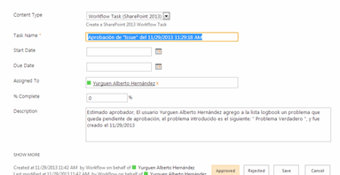
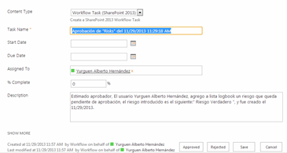

​Los flujos de trabajo que manejan aprobaciones, son flujos muy útiles porque permiten mantener un control adecuado de las tareas que se realizan dentro de una organización, además de permitir a los más altos mandos que procede y que no lo hace dentro de la empresa, los flujos son una herramienta muy eficaz que con trabajo y bien diseñados nos permiten tener control total sobre lo que ocurre en la organización.

El primer componente importante que vamos a utilizar es la herramienta SharePoint Designer 2013 para crear el flujo de trabajo, debemos de elegir el sitio sobre el cual vamos a trabajar y poner nuestras credenciales para trabajar sobre el mismo (en caso de ser necesario). Y ahora si empecemos a crear nuestro flujo de trabajo para aprobación.

Para este ejemplo, utilizaré un sitio ficticio, en el cual tendré una lista llamada "Logbook" a la cual le asignaré un flujo de trabajo que me avisará cuando se haya agregado un elemento y me pedirá la aprobación de replicar 2 elementos de esta lista en nuevas listas llamadas "Issues" y "Risks", ahora si iniciemos el flujo.

Debemos crear el flujo asociado a una lista.

Aquí es donde empieza la parte de estructura y donde hay que ponerle la lógica a los flujos de trabajo, vamos por el principio, nuestro flujo de trabajo cuando se va activar, pues justamente en el momento que se agregue un elemento y deba ser sometido a un análisis para determinar si califican con problema o riesgo real. Esta es la "cara" inicial que nos mostrará el SharePoint Designer al iniciar un flujo de trabajo.

Para todos aquellos que alguna vez hemos escuchado o estudiado la famosa máquina de Turing, esto no les parecerá nada complicado en estructura, pues los flujos de trabajo (workflows) son desde mi punto de vista Autómatas de Estado Finito donde las fases simulan ser los estados y las transiciones son las mismas condiciones que permiten a los autómatas moverse de un estado a otro, igualmente funcionan en los flujos de trabajo.

Continuando de lleno con los flujos de trabajo, vamos a colocarle un nombre a cada fase para poder identificarlas sin ningún tipo de confusión y nos permita tener más claridad sobre el trabajo que se realiza.

Ahora empieza la magia, lo primero es irnos al menú superior y buscar donde dice "Acción" aquí buscamos la tarea que disparará el flujo de trabajo, en este caso usaremos "Wait for event in List Item". En este menú están todas las acciones posibles de manejar en el flujo de trabajo.

Una vez aquí vamos donde dice "this item event" y configuramos que disparará nuestro flujo de trabajo, dentro configuramos que sea cuando se agrega un elemento y además escogemos sobre cual lista, en nuestro caso será la lista "Logbook".

En el designer en la parte de opciones del sitio se trae una opción llamada "Iniciar flujo de trabajo automaticamente cuando se cree el elemento", yo personalmente recomiendo utilizar esa opción en lugar de esta primer fase (la muestra por cultura), ya que además de requerir una fase extra tambien es menos fiable, pues puede inducir a error, por ende yo recomiendo activar la opción que mencione anteriormente.

Ahora vamos al mismo panel de arriba y creamos una nueva fase, simplemente pulsando en el boton Fase, esto nos creará una nueva Fase, al igual que a la anterior le ponemos un nombre en este caso será "Envío para aprobación".

Ahora en la Fase "Inicio del Flujo de Trabajo" vamos a la parte de transición y configuramos para saltar de estado, para esto ponemos la acción "Go to state".

Para realizar la aprobación, SharePoint Designer nos ofrece una segmento de acciones llamado "Task Actions" que nos permite manipular la aprobación de tareas de manera sencilla y muy controlada. Lo primero que debemos hacer es poner en la Fase "Envio para Aprobacion" la acción "Assign a task", la cual nos preguntará a cual usuario se lo debemos asignar y que será lo que debe aprobar.

Nos mostrará el siguiente formulario el cual deberemos de llenar con la información requerida para que llegue a la persona que deseamos con la información deseada.

El primer segmento incluye 4 campos, el primero se refiere a quien debe realizar la tarea, el segundo al nombre de la tarea, el tercero a la descripción de la misma y el último a la fecha de vencimiento de la misma. Se necesita probar un poco la herramienta para llegar a conocerla completamente, aqui simplemente les daré una demostración básica del manejo de variables y sus atributos.

Se le debe asignar la tarea a la persona aprobadora, el título será el nombre genérico que tendrá la tarea y permitirá al aprobador saber exactamente a que se refiere la tarea y vamos a la parte de descripción, entremos más profundamente aquí para explicar los terminos variables y atributos, para todos aquellos que hemos programado a bajo nivel le será muy sencillo asociar los terminos pero vamos despacio, lo primero será ingresar donde dice "Abrir el editor para el cuerpo" y nos conducirá a la siguiente ventana.

Aquí como podrán ver se podría agregar texto plano, es decir la misma descripción siempre para esta tarea, pero no sería inteligente, puesto que ocupamos que el aprobador se de cuenta de cual es el problema o riesgo, así que vamos donde dice "Agregar o cambiar busqueda" y nos mostrará un cuadro con 3 elementos, Origen de datos (variable), Campo de origen (atributo).

El origen de datos (variable) es un ente que puede variar, al que se tiene acceso y del cual podemos extraer información que se requiera, esa información (atributo) es el campo de origen, en este caso utilizaremos la lista actual (al inicio del flujo de trabajo asociamos a "logbook" al flujo, por ende es la lista actual) y utilizaremos uno de sus campos llamados "Identified Issues" que refiere al campo de la lista donde se ingresan los problemas encontrados.

Esto nos devuelve al cuadro anterior una "referencia" de los datos elegidos.

Después de esto podemos personalizar el cuerpo de nuestra tarea a nuestro gusto, yo le agregaré texto y algunas otras referencias para enriquecer el contenido.

Abajo, los siguientes menús son totalmente manipulables y se utilizan en caso de desear enviar correos electrónicos, o tomar acciones predeterminadas, por ahora no las vamos a tocar, porque no resultan relevantes para nuestro flujo de trabajo y además utilizaremos el correo electrónico, pero de forma "manual" para poder explicar lo sencilla que es la funcionalidad y no depender del formulario de tareas para utilizarlo.

Para finalizar vemos que la tarea incluye una variable llamada Problema o Riesgo (ese nombre se lo coloque yo), pero estas determinan el nombre que tendrá la respuesta a esa tarea, es decir el resultado de esa tarea se almacenara en un "Integer" que podrá ser visto en el flujo.

Ahora con la tarea asignada para los problemas, debemos hacer exactamente lo mismo pero con los riesgos, empezando por la acción "Assign a task", luego que ya tengamos las 2 tareas asignadas, vamos a enviar un correo electrónico con la tarea, "send e-mail", entramos a donde nos pide a quien le enviaremos el correo y configuraremos el correo electrónico.

Aquí está la configuración que le puse al correo electrónico, acotando en este punto también se pueden utilizar variables y atributos.

Ya en este punto, solo nos falta hacer que el flujo de trabajo decida que hacer de acuerdo a la respuesta recibida por parte del aprobador aquí continuamos creado 3 estados. (Aprobar Problema, Aprobar Riesgo, Aprobar Ambos).

Volvemos a la fase anterior, y en la parte de transición irá la lógica del flujo, usaremos esta vez no una acción, sino una condición (ubicadas a la par de las acciones) y utilizaremos "if any value equals value", para comparar, usaremos una estructura if-else (sería más fácil generar 2 flujos distintos en riesgos y problemas para no generar tantos if-else, pero lo hacemos en la misma tarea para poder complicar la existencia y aprender situaciones más complicadas).

Así se ve nuestro bloque de código con el cual vamos a trabajar, esta vez utilizaremos como origen de datos las variables y parámetros propios del flujo de trabajo, y en el campo de origen tomaremos el atributo (llamado variable en el flujo de trabajo) problema.

Y preguntaremos si es rechazado, así sucesivamente montaremos todos los if-else para determinar la ruta a seguir, debemos entender bien el funcionamiento de los if-else, como sus palabras lo dicen, el if hace la pregunta "¿Esto es verdad?" en caso de serlo continua en su bloque, en caso de no serlo, salta al bloque debajo de su respectivo else, una ventaja de esta estructura es que nos permite anidar if-else dentro de otros if o else lo cual nos permite tomar más de 2 caminos.

Así quedo mi estructura de decisión if-else para este flujo de trabajo. (Se creó un último estado de finalización).

Para terminar el flujo de trabajo debemos ir a cada uno de los estados anteriores y con la acción "create ítem list" generar la réplica de la información solicitada, empecemos por "Aprobar Ambos". Aquí escogeremos la lista "Issues" para iniciar y nos cargará por defecto los atributos que se deben cargar por defecto. Además nos permite agregar nuevos atributos, y poder "matchearlos" entre si.

Con esta simple acción ya creamos la copia oficial del problema creado, esto debemos hacer en cada uno de las fases, de acuerdo a su "estado".

Este es el último estado, donde colocamos un comentario que explica que terminamos el flujo.

Así hemos concluido ya el flujo de trabajo, despues de haberlo guardado y publicado el flujo de trabajo estará listo para empezar a trabajar. Podemos ver en la imagen siguiente como el flujo de trabajo ya aparece asociado a la lista (encerrado en el circulo rojo) y significa que esta activo.

Ahora ya podemos despreocuparnos de la entrada de riesgos o problemas que entren al centro de información sin autorización necesaria.

Proseguiremos con la demostración de como funciona el flujo de trabajo,  creamos elementos dentro de la lista "logbook" para disparar el flujo de trabajo, y podemos ver que inmediatamente a su creación los flujos de trabajos asociados empiezan a trabajar.

Aquí tenemos el correo que configuramos para enviar, podemos ver como llego de la forma exacta como lo habias configurado.

Pero recuerdan anteriormente comente no configuraríamos los envíos de e-mail dentro de las tareas, bueno veamos cómo funciona esa herramienta, ahora mostraré los correos automáticos que me fueron enviados "automáticamente por las tareas que creamos".

Veamos un correo enviado desde las tareas de riesgos y de los problemas, así podemos notar que completa es la asignación de tareas en los flujos de trabajo, pues si notaron sin configurar nada estos envían notificación consisas de lo que sucede, de nuevo yo personalmente recomiendo no utilizar la herramienta "send email" en caso de notificar sobre tareas, la herramienta por defecto es muy eficiente y no es necesario inventar el agua tibia, el "send e-mail" es genial para otro tipo de notificaciones, como por ejemplo podría ser un resultado quizá de esas mismas tareas.

Correo de problemas:

Al entrar a los links que traen los correos podemos ver la información básica de la tarea, podemos notar que la descripción que habíamos editado, es la que le llegará al aprobador, y justamente será la mejor forma de decidir si se aprueba o no la tarea.

Para poder decidir si se aprueba o no la tarea, debemos ir al menú superior y pulsar donde dice "Edit Item" así se nos desplegarán las opciones de aprobar o rechazar en la parte inferior, aquí es justo donde el aprobador toma la decisión e inclusive puede modificar información básica que deba cambiar para poder aprobar. Lo podemos ver en los 2 siguientes ejemplos de un problema y un riesgo respectivamente.

Problema:

Riesgo:

Luego de haber aprobado las verdaderas y haber rechazado las falsas, el flujo de trabajo realizará su labor y decidirá cuales entran en las listas y de realizarse correctamente podríamos dar por finalizado el taller, por ende según la información que habíamos agregado, "Prueba #1" y "Prueba #2" deben ser incluidas en la lista de riesgos, mientras que "Prueba #2" y "Prueba #3" deben ser agregados a la lista de problemas. Corroborando la información anterior tenemos la siguiente imagen.

Ahora mostraremos las listas, comprobando el funcionamiento óptimo del flujo de trabajo.

Logrando confirmar que el flujo de trabajo, realizo su trabajo de maravilla podemos constatar lo poderoso que puede ser un flujo de aprobación para una organización, no permitiendo que se escape ni un detalle, ya que se puede recibir correos con información de lo que está sucediendo o también se puede requerir autorizaciones dando una gama de control y estructuración de los procesos.

Así concluimos nuestro flujo de trabajo de aprobación, sencillo pero muy poderoso, espero les sea de mucha utilidad.

**Yurguen Hernández Hernández**
Siderys & BSN.
[yurguenh@siderysbsn.com](mailto:yurguenh@siderysbsn.com)

 
 
import LayoutNumber from '../../../components/layout-article'
export default LayoutNumber
