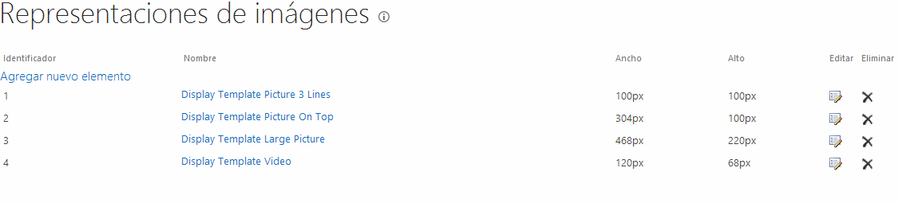
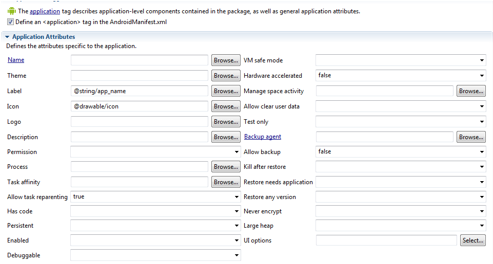

​A la hora de empezar a desarrollar una aplicación para móvil antes de empezar a escribir una línea de código, te tienes que hacer una serie de preguntas: ¿la vas a implementar para más de una plataforma? ¿Nativa, hibrida o HTML5? Dependiendo de las respuestas que obtengas,  optarás por una solución u otra.

En nuestro caso particular, a la primera pregunta, nuestra respuesta es SÍ. Entonces, como desarrolladores inquietos, lo que queremos es escribir una aplicación que con el mismo código fuente (o la mayor parte del mismo) nos pueda valer para ambas plataformas.  Para conseguir este objetivo, con una aplicación HTML5 es suficiente. Ahora bien, a la hora de seleccionar un tipo de aplicación, no solo tenemos que mirar el mayor reaprovechamiento de código, sino que la aplicación que vamos a desarrollar aproveche al máximo las características del teléfono. En el caso concreto de la aplicación de CompartiMOSS no hace uso de hardware alguno del dispositivo (como la cámara, la radio,…). Como consecuencia cumple perfectamente con la opción de ser una aplicación HTML5. En caso de que necesitáramos hacer uso de alguna particularidad del teléfono, como pueda ser utilizar la cámara de fotos, ya valoraríamos si implementamos una aplicación hibrida o una aplicación nativa. Una aplicación hibrida puede ser de dos formas: una aplicación HTML5 que utiliza un plugin implementado en nativo, o una aplicación nativa que necesita utilizar alguna característica HTML5 (hoy en día las aplicaciones hibridas copan el 75% de las aplicaciones que hay en los STORE).  Y una aplicación nativa es la que se implementa con el lenguaje para el sistema operativo por defecto de esta aplicación: XAML y C# para Windows Phone, Java para Android y Objective-C para iOS.

**Qué beneficios aporta SharePoint a una aplicación móvil**

Una vez hemos decidido que vamos a implementar una aplicación HTML5, el siguiente paso es ver cómo obtener los datos de SharePoint. En el caso de SharePoint 2013, la respuesta es muy clara: haciendo peticiones a la API REST. En esta versión, casi cualquier elemento que hay en SharePoint tiene un punto para solicitar la información de esta forma: Site, Web, List, servicio de traducción, el servicio de búsqueda, etc. De esta forma, se facilita muchísimo la vida a los desarrolladores y se ahorra mucho trabajo, ya que a la hora de implementar cualquier aplicación móvil hay que desarrollar un servicio para comunicar los datos con la aplicación.

En el caso de CompartiMOSS, como hemos visto en [anteriores números](/revistas/numero-16/como-se-hizo-compartimoss-parte-ii), la visualización de información se apoya sobre las capacidades del servicio de búsqueda. Nosotros haremos lo mismo en las Apps móviles: la información que vamos a mostrar se va a obtener utilizando peticiones API REST a este servicio.

Otra de las grandes ventajas que tiene SharePoint para el desarrollo de móvil, es que podemos utilizar las mismas imágenes que tenemos en la Web pero adaptándola tanto en tamaño del archivo como en medida. SharePoint  2013 incluye una característica que se llama Representación de Imágenes que nos ayuda a optimizar la entrega de imágenes, manteniendo en caché una versión optimizada de la misma en diferentes tamaños. ¿Esto qué quiere decir? Que dentro de esta característica podemos definir un nuevo tipo de imagen como carrusel en la que disponemos de un alto y ancho, tal y como nos han indicado nuestros diseñadores. Y en el momento de realizar la llamada a la imagen, le indicamos que nos la muestre con el renderizado indicado. De esta forma, las tareas de pensar si tenemos que tener una biblioteca para las imágenes de móvil, o bien, pensar algún mecanismo para que las imágenes que están alojadas en una determinada biblioteca y son muy pesadas se puedan representar en una aplicación móvil lo tenemos resuelto.

Para que esta característica funcione hay que seguir los siguientes pasos:

- Activar la "Blob Cache" en nuestro sitio Web. Para activarla tenemos que dirigirnos al web.config y en la entrada donde pone "&lt;BlobCache …." poner el valor "Enabled=True".
- Definir el Tamaño que queremos utilizar para eso dentro del sitio de SharePoint "Configuración del Sitio-&gt;Administración de Imágenes".




- Ahora bien, ¿cómo debemos llamar a la imagen para que tenga estas características? Pues concatenando a la URL de la imagen el parámetro "?RenditionID=Numero" donde Numero es el identificador que está en el apartado anterior. En caso de que necesitemos un tamaño que no esté definido por defecto también tenemos la posibilidad de pasarle los parámetros a la imagen de la siguiente forma: "?width=150&heigth=100″ Los dos parámetros no son obligatorios, podemos indicar solamente el alto o el ancho y el mismo se encarga de proporcionarla en base a ese valor.


**Siguientes pasos**

Una vez que se han explicado todos los aspectos que vamos a utilizar de SharePoint 2013 para crear la APP, queda el proceso de ponerse a desarrollar la aplicación. Al haber decidido implementar una APP HTML5, el primer paso es buscar una herramienta con la que podamos trabajar de una forma simple. En la actualidad hay muchos Frameworks JavaScript que generan el código HTML5 como hemos visto en anteriores números ExtJS, Kendo UI,  u otros conocidos como son AngularJS, Blackbone. Ahora bien, el decidir entre uno u otro depende más de lo evolucionados que estén para dispositivos móviles y en este caso ExtJS tiene una parte de su Framework dedicado a la movilidad llamado Sencha Touch (además de que disponemos de un IDE Sencha Arquitect para facilitarnos aún más el trabajo).

**Sencha Touch**

De la misma forma que ocurre con ExtJS, Sencha Touch facilita mucho la creación de APPs, de prototipos de aplicación y dispone de una arquitectura MVC en la que se basan las aplicaciones que se construyen. Basándonos en esta arquitectura, por un lado, nos vamos a crear los Modelos. Una vez tengamos los modelos creados, nos crearemos la comunicación con SharePoint y crearemos la vista que se renderizará en los dispositivos móviles.

Los modelos en esta aplicación está claro que son: Revistas, Artículos y Autores. Su definición dentro de la plataforma quedaría de la siguiente forma:

| `Ext.define(``'CompartiMOSS.model.revistaModel'``, {` |
| --- |

| `    ``extend:``'Ext.data.Model'``,` |
| --- |

| ` ` |
| --- |

| `    ``config: {` |
| --- |

| `        ``fields: [` |
| --- |

| `            ``{` |
| --- |

| `                ``mapping:``'Cells.results[5].Value'``,` |
| --- |

| `                ``name:``'Title'` |
| --- |

| `            ``},` |
| --- |

| `            ``{` |
| --- |

| `                ``mapping:``'Cells.results[2].Value'``,` |
| --- |

| `                ``name:``'Portada'` |
| --- |

| `            ``},` |
| --- |

| `            ``{` |
| --- |

| `                ``mapping:``'Cells.results[6].Value'``,` |
| --- |

| `                ``name:``'Editorial'` |
| --- |

| `            ``},` |
| --- |

| `            ``{` |
| --- |

| `                ``mapping:``'Cells.results[4].Value'``,` |
| --- |

| `                ``name:``'LinkUrl'` |
| --- |

| `            ``},` |
| --- |

| `            ``{` |
| --- |

| `                ``mapping:``'Cells.results[7].Value'``,` |
| --- |

| `                ``name:``'Number'` |
| --- |

| `            ``}` |
| --- |

| `        ``]` |
| --- |

| `    ``}` |
| --- |

| `});` |
| --- |

Este código no tiene ninguna complicación. Por un lado está el nombre del campo cómo lo vamos a llamar dentro de nuestro Modelo y, por otro lado, nos da la opción de mapearlo con la petición a la API REST de forma que podamos definir el nombre tal y como queremos, y no como nos lo devuelva la API REST.

Una vez ya tenemos definido el modelo, el siguiente paso es crear un "Store". Un store es un objeto que se encarga almacenar los datos en el lado del cliente, a través de peticiones a un proxy se encarga de enviar la información en ambos lados. En el caso particular de estas APPs solamente utilizamos la funcionalidad de leer los datos del servidor ya que la información solamente es un único sentido.   Este proxy que se encarga de la comunicación puede ser de diversos tipos AJAX, JSON, JSONP, XML, REST… en el supuesto que ninguno encaje con nuestros requerimientos siempre podremos desarrollar un proxy para establecer esta comunicación. En nuestro caso con un simple proxy "Ajax" sería suficiente. Para configurarlo sólo tenemos que configurar la URL donde vamos a solicitar los datos (la llamada API REST) y por otro lado, indicar el modelo en el que queremos mostrar los datos. Un ejemplo de Store utilizado seria el siguiente:

| `Ext.define(``'CompartiMOSS.store.revistaStore'``, {` |
| --- |

| `    ``extend:``'Ext.data.Store'``,` |
| --- |

| ` ` |
| --- |

| `    ``requires: [` |
| --- |

| `        ``'CompartiMOSS.model.revistaModel'` |
| --- |

| `    ``],` |
| --- |

| ` ` |
| --- |

| `    ``config: {` |
| --- |

| `        ``model: CompartiMOSS.model.revistaModel',` |
| --- |

| `        ``storeId:``'revistaStore'``,` |
| --- |

| `        ``proxy: {` |
| --- |

| `            ``type:``'ajax'``,` |
| --- |

| `            ``url: 'http:``//www.compartimoss.com/_api/search/query?.....,` |
| --- |

| `            ``reader: {` |
| --- |

| `                ``type:``'json'``,` |
| --- |

| `                ``rootProperty:``'d.query.PrimaryQueryResult.RelevantResults.Table.Rows.results'` |
| --- |

| `            ``}` |
| --- |

| `        ``}` |
| --- |

| `    ``}` |
| --- |

| `});` |
| --- |

Dentro de la configuración del Store, indicamos el tipo de Proxy que vamos a utilizar, en este caso una simple llamada "Ajax", la URL a la que vamos a realizar la petición y dentro de la lectura indicamos el nodo a partir del cual están los datos. En este caso la petición está en el quinto nivel. ¿Qué ocurre si indicamos mal está propiedad? En caso de que no lo indiquemos correctamente no se mostrarán los resultados tal y como esperamos. Si por ejemplo, ponemos un nivel menos solamente nos mostraran los registros que tenemos a ese nivel y naturalmente, tampoco casarán los resultados que estamos esperando con nuestro modelo.

**Diseño de la APP**

Con el modelo y los datos vinculados, queda la parte más difícil para los desarrolladores que es la representación de los datos. Para ello hemos utilizado diversos componentes que están incluidos dentro del Framework, unido con Sencha Architect (que nos proporciona la visión de como se muestra el resultado en el tamaño del móvil).  Una visión de este IDE es la siguiente imagen:


Sencha Touch contiene bastantes componentes para facilitarnos el desarrollo, desde una Toolbar, Button, Panel, TextBox, TextData, Validator, etc. De todos estos componentes, el que más hemos utilizados ha sido Ext.DataView.List que es un componente que se encarga de mostrar los elementos almacenados en un Store. Pero su mayor virtud es que a este componente le podemos añadir un template para indicar como queremos visualizar cada elemento de forma que quede tal y como el diseñador quiere.  En nuestro caso tenemos dos tipos de templates: uno para mostrar las revistas y otro visualizar los artículos que componen la revista. Ambos quedan de la siguiente forma:

| `<div class=``"divCompartiMOSSMagazineNumber"` `>  ` |
| --- |

| `               ``<div class=``"divPicture"` `>   ` |
| --- |

| `                           ``<a href=``"#"` `>` |
| --- |

| `                                           ``` |
| --- |

| `         ``</a>` |
| --- |

| `               ``</div> ` |
| --- |

| `               ``<div class=``"divOverlay"` `style=``"top: 150px;"``>  ` |
| --- |

| `                           ``<a class=``"linkOverlay"` `href=``"#"``>      ` |
| --- |

| `                                         ``<h2 class=``"ms-noWrap"` `>{Title:``this``.TituloEditorial2}</h2>   ` |
| --- |

| `                           ``</a>    ` |
| --- |

| `               ``</div>    ` |
| --- |

| `</div>` |
| --- |

Dentro del Template podemos añadir diversas funciones a la hora de que se muestre el elemento. Porque es muy útil esta función. En nuestro caso cuando solicitamos las imágenes a SharePoint, la URL donde están almacenados nos devuelven una URL relativa es decir independientemente de donde está el servidor. La API REST supone que siempre la estamos utilizando dentro del contexto de SharePoint por lo cual tenemos que buscar alternativas para conseguir visualizar estas imágenes. En nuestro caso con añadir la siguiente función es suficiente:

| `Function Transform33(value)` |
| --- |

| `{` |
| --- |

| `var` `cadena = value.split(``' '``);` |
| --- |

| `var` `resultado;` |
| --- |

| `var` `maxLength=cadena.length;` |
| --- |

| `for` `(``var` `i=0;i<maxLength;i++)` |
| --- |

| `{` |
| --- |

| `    ``if` `(cadena[i].indexOf(``'src='``)>-1)  ` |
| --- |

| `    ``{` |
| --- |

| `        ``resultado=cadena[i];` |
| --- |

| `        ``resultado= resultado.replace(``'src="'``,``'src="http://www.compartimoss.com'``);` |
| --- |

| `        ``resultado= resultado.replace(``'src='``,``''``);` |
| --- |

| `        ``resultado= resultado.replace(``'"'``,``''``);       ` |
| --- |

| `        ``resultado=resultado.replace(``'"'``,``''``);` |
| --- |

| `    ``}` |
| --- |

| `}` |
| --- |

| `resultado.replace(``'<br />'``,``''``);` |
| --- |

| `return` `resultado;` |
| --- |

| `}` |
| --- |

**Depuración de** **la Aplicación**

Antes de generar la aplicación, tendremos que probar que su funcionamiento es correcto.  Dado que lo que tenemos es una aplicación HTML5 el resultado lo podremos depurar y testear con cualquier navegador moderno. Sin embargo, tenemos un problema y que no es otro que el hecho de que estemos realizando llamadas a URLs de SharePoint, lo que provoca que el navegador las bloquee debido a que son llamadas fuera del dominio ("problema de CORS").

Para solucionarlo tenemos dos opciones:

- Desplegar la solución en un IIS / Apache o servidor web y permitir las llamadas de este servidor.
- Configurar nuestro navegador para permitir todas las llamadas. Por ejemplo en Chrome tendríamos que abrir el navegador añadiendo el parámetro –disable-web-security.


**Uso de PhoneGap**

Con la aplicación HTML5 generada queda la forma de generar la aplicación en la plataforma en la que la queremos desplegar. Para generar la aplicación hemos utilizado PhoneGap. ¿Qué es PhoneGap? Es un Framework que permite a los desarrolladores web enfocarse en el desarrollo para dispositivos móviles teniendo como base un código genérico con herramientas tales como JavaScript, HTML, CSS, y creando una interfaz de funciones foráneas para embeber una vista Web en el dispositivo móvil.

**Generación de la APP de Android**

PhoneGap genera unos proyectos que  dependen de la plataforma de destino. En nuestro caso vamos a comenzar creando la aplicación para Android de la siguiente forma:

- Ir a la dirección donde hemos descargado PhoneGap.
- Ir al directorio lib/Android/bin
- Introducir create "PathDonde vamos a dejar el proyecto" PackageName NameApp


El siguiente paso es abrir este proyecto. Para ello hemos utilizado la versión de Eclipse ADT que está preparada para el desarrollo de Android, se puede descargar desde el enlace http://developer.android.com/sdk/installing/bundle.html.

El proyecto tiene la siguiente estructura (muy semejante a una aplicación dentro de un servidor web):


En  el proyecto dentro de la carpeta de Assets, hay una carpeta www en la que añadiremos el proyecto desarrollado en Sencha previamente.

Desplegamos la aplicación para realizar algunos ajustes dentro del proyecto de Android.  Por una parte, tenemos que configurar los iconos que queremos mostrar en la aplicación y la pantalla de bienvenida. Además de estos aspectos más estéticos hay que configurar diversos parámetros dependiendo de la versión de Android en la que deseamos publicar la APP. Debido al fragmentamiento que tiene Android y que es uno de los grandes problemas de esta plataforma (o virtudes) según quien lo mire, optamos por establecer el Framework mínimo en 4.0 para evitar arrastrar algunos problemas de rendimiento en este tipo de aplicaciones.  Estos problemas son principalmente de consumo de memoria RAM, lo que hace que estas aplicaciones fueran inestables y el rendimiento era muy malo.  El fichero de configuración al final queda de la siguiente forma:



**Creación de la APP para iOS**

Para la creación de la APP para iOS es obligatorio realizarla desde un ordenador MAC. Una vez dentro del MAC creamos el proyecto PhoneGap de una forma muy similar a la versión en Android, pero seleccionando un proyecto de tipo iOS.

Realizaremos la misma secuencia que en la versión de Android, que es añadir nuestro proyecto de Sencha dentro de la carpeta de Assets.

Para finalizar, indicaremos en que versiones de sistemas operativos y en qué dispositivos (iPhone o iPad) se va a distribuir la aplicación.

**Depuración de la Aplicación en el dispositivo**

Probando en los diversos emuladores, quizás observamos un comportamiento diferente al que tenía en nuestro entorno web. ¿Por qué puede ser? La principal diferencia puede ser en temas de estilos, porque al final estamos visualizando las aplicaciones en navegadores distintos a Chromium para Android y Safari para iOS por lo cual tendremos que lidiar con problemas ya de sobra conocidos para los desarrolladores web. Ahora bien también existen diversos problemas como puede ser el comportamiento de la aplicación, para ello hay herramientas para poder depurar de forma remota estas APP. Para más información sobre esta utilidad recomiendo los siguientes enlaces:

- [http://www.2ality.com/2011/12/shim-vs-polyfill.html](http&#58;//www.2ality.com/2011/12/shim-vs-polyfill.html)
- [https://github.com/SuperSkunk/cordova-shim](https&#58;//github.com/SuperSkunk/cordova-shim)
- [https://developers.google.com/chrome-developer-tools/docs/mobile-emulation?hl=es](https&#58;//developers.google.com/chrome-developer-tools/docs/mobile-emulation?hl=es)


**Publicación de las APPs**

El siguiente paso es subirlas a cada Store correspondiente. Ambos Store son bastante distintos, por un lado la tienda de Android no tiene ningún tipo de control. Lo que hace que las posibles aplicaciones que hay en este mercado son de una calidad muy baja. Por el contrario, la tienda de Apple tiene todo tipo de control, y el proceso de tener una aplicación en el Store cuesta relativamente mucho más tiempo, en nuestro caso particular tardo más de 20 días en ser revisada la aplicación.

**Conclusión**

SharePoint y el desarrollo para dispositivos móviles es algo que tradicionalmente no ha ido muy de la mano, quizás por la tardanza de la propia Microsoft en entrar dentro del mundo de los Smartphone. Pero una vez se han dado cuenta de sus carencias han evolucionado mucho el producto para que todo el mundo pueda acceder al contenido de SharePoint independientemente de la marca del dispositivo que lo renderiza. Pero como la gran herramienta que es, no se conforma solamente con que podamos visualizar sino que proporciona diversas utilidades para facilitar el desarrollo de aplicaciones móviles y brinde a los partner de Microsoft muchas oportunidades para hacer de SharePoint la piedra angular de la empresa, algo que distingue a SharePoint de su competencia.


**Adrián Diaz Cervera**
Sharepoint Architect at Encamina
MVP de SharePoint Server
[http://blogs.encamina.com/desarrollandosobresharepoint](http&#58;//blogs.encamina.com/desarrollandosobresharepoint)
[http://geeks.ms/blogs/adiazcervera](http&#58;//geeks.ms/blogs/adiazcervera)     
adiaz@encamina.com @AdrianDiaz81

