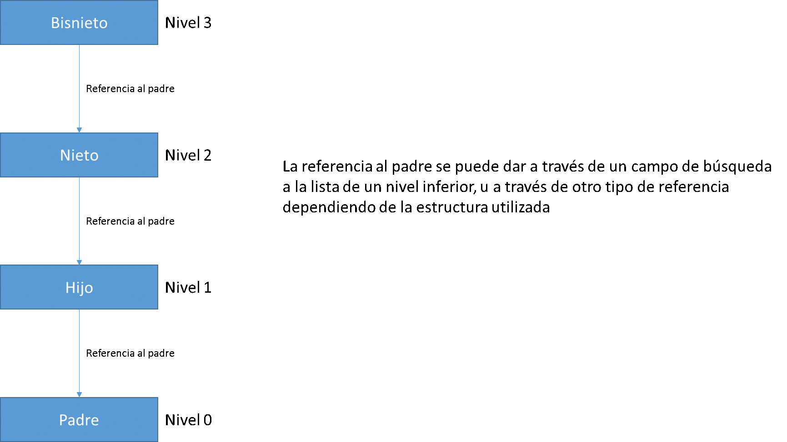
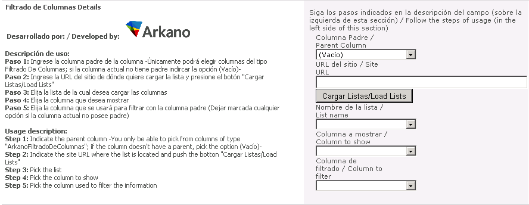
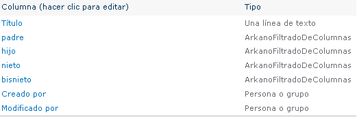
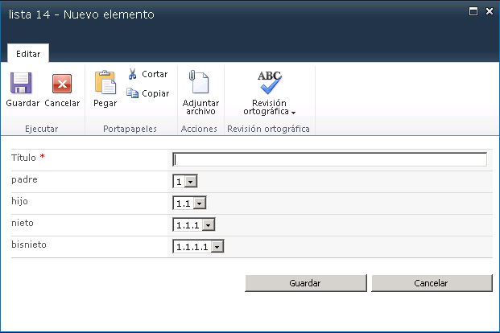

​**La visión del cliente**

Un usuario de una empresa forestal -uno de nuestros mayores clientes-, llegó con un pedido que a priori al analizarlo ya se podía determinar su complejidad, pero también que sería muy beneficioso en lo que a información para la empresa refería. Dado el rubro del negocio, ellos cuentan con una cantidad significativa de mediciones, datos provistos por terceros, en fin, información heterogénea en diversos formatos.

A lo largo de los años se han migrado de diversas formas –algunas quizás no fueron las más óptimas, pero eran las disponibles en ese momento- a SharePoint, generando una extensa plataforma con múltiples estructuras y sub estructuras; las cuales en su gran mayoría y en gran parte por el hecho de que cada estructura fue creada por distintos autores, han resultado independientes y muy poco entrelazadas entre sí.

Cada estructura de información presentaba sus soluciones, sus reportes, su micro mundo; pero como algo obvio, que no fue tan obvio en un principio, nació la necesidad de interrelacionar la información de distintos micro mundos, de forma de poder consolidar información y generar reportes en base a dicha información, proporcionada por distintos actores (algunos internos y otros externos a la organización), distribuida en múltiples sitios. Esto llevó a preguntarse como efectuar esa consolidación de la información, facilitándole lo más posible al usuario el uso de la nueva estructura a implementar; y lo más importante, como llevar a algo nativo de SharePoint una solución de estas características.

Lo primero fue entender desde el punto de vista general que esperaba el cliente, dejando de lado el aspecto programático y centrándonos en la necesidad del negocio. En base a esto, se entendió que lo que necesitábamos era un lugar en dónde se obtuviera información de múltiples listas tanto internas, como externas al sitio original, de las cuales la información previamente citada fuera filtrada en base a la información obtenida desde otra lista; en pocas palabras, querían crear un lugar (dado por una lista) en donde la información pudiera ser consolidada, filtrada y discriminada, dependiendo de los valores que se fueran especificando en los distintos campos de la lista de consolidación. Adicionalmente, la solución debía ser genérica y de fácil implementación.

**La visión del programador**

Frecuentemente, los usuarios proponen ideas complejas, no tanto por el lado de desarrollo, sino por el lado de análisis de las mismas, lo cual implica un correcto entendimiento de dicha idea para que el resultado sea el que realmente el usuario espera. Hay una frase de Steve Jobs que dice: "No se puede simplemente preguntar a los clientes que es lo que desean y luego tratar de darle eso. Al momento de finalizar la construcción, querrán algo nuevo."

Cómo ejemplo ilustrativo, un cliente solicitó que  a partir de dos listas ya existente, se filtrara la información en dos niveles en una tercera lista. Luego de un exhaustivo análisis e innumerables pruebas, llegué a comprender la necesidad del cliente y el beneficio asociado para el negocio. El usuario deseaba tener una relación padre e hijo, con dos campos de una lista; y los valores de esos campos debían ser un lookup a otras listas, las cuales ni siquiera se encontraban en el mismo sitio.

Mi primera reacción fue, "me mataron"; pero sin mucha idea de cómo encarar lo antes propuesto, dada mi falta de experiencia y de que mis colegas de trabajo tampoco tenían mucha idea de cómo siquiera desarrollar lo pasado; fue que empecé a buscar en foros, buscadores, etc. una solución o una idea de cómo encarar la misma.

Luego de un tiempo prudencial de investigación, encontré una solución en el santuario del código libre de los desarrolladores de SharePoint: CodePlex.

Aquí se encontraba una solución, limpia, de fácil instalación, genérica y exacta a lo que necesitaba; el único problema es que no era desarrollada por mí, ni por mí empresa y había que conversar con el cliente para explicarle en qué consistía la solución y asegurarle que era sin costo y segura.

El cliente entendió el planteamiento, le convenció la solución, y se realizó la instalación con éxito, siendo utilizada en varios sitios sin registrarse ningún tipo de error.

La historia hubiera sido genial, -aunque un poco aburrida y de falta de contenido para publicar en una revista de esta índole-, si hubiera terminado ahí, pero no fue así.

La inquietud y deseo de aprovechar lo más posible la herramienta, por parte de los usuarios, llevó a que la solución propuesta empezara a necesitar de agregados para cumplir con esas nuevas inquietudes planteadas. Esto se debió a que si bien la solución era genérica, aplicable a toda lista, y cumplía con los requisitos planteados en un inicio; -dado que lo que crea son dos tipos de columna personalizadas; una en la cual se especifica cual es el padre y en la otra cual o cuales son los hijos y los campos para realizar la referencia.- la misma resultó ser muy básica para las nuevas pretensiones de los usuarios; los cuales pasaron de pensar a que no era posible hacer ningún tipo de filtrado, a pensar de que todo era posible.

El principal problema resultó que no se permitía poner dos columnas padres en una misma lista, es decir, no se permitía que el filtrado de datos en dos niveles, entre campos distintos e independientes, se llevara a cabo en una misma lista. La segunda y fundamental, es que al ver que era posible filtrar por dos niveles, fueron por más y querían filtrar por tres o más niveles. Acordamos intentar agregar esta nueva funcionalidad, y mi primer pensamiento fue recurrir nuevamente al santuario, en busca de algo que se aplicara a lo pedido y que fuera de fácil y rápida implementación.

Sin embargo, no se encontró una solución que contemplará todo lo pedido en los requerimientos; dado que todas las soluciones encontradas, se basaban en insertar javascript en un editor de contenido, más que presentar la solución como un paquete nativo de SharePoint, como lo hacía la anterior. Es decir, una solución que generará columnas personalizadas, genéricas, con búsqueda de información a lo largo y ancho de toda la Web Application, y por sobre todo de fácil uso para un usuario promedio.

En base a esto, se abrieron dos caminos: el simple, que era decirle a los usuarios finales las limitaciones del sistema, en base a lo que se encontraba disponible en el mismo; o el que cumpliera con sus expectativas: invertir una cantidad de horas significativas en investigación y desarrollo de la solución propuesta; y demostrarle a los usuarios que con el enfoque correcto todo es posible.

Una vez conversado con el cliente, se decidió ir por la segunda opción y se habilitó el desarrollo de la solución.

La pregunta inmediata que surgió fue, ¿por dónde empiezo? Esta pregunta nuevamente no la pudo responder ningún colega, debido a que el desarrollo de columnas personalizadas no es algo muy común en nuestra empresa, a decir verdad, era la primera vez que llegaba algo por el estilo y yo fui "el afortunado" en investigarlo y desarrollarlo.

Luego de investigación, se llegó a la conclusión de que se debía desarrollar un campo personalizado, y en base a esto es que se recopilo información para la creación del mismo. Si bien la información no oficial disponible en internet es abundante, no lo es así la información oficial presentada por Microsoft; lo cual conlleva a que el desarrollo de componentes, que a priori debería ser trivial, no resulta de dicha forma.

Una vez solucionado el tema de configuración y entendimiento de las bases de la creación de tipos de columnas personalizados, se decidió realizar una solución lo más genérica posible; el resultado fue la creación de un tipo de columna que permite n niveles de filtrado, obteniendo la información de cualquier lista disponible en toda la WebApplication.

Esto fue un gran desafío, el cual me permitió explorar una zona poco visitada en el desarrollo de componentes personalizadas en SharePoint y que el cliente recibió como un triunfo personal, debido al abanico de posibilidades que se le presentaron.

Como aprendizaje de esta experiencia, entiendo que siempre se debe estar atento a si los planteamientos de los usuarios son efectivamente realizables, o necesitan un análisis en conjunto para llegar a una solución que conforme principalmente al usuario, que cumpla con sus objetivos de negocio, y que nosotros podamos asegurarle que es realmente realizable.

**Bruno Torterolo**
MCPD for SharePoint 2010
[bruno.torterolo@arkanosoft.com](mailto&#58;bruno.torterolo@arkanosoft.com)

