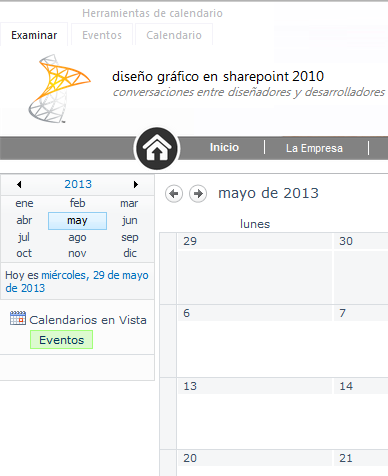
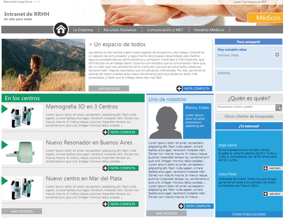

En el artículo anterior hicimos una introducción acerca de cómo incorporar en SharePoint 2010 los estilos creados por un diseñador gráfico. Nos basamos en algunas hipótesis como el uso de SharePoint Foundation, páginas maestras, hojas de estilo y modelo de objetos de cliente para JavaScript. Se recomienda leer la [parte 1](/revistas/numero-16/diseno-grafico-en-sharepoint-foundation-2010) antes de continuar.

**Ocultar Inicio Rápido salvo excepciones**

Supongamos que necesitamos ocultar el inicio rápido (y el espacio que ocupa) en todas las pantallas, excepto en aquellas que trabajan con vistas de calendario. Una forma de resolverlo es agregar este código a la hoja de estilos.

```
#s4-leftpanel, .ms-quicklaunchouter { display: none; }
```

```
.s4-ca { margin-left: 0px; }
```

Con el primero ocultamos la barra de inicio rápido y en particular los elementos que no son de calendario. Con el segundo estilo, quitamos el espacio que ocupa la barra de inicio rápido.

Además, agregamos el siguiente código en nuestra página maestra, justo antes de "&lt;/body&gt;:

```
<script type="text/javascript">
```

```
var x = document.getElementById("Ribbon.Calendar");
```

```
if (x != null) {
```

```
 // Existe la Ribbon de Calendario, por lo tanto se necesita la Quick Launch
```

```
 document.getElementById('s4-leftpanel').style.display='inline';
```

```
 document.getElementById('MSO_ContentTable').style.marginLeft='155px';
```

```
 }
```

```
</script>
```

Este código detecta si se trata de una página de tipo calendario. En caso que así sea, vuelve a hacer visible el Inicio Rápido, pero sólo mostrarán las opciones de calendario tal como se ve en esta imagen:



**Referenciar la CSS dentro de la Master Page en un subsitio**

SharePoint Foundation no soporta "**$SPUrl:~sitecollection"** tal como lo soporta la versión Server. Esto genera problemas para referenciar a una hoja de estilos, especialmente si nos encontramos en un subsitio y queremos evitar incluir el nombre del subsitio en la página maestra.

Para resolverlo hacemos uso de**"****ASP:literal**" y de "**SharePoint:ProjectProperty"**, lo que nos permite construir en forma dinámica la URL de la hoja de estilos. Más abajo dejo un enlace en donde está explicado en detalle. El código es el siguiente:

```
<asp:literal runat="server" Text="&lt;link href='"/>
```

```
<SharePoint:ProjectProperty Property="SiteUrl" runat="server" />
```

```
<asp:literal runat="server" Text="/Internal/Intranet.css' rel='stylesheet' type='text/css'/&gt;"/>
```

​

**Agregar enlaces en el pie de página dentro de la master page**

Supongamos que tenemos que agregar enlaces en el pie de página en un subsitio y no conocemos la dirección del sitio, entonces podemos utilizar el siguiente código, haciendo uso de le \_spPageContextInfo:

```
<a href="' + window.location.protocol + '//' + window.location.host + retornar_sitio() + '/Contenido/Historia.aspx' + '">Calidad</a>
```

Para ello, hemos creado previamente una función llamada retornar\_sitio:

```
<script type="text/javascript">
```

```
function retornar_sitio() {
```

```
if ( _spPageContextInfo.siteServerRelativeUrl == '/') { 
```

```
 return ""; 
```

```
 }
```

```
else {
```

```
return (_spPageContextInfo.siteServerRelativeUrl);
```

```
}
```

```
}
```

```
</script>
```


**Nota:** este mismo truco puede ser utilizado también en la barra de vínculos superior!

**Dar estilo a una vista de Noticias**

Vamos a salir ahora de la página de inicio. Imaginemos que tenemos una lista de SharePoint con Noticias. Creamos una vista estándar con los siguientes campos:

- Imagen destacada.
- Título (vinculado al elemento).
- Fecha.
- Resumen.


Ahora queremos darle algo de estilo a la lista, pero sin perder las funcionalidades de SharePoint. Es decir que no queremos crear una página a medida, sino utilizar las opciones de SharePoint para crear vistas desde el navegador.

Entonces optamos por el enfoque de agregar una CEWP que modifique el estilo de esta vista. En este ejemplo, vamos a asumir que la vista tiene estas opciones:

- Sin edición incluida / Con vista tabular.
- Con estilo Boletín sin líneas.


En una primer parte, trabajamos todo con estilos, dejaremos para el final algunos scripts para puntos que no podemos manejar con CSS. Nuestros estilos son:

```
<style>
```

```
/* Oculto la tabla mientras trabajo */
```

```
body { display: none; }
```

```
/* Oculto la fila con los nombres de los campos */
```

```
.ms-listviewtable .ms-viewheadertr { display: none; }
```

```
/* Minimizo el ancho de la columna que tiene la foto */
```

```
.ms-listviewtable > tbody > tr > td:first-child { width: 1%; }
```

```
/* alternado de filas */
```

```
.ms-vb2, .ms-vb-tall, .ms-newsletteralt td { background-color: white !important; }
```

```
/* Bordes */
```

```
.ms-listviewtable td { border-color: white !important; }
```

```
/* Imagen*/
```

```
.noticia_general_left_img_sharepoint {
```

```
border-left: solid 8px #297AD3;
```

```
}
```

```
/* Título */
```

```
.noticia_general_right_title_sharepoint {
```

```
font-size: 25px;
```

```
font-weight: lighter;
```

```
padding-left: 15px !important;
```

```
font-family: "Segoe UI", "Lucida Sans Unicode", "Lucida Grande", sans-serif;
```

```
width: 500px;
```

```
}
```

```
.noticia_general_right_title_sharepoint a {
```

```
color: #000 !important;
```

```
height: 20px;
```

```
}
```

```
/* Fecha */
```

```
.noticia_general_right_date_sharepoint {
```

```
color: #297ad3;
```

```
width: 200px;
```

```
}
```

```
.noticia_general_right_date_sharepoint_sep {
```

```
border-bottom: 1px solid #d3dcf3;
```

```
padding-bottom: 3px;
```

```
margin-left: -5px;
```

```
}
```

```
/* Resumen */
```

```
.noticia_general_right_gray_sharepoint {
```

```
color: #999999;
```

```
font-size: 15px;
```

```
line-height: 19px;
```

```
font-family: "Segoe UI", "Lucida Sans Unicode", "Lucida Grande", sans-serif;
```

```
overflow: hidden;
```

```
}
```

```
/* Separador */
```

```
.noticia_general_divisor_sharepoint {
```

```
border-bottom: 1px dashed #797979;
```

```
padding-top: 50px;
```

```
padding-bottom: 3px;
```

```
}
```

```
</style>
```

En una segunda parte, trabajamos con jQuery para agregar los estilos definidos en donde corresponda y modificar algunos anchos, de acuerdo al tipo de noticia:

```
<script type="text/javascript" src="./../../Internal/jquery-1.9.1.js"></script>
```

```
<script type="text/javascript">
```

```
lista_ini = window.location.href.indexOf("/Lists/") + 7;
```

```
lista = window.location.href.substr(lista_ini);
```

```
lista_fin = lista.indexOf("/");
```

```
lista = lista.substr(0, lista_fin);
```

```
$(document).ready(function () {
```

```
// Formato de la imagen
```

```
$('.ms-listviewtable > tbody > tr > td:nth-child(1) img[src*="noticias"]').addClass('noticia_general_left_img_sharepoint');
```

```
// Formato del título
```

```
$('.ms-listviewtable > tbody > tr > td:nth-child(2)').addClass('noticia_general_right_title_sharepoint');
```

```
$('.noticia_general_right_title_sharepoint').prepend('> ');
```

```
// Formato del resumen
```

```
$('.ms-listviewtable .ms-rtestate-field').addClass('noticia_general_right_gray_sharepoint');
```

```
// Formato de la fecha
```

```
$('.ms-listviewtable > tbody > tr > td:nth-child(3)').addClass('noticia_general_right_date_sharepoint');
```

```
$('.noticia_general_right_date_sharepoint').append('<br/><div class="noticia_general_right_date_sharepoint_sep"></div>');
```

```
// Formato de la línea de división
```

```
$('.ms-vb-tall').append('<br/><div class="noticia_general_divisor_sharepoint"></div>');
```

```
// Formatos variables según la página
```

```
if (lista == 'Noticias') {
```

```
$('.noticia_general_left_img_sharepoint').css('width', '371px').css('height', '233px');
```

```
$('.noticia_general_right_gray_sharepoint').css('margin-top', '-190px').css('height', '175px').css('margin-left', '400px');
```

```
}
```

```
else if (lista == 'Noticias_Centros') {
```

```
$('.noticia_general_left_img_sharepoint').css('width', '182px').css('height', '107px');
```

```
$('.noticia_general_right_gray_sharepoint').css('margin-top', '-65px').css('height', '100px').css('margin-left', '213px');
```

```
}
```

```
else if (lista == 'Noticias_Perfiles') {
```

```
$('.noticia_general_left_img_sharepoint').css('width', '154px');
```

```
$('.noticia_general_right_gray_sharepoint').css('margin-top', '-121px').css('height', '100px').css('margin-left', '184px');
```

```
}
```

```
else {
```

```
alert('Página no soportada. Contace a su administrador.');
```

```
}
```

```
$("body").fadeIn("slow");
```

```
}); 
```

```
</script>
```

**Evitar que un estilo aparezca en una pantalla de diálogo**

Y finalmente, un último truco que siempre nos puede sacar de apuro...Si queremos evitar que una porción de nuestro código aparezca en una ventana de diálogo, por ejemplo el pie de página, simplemente agregamos la clase "s4-notdlg":

```
<div id="footer" class="s4-notdlg"> 
```

**Conclusión**

Esta fue una segunda parte del artículo para incorporar estilos gráficos en SharePoint Foundation 2010. Por supuesto hay mucho más material y muchas formas distintas de resolver los problemas. En mi opinión, a la hora de elegir el mejor enfoque de desarrollo, debemos pesar todas las variables. A veces lo más limpio desde el punto de vista de desarrollo puede generar un mayor costo de mantenimiento futuro o hacer perder algunas opciones de configuración fuera de la caja de SharePoint. Cada escenario es distinto. Lo importante es encontrar la forma de convivencia adecuada entre el desarrollador SharePoint y el diseñador gráfico y obtener un resultado como el que se ve en la imagen:



**Bibliografía**

- [A guide to Branding and SharePoint Foundation - Part 2](http&#58;//blog.blksthl.com/2012/03/27/a-guide-to-branding-and-sharepoint-foundation-part-2/)
- [Understanding the \_spPageContextInfo variable in SharePoint 2010](http&#58;//blog.tedpattison.net/Lists/Posts/Post.aspx?ID=9)
- [Diseño Gráfico en SharePoint Foundation 2010](http&#58;//surpoint.blogspot.com/2013/08/diseno-grafico-en-sharepoint-foundation.html)


**Juan Pablo Pussacq Laborde**
SharePoint MVP
Blog: [http://surpoint.blogspot.com/](http&#58;//surpoint.blogspot.com/) 
Facebook: [http://facebook.com/surpointblog/](http&#58;//facebook.com/surpointblog/) 
Twitter: [http://twitter.com/jpussacq/](http&#58;//twitter.com/jpussacq/)

