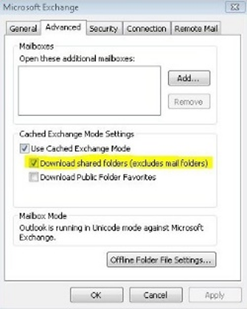
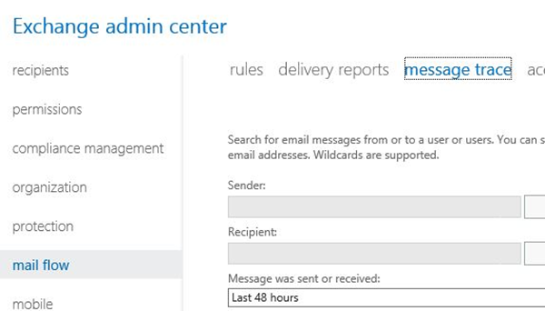

​**La toma de desiciones**

Cuando planeamos implantar Exchange Online en nuestra organización, es necesario tomar algunas decisiones para evitar futuros problemas, y el más común es el de la actualización/degradación entre familia de planes (SKUs).

Dado que Microsoft soporta desde hace poco la actualización entre SKUs pero no la degradación ni la actualización de una licencia retail a plan empresarial, es una buena idea pararse a analizar un momento, no solo en las necesidades presentes de la empresa sino también en las necesidades futuras.

En mi opinión personal, considero que es una buena idea empezar por comprar licencias de Exchange Online Plan 1 (nada de planes como E3) ya que es un plan que forma parte de la familia de planes empresariales , y si se tiene la necesidad de utilizar Office Professional en algún puesto de trabajo, tendremos la oportunidad de agregar la licencia de Office Professional Plus como parte de nuestra suscripción o seleccionar cualquier plan empresarial que se adapte a nuestras necesidades, salvo que necesites cubrir solo lo básico y se encuentre en una organización sin planes de crecimiento.

Además, deberías saber el número máximo de usuarios que pueden agregarse en planes de pequeña y mediana empresa (25 y 300 usuarios respectivamente) y la mezcla de licencias no es posible (por ejemplo un plan Pequeña Empresa y un plan Mediana Empresa).

Actualmente (mientras escribo este artículo), si contratamos un plan pequeña empresa y el número de usuarios supera el límite, tendremos que subir de plan a uno de mediana empresa o empresarial mediante la herramienta de cambio de plan que se encuentra dentro del portal recientemente publicada.

Así que tomate tu tiempo y échale un vistazo al Cuadro comparativo de los planes de Office365 ([http://office.microsoft.com/es-es/business/compare-all-office-365-for-business-plans-FX104051403.aspx](http://office.microsoft.com/es-es/business/compare-all-office-365-for-business-plans-FX104051403.aspx))  y toma una decisión acertada.

**Resolviendo problemas antes de migrar**

Bueno, estamos en la fase antes de migrar a Exchange Online y hay algunas cosas que preparar antes de comenzar la migración. Este es un escenario en el que hay que prestar mucha atención para subsanar los posibles problemas que puedan existir si no queremos que luego se conviertan en obstáculos para la migración, ¿y no queremos eso, no?

Primero que nada, asegúrate de que se cumplen los siguientes requerimientos:

- El equipo cliente debe tener al menos Microsoft Windows XP SP3, Microsoft Office 2007 SP3 y Microsoft Internet Explorer 8. Recuerda que el ciclo de vida de estos productos termina en Abril y se recomienda actualizar a las últimas versiones de Microsoft Windows, Microsoft Office y Microsoft Internet Explorer, no solo por mantener una línea de compatibilidad sino también por preservar y aumentar la seguridad de nuestra empresa. Ten en cuenta esto último.
- Comprueba que todos los equipos cliente cuentan con las últimas actualizaciones de Windows y Office.
- Asegúrate de contar con una conexión a internet rápida y fiable. Puedes comprobarlo mediante la "herramienta de análisis de red para Office365" ([http://blogs.itpro.es/guruxp/2013/07/07/network-analysis-tool-for-office365-based-on-cloud/](http://blogs.itpro.es/guruxp/2013/07/07/network-analysis-tool-for-office365-based-on-cloud/)).
- Confirma que tu red está preparada para el despliegue y adaptación de Office365. Recomiendo la utilización del Office365 Deployment Readiness Tool y OnRamp ([https://onramp.office365.com/onramp/](https://onramp.office365.com/onramp/)).
- ¿Dispones de un Firewall/Proxy? Asegúrate de que los puertos necesarios estén abiertos y de agregar las siguientes direcciones como excepciones para Exchange Online ([http://help.outlook.com/es-es/140/gg263350.aspx](http://help.outlook.com/es-es/140/gg263350.aspx)) y para Office365 ([http://onlinehelp.microsoft.com/Office365-enterprises/hh373144.aspx](http://onlinehelp.microsoft.com/Office365-enterprises/hh373144.aspx))
- Asegúrate de tener acceso a tu servidor de DNS de dominio externo (.com) para poder agregar/modificar las entradas necesarias para trabajar con Office365.

**Escenario durante la migración**
Si este es tu escenario, entonces podrías encontrarte con algunas trabas durante el proceso, algunas de estas son:

Panel de control de Exchange en planes de pequeña empresa:

Q: "He adquirido el plan de Pequeña Empresa, pero cuando accedo al portal no puedo ver el panel de control de Exchange (ECP) y no veo las opciones avanzadas, ¿significa eso que mi suscripción no incluye esta característica?"

A: No, esta "característica" esta oculta para mantener las cosas simples a nuevos administradores de Office365, tan solo tienes que acceder a [http://www.outlook.com/ecp](http://www.outlook.com/ecp) después de acceder al portal de Office365.

Problemas de verificación de dominio:

Recuerda que pueden pasar hasta 72 horas en replicar los registros de DNS agregados o modificados (es algo que depende de tu proveedor de hosting), sin embargo puede hacer uso de la herramienta de NSLOOKUP la cual explicare más adelante.

Interrupción de correo después de agregar y verificar el dominio:
Si estás haciendo un proyecto piloto (el cual es recomendable), debes configurar tu dominio personalizado como dominio de "retransmisión interna" y no como un "dominio autoritativo" dentro del panel de control de Exchange – Flujo de correo – dominios aceptados. 
Esto permitirá que el correo se envíe a ambos servidores de correo, el de Office365 y el actual sin necesidad de cambiar los registros MX ni migrar a todos los usuarios. Esto se conoce como coexistencia.

Problemas de configuración de cuentas en Microsoft Outlook:

Verifica que has creado el registro de DNS "autodiscover.tudominio.com" de tipo CNAME con el valor "autodiscover.outlook.com".

Autodiscover permite a los clientes de correo como Microsoft Outlook y dispositivos móviles obtener los parámetros necesarios para la configuración de la cuenta con solo introducir el correo electrónico y la contraseña. Pero no solo eso, también permitirá aplicar los cambios producidos en los servidores de forma automática en los clientes de correo y dispositivos.

Si ya lo has hecho, asegúrate de que este correctamente configurado mediante la herramienta Nslookup en una consola de comandos:
*"Nslookup –q=CNAME autodiscover.tudominio.com"*

Haz un ping a autodiscover.tudomino.com y comprueba que al menos resuelva el host, devolviendo el valor asociado. Si no lo hace es probable que haya algo bloqueando la conexión. Hay malware que bloquea las comunicaciones a cualquier dirección que tenga que ver con Microsoft y sus servicios. Un buen método para saber si este es tu caso, es detener y deshabilitar el servicio "cliente de DNS" y navegar a [www.microsoft.com](http://www.microsoft.com/).

Salvo que ya hayas configurado a los usuarios dentro de Office365 para que usen el dominio personalizado, recuerda que el usuario a utilizar debe ser algo parecido a [usuario@tudominio.onmicrosoft.com](mailto:usuario@tudominio.onmicrosoft.com).

Licenciamiento:

Recuerda asignar licencias dentro del portal de Office365. A pesar de que puedes crear usuarios en lotes, las licencias no se asignan automáticamente. Este proceso se hace manualmente (especialmente si sincronizamos nuestro AD con Office365 mediante Windows Azure Active Directory Sync Tool).

Conexión a internet lenta:

Algunas veces los usuarios pueden experimentar una conexión a internet lenta. Yo recomiendo el uso de PST Capture Tool 2.0 ([http://www.microsoft.com/en-us/download/details.aspx?id=36789](http://www.microsoft.com/en-us/download/details.aspx?id=36789)) para subir los archivos PST a la nube, porque te permite limitar el ancho de banda y hasta incluso establecer las horas en las que subir los datos.

Facilitar el acceso a los usuarios a su correo:

Una de las cosas que yo hago en los clientes es crear un registro de tipo CNAME llamado webmail.tudominio.com con el valor mail.office365.com, de esta forma evitaras llamadas del tipo "como era la dirección de webmail?". Ayúdales a ayudarte.

Ejecuta la herramienta de preparación de escritorio de Office365:

Puedes encontrar esta herramienta para descargar en la sección de "Software" dentro de la página de configuración de Office365 de cualquier usuario. Esta herramienta se encargara de preparar el equipo para obtener los últimos certificados y parches para la correcta configuración de la cuenta.

Ten cuidado con los lectores de tarjetas inteligentes:

Algunas veces los drivers instalados de los lectores de tarjetas inteligentes como los de DNI-E, pueden bloquear comunicaciones SSL, así que asegúrate de contar con la última versión de los drivers o desconéctalo temporalmente.

Da un paso más en la solución de problemas:

Puedes ir un paso adelante con la solución de problemas haciendo uso del analizador de conectividad remota (Remote Connectivity Analyzer: [https://testconnectivity.microsoft.com/](https://testconnectivity.microsoft.com/)). Esta herramienta basada en web permite detectar problemas y posibles soluciones con varias pruebas individuales.

Comprueba tu sufijo UPN local:

Si estas implementando la sincronización de directorios, debes tener en cuenta que todas aquellas cuentas que contengan un sufijo de UPN .local, .internal o .loc, no sincronizaran con el dominio personalizado sino con el dominio que Microsoft proporciona (dominio.onmicrosoft.com), para ello, deberemos agregar el sufijo de UPN de nuestro dominio personalizado en "Dominios y confianzas" de nuestro AD y establecerlo en las propiedades de nuestros usuarios dentro de "Usuarios y equipos de AD".

Eligiendo el certificado publico apropiado:

Ten cuidado, elige el certificado publico apropiado para tu ADFS 2.0. Si estás pensando en implantar un escenario hibrido con usuarios móviles o externos, también necesitaras añadir un par de servidores ADFS 2.0 y otro par de servidores proxy ADFS 2.0 con los certificados públicos apropiados, revisa la lista de los certificados de raíz permitidos:  [http://support.microsoft.com/kb/929395/es-es](http://support.microsoft.com/kb/929395/es-es)

**POST-MIGRACION**

¿Así que ya has implantado Exchange Online en tu organización?, entonces probablemente ya conocerás las ventajas que este servicio de Office365 puede ofrecer… pero no todo son caritas sonrientes. Cada tecnología tiene una parte buena y la parte en la que los usuarios tienen problemas, bien pues este producto no es una excepción… por supuesto no es como mantener un Exchange Server en local pero aun así hay que estar preparados (especialmente si estamos comenzando en este mundo).
Algunas de las cosas a comprobar cuando se tienen problemas son:
- Siempre comprobar que se tiene internet como primera comprobación.
- Los DNS pueden engañarnos. Haz uso de las herramientas "ping" y "Nslookup" para asegurarte que los registros están correctamente creados y que están disponibles.
- Comprueba el estado del Servicio en el panel de salud de Office365. Yo personalmente recomiendo usar el RSS del panel para obtener notificaciones cada cierto tiempo en caso de incidencias, o descargar la APP para dispositivos móviles Android, IOS y Windows Phone llamada "Office365 Admin" para comprobar el estado de salud.
- El Malware puede engañarte. Aquí hay algunos tips que pueden ayudarte:
    - Resetea los ajustes de Internet Explorer.
    - Asegúrate que la opción de "Utilizar un servidor proxy…" no está marcada en las opciones de conexión de Internet Explorer (salvo que tengas un servidor proxy en tu red).
    - Usa la herramienta de Microsoft Sysinternals, Autoruns ([http://www.sysinternals.com](http://www.sysinternals.com/)). Esta herramienta es muy buena a la hora de tratar con Malware.
- Problemas con buzones auto-mapeados. Comprueba que el usuario tiene los permisos necesarios sobre el buzón deseado, ya sea por interfaz gráfica (GUI) o PowerShell.
- Windows XP y los certificados de raíz. Asegúrate de instalar los últimos certificados de raíz públicos para Windows XP: [http://support.microsoft.com/kb/931125/es-es](http://support.microsoft.com/kb/931125/es-es)
- En Microsoft Outlook solo se muestra contenido antiguo: Algunas veces puedes encontrarte con un caso en el que el contenido de un buzón en Microsoft Outlook no se corresponde con el que muestra Outlook Web App (OWA) y si no fijamos en la parte inferior de Outlook nos muestra que la última vez que se sincronizo la carpeta fue hace horas o días atrás. Si es así, asegúrate que no estés trabajando sin conexión, que tengas suficiente espacio libre en la unidad donde se encuentre el archivo OST, o accede a las propiedades de la carpeta para eliminar el contenido sin conexión y que vuelva a sincronizar.

Si todavía tienes problemas con el contenido sin conexión, prueba a cambiar el nombre del fichero OST y vuelve a iniciar Microsoft Outlook, esto forzara la sincronización del buzón entero. Pero no siempre es la mejor solución ya que ocasionara que el trabajador no esté operativo con Microsoft Outlook durante un determinado tiempo dependiendo del tamaño del buzón, en este caso puedes intentar lo siguiente:
    - Deshabilitar la opción de "Descargar carpetas compartidas" dentro de las opciones avanzadas de la configuración de la cuenta. Esto mostrará el contenido del buzón en vivo de las carpetas compartidas o buzones mapeados sin contar con la cache.
    - Deshabilitar la opción de "Usar el modo de cache en Exchange" dentro de las opciones avanzadas de la configuración de la cuenta. Esto forzara al usuario a trabajar con su buzón totalmente en línea  y no con la cache.

Intenta no hacer de esto una práctica habitual sino para detectar la fuente del problema, ya que esto provocara que el usuario trabaje con lentitud. La cache siempre es más rápida que el contenido online. Para más información sobre el modo cache en Microsoft Outlook revisa este enlace: [http://technet.microsoft.com/es-es/library/cc179175(v=office.15).aspx](http://technet.microsoft.com/es-es/library/cc179175%28v=office.15%29.aspx).

- Outlook no se conecta con el servidor de Exchange: Si Microsoft Outlook no se conecta al servidor de Exchange Online, puedes probar un par de cosas asumiendo que nada de lo anterior escrito en este artículo ha funcionado:
    - Accede a tu cuenta vía OWA para comprobar que la contraseña no haya caducado. Si este es el caso, saldrá una advertencia pidiendo que la cambies por una nueva.
    - Repara el perfil de Microsoft Outlook dentro de la configuración de la cuenta o accediendo desde el panel de control – correo – cuentas de correo electrónico – doble click en la cuenta de correo y "Reparar".
    - Crea un perfil adicional de Microsoft Outlook dentro del panel de control de Microsoft Windows – Correo – Perfiles.
- Tratando con sincronización de identidades: Una de las cosas que ya deberías saber a estas Alturas es que Windows Azure Active Directory Sync Tool (antiguamente DirSync, WAADST de ahora en adelante), hace una sincronización cada 3 horas en cuanto a cuentas de usuario, contactos y grupos y cada 2 minutos en cuanto a contraseñas de usuarios, pero algunas veces nos hace falta forzar la sincronización.  Podemos forzarla de dos maneras:
    - Ejecutar el archivo dirsyncconfigshell.ps1 ubicado en "%programfiles%\Microsoft online directory sync" y ejecutar el CmdLet "Start-OnlineCoexistenceSync".
    - Ejecutar el asistente de configuración de WAADST de Nuevo y marcar la casilla que dice "Sincronizar los directorios ahora" en la fase final.

- Correos devueltos: Lo más común a la hora de revisar un correo devuelto es el destinatario, la mayoría de los casos es porque el usuario ha escrito mal la dirección de destino o porque el dominio de ese destinatario no existe, y algunas veces el propio correo devuelto nos indica una causa fácilmente reconocible (buzón lleno, usuario inexistente, remitente considerado como spam…).

> Pero algunas veces obtendremos un error del tipo "0x80070005-00000000-00000000" sin ninguna descripción asociada. Si este es el caso, entonces es que el usuario este enviando el correo en nombre de algún buzón compartido, lista de distribución u otro usuario y no tiene los permisos necesarios para ello o la lista de direcciones sin conexión está obsoleta y esté utilizando una información de contacto obsoleta como remitente.
> 
> Mi recomendación es actualizar la libreta de direcciones sin conexión por complete y no solo los cambios. Eso debería sacarte de problemas y evitar dolores de cabeza innecesarios.
> 
> También puedes hacer uso de Exchange Online Protection para comprobar si hay alguna información adicional sobre el correo electrónico en cuestión. Para ello, simplemente accedemos a nuestro panel de control de Exchange Online (ECP) y pinchamos en Flujo de Correo para obtener la pestaña de "Seguimiento de correo".

**Recomendaciones**

Finalmente tengo algunas recomendaciones que pueden mejorar el entorno:

- Intenta convencer a los usuarios de no almacenar más de 10.000 elementos en la bandeja de entrada. Microsoft recomienda que no se supere este límite por carpeta porque de lo contrario Microsoft Outlook puede comportarse de forma incorrecta. Como buena práctica, indica a los usuarios que clasifiquen sus mensajes en subcarpetas.
- Haz uso de MOSDAL. Es una herramienta estupenda para diagnosticar comportamientos extraños y resolver problemas incorregibles. Para más información sobre MOSDAL visita [http://support.microsoft.com/kb/960625](http://support.microsoft.com/kb/960625).
- Si hay algo que depende del tenant o bien que no puedes resolver de tu lado, crea un ticket de Soporte desde el portal de Office365.

**Alberto Pascual**
MVP de Office 365
[a.pascual@outlook.com](mailto:a.pascual@outlook.com) 
@guruxp
[http://blogs.itpro.es/guruxp](http://blogs.itpro.es/guruxp)

