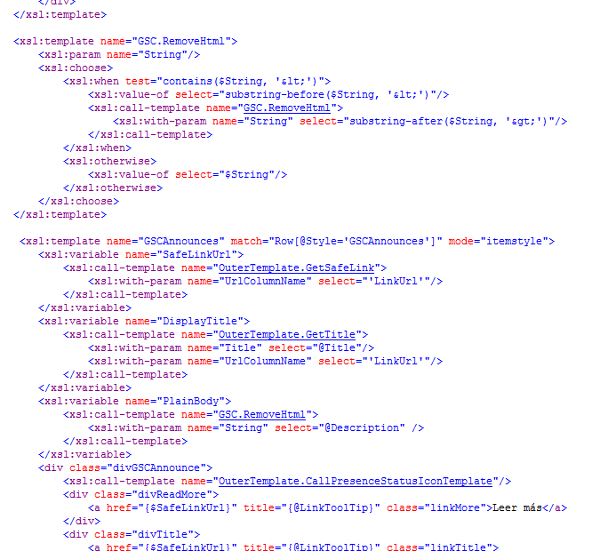
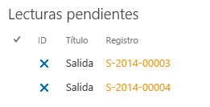
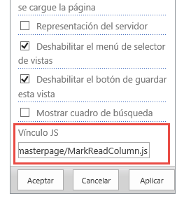

​SharePoint 2010 introdujo las plantillas XLST para poder modificar el renderizado de los WebPart desde el lado del servidor, lo que permitía, con más o menos dificultad, definir una plantilla XLST con el comportamiento necesario para pintar los elementos de un WebPart de lista.



Con el paradigma del Cloud, SharePoint necesita descargar al servidor de procesos innecesarios y una nueva forma más actual de poder modificar el comportamiento de la interfaz de usuario, y en la versión 2013 se incluye al renderizado en cliente (Client-Side Rendering) mediante el uso de JavaScript y HTML5, que tan de moda lo tenemos.

Por lo tanto, en SharePoint 2013, podemos seguir utilizando las plantillas XLST y dos nuevas opciones para modificar el comportamiento de la interfaz de usuario, JSLink y/o las Plantillas de Visualización (Display Templates).

**JSLink**

Aunque la documentación de JSLink en MSDN es escasa (o más bien nula), JSLink se puede usar para transformar los siguientes elementos de SharePoint:

- Listas o bibliotecas de documentos.
- Vistas de listas o bibliotecas.
- Campos.
- Elementos Web.
- Tipos de Contenido.


Básicamente, JSLink es una propiedad en algunos objetos de SharePoint que permite añadir código JavaScript en el proceso de renderizado en cliente del objeto y dependiendo de nuestro código, podemos incluir lógica al propio objeto o cualquier funcionalidad que queramos en la página donde se renderice.

En JavaScript registraremos un objeto de contexto de SharePoint, que nos permite modificar ciertos aspectos y plantillas del renderizado de los objetos que estemos tratando. Lo mejor es que lo veamos con algunos ejemplos.

**Modificar la visualización de un campo de una lista**

Nuestro código JavaScript se ejecutará cuando se cargue el fichero .js y, mediante un objeto de contexto de SharePoint, asociamos a los campos la función JavaScript a ejecutar.

```
(function () {
```

```
    //Inicializamos el contexto y las plantillas
```

```
    var overrideContext = {};
```

```
    overrideContext.Templates = {};
```

```
 
```

```
    //Registramos los campos y la función a ejecutar en el contexto de Vista, DisplayForm, EditForm o NewForm
```

```
    overrideContext.Templates.Fields = {
```

```
        'ID': {
```

```
            'View': IDViewTemplate,
```

```
            'DisplayForm:' IDDisplayFormTemplate,
```

```
            'EditForm:' IDEditFormTemplate,
```

```
            'NewForm:' IDNewFormTemplate,
```

```
        }
```

```
    };
```

```
 
```

```
    //Sobreescribiemos la plantilla con nuestro contexto
```

```
    SPClientTemplates.TemplateManager.RegisterTemplateOverrides(overrideContext);
```

```
})();
```

Como podemos ver en el fragmento de código anterior, podemos definir una función para cada una de las posibles vistas de un campo de una lista en SharePoint, por ejemplo, para cambiar el comportamiento de un campo elección y crearnos unos combos anidados o añadir una imagen con una acción en el campo ID, esta función, podría ser como sigue:

```
function IDViewTemplate(ctx) {
```

```
    var id = ctx.CurrentItem[ctx.CurrentFieldSchema.Name];
```

```
    var params = "'" + ctx.listName + "', '" + id + "', '" + window.location + "'";
```

```
    
```

```
    var html = '<a onclick="DeleteReadItems(' + params + '); return false;" alt="Marcar como leído" title="Marcar como leído">'
```

```
    html += '<span class="ms-list-addnew-imgSpan16">';
```

```
    html += ''
```

```
    html += '</a>';
```

```
 
```

```
    return html;
```

```
}
```

Básicamente, recibimos un contexto con el elemento de lista actual y debemos devolver el HTML necesario para renderizar el campo. En nuestro ejemplo, añadimos una imagen con una acción que ejecuta código JavaScript con los parámetros siguientes: nombre de la lista, Id del elemento actual y la URL del mismo.



Una vez que tenemos nuestro fichero JavaScript, lo podemos aplicar en el WebPart de la vista de la lista donde se encuentra el campo o bien añadirlo con código a la definición de la columna o a la definición de la vista, según sea necesario.



Como se podemos ver en la Imagen 3, editando un WebPart de vista de lista, tenemos una propiedad que nos permite añadir el vínculo al fichero JavaScript con nuestro código JSLink, en este caso, *~site/\_catalogs/masterpage/MarkReadColumn.js*.

Otra de las posibilidades sería añadir el fichero JavaScript utilizando PowerShell o código con el modelo de objetos de SharePoint.

```
SPViewCollection viewCollection = pendingList.Views;
```

```
System.Collections.Specialized.StringCollection viewFields = new System.Collections.Specialized.StringCollection();
```

```
viewFields.Add("ID");
```

```
viewFields.Add("Title");
```

```
viewFields.Add(Constants.REGLINKFIELDNAME);
```

```
string query = "<Where><Eq><FieldRef Name=\"" + Constants.USERFIELDNAME + "\" /><Value Type=\"Integer\"><UserID /></Value></Eq></Where>";
```

```
var view = viewCollection.Add("Mis lecturas pendientes", viewFields, query, 30, true, true);
```

```
 
```

```
view.JSLink = "~sitecollectionlayouts/GSC.SP.Entrada/Scripts/MarkReadColumn.js|~sitecollectionlayouts/GSC.SP.Entrada/Scripts/jquery-1.10.2.min.js|~sitecollectionlayouts/GSC.SP.Entrada/Scripts/lecturasView.js";
```

```
 
```

```
view.Update();
```

```
pendingList.Update();
```

En el código anterior, creamos una nueva vista en la lista y en la propiedad JSLink le añadimos nuestro fichero JavaScript, con la posibilidad de concatenar varios ficheros con JSLink o jQuery, como podemos ver en el ejemplo.

Hay que tener en cuenta que la URL del fichero JavaScript no puede ser relativa (por ejemplo, /\_layouts/ficherojslink.js), si no que tenemos que usar algunas de las siguientes variables:

- ~site
- ~sitecollection
- ~layouts
- ~siteLayouts
- ~siteCollectionLayouts


**Modificar el JSLink de un campo con PowerShell**

Si fuera necesario, podemos usar PowerShell para añadir el fichero JavaScript a la propiedad JSLink de un campo de nuestro sitio.

```
$web = Get-SPWeb https://teamsite
```

```
$field = $web.Fields["RegistroField"]
```

```
$field.JSLink = "~layouts/GSC/JSLinkRegistro.js"
```

```
$field.Update($true) 
```

**Modificar la visualización de una vista**

Veamos como modificar el comportamiento de una vista, para que, por ejemplo, nos muestre el típico carrusel de imágenes.

Habrá que tener en cuenta definir nuestro contexto para una determinada vista base (BaseViewID) o plantilla de lista ([ListTemplateType](http://msdn.microsoft.com/en-us/library/microsoft.sharepoint.splisttemplatetype.aspx)).

```
(function () {
```

```
    var overrideCtx = {};
```

```
    overrideCtx.Templates = {};
```

```
 
```

```
    //overrideCtx.BaseViewID = 99;
```

```
    overrideCtx.ListTemplateType = 109;
```

```
 
```

```
    overrideCtx.Templates.List
```

```
    overrideCtx.Templates.Header = "<div class=\"slider-wrapper theme-light\"><div id=\"slider\" class=\"nivoSlider\">";
```

```
    overrideCtx.Templates.Item = customItemHtml;
```

```
    overrideCtx.Templates.Footer = "</div></div>";
```

```
 
```

```
    SPClientTemplates.TemplateManager.RegisterTemplateOverrides(overrideCtx);
```

```
})();
```

En nuestro ejemplo, configuramos el contexto para la plantilla de *Biblioteca de imágenes* (ListTemplateType = 109), definimos una cabecera simple con algunos estilos CSS necesarios para el slider y  el HTML del pie.

A diferencia del código para el renderizado de un campo, definimos una función que trata los elementos de la lista y los pinta en HTML, con la siguiente función:

```
function customItemHtml(ctx) {
```

```
    var item = "";
```

```
    var href = "<a style='cursor:default;'>";
```

```
    
```

```
    if (ctx.CurrentItem.Link.length > 0) {
```

```
        href = ctx.CurrentItem.Link;
```

```
        href = "<a href='" + $(href).attr('href') + "' target='_blank'>"
```

```
    }
```

```
 
```

```
    var img = ' 0) {
```

```
        img = img + ' title="' + ctx.CurrentItem.Title + '"';
```

```
    }
```

```
    img = img + '/>';
```

```
 
```

```
    item = href + img + '</a>';
```

```
 
```

```
    return item
```

```
}
```

Únicamente nos quedaría inicializar el carrusel, en este caso usamos [Nivo Slider](http://dev7studios.com/plugins/nivo-slider/), con el siguiente fragmento de código, que ponemos al final de nuestro JavaScript.

```
$(document).ready(function () {
```

```
    $('#slider').nivoSlider();
```

```
});
```

Seleccionamos con jQuery el DIV principal y llamamos a la función de inicio del pluging, obteniendo el siguiente resultado cuando se lo aplicamos al WebPart de vista de la biblioteca, junto con el fichero JavaScript del pluging.


**Carga bajo demanda de los scripts**

Si necesitamos controlar la carga de nuestros JavaScript y evitarnos sobrecargar funciones que no sean necesarias, podemos indicarle con la etiqueta *(d)* que se cargue el fichero bajo demanda, de la siguiente forma:

*~site/\_catalogs/masterpage/MarkReadColumn.js(d)*

Registrando el script con la siguiente función de SharePoint:

```
<script type="text/javascript">RegisterSod("~site/_catalogs/masterpage/MarkReadColumn.js", "\u002fsites\u002f_catalogs\u002fmasterpage\u002fMarkReadColumn.js");</script>
```

**Conclusiones**

Sinceramente, creo que JSLink es un gran avance para la interfaz de usuario de SharePoint. Pensemos que con este potencial, podemos modificar los formularios de las listas para que, por ejemplo, un campo sea de solo lectura, un validador en cliente o tener varios selectores anidados, algo que ya hacíamos modificando el formulario y que ahora lo podemos hacer de forma estándar y soportada.

Lo mismo para la visualización de las listas, sin prácticamente complicarnos en desarrollar un WebPart, podemos inyectar nuestro código JavaScript que cambia totalmente el comportamiento de la visualización de los elementos de la vista para adaptarla a nuestras necesidades.


**Alberto Diaz Martin**
 MVP SharePoint
 [adiazcan@hotmail.com](mailto:adiazcan@hotmail.com) 
 @adiazcan
 [http://geeks.ms/blogs/adiazmartin](http://geeks.ms/blogs/adiazmartin)

