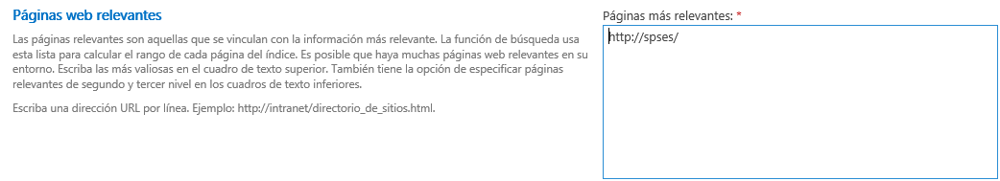
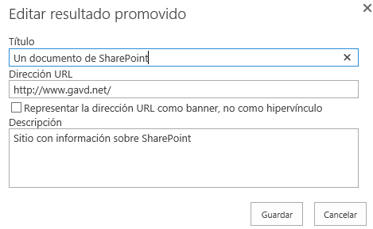
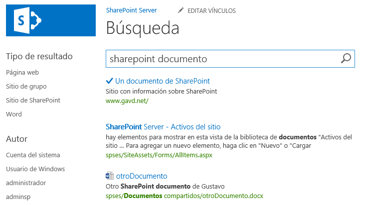
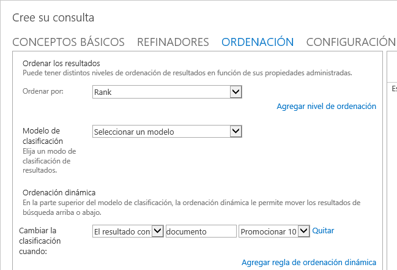
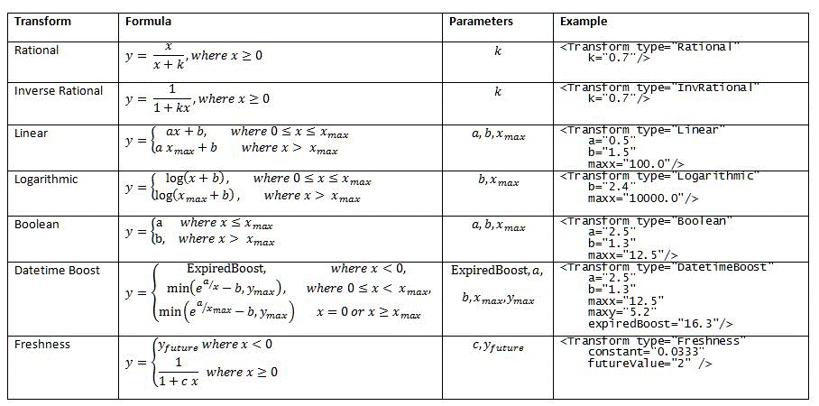

​Cuando se instala y configura correctamente el Motor de Búsqueda de SharePoint, los resultados que genera para una consulta aparecen en el orden que los algoritmos internos determinan. Pero el orden por defecto generado por SharePoint no es necesariamente el orden que los requisitos de la empresa o compañía que utiliza el sistema desean tener. Un ejemplo común es que puede exigir que los productos de la empresa aparezcan en primer lugar en los resultados de búsqueda.

La relevancia se puede definir como los resultados que elevan la probabilidad de realizar una tarea con éxito. Aplicado a un sistema de búsqueda de información, se puede decir que los resultados más relevantes producidos por una búsqueda son los que con más probabilidad presentan la información que el usuario está buscando. En el ejemplo indicado en el párrafo anterior, es mucho más probable que un empleado de una empresa busque información sobre los productos de su propia empresa, por lo que los resultados más relevantes son los que están relaciones con estos productos, y no con los de la competencia.

El Motor de Búsqueda de SharePoint 2013 tiene algoritmos para calcular la relevancia ("Ranking") que son basados en modelos lingüísticos generales. Idealmente, los resultados mostrados en la primera página son los que contienen la información que el usuario está buscando. Cuando esto no ocurre, se habla de que es necesario ajustar la relevancia. Para esto, SharePoint proporciona los mecanismos necesarios para alterar los modelos y adaptar la relevancia a las necesidades particulares de un sistema.

**Relevancia en el Motor de Búsqueda de SharePoint 2013**

SharePoint utiliza dos tipos de fórmulas de ranking para calcular la relevancia: Estáticas y Dinámicas. La diferencia es relativa a si el cálculo del ranking se ve afectado o no por los términos de la consulta y las propiedades del elemento de contenido.

El ranking Dinámico describe el ranking que se ve afectado por los valores de las propiedades del contenido (también conocido como "query-dependent ranking"). Los componentes principales usados por el algoritmo Dinámico de ranking en el Motor de Búsqueda de SharePoint para calcular la relevancia son:

- **Texto de Anclaje ("Anchor Text") -**Es el texto que se incluye con un hyperlink para describir el contenido del enlace. Cuando el Motor de Búsqueda rastrea el elemento, este texto es incluido en el índice del ítem. El Anchor Text solamente influye en el rango, y no es un factor determinante para incluir un elemento en el grupo de resultados. Por ejemplo, si los términos de búsqueda se encuentran solamente en el Anchor Text y no en el contenido real del elemento, el vínculo puede ser obsoleto de tal forma que el contenido del elemento no se incluye en el grupo de resultados.
- **Pesaje de Propiedades ("Property Weighting") -**Algunas propiedades son más importantes para calcular la relevancia que otras. El Motor de Búsqueda de SharePoint provee una forma para modificar el "peso" de cada propiedad de tal forma que tengan más importancia en los cálculos de relevancia. Cambiar arbitrariamente esta propiedad puede tener efectos adversos en la relevancia general del sistema, por lo que no es recomendado hacerlo sin una evaluación de los cambios y como impactan la precisión de los resultados.
- **Normalización de la Longitud ("Property Length Normalization") -**Un elemento de contenido puede tener propiedades de diferente longitud. Si los valores de esas propiedades se tratan igualmente sin importar su tamaño durante los cálculos de relevancia, puede tener un efecto negativo sobre el ranking calculado. "Length Normalization" ajusta el rango de un elemento, basado en la longitud de la propiedad y su configuración de "Length Normalization".
- **Igualación de URL ("URL Matching") -**URL Matching es el proceso por el cual el Motor de Búsqueda controla la URL de un elemento para que corresponda con el término buscado por el usuario.
- **Extracción de Títulos ("Title Extraction") -**Title Extraction, o utilizar el valor del título en el cálculo de la relevancia, puede ayudar a devolver contenido altamente relevante si el elemento esta titulado de forma apropiada.


A su vez, el ranking Estático describe el ranking que no es impactado por el contenido o valor de las propiedades de un elemento (también conocido como "query-independent ranking"). Los componentes usados por este algoritmo son:

- **Distancia de cliqueo ("Click Distance") -**Un documento, una página web, una lista o cualquier otro elemento puede estar vinculado a otro elemento porque el elemento vinculado contiene información relacionada a, y enriquece el contenido del elemento original que contiene el vínculo. Además, información sobre esos hyperlinks a un elemento especifico, tales como el número de hyperlinks a él o en donde esos hyperlinks están localizados son importantes para determinar la relevancia. Click Distance se refiere al número de vínculos entre el elemento y una página "principal". Para calcular la relevancia, el punto de inicio es esta página principal ("Authoritative Page"). Entre más vínculos el rastreador tenga que recorrer desde la página principal al elemento, menor es la relevancia. Si hay múltiples rutas al elemento, la relevancia es calculada en base al camino más corto, el que tiene la menor cantidad de links desde la página autoritativa hasta el elemento.
- **Profundidad de URL ("URL Depth") –**El contenido Importante o relevante esta frecuentemente localizado más cerca al inicio de la jerarquía de sitios que en un sitio varios niveles más abajo. La consecuencia es que un URL más corto es probablemente mejor recordado y utilizado por un usuario. El Motor de Búsqueda revisa la profundidad del URL calculando el número de slash ("/") en el URL. Entre mayor cantidad de slash, más profundo es el URL y menor la relevancia del elemento.
- **Detección automática de lenguaje ("Automatic Language Detection") –**Los usuarios normalmente prefieren recibir contenido en su propio lenguaje. El Motor de Búsqueda determina el lenguaje del usuario basado en la cabecera "Accept-Language" del navegador utilizado. Cuando se calcula la relevancia, el contenido en el lenguaje del usuario se considera más relevante con la excepción de contenido en inglés, que se considera tan relevante como el contenido del lenguaje del usuario.
- **Propósito del Tipo de Archivo ("File Type Biasing") -**Ciertos tipos de archivos pueden ser más relevantes que otros. Por ejemplo, paginas HTML y documentos Word son normalmente más relevantes en búsquedas que el contenido de una hoja de cálculo Excel. El mecanismo de relevancia incluye un algoritmo que asigna un ranking superior a determinados tipos de archivos.


**Ajuste de la Relevancia en SharePoint 2013**

Aunque hay muchos factores que determinan la calidad de los resultados de una búsqueda, comenzando por supuesto por la consulta misma utilizada por el usuario, no todos los factores que contribuyen al cálculo de la relevancia pueden ser modificados. De todas formas, en SharePoint 2013 es posible manipular la relevancia a través del uso de diccionarios, páginas relevantes, reglas de ordenamiento dinámico y modelos de ranking.

**Diccionarios de Búsqueda**

Aunque estrictamente hablando los  diccionarios no permiten modificar la relevancia en el Motor de Búsqueda, si es posible mejorar la experiencia de uso de las búsquedas influyendo indirectamente en la relevancia. Por ejemplo, definiendo diccionarios de sinónimos se puede lograr que los resultados se ajusten mejor a lo esperado.

Los tipos de Diccionarios de Búsqueda y su creación y uso es un tema demasiado extenso para este artículo, por lo que la segunda parte a publicar en el número 21 de CompartiMOSS se dedicará exclusivamente a los Diccionarios.

**Páginas Relevantes**

Las Páginas Relevantes son páginas que vinculan a información crítica dentro de la granja de SharePoint. Cuando se definen Páginas Relevantes, se afecta el ranking de cada página que está conectada por vínculos a la página Relevante por medio de "click distance". "Click distance", como se definió anteriormente es el número de clics necesario para navegar desde la Pagina Relevante al contenido a rastrear. Entre más cerca este la información a la Página Relevante, su ranking estático es mayor.

Las Paginas Relevantes se definen en la Aplicación de Servicio de Búsqueda ("Search Service Application", SSA) en donde se pueden definir tres niveles de Paginas Relevantes lo mismo que Páginas que no son Relevantes (las que ayudan a eliminar información irrelevante del cálculo de relevancia). En SharePoint On-Premise se define como Paginas Relevante por defecto la página principal de la colección de sitio de más alto nivel en la Aplicación Web. Es obligatorio tener por lo menos una página Relevante definida. Normalmente los administradores de SharePoint pueden definir algunas otras Páginas Relevantes, como por ejemplo la página de home de un subsitio, aunque se pueden definir múltiples si es necesario.

Los Administradores con conocimientos específicos de un área pueden influenciar la importancia relativa de páginas especificando otras páginas Relevantes y no-Relevantes. Un ejemplo de Páginas no-Relevantes podrían ser los URLs de sitios que contienen información obsoleta que solamente se mantiene como archivo.

Para acceder al menú de configuración de páginas Relevantes, desde la Administración central de SharePoint vaya a las páginas de Administración del Búsquedas y en el menú de acceso rápido (lado izquierdo) se encuentra el vínculo hacia "Páginas relevantes".



SharePoint contiene todos los cmdlets de PowerShell necesarios para trabajar con páginas Relevantes:

- **Get-SPEnterpriseSearchQueryAuthority** - Obtiene una página Relevante o la colección de páginas Relevantes en el SSA.
- **New-SPEnterpriseSearchQueryAuthority** - Crea una nueva página Relevante.
- **Set-SPEnterpriseSearchQueryAuthority** - Cambia el nivel de una página Relevante.
- **Remove-SPEnterpriseSearchQueryAuthority** - Elimina una página Relevante existente.
- **Get-SPEnterpriseSearchQueryDemoted** - Obtiene las páginas no Relevantes ("no autoritativas").
- **New-SPEnterpriseSearchQueryDemoted** - Crea una página no Relevante.
- **Remove-SPEnterpriseSearchQueryDemoted** - Elimina una página no Relevante.


Los parámetros que estos cmdlets utilizan son:

- **Url** - Los comandos "New" necesitan un Url para designar la página o site que se va a agregar.
- **Identity** - [optional para los comandos "Get"] Sin una Identidad, el comando Get obtiene todas la páginas Relevantes. Los comandos "Set" y "Remove" requieren que una página específica sea el identificador.
- **Level** - Específica el nivel al que la página se va a agregar. Valores validos son 0, 1 y 2, donde 0 es la página más Relevante y 2 la de tercer nivel.
- **Owner** - Tiene que ser asignado a un "Search Object Owner" designando o la SSA (Search Service Application) o la Subscripcion del Inquilino ("Tenant Subscription") en un sistema Multi-tenant.
- **SearchApplication** - El objeto SSA al que se le va a configurar las páginas.


El siguiente ejemplo crea una página Relevante en el segundo nivel, luego la mueve al tercero, crea una página no-Relevante y finalmente elimina la página que se movió al tercer nivel:

```
# La cuenta utilizada por el Motor de Busqueda
```

```
$myPropietario = Get-SPEnterpriseSearchOwner -Level ssa
```

```
# Crear una nueva página en el segundo nivel
```

```
$mySqa = New-SPEnterpriseSearchQueryAuthority -Owner $myPropietario -SearchApplication $ssa -Url "http://servidor/sitios/abc" -Level 1 
```

```
# Mover la página del segundo al tercer nivel
```

```
Set-SPEnterpriseSearchQueryAuthority -Identity $mySqa -Level 2 -SearchApplication $ssa -Owner $myPropietario
```

```
# Crear una nueva página como no-autoritativa
```

```
New-SPEnterpriseSearchQueryDemoted -Owner $myPropietario -SearchApplication $ssa -Url "http://servidor/sitios/noautoritativa"
```

```
# Remover la página que se movió al tercer nivel
```

```
Remove-SPEnterpriseSearchQueryAuthority -Identity "http://servidor/sitios/abc" -Owner $myPropietario -SearchApplication $ssa -Confirm:$false
```

**Reglas de Consulta y Ordenamiento Dinámico**

Para manipular la relevancia de los resultados de una consulta es posible establecer reglas de dos tipos: reglas que ejecutan antes de que se genere el grupo de resultados (Reglas de Consulta) y reglas que ejecuten una vez se tienen los resultados (Reglas de Ordenamiento). En ambos casos se puede lograr que determinados resultados aparezcan más hacia el comienzo de la lista (promover resultados) o que se muestren como menos importantes, moviéndolos hacia puestos menores en la lista (degradar resultados).

Aunque el resultado de ambos tipos de reglas puede llegar a ser similar, el primero se integra profundamente con los algoritmos internos de ranking del Motor de Búsqueda, lo que mejora el rendimiento de búsqueda y muestra de resultados. El segundo tipo de reglas se basa en un reordenamiento de los resultados ya rankeados por el Motor, proceso que teóricamente puede mostrar algún tipo de degradación en el rendimiento, aunque solo sea marginal.

**Reglas de Consulta Dinámicas**

Sin utilizar ningún tipo de programación, los administradores de SharePoint, los administradores de Colecciones de Sitios y los propietarios de Sitios pueden modificar la relevancia por medio de "Reglas de Consulta" ("Query Rules"). En una Regla de Consulta se definen las condiciones de la Regla y las acciones que ocurren cuando una condición ocurre reduciendo la cantidad de resultados o cambiando el orden en que se muestran. Por ejemplo, una condición de Regla de Consulta puede ser que un término en la consulta corresponda con una (o unas) palabra determinada en un Conjunto de Términos de SharePoint (definido en el Servicio de Metadatos Administrados) o que es una consulta realizada frecuentemente (tal como "video", por ejemplo). Cuando la condición ocurre, se puede iniciar una acción para mostrar un elemento específico al principio de la lista de resultados.

Como se indicó anteriormente, las Reglas de Consulta se pueden crear a nivel de Administración Central, Colección de Sitios o Sitios por medio de las páginas de administración de cada nivel. Las Reglas se heredan de un alcance superior al siguiente, pero cada nivel puede tener sus propias Reglas que no afectan a su nivel superior (pero son heredadas hacia su nivel inferior). SharePoint dispone de un número de Reglas predefinidas por defecto, pero su número depende de la licencia utilizada, haciendo por ejemplo que algunos tipos de Reglas no se puedan utilizar en SharePoint Foundation, pero si en SharePoint Server.

Existen seis tipos de condiciones para Reglas de Consulta:

- La consulta coincide exactamente con la palabra clave - Es la forma más sencilla de condición: la regla asociada se disparara cuando la palabra o frase configurada se utiliza exactamente en la consulta de búsqueda.
- La consulta contiene el término de acción - Similar a la anterior, con la excepción que la palabra o frase configurada esta al principio o al final de la consulta. Por ejemplo, si se configura "SharePoint" como condición, la acción iniciara con las consultas "SharePoint como sistema" y "información sobre SharePoint", pero no con la consulta "información sobre SharePoint como sistema" o simplemente "SharePoint". En esta condición es posible utilizar palabras o frases configuradas en el Servicio de Metadatos Manejados.
- La consulta coincide exactamente con el diccionario - Es igual al primer tipo de consulta, excepto que no se utiliza una palabra o frase libremente configurable, sino términos guardados en el Servicio de Metadatos Manejados. Hay que tener en cuenta que el Motor de Búsqueda chequea cada 30 minutos por cambios en los diccionarios guardados en el Servicio de Metadatos Manejados, por lo que si estos se modifican, los cambios tardarán algunos minutos en ser visibles.
- Consulta más común en este origen - La Regla de Consulta se activa si la consulta se ha realizado con frecuencia en otro Origen de Resultados (permite seleccionar el Origen a utilizar).
- Tipo de resultados seleccionados con más frecuencia - Dispara la acción si en los usuarios han utilizado con frecuencia resultados que aparecen en consultas similares.
- Coincidencia de texto de consulta avanzada - Para utilizar Expresiones Regulares.


A su vez, tres tipos de acciones se pueden acoplar a las condiciones:

- Resultados promocionados - Es un resultado que aparece en la parte superior de la lista de resultados y que es muy importante que sea visible para el usuario. En versiones anteriores de SharePoint se llamaba "Best Bet" o "Visual Best Bet". El ejemplo típico de utilización es definir la condición como "La consulta coincide exactamente con la palabra clave" configurando el nombre de la empresa, y como Resultado promocionado la información de contacto de ella. De esta forma, cuando un usuario utiliza el nombre de la empresa como termino de consulta, el primer resultado en la lista de resultados indicará directamente su información de contacto
- Bloques de resultados - Todos los resultados que cumplen la condición son agrupados en un bloque y resaltados dentro del grupo de resultados de la consulta. El bloque se puede mostrar al principio de la lista de resultados, o dentro de ella dependiendo de su ranking. Configuraciones adicionales permiten especificar cuantos resultados se deben mostrar en el bloque y si se debe mostrar un vínculo con "Más resultados" si la cantidad de resultados en el bloque sobrepasa la cantidad a mostrar configurada. Importante en este tipo de acciones es que permite mezclar resultados provenientes de diferentes Fuentes de Resultados, como por ejemplo, OpenSearch, Exchange y sistemas de SharePoint remotos, con los resultados nativos del sistema
- Cambiar resultados clasificados cambiando la consulta - Esta posibilidad permite cambiar la forma en la que una consulta es manejada por SharePoint, suplementándola con términos o Propiedades Manejadas adicionales


Finalmente es posible definir una fecha de inicio y finalización de publicación de la Regla, lo mismo que dejarla definida pero inactiva y una cuenta de usuario que recibe un mensaje de advertencia para revisar la regla en una fecha determinada.

Como un ejemplo de configuración utilizando la Interfaz de Usuario, vaya a la "Configuración del sitio" desde el sitio de nivel superior de una Colección de Sitios - "Reglas de consultas de búsqueda" (sección "Administración de la colección de sitios") y en la página de "Administración de reglas de consulta" seleccione "Documentos (sistema)" en el primer combo-box. Luego utilice el vínculo de "Nueva regla de consulta", indique un nombre para la regla y seleccione "Consulta coincide exactamente con la palabra clave", indicando "sharepoint documento" en la expresión. Utilice el vínculo de "Agregar resultado promocionado" e indique un título a mostrar en la lista de resultados, lo mismo que el URL a donde debe redirigirse cuando se hace clic sobre él. Se puede utilizar el campo de Descripción para agregar información adicional en la lista de resultados:



Guarde la Regla y ejecute una búsqueda utilizando el término exacto configurado. Al principio de la lista de resultados aparecerá el término promocionado:



SharePoint 2013 no dispone de cmdlets de PowerShell para trabajar con Reglas de Consulta. Aunque el Modelo de Objetos de Servidor contiene el espacio de nombres Microsoft.Office.Server.Search (Microsoft.Office.Server.Search.dll en el hive 15/ISAPI) que si debería permitir trabajar programáticamente con Reglas de Consulta, una gran parte de sus clases y métodos son selladas, por lo que de todas formas son inutilizables para programación normal.

**Reglas de Ordenamiento Dinámicas**

Este tipo de reglas permiten reordenar los resultados de una consulta por medio de un grupo de condiciones de forma similar a las Reglas de Consulta, pero que son aplicadas después de que el Motor de Búsqueda ya ha generado la lista de resultados. La parte encargada de manejar la devolución de listas de resultados del Motor de Búsquedas utiliza palabras claves y XRANK para modificar el orden de la manera configurada.

Las Reglas de Ordenamiento Dinámicas se definen en el "Constructor de Consultas" de la WebPart de Resultados de Consulta (pestaña de "Ordenación"). En esta ventana, en el Combo-box de "Ordenar por" se debe seleccionar "Rank" para poder definir las Reglas de Ordenamiento Dinámicas. Luego, utilizando el vínculo de "Agregar regla de ordenación dinámica" se pueden definir nueve tipos de condiciones para "Promover" o "Disminuir" los resultados que cumplen la condición por un número determinado de niveles. Se pueden configurar múltiples condiciones por medio de un estamento "OR" (serán evaluados en orden de configuración).



Las condiciones que se pueden utilizar son:

- El resultado contiene la palabra clave - Como su nombre lo indica, se puede promocionar o democoionar un resultado que contenga el termino configurado.
- El título contiene palabras clave - Igual a la anterior condición, pero que se aplica al título de la información solamente, no a su contenido, y el título puede contener más términos.
- El título coincide con las palabras clave - Igual a la anterior, pero el título debe ser igual al término configurado.
- La URL empieza por - La condición se aplica a todos los resultados en donde su ruta comienza con el termino configurado.
- La URL coincide exactamente - Permite manipular el orden de sitios específicos.
- El tipo de contenido es - La condición se basa en el Tipo de Contenido de la información, permitiendo promover todos los elementos creados con él.
- Coincidencias de extensión de archivo - Permite configurar la posición de archivos encontrados en los resultados basándose en su extensión (por el ejemplo documentos Word con extensión .docx).
- El resultado tiene la etiqueta - En donde la descripción o cualquier otro metadato coincide con el término configurado.
- Condición manual - Permite utilizar Regular Expressions para crear la condición.


Lo mismo que para las Reglas de Consulta Dinámicas, SharePoint no dispone de cmdlets de PowerShell para trabajar con Reglas de Ordenamiento, y las posibilidades de utilizar el Modelo de Objetos de Servidor son extremadamente reducidas, haciendo prácticamente imposible configurarlas de otra manera diferente a utilizando la Interface de Usuario.

**Modelos de Ranking**

El Motor de Búsqueda es responsable de asignarle un ranking a cada elemento que se encuentre en una consulta, basado en un número de factores definidos en el modelo de ordenación. Este modelo contiene las reglas y las operaciones matemáticas y lógicas que se deben aplicar a los resultados de la consulta. SharePoint Server 2013 dispone por defecto de catorce modelos de ranking que se aplican en diferentes contextos, tales como búsquedas en documentos o en información sobre personas.

Los modelos de ranking son archivos XML que se registran en SharePoint para que el Motor de Búsqueda los pueda utilizar. Aunque en SharePoint 2013 es posible modificar o crear nuevos modelos de ranking, Microsoft recomienda evitar hacerlo y utilizar las otras posibilidades descritas anteriormente para afectar el ranking. Muy probablemente esta es la razón por la que prácticamente no existe información disponible sobre la estructura y funcionamiento de estos modelos.

PowerShell para SharePoint 2013 dispone de cuatro cmdlets para trabajar con Modelos de Ranking:

- **Get-SPEnterpriseSearchRankingModel** - Enumera los modelos instalados y permite exportarlos a archivos físicos.
- **New-SPEnterpriseSearchRankingModel** - Despliega un nuevo modelo.
- **Remove-SPEnterpriseSearchRankingModel** - Elimina un modelo.
- **Set-SPEnterpriseSearchRankingModel** - Permite configurar las propiedades de un modelo.


Para exportar el modelo por defecto de SharePoint 2013 hacia un archivo físico utilice un script similar al siguiente:

```
$ssa = Get-SPEnterpriseSearchServiceApplication -Identity "Aplicación de servicio de búsqueda"
```

```
$myPropietario = Get-SPenterpriseSearchOwner -Level ssa
```

```
$unModelo = Get-SPEnterpriseSearchRankingModel -SearchApplication $ssa -Owner $myPropietario
```

```
$unModelo.RankingModelXML > c:\unModelo.xml
```

Una vez exportado, un modelo puede ser modificado e importado de nuevo en SharePoint, preferiblemente con un nombre diferente para no alterar el modelo original. El siguiente script permite importar el modelo exportado en el paso anterior:

```
$myRankingModel = Get-Content c:\unModelo.xml 
```

```
$myRankingModel = [String]$myRankingModel
```

```
$ssa = Get-SPEnterpriseSearchServiceApplication
```

```
$myPropietario = Get-SPenterpriseSearchOwner -Level ssa
```

```
$newrm = New-SPEnterpriseSearchRankingModel -SearchApplication $ssa -Owner $myPropietario -RankingModelXML $myRankingModel
```

Los Modelos de Ranking consisten de diferentes "Características" ("Features") que, combinadas, forman el orden final de un elemento. El ranking se calcula para cada elemento en una consulta, y está basado en algoritmos matemáticos que pueden ser bastante complejos. El siguiente cuadro muestra las funciones de transformación para solamente las características de ranking estático y de proximidad (información proporcionada por Microsoft):



El modelo por defecto de ranking consta de siete de este tipo de características, que luego son agregadas por medio de modelos matemáticos que tratan de predecir la importancia del elemento en el conjunto de resultados. Los Modelos son altamente complejos de crear y testear; por ejemplo, el modelo por defecto que se exportó utilizando el script al principio de esta sección consta de 2.290 líneas de código XML.

**Conclusiones**

El Motor de Búsqueda de SharePoint 2013 calcula por defecto la relevancia de cada elemento en el conjunto de resultados de una consulta, permitiendo que los elementos que deben ser más interesantes para el usuario aparezcan al principio de la lista de resultados. Este ordenamiento se consigue por medio de modelos de Ranking que pueden ser creados y/o modificados. Pero existen otras formas para manipular el orden de los resultados, como por ejemplo por medio de reglas de ordenamiento que se pueden aplicar antes o después de que el Motor realice la búsqueda, por medio de la definición de Páginas Relevantes y la creación de Diccionarios de búsqueda.


**Gustavo Velez**
 MVP de SharePoint Server
 [gustavo@](mailto:gustavo@)gavd.net
 http://www.gavd.net

