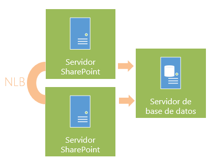

​Continuando el anterior artículo ([CompartiMOSS nº 19](/revistas/numero-19/buenas-practicas-en-infraestructura-en-sharepoint-2013-parte-1)), vamos a centrarnos en el diseño de una granja de SharePoint. Veremos las diferentes recomendaciones y buenas prácticas a la hora de diseñar la granja, calcular su tamaño y capacidades y configurar. Se ha intentado que el artículo aplique tanto a SharePoint 2010 como a SharePoint 2013, indicando en determinados puntos posibles diferencias.

Como primera parte del artículo, es importante tener claro cómo funciona y se estructura un entorno SharePoint. Si ya conoces estos conceptos, puedes saltarte el primer apartado.

**Entendiendo cómo funciona un entorno SharePoint**

Un conjunto de servidores (también llamado granja) puede contener uno o varios servidores de SharePoint. Los servidores de SharePoint se basan en IIS y en .NET para albergar las aplicaciones web de contenido y las aplicaciones de servicio. En numerosos diseños de arquitectura, los servidores SharePoint se separan en dos roles:

- **Servidores frontal web**: contienen las aplicaciones de contenido (una web, una intranet, los sitios personales, el repositorio documental, etc.).
- **Servidores de aplicación**: contienen las aplicaciones de servicio (Servicios de Access, servicio de administración de Apps, servicio de BCS, Excel Services, metadatos administrados, traducciones, PerformancePoint, búsquedas, servicio de Visio, servicio de perfiles, etc.).

Adicionalmente, es necesario tener uno o varios servidores SQL Server de **base de datos**, que albergarán todas las bases de datos de configuración, contenido y servicios de la granja.

Opcionalmente se puede disponer de uno o varios servidores de **Office Web Apps** (también llamadas Office Online en entornos cloud), que proporcionan a SharePoint versiones web de Word, Excel, PowerPoint y OneNote. En SharePoint 2010, las Office Web Apps se instalaban sobre SharePoint como aplicaciones de servicio adicionales, en la versión 2013, forman una granja totalmente independiente, que puede ser consumida por SharePoint o por otros productos de servidor.

En la **Imagen 1** puede observarse la estructura de una granja SharePoint y cómo otros productos cliente y servidor interactúan con ella.

Adicionalmente, **Exchange Server** y **Lync Server** se pueden integrar en multitud de ocasiones con SharePoint, y son un complemento perfecto para su funcionalidad. Los ejemplos de integración más comunes son:

- **Indicadores de presencia**: cuando se visualiza un usuario en SharePoint, parece un indicador visual que permite conocer la presencia (desconectado, activo, ocupado…) de Lync. Además, el indicador permite enviar un correo electrónico con Exchange, iniciar un chat por Lync o realizar una videollamada.
- **Buzón del sitio**: la posibilidad de contar con un buzón de Exchange dentro de un sitio colaborativo de SharePoint para enviar y recibir correos. Los correos recibidos y sus adjuntos pueden guardarse en las bibliotecas documentales de SharePoint.
- **Work Management Service**: aplicación de servicio que permite visualizar tareas de Exchange en SharePoint.
- **Outlook Web App**y **Lync Web App**: Exchange Server y Lync Server proporcionan versiones web de Outlook y Lync. Pueden mostrarse en SharePoint como WebParts.

**¿Cómo estructurar una granja?**

Cuando se diseña una granja de SharePoint, no existe una implementación única ni unas reglas estándar a seguir. Cada granja debe disponer de los componentes y servidores que más se adapten a nuestras necesidades. SharePoint es un producto que permite mucha flexibilidad a la hora de separar funcionalidades y servicios según nos interese.

Así mismo, no hay un modelo estándar de cálculo de capacidades. Debemos hacer pruebas de capacidad con cálculos sobre papel y fijarnos en otras granjas y arquitecturas de referencia para calcular los recursos necesarios. Una vez diseñada e implementada la granja, será necesario realizar pruebas de carga y evaluar si la granja satisface nuestras necesidades o si es necesario un cambio o re-escalado.

Para ello, Microsoft propone un modelo cíclico (Imagen 2) en el que modelamos y diseñamos la granja en base a nuestros datos de rendimiento, carga y funcionalidades. Tras esto, implementamos un piloto en el que probamos los recursos y la carga del hardware. Si es necesario, se optimizará la granja realizando los cambios necesarios en los recursos de la granja y la topología. Una vez se haya terminado, se implementará la granja final y se pasará a un estado de supervisión y mantenimiento, en la que se monitorizará la granja para ir evaluando periódicamente si es necesario aumentar sus capacidades. En caso que sea necesario, se comenzará de nuevo con el proceso. Se puede encontrar más detalle de este proceso en: [http://technet.microsoft.com/es-es/library/ff758647(v=office.15).aspx](http&#58;//technet.microsoft.com/es-es/library/ff758647%28v=office.15%29.aspx)

**Diseño de la granja**

Para diseñar la granja, es necesario conocer las distintas combinaciones de servidores con las que podemos ir jugando para adaptarla a nuestras necesidades. Comencemos con lo básico, el mínimo de servidores en producción son: un servidor SharePoint (que contendrá aplicaciones web de contenido y aplicaciones de servicio) y un servidor de base de datos (Imagen 3).

Si el servidor tiene mucha carga de datos, o mucho acceso y concurrencia, es posible agregar más servidores (los que sean necesarios). El proceso es tan sencillo como instalar SharePoint en un nuevo servidor y ejecutar un asistente para unirlo a la granja. En estos casos, podemos balancearlos (usando NLB de Windows u otra tecnología) para repartir la carga entre ellos, de esta forma también conseguimos contar con Alta Disponibilidad (Imagen 4).

Para conseguir Alta Disponibilidad en los servidores de base de datos, podemos añadir más servidores y configurarlos en SQL Server Cluster o en SQL Server Always-on (Imagen 5).

Si se detecta servicios (Excel services, Web Analytics, PerformancePoint, perfiles, alguno de los componentes de las búsquedas…) que requieren una gran carga de procesamiento, es posible separarlos en servidores de aplicación (Imagen 6).

Es posible añadir la cantidad de servidores SharePoint que sea necesario (dos, tres, diez, treinta…) para cubrir nuestras necesidades. Del mismo modo, podemos separar en servidores de aplicación las aplicaciones de servicio que consideremos oportunas y hacer los balanceos que sean necesarios. Cuando tenemos entornos con varios servidores frontal web y varios de aplicación, tenemos una de las arquitecturas más famosas, la arquitectura de tres niveles. En la Imagen 7 podemos ver un ejemplo de arquitectura de tres niveles con Alta Disponibilidad.

**Cálculo del tamaño**

El siguiente paso, una vez conocidos estos conceptos, es calcular el tamaño que tendrá la granja. Para ello, Microsoft nos propone cuatro arquitecturas de referencia, para que nos basemos en la que más se adapta a nuestras necesidades. Estas cuatro arquitecturas son:

- Granja de servidor único (Imagen 8):
    - Para fines de evaluación.
    - Todo (frontales web, servidores de aplicaciones, bases de datos) se instala en un único servidor.
- Granja de servidores pequeña (Imagen 8)
    - También llamada "granja de dos niveles".
    - Para implementaciones limitadas, con un mínimo de aplicaciones de servicio en uso (o muchas con poca carga) y un volumen relativamente pequeño de datos (10 o más GB).
- Granja de servidores mediana (Imagen 9)
    - También llamada "granja de tres niveles".
    - Tiene una topología de tres niveles, (la arquitectura más común) en la que diferenciamos servidores frontal web (aplicaciones de contenido), servidores de aplicación (aplicaciones de servicio) y servidores de base de datos.
    - Decenas de miles de usuarios.
    - De 10 a 50 solicitudes por segundo.
    - 1 ó 2 TB de datos.
- Granja de servidores grande (Imagen 10):
    - Consiste en varias granjas de servidores, en las que podemos o no compartir aplicaciones de servicio entre ellas.
    - De esta forma, podemos conseguir granjas dedicadas para distintos servicios. Podemos tener una granja sólo para servicios de Excel que sea consumida por otras granjas.
    - Cientos de miles de usuarios.
    - Cientos de solicitudes por segundo.
    - 10 o más TB de datos.

Estas arquitecturas sirven de referencia, no son un modelo cerrado que debamos implementar. Debemos basarnos en ellas y hacer los cambios que consideremos oportunos para diseñar nuestro propio entorno. Se puede encontrar más detalle sobre estas arquitecturas de referencia en el siguiente enlace: [http://technet.microsoft.com/es-es/library/ff758647(v=office.15).aspx](http&#58;//technet.microsoft.com/es-es/library/ff758647%28v=office.15%29.aspx)

**Cálculo de la capacidad**

Cuando se tiene clara la arquitectura de referencia con la que se va a trabajar y se tienen claros los conceptos de diseño, es el momento de calcular las capacidades de la granja. Para ello, debemos recopilar toda la información que podamos, como la posible carga del entorno, cantidad de usuarios, volumen de los datos, valores de concurrencia, etc.

Para realizar este cálculo, debemos utilizar un importante recurso de TechNet, los resultados y recomendaciones de pruebas de rendimiento ([http://technet.microsoft.com/es-es/library/ff608068.aspx](http&#58;//technet.microsoft.com/es-es/library/ff608068.aspx)). Este artículo contiene pruebas de rendimiento, recomendaciones y arquitecturas de ejemplo para diferentes escenarios (colaboración, ECM, contenido multimedia, contenido social…). Podemos consultar el escenario que más se adapte a nuestro caso y hacer los cálculos de rendimiento para nuestra granja basándonos en las indicaciones.

Adicionalmente, es recomendable diseñar las capacidades basándonos en la infraestructura diseñada en proyectos pasados y en los ejemplos reales de implementaciones que se pueden encontrar en TechNet.

También existen calculadora automáticas que pueden ayudarnos en muchos casos:

- HP SharePoint Sizer (para SharePoint 2007 y 2010):
    - [http://h71019.www7.hp.com/ActiveAnswers/secure/548230-0-0-225-121.html](http&#58;//h71019.www7.hp.com/ActiveAnswers/secure/548230-0-0-225-121.html)
- Microsoft SharePoint Capacity Planning Tool (para SharePoint 2007):
    - [http://www.microsoft.com/en-us/download/details.aspx?id=22876](http&#58;//www.microsoft.com/en-us/download/details.aspx?id=22876)

Finalmente, este artículo de Sanjay Narang puede ayudarnos mucho para calcular capacidades en SharePoint 2013: [http://blogs.msdn.com/b/sanjaynarang/archive/2013/04/06/sizing-and-capacity-planning-for-sharepoint-2013-resources.aspx](http&#58;//blogs.msdn.com/b/sanjaynarang/archive/2013/04/06/sizing-and-capacity-planning-for-sharepoint-2013-resources.aspx)
**Otras recomendaciones**

Finalmente, no quería terminar el artículo sin detallar otras recomendaciones a tener en cuenta al configurar o implementar granjas de SharePoint. La primera de ellas son las cuentas de usuario. Nunca queda claro del todo cuales son las cuentas necesarias y recomendadas para configurar al completo la granja, ya que Microsoft las va detallando a lo largo de diferentes artículos de TechNet y puede llevar a cierta confusión. A continuación os indico el listado completo, que es compatible con proyectos de instalación como AutoSPInstaller. Existen distintas nomenclaturas, en este listado he intentado usar una de las más extendidas, que consiste en poner las letras "sp" delante de cada cuenta, seguido de una explicación breve de su función:

- **spsetup**: Cuenta de instalación. Con ella instalamos SharePoint y ejecutamos el asistente de configuración de la granja. Será la cuenta apropiada para la ejecución de PowerShell.
    - Debe ser administrador local en todos los servidores, incluyendo SQL Server. Debe tener los permisos securityadmin y dbcreator en SQL Server.
- **spfarm**: cuenta de acceso a base de datos, administrador de la granja, pool de la administración central y servicio de timer. Se impersona en la granja como "Cuenta del Sistema" (SHAREPOINT\system). Es la cuenta que debemos escribir para conectar a base de datos en el asistente de configuración de la granja.
    - Debe ser administrador local en todos los servidores SharePoint durante la instalación y para arrancar el servicio de sincronización de perfiles. Una vez acabemos estas tareas **NO** debe ser administrador local nunca más.
- **sppool1, sppool2, spool3…**: cuentas para los application pool de las distintas aplicaciones SharePoint de contenido. Una cuenta por aplicación.
- **spmysite**: administrador de Mi Sitio (My Site) y cuenta del application pool de la aplicación de Mi Sitio.
    - Debe ser administrador local en todos los servidores SharePoint.
- **spservices**: cuenta para los application pool de las aplicaciones de servicio
- **spproject**: si se instala Project Server, se recomienda una cuenta adicional para el application pool de las aplicaciones de servicio de Project Server.
- **spsearch**: cuenta para el servicio de búsqueda.
- **spcrawl**: cuenta para el rastreo de contenido en las búsquedas.
- **spprofile**: cuenta para sincronizar perfiles de usuario.
    - Debe tener permisos de "Replicating Directory Changes" en el Active Directory. Si el dominio es versión Windows 2003 o anterior, debe ser miembro del grupo "Pre-Windows 2000" del Active Directory.
- **spexcel**, **spvisio**, **spperfpoint**: cuentas para el servicio sin-atención de los servicios de Excel, Visio y PerformancePoint.
- **spcacheadm**, **spcacherd**: cuentas para la caché de objetos de SharePoint ([http://technet.microsoft.com/es-es/library/ff758656.aspx](http&#58;//technet.microsoft.com/es-es/library/ff758656.aspx))

**Nota**: Hay cuentas en las que no se indica los permisos necesarios. Esto es debido a que se le asignarán automáticamente durante la instalación o configuración.

A continuación, una serie de recomendaciones a tener en cuenta en los servidores de base de datos:

- A ser posible, conectar a base de datos mediante un Alias SQL. Si existe la necesidad de cambiar el servidor de base de datos, de configurar un cluster o de realizar cualquier otro cambio, SharePoint no se verá afectado.
- Si se dispone de servidores suficientes, configurar clúster en base de datos (o un Always-on) para conseguir alta disponibilidad.
- Separar bases de datos en distintos discos duros. Recomendación:
    - Disco 1: Sistema Operativo
    - Disco 2: Binarios, instalación
    - Disco 3: bases de datos de contenido y servicios (mdf)
    - Disco 4: log transaccionales de bases de datos de contenido y servicios (ldf)
    - Disco 5: bases de datos de búsqueda y rastreo (mdf)
    - Disco 6: log transaccionales de bases de datos de búsqueda y rastreo (ldf)
- El Autogrow de bases de datos está por defecto a 1 MB, mejor incrementarlo.
- Intentar no cambiar permisos en las bases de datos de SharePoint a mano, a no ser que sea absolutamente necesario. Para dar permisos a cuentas adicionales, usar el comando de PowerShell Add-SPShellAdmin desde los servidores SharePoint.

Y otra serie de recomendaciones en los servidores SharePoint:

- Crear aplicaciones de servicio a mano para controlar los nombres de las bases de datos, pools de aplicaciones, configuraciones y cuentas.
- A ser posible, conectar a base de datos mediante un Alias SQL.
- Configurar límites de ficheros de log, separar en otros discos duros.
- Instalar iFilters esenciales, p.ej. PDF.
- Al acabar la instalación, spfarm debe dejar de ser administrador local.
- Si se dispone de servidores suficientes, configurar balanceos NLB en los frontales para lograr Alta Disponibilidad.
- Si se desea, configurar una granja de Office Web Apps y conectarla a la granja de SharePoint.
- Configurar correctamente los servicios que se ejecutan en cada servidor, es un error común hacer servidores de aplicaciones con el servicio de frontal web. Evitar esto.
- Supervisar periódicamente la granja e instalar actualizaciones de seguridad si es necesario.
- Instalar los Service Pack cuando vayan apareciendo, aunque recomiendo esperar unas semanas por si se descubre algún problema.

## Conclusiones

Espero que estos dos artículos puedan servir de ayuda a la hora de diseñar e implementar entornos de SharePoint. Existe muchísima información sobre estos procesos en internet, pero toda muy desordenada y extremadamente densa. No olvidéis todas las recomendaciones, ya que evitarán muchos problemas y quebraderos de cabeza en el futuro.

**Miguel Tabera Pacheco**
 SharePoint Server MVP 
[miguel.tabera@outlook.com](mailto&#58;miguel.tabera@outlook.com) 
@migueltabera
 [http://www.sinsharepointnohayparaiso.com](http&#58;//www.sinsharepointnohayparaiso.com/)

