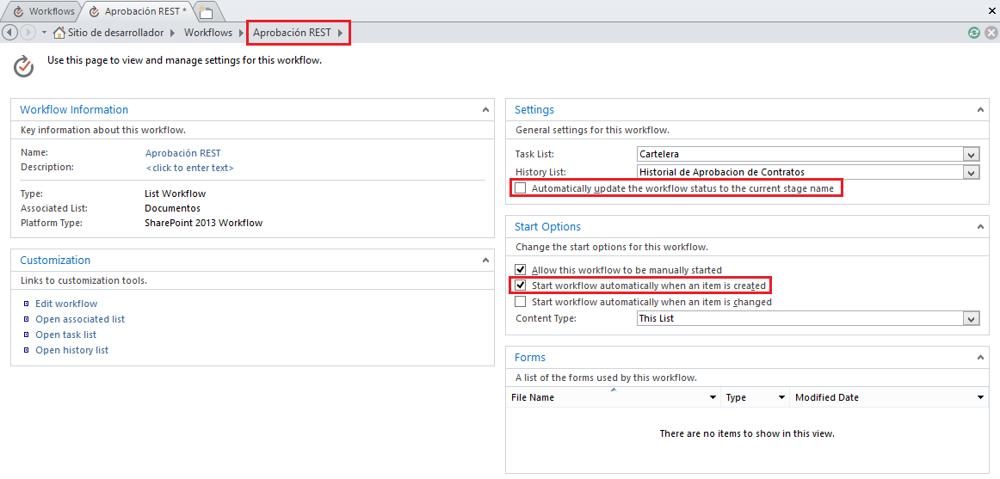

​**REST en la Plataforma SharePoint**

El API REST que SharePoint 2013 expone es bastante grande, y es muy importante revisar la documentación para entender y tener una idea general de los diferentes servicios y su funcionalidad con los cuales contamos. En el enlace http://msdn.microsoft.com/en-us/library/office/jj860569(v=office.15).aspx nos damos una idea de los distintos *endpoints* agrupados por los diferentes elementos de la plataforma, por ejemplo: listas, archivos y carpetas, usuarios y grupos, entre otros. En SharePoint 2010 para obtener vía REST las listas de un sitio de SharePoint se tenía que ejecutar el siguiente llamado a través del protocolo HTTP: [http://intranet/\_vti\_bin/listdata.svc](http://intranet/_vti_bin/listdata.svc) En ese caso listdata.svc es la interfaz REST a través del cual se realizan o ejecutan las distintas operaciones. En SharePoint 2013 se abrevió la llamada por intermedio del alias **\_api**, y lo anterior se consigue de la siguiente forma: https://intranet /\_api/lists

**Fiddler el primer aliado**

Fiddler es una herramienta bastante recomendada para ejecutar y probar las distintas operaciones REST que vayamos a utilizar desde un WorkFlow en SharePoint Designer 2013. Esto se debe a que la depuración y revisión rápida de lo que está sucediendo desde el WorkFlow y los pasos definidos en Designer, es realmente una tarea que consume demasiado tiempo y es difícil para el desarrollador que requiere realizar sus tareas con productividad. Por tal razón necesitamos descargar e instalar Fiddler ([http://www.telerik.com/download/fiddler](http://www.telerik.com/download/fiddler)). Es recomendable, si estamos trabajando desde Windows 8.1, descargar la versión específica de la herramienta para este sistema operativo, tal como lo aclaran en la página. A continuación veremos los pasos a seguir para ejecutar una operación REST de SharePoint 2013 desde Fiddler:

- Habiendo instalado Fiddler, ejecutamos la herramienta.
- Cuando cargue Fiddler utilizamos F12 para iniciar la captura del tráfico.
- En el lado derecho ubicar el TAB Composer, que es la ventana desde la cual se puede ejecutar las operaciones REST con la ventaja de poder indicar el método HTTP requerido como se muestra en la siguiente figura.

- Al hacer clic en el botón Execute, vamos a observar diferentes problemas por la siguiente razón. En el caso de SharePoint Online 2013, que es la versión de SharePoint expuesta a través de los servicios de Nube de Microsoft Office 365, el método de autenticación utilizado es distinto de una implementación de SharePoint 2013 OnPremise. Por tal razón se requieren pasos adicionales en Fiddler para lograr ejecutar los llamados a la interfaz REST.
- Luego de ejecutar el servicio en Fiddler se puede ver un mensaje en color amarillo, sobre el cual se debe hacer clic para decodificar las respuestas que vienen desde el sitio de SharePoint. De inmediato se podrá ver un mensaje que nos indica que el llamado no se puede ejecutar por falta de permisos: HTTP/1.1 403 Forbidden.
- Es importante en el menú Tools de Fiddler hacer clic en Fiddler Options, seleccionar el TAB HTTPS y seleccionar las opciones que permiten capturar los llamados HTTPS, debido a que SharePoint Online 2013 hace las peticiones utilizando ese protocolo. Activamos las siguientes opciones como muestra la siguiente figura.

- Como ya se tiene configurada la herramienta para escuchar las peticiones HTTPS, debemos abrir una ventana del navegador y ahí iniciar una sesión en el sitio de SharePoint Online 2013. En la ventana que solicita nuestras credenciales, ingresarlas, seleccionar la opción que permite mantener la sesión iniciada, y al finalizar la redirección al sitio, nuevamente regresamos a Fiddler para buscar las cookies que requerimos para poder hacer los llamados REST. Esto se puede buscar en Fiddler en la ventana que está escuchando todas las solicitudes realizadas y luego encontrar el valor de la cabecera Cookie que se envían al sitio de SharePoint Online 2013 durante las peticiones. La siguiente figura muestra lo anterior.

- Seleccionamos el valor FedAuth, y lo copiamos para luego utilizarlo.
- En Fiddler nuevamente regresamos al TAB Composer y agregamos la cabecera para realizar nuevamente la solicitud al servicio REST que habíamos intentado antes.
- En la siguiente figura se puede ver que en la ventana Request Headers hemos agregado el valor Cookie tal como se había copiado en un punto anterior. También es importante observar y agregar los valores User-Agent, Host y Content-Length. Al hacer clic en el botón Execute se podrá evidenciar que el servicio retorna una respuesta correcta: HTTP/1.1 200 OK

- En Fiddler en el TAB XML por ejemplo se puede visualizar los resultados retornados por la solicitud.

**Configurando Fiddler para realizar solicitudes tipo POST**

Hasta este punto hemos revisado la configuración y llamado a un servicio REST de SharePoint Online 2013 utilizando la operación GET, y también el envío de la cabecera Cookie con los valores necesarios para que la ejecución sea permitida por el sitio de SharePoint. Ahora es momento de ejecutar una operación vía REST, utilizando la operación POST, la cual permite enviar información o una orden directamente al sitio de SharePoint y por ejemplo crear un sitio, dar de alta un documento, crear un ítem de una lista, entre otras operaciones. Para el propósito de este artículo, vamos a mostrar cómo podemos aprobar un documento en una biblioteca de documentos la cual ha sido configurada con la opción de Aprobación de contenido, haciendo uso de una operación vía REST, que ejecute la acción y deje el documento en el estado APROBADO. En el siguiente artículo se puede tener un detalle adicional de operaciones que se pueden ejecutar "Understanding and Using the SharePoint 2013 REST Interface" (http://msdn.microsoft.com/en-us/magazine/dn198245.aspx).

- Nuevamente regresamos a Fiddler y seleccionamos el TAB Composer.
- Esta vez vamos a configurar una operación tipo POST. La URL que invoca el servicio REST sería similar a lo siguiente: 

https://intranet/\_api/web/GetFileByServerRelativeUrl('/documentos/midocumento.docx')/approve(comment='El documento ha sido aprobado')

La URL muestra que tenemos una biblioteca de documentos llamada DOCUMENTOS y un documento dado de alta con nombre MIDOCUMENTO.DOCX. El llamado a la operación **GetFileByServerRelativeUrl()**permite obtener una instancia del documento, el cual se pasa al método a través de su ubicación relativa en el sitio de SharePoint, no es necesario enviar la ruta absoluta del documento.

Luego se puede observar la ejecución de la operación **approve**, la cual es la que permite realizar la APROBACIÓN del documento en cuestión, adicionando un mensaje cualquiera, tal como si se aprobara el documento desde la interfaz Web en el sitio de SharePoint.

**NOTA:** En caso que la biblioteca haya sido configurada para requerir CheckIn y CheckOut de los documentos, en el WorkFlow deberíamos ejecutar la acción que desproteja el documento para poder ejecutar acciones como la de APROBACIÓN y todo lo que requiera cambios sobre el elemento. Para este ejemplo, asumimos que no es necesario desproteger el documento.

- En Fiddler si ejecutamos el llamado REST ya descrito, vamos a obtener un Error 403 Forbidden, como se muestra en la figura.

- El error es debido a la ausencia de un valor más en la cabecera de la solicitud. Ese valor es el del parámetro X-RequestDigest. Para conseguir dicho valor, es necesario componer una llamada a un servicio REST con la operación POST que retorna el valor de FormDigestValue, valor que se usará en la cabecera de solicitudes con la variable  X-RequestDigest.
- La llamada se compone de la siguiente manera en el Composer de Fiddler: [https://intranet.sharepoint.com/\_api/contextinfo](https://intranet.sharepoint.com/_api/contextinfo)

Los valores de la cabecera de solicitudes deberán ser los mismos que hasta ahora se han usado.
- La llamada anterior a través de Fiddler permitirá capturar el valor de FormDigestValue. Ese valor se debe copiar y lo utilizamos como cabecera de la solicitud debiendo quedar algo similar a esto:

**Accept**: application/json;odata=verbose
 **Content-Type**: application/json;odata=verbose
 **Host**: intranet.sharepoint.com
 **Content-Length**: 0
 **Cookie**: rtFa=9jVUUNa1x/y6gu/fnfIIuVCy6jM8Ekipl/qVtqTgQeSrPi7Y1FBs4IzdfSYRPAycItniwAEPFpLT;FedAuth=77u/PD94bWwgdmVyc2lvbj0iMS4wIiBlbmNvZGluZz0idXRmLTgiPz48U1A+RmFsc2UZXMvYW1lcmljYXNkbXMvc3Rvcms8L1NQPg==;
 **X-RequestDigest**: 0x191DC189CFA557711C8630CD0E3E6DBD601267159D2177AD4CFF3AE45D248F9CF9B7E7,27 Mar 2014 21:55:51 -0000

- Teniendo el valor de X-RequestDigest es momento de volver a ejecutar el servicio REST que nos permitirá APROBAR el documento: https://intranet/\_api/web/GetFileByServerRelativeUrl('/documentos/midocumento.docx')/approve(comment='El documento ha sido aprobado')

La llamada anterior desde Fiddler deberá retornar un resultado 200 OK. Y si se revisa el documento en el sitio de SharePoint este deberá aparecer como APROBADO con el mensaje "El documento ha sido aprobado".

**Crear y configurar un WorkFlow en SharePoint Designer 2013**

Luego de probar y validar el correcto funcionamiento de nuestras solicitudes REST desde Fiddler, es el momento de crear el WorkFlow en SharePoint Designer, agregar la acción que permite invocar el servicio REST y tenemos una alta probabilidad que todo funcione de manera correcta. La acción **Registrar en lista de historial** es una buena forma de registrar valores que nos permiten ir validando que el WorkFlow se está ejecutando de manera adecuada así como los servicios REST invocados.

- Lo primero es que debemos contar con permisos necesarios para realizar los siguientes pasos, por ejemplo ser Propietarios del sitio.
- Teniendo los permisos suficientes, procedemos a abrir SharePoint Designer 2013 y cargamos el sitio en el cual vamos a crear el WorkFlow.
- De inmediato vemos que se cuenta con varias opciones para crear WorkFlows: WorkFlow de lista, reutilizables y de sitio. Para el propósito de este ejemplo, usaremos el WorkFlow de Lista y seleccionamos la lista o biblioteca de documentos sobre la que queremos que se ejecute el WorkFlow.
- Luego se abrirá un Wizard que nos permitirá configurar las opciones iniciales del WorkFlow. Por ejemplo asignarle un nombre, una descripción, y lo más importante escoger el tipo de Plataforma, en este caso y para tener la opción de invocar servicios REST desde el WorkFlow, debemos seleccionar SharePoint 2013 WorkFlow.

- Al hacer clic en el botón OK, SharePoint Designer 2013 despliega una ventana que permitirá crear y configurar los distintos pasos del WorkFlow.
- A continuación asignamos un nombre a la fase, por ejemplo Aprobación. En la sección Transition to stage hacemos clic y agregamos la acción **Ir a una fase** y seleccionamos el valor Final del flujo de trabajo. En este caso es un ejemplo simple que no requiere de varios pasos, pero podemos agregar todos los pasos o fases necesarias para nuestro proceso.
- En la fase de Aprobación vamos a agregar una acción que invoque al servicio REST que nos permite obtener la información de contexto de la cual como ya vimos desde Fiddler, obtenemos el valor de FormDigestValue.
La acción de SharePoint Designer 2013 que nos permite hacer esto es: **Llamar al servicio web HTTP**.
Las acciones de los WorkFlows de SharePoint Designer pueden contener valores estáticos, como lo veremos en este ejemplo, pero también podemos trabajar con valores dinámicos, por ejemplo tomados desde la metadata del documento, de parámetros o variables definidos en el WorkFlow, y otras opciones más que se tienen a disposición.
- Lo primero que la acción nos solita es que configuremos la URL del servicio y también el método HTTP, tal como lo hicimos en Fiddler.

- En el campo que nos permite componer la URL agregamos la que habíamos utilizado en Fiddler y el método requerido. Para este caso la URL es similar a lo siguiente: [https://intranet/\_api/contextinfo](https://intranet/_api/contextinfo) y usamos el método HTTP POST.
- Ahora la pregunta es en qué momento pasamos los valores a la cabecera de la solicitud, tal como lo hicimos en Fiddler. Lo primero que tenemos que hacer es agregar una acción antes del llamado al servicio que nos permite configurar un Diccionario. Agregamos la acción **Generar Diccionario** y comenzamos a configurar cada uno de los valores de la cabecera, y deberíamos tener algo similar a lo siguiente.

​

- Finalizamos la configuración del diccionario haciendo clic en el botón OK. Por defecto SharePoint Designer crea la variable diccionario, pero en la acción se puede crear una nueva si así se desea.
- Luego hacemos clic derecho sobre la acción Llamar al servicio web HTTP que ya habíamos agregado y seleccionamos la opción Propiedades. En la ventana que se abre ubicamos la opción RequestHeaders y ahí asignamos como valor el diccionario que acabamos de configurar en pasos anteriores.
- Con lo anterior el servicio podrá ejecutarse correctamente y es momento de obtener el valor de FormDigestValue retornado por el servicio. Para esto creamos una variable local con el nombre FormDigestValue o el que se desee, de tipo Diccionario.
- En la acción Llamar al servicio web HTTP debemos hacer clic en el enlace **respuesta.**Ahí es donde asignamos la variable local recién creada en la cual se almacenará el valor de FormDigestValue.
- El servicio almacenará el valor de retorno en la variable de tipo diccionario, y su valor puede ser obtenido agregando una acción **Obtener un elemento de un diccionario.**El servicio retorna la información en formato JSON y en el enlace de la acción **Elemento por nombre o ruta de acceso**se puede obtener el valor JSON de la siguiente manera: d/GetContextWebInformation/FormDigestValue. Se debe indicar también la variable diccionario de la cual se toma el valor y el resultado leído deberá ser almacenado en una variable adicional que puede ser creada al hacer clic en el enlace **elemento.**Esta variable adicional será de tipo cadena. En la siguiente imagen se observa lo que debemos tener hasta este momento.

- Con el valor de FormDigestValue es posible agregar la acción que permitirá hacer la llamada al servicio REST que nos permitirá APROBAR el documento.
- En pasos anteriores habíamos definido una variable de tipo Diccionario con los parámetros y sus valores que debemos pasar como cabecera de las solicitudes. Pero es necesario agregar el valor de la variable donde se almacenó el valor de FormDigestValue a este diccionario. Esto se puede hacer agregando una acción de tipo **Generar Diccionario** a través de la cual asignamos el valor a un nuevo parámetro llamado X-RequestDigest, que como ya se explicó en Fiddler, es requerido para poder ejecutar la operación POST que nos permitirá APROBAR el documento. La acción debe ser configurada usando la variable de tipo Diccionario que ya se había utilizado cuando se agregaron los parámetros requeridos por los servicios.
- Seguidamente agregamos una nueva acción de tipo **Llamar al servicio web HTTP**, asignamos la URL del servicio tal como se usó en Fiddler, y para efectos del ejemplo usaremos valores prestablecidos, pero es importante recordar que estos valores pueden ser dinámicos. Esto es importante porque el servicio debería APROBAR cualquier documento que esté siendo asociado al WorkFlow, igualmente la ubicación de la biblioteca y cualquier elemento que sea susceptible de ser dinámico y pueda ser construido dentro de la URL del llamado al servicio. Por ahora nuestra URL luce así: https://intranet/\_api/web/GetFileByServerRelativeUrl('/documentos/midocumento.docx')/approve(comment='El documento ha sido aprobado'). Recordemos que el método HTTP debe ser configurado como POST. Nuevamente hacemos clic derecho sobre la acción y asociamos en el valor RequestHeaders la variable Diccionario que hemos venido utilizando para los parámetros requeridos por la cabecera de las solicitudes y que en el paso anterior fue actualizada con el valor de X-RequestDigest.
- Luego de haber seguido los pasos anteriores debemos tener el WorkFlow similar a como se ve en la siguiente figura.

- Para finalizar la configuración del WorkFlow hacemos clic en su nombre, Aprobación REST, desmarcamos el valor Automatically update the workflow status to the current stage name y seleccionamos la opción Start workflow automatically when an ítem is created.

- Finalmente hacemos clic en el botón Guardar y Publicar de SharePoint Designer 2013 para poder probar el WorkFlow en la biblioteca de documentos.
- Para probar el WorkFlow vamos al sitio de SharePoint, ubicamos la biblioteca a la cual asociamos el WorkFlow que se acaba de crear y configurar, damos de alta un documento a la biblioteca y el WorkFlow deberá iniciar y terminar satisfactoriamente. Luego de esto al revisar el historial de versiones del documento o las opciones de Aprobación, debemos encontrar que ha sido aprobado con el mensaje que hemos usado en este ejemplo.

En conclusión hemos podido evidenciar que la inclusión y uso de REST dentro de SharePoint, es una gran ventaja para que los desarrolladores puedan consumir y enviar información a los sitios en SharePoint desde las aplicaciones cliente que implementan, y que se encuentra disponible en las versiones Online y Onpremise de la plataforma. Debido al uso de REST los desarrolladores de gran variedad de plataformas podrán construir estas aplicaciones que se comunica con SharePoint: JAVA, PHP, Android, IOs, entre otras.

Finalmente vemos que la inclusión de la acción que permite hacer llamado a los servicios REST de SharePoint desde los pasos de un WorkFlow, es una capacidad realmente potente e importante para que el resultado final de los WorkFlows construidos con Designer realmente agreguen valor a las organizaciones que muchas veces requieren integrar estos procesos con información adicional, y no estar atados únicamente a los ítems de una lista y/o biblioteca.

**Andrés Ortíz**
 Microsoft Community Specialist SharePoint
 [aortiz@topgroup.com.ar](mailto:aortiz@topgroup.com.ar)  
@jaortizgonz
 [http://desarrollo.topgroup.com.ar/search/label/Sharepoint](http://desarrollo.topgroup.com.ar/search/label/Sharepoint)

