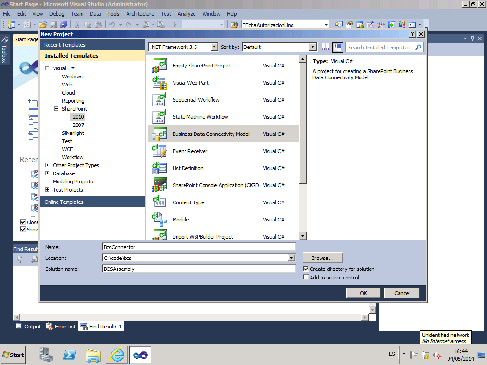
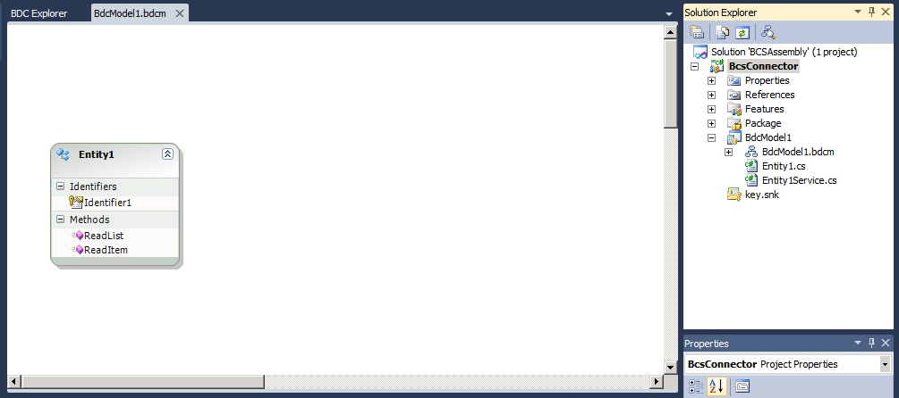
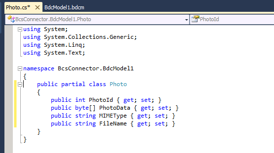
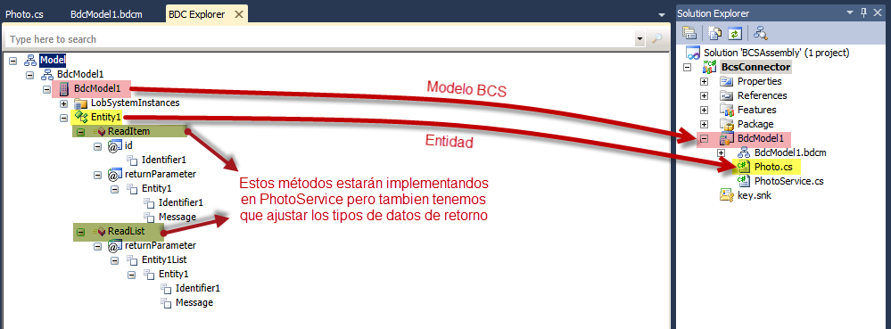
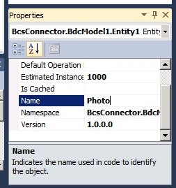
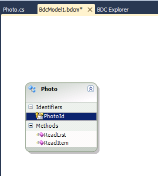
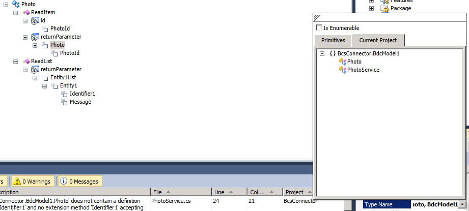
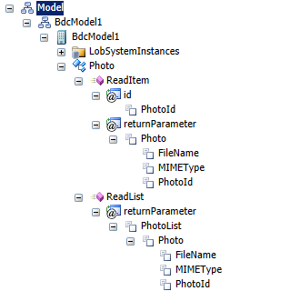
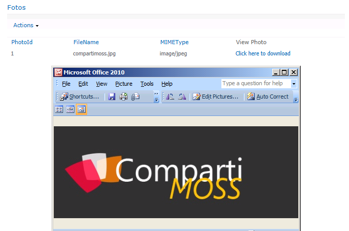

​Business Connectivity Services (BCS) es un componente de SharePoint que permite exponer datos provenientes de otros sistemas (bases de datos, aplicaciones corporativas, servicios online…) dentro de SharePoint como listas externas.

En el artículo anterior de esta serie, publicado en CompartiMOSS número 18, expliqué como acceder a los datos binarios que residen en una tabla de SQL Server. Para ello, bastaba con apuntar SharePoint Designer a dicha tabla y retocar ligeramente el fichero descriptor del conector que genera la herramienta.

Ahora vamos a ver cómo podemos exponer los datos en cualquier plataforma accesible mediante .NET como lista externa en SharePoint. Para ello tendremos que usar nuestro querido amigo Visual Studio.

**Conector BCS usando Visual Studio**

Cuando queremos hacer un conector de BCS y los datos a los que apuntamos no están en SQL Server u otra base de datos compatible con ODBC, no hay más remedio que conectarse mediante un conector de tipo ensamblando (Assembly). El conector realmente será una librería NET que expondrá algunos métodos para devolver los datos del sistema externo.

Como punto de partida en este ejemplo tendremos un ensamblado que devolverá una lista de una imagen en formato JPG. Para simplificar el desarrollo, lo que haremos es fijar los contenidos de esta lista directamente en el código, a modo *hardcoded*. Dejaré como ejercicio al lector extender este ejemplo para que los datos vengan de una base de datos, un servicio web o cualquier otra fuente.

Abrimos Visual Studio (en mi ejemplo usaré Visual Studio 2010, pero la verdad es que el diseñador no difiere en nada en Visual Studio 2012 y 2013) y creamos un nuevo proyecto de tipo Modelo de conectividad a datos empresariales.



El proyecto lo he llamado BcsConnector dentro de la solución BCSAssembly.

Después de la obligada ventana de elegir dónde vamos a desplegar nuestro paquete de solución WSP, nos aparece la pantalla siguiente.



Podemos ver que Visual Studio ha creado un conector automático, inventándose una entidad llamada Entity1 y un modelo llamado BdcModel1. Vale la pena detenernos aquí y explicar el significado de cada uno de los ficheros generados.

BdcModel1.bdcm es el fichero del descriptor del modelo BCS. Es un fichero XML y contiene la descripción de nuestro modelo, los metadatos que contienen las entidades del modelo y las operaciones que devuelven los metadatos. Como se puede ver, Visual Studio dispone de un diseñador visual del modelo, al estilo de Entity Framework.

Entity1.cs es la clase que representa nuestro modelo de datos. Si cambiamos su nombre o sus propiedades**,**el fichero descriptor no se actualiza automáticamente. Esto es muy importante porque muchos fallos de BCS vienen precisamente de la falta de sincronización entre el ensamblando y el descriptor.

Entity1Service.cs es la clase que implementa el servicio que devuelve los datos. En esta clase se generarán los métodos que devuelven los datos. Si en el diseñador añadimos o cambiamos un método, ese cambio se verá reflejado en esta clase así que habrá que ir alerta con los cambios no deseados en el diseñador.

Bien, ahora vamos a renombrar la Entity1 como Photo y Entity1Service como PhotoService. A la clase Photo le vamos a poner las siguientes propiedades.



PhotoId será la columna clave o identificador de cada foto (aunque en el ejemplo tenemos sólo una foto). PhotoData contendrá los bytes con los datos binarios de la foto. MIMEType tendrá el texto de tipo de contenido MIME (en nuestro caso "image/jpeg") y FileName contendrá el nombre del fichero que se descargará desde nuestro conector. PhotoData, MIMEType y FileName son necesarios para poder descargar los datos binarios y un identificador es necesario para que BCS sepa cómo acceder a los detalles de una entidad.

Si abrimos el diseñador del modelo y vamos a la pestaña BDC Explorer, podemos ver que nuestro modelo real y el modelo en el descriptor no coinciden.



Vemos que el modelo todavía refleja la Entity1 y que las operaciones ReadItem y ReadList (las dos mínimas que necesita BCS) devuelven listas e instancias de Entity1. Tenemos que arreglar esto, clicando en cada nodo y especificando el tipo de datos correcto.

Primero renombraremos la entidad Entity1 en el modelo (el nodo destacado en amarillo) a Photo. Para ello, clicaremos el nodo y en la ventana de Propiedades ajustaremos en nombre.



Acto seguido, abriremos el diseñador BCS y en la entidad Photo le cambiaremos el nombre y el tipo de identificador, de Identifier1 (String) a PhotoId (Int32).



Ahora viene la parte más manual de todo el proceso. En el BDC Explorer tenemos que ir a cada método (ReadList y ReadItem) y cambiar manualmente los tipos de datos de los parámetros de entrada y salida.

ReadItem tomará como parámetro id de tipo Int32, y devolverá un nodo de tipo Photo, con los subnodos PhotoId (Int32), FileName (String) y MIMEType (String). Clicando con el botón derecho encima de un nodo de resultado y eligiendo "Add Type Descriptor" podemos ir pegando las propiedades de nuestra entidad.

Para elegir el tipo de entidad Photo, en la ventana propiedades tenemos una pestaña para elegir las entidades del proyecto actual.



ReadList no tendrá parámetros pero devolverá un IEnumerable de Photo llamado PhotoList (hay que marcar la casilla "Is Enumerable" al elegir el tipo), con los mismos parámetros que ReadItem. Para ello, podemos copiar el nodo Photo entero desde ReadItem y pegarlo en ReadList, debajo del nodo de IEnumerable.

Todo el modelo queda ahora como se ve en la imagen siguiente.



La parte más quisquillosa de hacer un conector está hecha. Nos faltan todavía dos cosas más: añadir el método que devolverá la foto (un StreamAccessor) y añadir el código que implementará los métodos ReadList y ReadItem.

Para añadir el método StreamAccessor, tenemos que abrir el fichero de descriptor (BdcModel1.bdcm) en modo XML. Buscaremos el nodo correspondiente al método ReadItem y al final de este copiaremos el fragmento siguiente (antes del cierre del nodo Methods):

```
<Method Name="ReadPhoto" IsStatic="false">
```

```
  <Parameters>
```

```
    <Parameter Name="PhotoId" Direction="In">
```

```
      <TypeDescriptor Name="PhotoId" TypeName="System.Int32" IdentifierEntityNamespace="BcsConnector.BdcModel1" IdentifierEntityName="Photo" IdentifierName="PhotoId" />
```

```
    </Parameter>
```

```
    <Parameter Name="photo" Direction="Return">
```

```
      <TypeDescriptor Name="photoTypeDescriptor" TypeName="System.Stream" />
```

```
    </Parameter>
```

```
  </Parameters>
```

```
  <MethodInstances>
```

```
    <MethodInstance Name="ReadPhotoInstance" Type="StreamAccessor" ReturnParameterName="photo" Default="true" DefaultDisplayName="View Photo" ReturnTypeDescriptorPath="photoTypeDescriptor">
```

```
      <Properties>
```

```
        <Property Name="MIMETypeField" Type="System.String">MIMEType</Property>
```

```
        <Property Name="FileNameField" Type="System.String">FileName</Property>
```

```
      </Properties>
```

```
    </MethodInstance>
```

```
  </MethodInstances>
```

```
</Method>
```

Este fragmento define una operación llamada ReadPhoto que devolverá un Stream con la imagen, dado un PhotoId.

Ahora ya estamos listos para preparar el código de PhotoService, que contendrá la lógica de los tres métodos (ReadItem, ReadList y ReadPhoto). Como podemos ver, estamos "falseando" la lista a mano pero para los propósitos de este articulo ya es suficiente.

```
    public static Photo ReadItem(int id)
```

```
    {
```

```
        return new Photo()
```

```
        {
```

```
            PhotoId = id,
```

```
            FileName = "compartimoss.jpg",
```

```
            MIMEType = "image/jpeg"
```

```
        };
```

```
    }
```

```
 
```

```
    public static IEnumerable<Photo> ReadList()
```

```
    {
```

```
        List<Photo> list = new List<Photo>();
```

```
        var photo = new Photo()
```

```
        {
```

```
            PhotoId = 1,
```

```
            FileName = "compartimoss.jpg",
```

```
            MIMEType = "image/jpeg"
```

```
        };
```

```
        list.Add(photo);
```

```
        return list;
```

```
    }
```

```
 
```

```
    public Stream ReadPhoto(int PhotoId)
```

```
    {
```

```
        string imageString = "/9j/4AAQS...kZJRgA";
```

```
        var photoData = System.Convert.FromBase64String(imageString);
```

```
        return new MemoryStream(photoData);
```

```
    }
```

En imageString guardaremos los datos binarios de la imagen en formato Base64. Podéis usar la página [http://www.base64-image.de/step-1.php](http://www.base64-image.de/step-1.php) para subir una imagen y obtener el texto en Base64 con los datos binarios de la imagen. En el código anterior he recortado la longitud del string pero debéis pegar el texto correspondiente a una imagen JPEG válida antes de probar el conector.

No nos queda más que compilar, desplegar la solución, crear una lista externa de este tipo llamada Fotos y añadir una WebPart de **tipo Lista de datos de conectividad empresarial**. Nos debería salir la lista de una sola foto con el enlace para descargarla. Si lo clicamos veremos que la foto se descarga en toda su gloria binaria.



**Conclusión**

En este artículo hemos visto cómo acceder a los datos de tipo binario desde SharePoint a través de un ensamblado .NET. Espero que los dos artículos hayan sido útiles para aclarar un poco que pasa cuando trabajamos con datos binarios en BCS. Como decía en el primer artículo, es un tema muy poco cubierto por la documentación.

El fichero modelo BCS de este artículo está disponible en [http://1drv.ms/1g0INMP](http://1drv.ms/1g0INMP).


**Edin Kapić**
 Arquitecto SharePoint
 [edin.kapic@spenta.es](mailto:edin.kapic@spenta.es)
 @ekapic
 [http://www.spenta.es](http://www.spenta.es/)

 
 
import LayoutNumber from '../../../components/layout-article'
export default LayoutNumber
