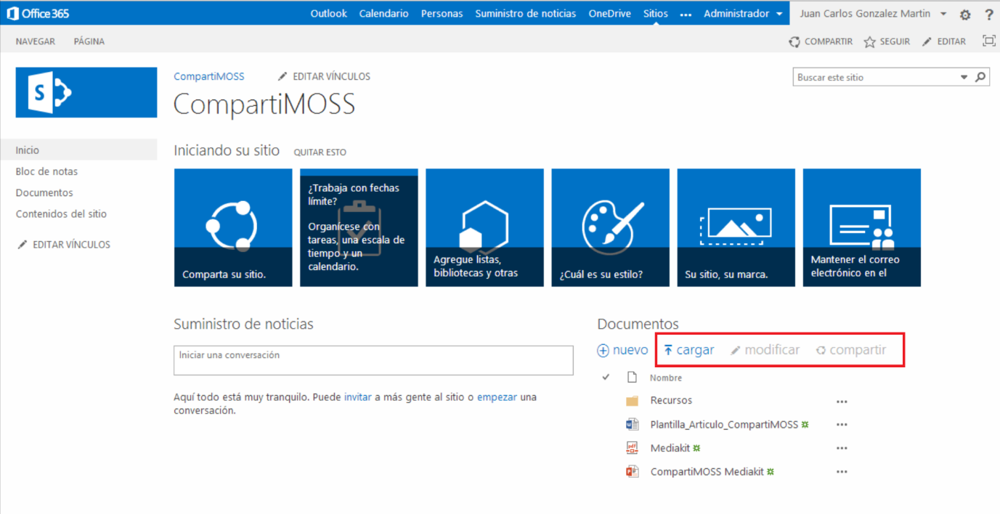
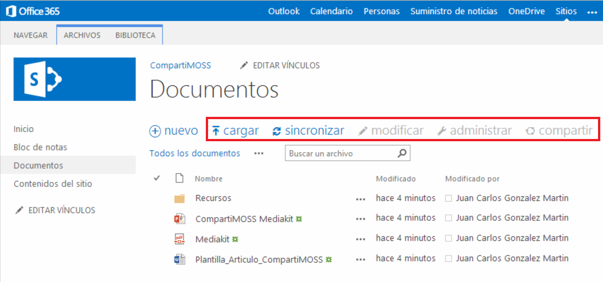
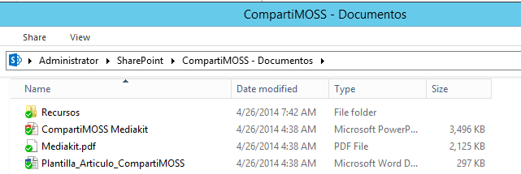
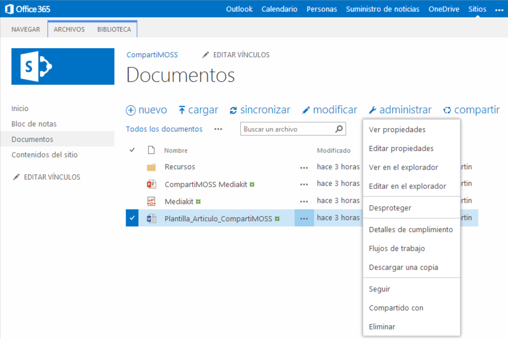
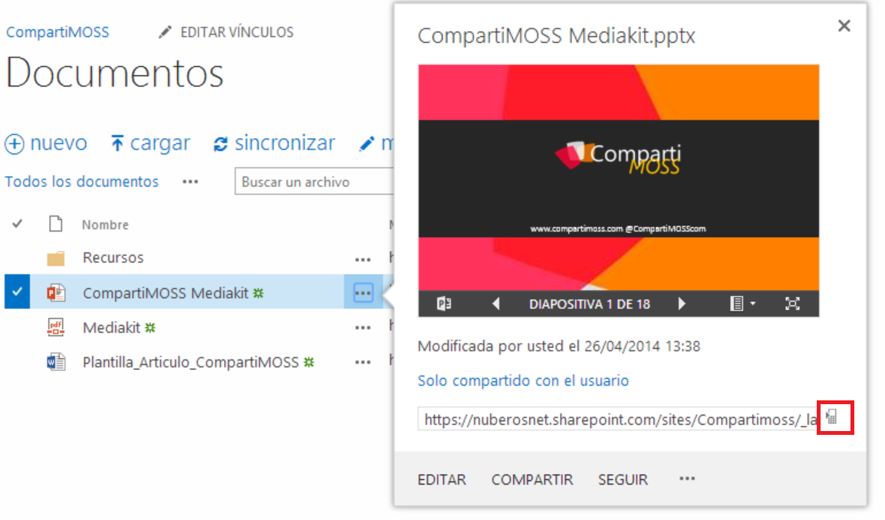
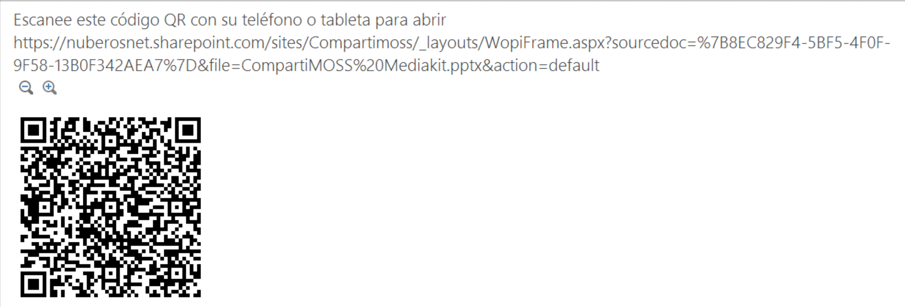
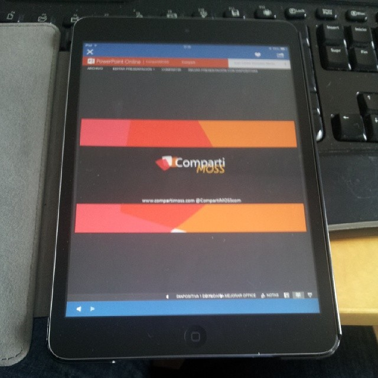

import ArticleHeader from '../../../components/article-header'

<ArticleHeader frontmatter={props.pageContext.frontmatter} />

​En este artículo se muestran algunas de las últimas novedades incorporadas por Microsoft en la gestión y uso de bibliotecas de documentos y documentos en SharePoint Online como parte de su estrategia de mejora continua e innovación de su plataforma de productividad en la nube. El compromiso de Microsoft consiste en añadir nuevas características y funcionalidades a Office 365 con una periodicidad mensual, así como capacidades de mayor calado cada 3-4 meses. Este compromiso es común para todos los servicios que forman parte de Office 365, por lo que SharePoint Online también se beneficia.

**Novedades en la gestión y uso Bibliotecas de Documentos en SharePoint Online**

Desde hace unas semanas, cuando un usuario accede a sus sitios de SharePoint Online "se puede" encontrar (**Nota:** Los cambios que se detallan en este artículo no están siendo aplicados de forma global por Microsoft a todos los tenant de SharePoint Online en Office 365, sino que la aplicación se está realizando de forma incremental por lo que es posible que no todo usuario de SharePoint Online tenga disponibles estas capacidades) con que las bibliotecas de documentos del sitio cuenta con una serie de acciones que facilitan realizar tareas comunes sin necesidad de pasar por la Cinta de la biblioteca y muy enfocado a que las tareas que habilitan estas acciones se puedan realizar de forma sencilla desde un dispositivo tipo tableta o Smartphone.

Las opciones disponibles varían en función de si se está accediendo directamente a la biblioteca o de forma indirecta a través de una vista en una WebPart:

- Para el caso en el que se acceda al contenido de la biblioteca a través de la correspondiente WebPart (**Nota:** Cada lista / biblioteca de documentos de un sitio de SharePoint cuenta con una WebPart de tipo XsltListViewWebPart que puede ser añadida en cualquier página del sitio para facilitar la visualización y manejo de la información / documentos contenidos en la lista / biblioteca), las nuevas opciones disponibles son: "cargar", "modificar" y "compartir".

- En el caso de que se acceda directamente a la biblioteca de documentos, a las acciones anteriores se añaden las siguientes: "Sincronizar" y "Administrar".

Si analizamos las opciones en detalle y cuando se pueden utilizar, al igual que sucede con la Cinta de la biblioteca nos encontramos con dos tipos de acciones

- Acciones de biblioteca, que se engloban en las acciones "cargar" y "sincronizar". La acción "cargar" permite cargar un nuevo documento en la biblioteca de documentos a través del clásico cuadro de diálogo de carga de documentos de SharePoint. La acción "sincronizar" permite sincronizar de forma local los documentos almacenados en la biblioteca utilizando el cliente de OneDrive para la Empresa.

- Acciones de documento o carpeta, que incluyen las acciones "modificar", "administrar" y "compartir". La acción "modificar" permite editar el documento seleccionado con el programa cliente que corresponde (por ejemplo, para un documento Word se abrirá Microsoft Office Word para proceder a su edición). La opción "administrar" muestra para el documento seleccionado todas las opciones clásicas de menú de elemento de lista / biblioteca.

Finalmente, la opción "compartir" abre el diálogo que permite compartir el documento seleccionado con otros usuarios del sitio o bien con usuarios externos de forma que se genere la correspondiente invitación de correo electrónico (si se deja esa opción marcada al compartir el documento).

**Novedades en el acceso a documentos de SharePoint Online**

Junto con las novedades relativas a la gestión y uso de bibliotecas de documentos, Microsoft también ha incluido otras funciones que mejoran la experiencia en el acceso a documentos almacenados en bibliotecas de sitios de SharePoint Online:

- Cuando un usuario previsualiza un documento almacenado en una biblioteca de documentos, además de poder visualizarlo sin tener que abrirlo y de poder realizar acciones comunes de administración y uso, dispone de la posibilidad de facilitar el acceso al mismo desde un dispositivo móvil que disponga de una aplicación de escaneo de códigos QR.

Como se puede apreciar en la Imagen 5, junto con la Url del documento en SharePoint Online se dispone de un icono que representa un dispositivo móvil.

- Si se hace clic en icono, a continuación se muestra una página con el código QR del documento así como la Url de acceso al mismo desde el navegador.

- El código QR se puede escanear desde una aplicación que lea ese tipo de códigos en un dispositivo móvil. Por ejemplo, en mi caso, una aplicación específica para mi iPad Mini. Una vez escaneado el código, podemos acceder al documento desde el navegador del dispositivo móvil

**Conclusiones**

Dentro de su estrategia de añadir nuevas funcionalidades en SharePoint Online, Microsoft ha añadido recientemente nuevas características que simplifican la gestión y uso de bibliotecas de documentos por un lado y el acceso a documentos desde dispositivos móviles por otro.

**Juan Carlos González Martín**
MVP SharePoint de SharePoint Server | Arquitecto de Soluciones en LKS
E-Mail de Contacto: [jc.gonzalez@lks.es](mailto&#58;jc.gonzalez@lks.es)   
Twitter: @jcgm1978
Blog: [http://geeks.ms/blogs/jcgonzalez](http&#58;//geeks.ms/blogs/jcgonzalez)   
Web: [www.lks.es](http&#58;//www.lks.es/)

