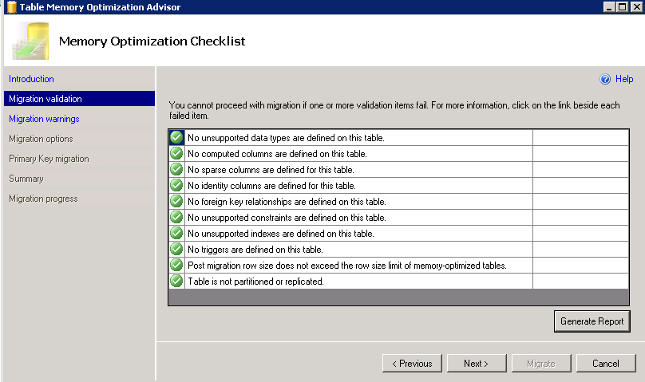
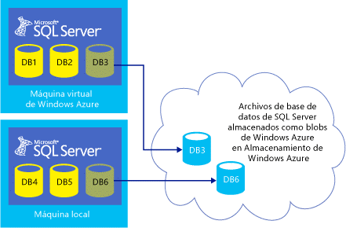

​En este artículo veremos las principales novedades que vienen en la última versión de SQL Server liberada por Microsoft: SQL Server 2014.

**Lo incambiado**

Para sorpresa de los que esperan grandes cambios de versión a versión, SQL Server 2014 no ofrece grandes novedades para Integration Services, Analysis Services, Replicación y la única novedad para Reporting Services es el soporte para navegadores Chrome. Desde mi punto de vista esto se debe a que estamos ante una versión "de salto", donde el gran cambio viene en lo que podemos considerar el core del producto (OLTP) y donde estamos viendo la tendencia hacia entornos cloud y Apps.

**In-Memory OLTP (Hekaton)**

Para gustos los colores dicen, pero este es de lejos uno de los cambios más importantes de esta versión. El motor OLTP en memoria reduce de forma drástica los tiempos de I/O requeridos por las aplicaciones y según información oficial hablamos de hasta una mejora de velocidad de 20x. Otra de las ventajas es que podemos tener en una misma base de datos el modelo hibrido, es decir, tablas en memoria y tablas en disco pudiendo trabajar con ellas al mismo tiempo en una misma consulta, lo que nos permite jugar con los criterios de coste de la velocidad que necesitemos en cada caso. Para ayudar a visualizar la forma en la que podríamos migrar nuestras consultas y procedimientos almacenados contamos con un asistente que validará nuestro modelo actual y nos dará información sobre las características de la migración.

**Azure**

SQL Server 2014 ofrece importantes novedades con respecto a Azure. En primer lugar nos permite integrar modelos AlwaysOn con Azure, lo que implica tener un modelo mixto de recuperación ante desastres que nos permitirá trabajar en grupos de máquinas virtuales Azure ante un fallo de nuestras arquitecturas de datos locales, y para mejor todo gestionado desde del mismo SQL Server Managment Studio. La segunda novedad es que nos permite realizar nuestros backups directamente en Azure de forma automática, cosa que siempre echamos en falta en ese preciso instante en que necesitamos un respaldo. Por último, otra de las novedades es la posibilidad de contar con los ficheros de datos de nuestra base de datos en Azure. Es decir, podemos tener nuestra base de datos corriendo de forma local pero con los ficheros que la soportan almacenados en Azure (en contenedores BLOB). Aunque a simple vista se desprenden las ventajas de este modelo en lo que respecta a migración y alta disponibilidad, debemos tener mucho cuidado con el rendimiento que implica, ya que nuestras transacciones están enviando y recibiendo todos sus datos asociados a través de internet.

**ColumnStore**

Los que trabajamos con modelos datawarehouse nos alegramos cuando se introdujo este concepto en SQL Server 2012 gracias a la gran velocidad que otorgaba para algunas consultas, pero para decepción de algunos nos encontramos con la limitación de que la tabla involucrada en este tipo de consultas debía ser de solo-lectura. Esta versión ha eliminado la limitación, lo que nos permite realizar cambios en la tabla en cuestión sin necesidad de borrar y volver a crear el índice ColumnStore.

**Duración de las Transacciones**

Como todos sabemos, uno de los problemas al utilizar transacciones es la necesidad de "esperar" que la transacción termine para devolver el control a la aplicación y esto implica que debemos esperar a que el LOG termine de registrar la transacción. En SQL Server 2014 tenemos un nuevo tipo de transacción delegada o retrasada, lo que implica que se devuelve el control antes de que la transacción sea registrada en el log y puede ser controlada a nivel de COMMIT, ATOMIC y obviamente a nivel de base de datos. Hay que tener muy en cuenta que modelo utilizar en cada caso, ya que estamos sacrificando seguridad en pro del rendimiento. Con esto quiero decir que hasta ahora debíamos esperar a que las transacciones terminaran para volver a tener el control, lo que nos garantizaba la seguridad en la información que se está leyendo pero nos penalizaba en entornos en los que teníamos un acceso a disco más tardío o cuellos de botella a nivel de log. Con la posibilidad de no esperar por la escritura del log ganamos esta velocidad, pero a cambio debemos estar dispuestos a perdida de información o lectura "sucia".

**Business Intelligence**

Por último no podía dejar este artículo sin mencionar los cambios en esta materia. Aunque las novedades no son específicas de SQL Server 2014, las mejoras de Office 365 y PowerBI implican una gran apuesta por estas tecnologías y en la que el usuario ha ganado gran relevancia en esta edición. En primer lugar PowerPivot ha dejado de ser un add-in y ya forma parte de Excel 2013 lo que nos ofrece un potente motor de tratamiento de información para el usuario final. Power View ha ganado varios tipos de nuevos reportes y el soporte para DAX (Data Analysis Expressions) es una mejora sustancial. Por último dos nuevos actores como PowerQuery y PowerMap no dejan al usuario indiferente. PowerQuery permite al usuario extraer información de toda clase de orígenes de datos no normalizados (Azure, ficheros de texto y XML, oData, Hadoop, etc) e integrarla dentro del modelo de información de forma sencilla e intuitiva sin tener idea de lo que es un modelo de datos o un modelo relacional, con todo lo bueno y lo malo que esto implicaJ. PowerMap es un modelo de visualización 3D geográfico que permite posicionar la información sobre mapas Bing con una presentación realmente espectacular. Todos estos actores pueden combinarse en Office 365 en portales específicos con el objetivo de hacer que esta información esté siempre disponible y en donde se introducen novedades como cuadros de mando interactivos, presentaciones de datos y búsqueda de indicadores entre otras.

Javier Menéndez Pallo
Director Oficina Centro – España y Portugal 
ENCAMINA
[jmenendez@encamina.com](mailto:jmenendez@encamina.com)

 
 
import LayoutNumber from '../../../components/layout-article'
export default LayoutNumber
