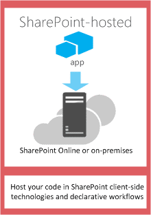
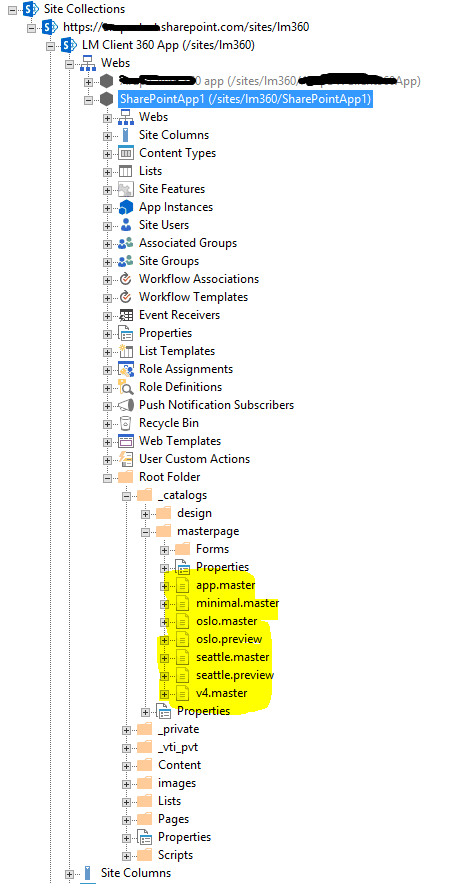
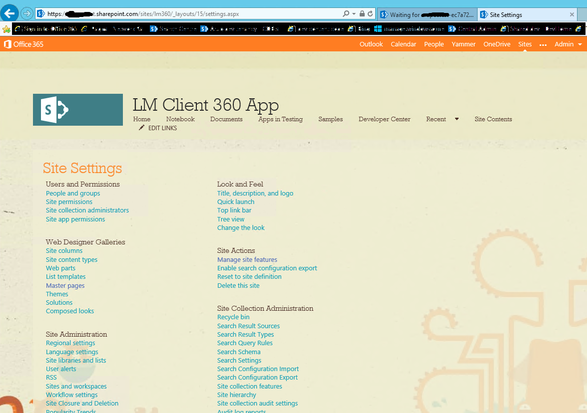
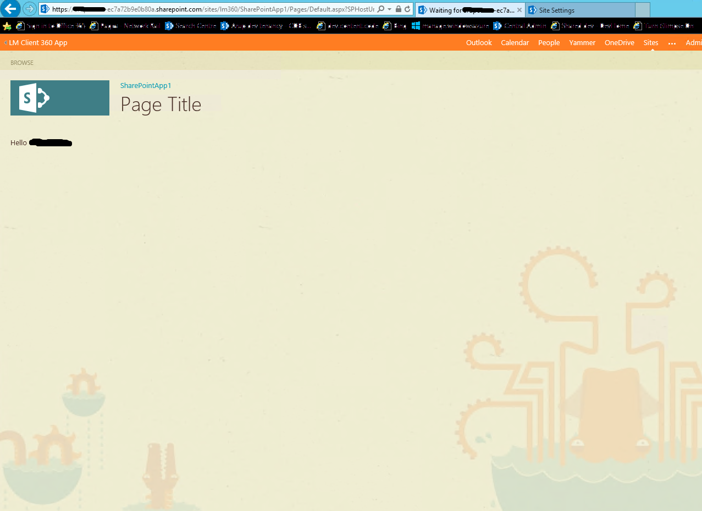
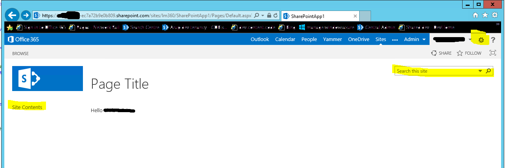
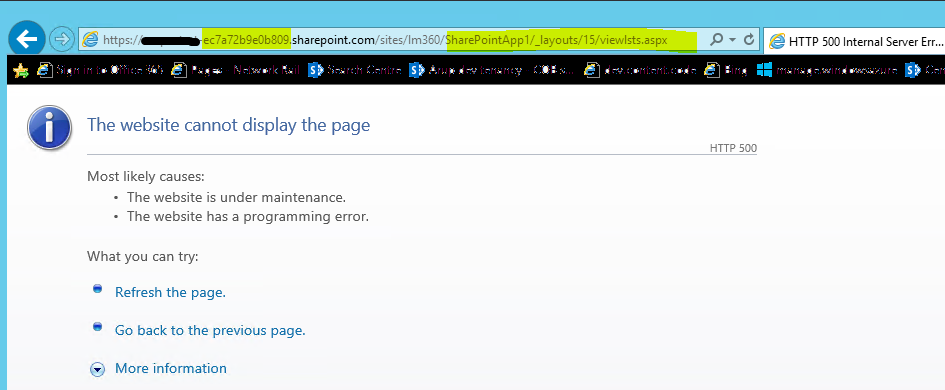
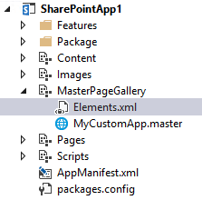
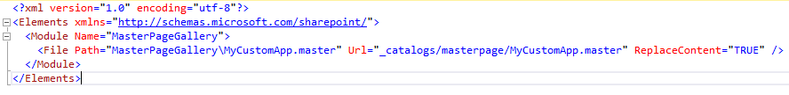

​Desde la llegada de las Aplicaciones de SharePoint y sus tres modelos de hosting posibles: SharePoint-Hosted, Autohosted y Provider Hosted, el modelo de las Aplicaciones SharePoint-Hosted es probablemente uno de los que mejor acogida ha tenido, sobre todo para el desarrollador, gracias a que es mucho más sencillo de desplegar en SharePoint.

Sin embargo, no olvidemos que cualquier App se ejecuta fuera de SharePoint, incluso las SharePoint-Hosted, y esto trae algunos desafíos relacionados con el branding, a la hora de mantener una estética coherente entre el sitio de SharePoint y la App.

Cuando instalamos una Aplicación SharePoint-Hosted, SharePoint provisiona la App en un sitio específico que es creado en el momento en el que se instala la App desde el sitio Host, con una URL característica que seguramente ya todos conocéis:

[http://app-bdf2016ea7dacb.fabrikamapps.com/sites/Marketing/Scheduler](http://app-bdf2016ea7dacb.fabrikamapps.com/sites/Marketing/Scheduler)

*https:// App\_Prefix - App\_ID . App\_Base\_Domain / Domain\_Relative\_URL\_of\_Host\_Web / App\_Name*

Además, SharePoint provisiona la galería de Páginas Maestras, incluyendo algunas de las páginas maestras por defecto de SharePoint, tal y como se puede apreciar en la Imagen 2.

Conviene aclarar que SharePoint provisiona algunas de las páginas maestras que tiene por defecto, y que en ningún caso provisiona las mismas páginas maestras que contiene el sitio de SharePoint donde se instaló la App.

Por defecto, SharePoint establece como página maestra la página "app.master", dicha página está preparada para aplicar algunos de los estilos de SharePoint, así como el Chrome control, que hará posible que el tema seleccionado en el sitio de SharePoint donde se instaló la App. Si observamos la imagen 3, vemos uno de los temas que viene por defecto en SharePoint, aplicado a un sitio, en dicho sitio hemos instalado una Aplicación SharePoint-Hosted, que utiliza la página maestra app.master, y tiene el mismo tema aplicado, como se puede observar en la Imagen 4.

La página maestra aplicada, viene definida en cada página .aspx de la App en el atributo:

MasterPageFile="~masterurl/default.master"

Por defecto hace uso del token "~masterurl/default.master", que se traduce por la URL de la galería de páginas maestras de la App, y la página maestra app.master, pero podemos cambiarlo y apuntar a la página maestra que queramos. Llegado este punto, y viendo las páginas maestras que se provisionan por defecto, podríamos tener la tentación de usar, por ejemplo, la página maestra s*eattle.master*, que nos proporcionaría la navegación, la caja de búsqueda, el acceso al a la página de configuración del sitio, etc. Sin embargo, aunque esto es a priori posible cambiando la página maestra:

MasterPageFile=" ~site/\_catalogs/masterpage/seattle.master"

Pronto nos daremos cuenta de que el resultado no es el esperado, ya que muchas de las redirecciones se intentaran hacer dentro de la App, y por lo tanto no funcionarán. La Imagen 6 muestra el resultado de pulsar sobre el enlace de "Contenidos del sitio" en la zona de navegación de la izquierda.

En algunos casos, puede que no sea suficiente con la app.master, y queramos utilizar nuestra página maestra personalizada, para añadir funcionalidad común a toda la App, como podría ser la navegación de la App. En este caso necesitaremos cambiar la página maestra por una página maestra que estará en la propia App  y para ello, deberemos provisionar nuestra página maestra personalizada en el sitio de SharePoint creado para la App:

- Como sugerencia, recomiendo que se utilice la app.master como punto de partida a la hora de crear nuestra página maestra personalizada, ya que te dará la base para mantener la misma estética y tema que el sitio de SharePoint que hospeda la app. La app.master la puedes encontrar en: *C:\Program Files\Common Files\microsoft shared\Web Server Extensions\15\TEMPLATE\GLOBAL*
- Añadimos un nuevo módulo de SharePoint a la app, dicho modulo contiene nuestra master page personalizada.

- Editamos el archivo Elements.xml y lo configuramos con el siguiente código:

- En las páginas de la App, editamos el atributo que referencia la master para que apunte a la página personalizada

*MasterPageFile=" ~site/\_catalogs/masterpage/MyCustomApp.master"*

De esta forma, cuando se provisione la App, la página maestra estará en la galería de páginas maestras, y las páginas de la App harán uso de ella.

**Luis Mañez**
 MCPD SharePoint 2010 and Microsoft Active Professional
 @luismanez
 [http://geeks.ms/blogs/lmanez](http://geeks.ms/blogs/lmanez)

 
 
import LayoutNumber from '../../../components/layout-article'
export default LayoutNumber
