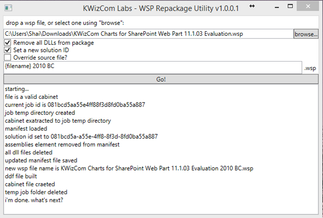

import ArticleHeader from '../../../components/article-header'

<ArticleHeader frontmatter={props.pageContext.frontmatter} />

​We have been struggling with this concept for a while, being an ISV with many customers who use our products on SharePoint 2007/2010 and are interested in upgrading to SharePoint 2013, but using the deferred site collection upgrade approach. You see, in this approach you upgrade to a SharePoint 2013 farm but still run your 2010 sites in SharePoint 2010 user interface, while allowing site owners to gradually upgrade to 2013 interface gradually.

The challenge this poses for us was simple: which version of our solution should a customer install on such a hybrid farm?

A SharePoint 2010 solution will work on the 2010 experience sites, but will not work on those that were already upgraded to 2013 or on new sites created in 2013 experience, while a SharePoint 2013 solution will work on the upgraded sites or new sites, but not on sites still using the 2010 user interface.

Installing both versions seemed to be the solution, but we had a few issues with that approach:

1. Our 2010 and 2013 WSP solutions have the same solution ID, thus cannot be installed on the same farm at the same time.
2. Both 2010 and 2013 WSP packages contain the same DLLs assemblies, and so if we retract one – it will remove the shared DLLs and break the other. So, when upgrade is done and we want to remove the 2010 package it will break the 2013 package.

After working closely with the good people at Microsoft, we ran some tests and came up with the following procedure that would work for us, and possible for everyone in this situation.
 Assuming you have a solution which includes a 2010 version called "MySolution2010.wsp" and a 2013 version called "MySolution2013.wsp":

1. Install the 2013 solution on your 2013 farm (which is supposed to support 2010 backward compatibility sites).
2. Create a new package (called "MySolution2010BC.wsp") that installs only the needed resources and install it on your farm. This package will be used during the deferred site collection upgrade period.
3. Once that period is over and everything was upgraded – remove the "MySolution2010BC.wsp" package.

This approach seems to be working great on our testing, but we still had the 2 issues to deal with (DLLs and solution ID) and I didn't want to burden our R&D with maintaining and producing another package for every product.

So, I am happy to share with you a new codeplex project we've just released for this purpose: "WSP Repackage tool" found here: [https://wsprp.codeplex.com/](https&#58;//wsprp.codeplex.com/)

This tool will take your existing 2010 solution package, and repackage it as a new WSP file with a new solution ID and without the assemblies inside. This new package will be the "2010 BC" package that you can safely install on your SharePoint 2013 farm along with the SharePoint 2013 solution to be able to support both 2013 native sites and upgraded sites that still use 2010 user interface.

If you have thoughts, comments please feel free comment on the discussion in the Codeplex project [https://wsprp.codeplex.com/](https&#58;//wsprp.codeplex.com/).

**Shai Petel**

SharePoint Server MVP

VP R & D MCPD, MCT, MVP

[shai@kwizcom.com](mailto&#58;cherman@eisneris.com)

[Blog](http&#58;//kwizcom.blogspot.com/)

[Twitter](http&#58;//twitter.com/shaibs)

