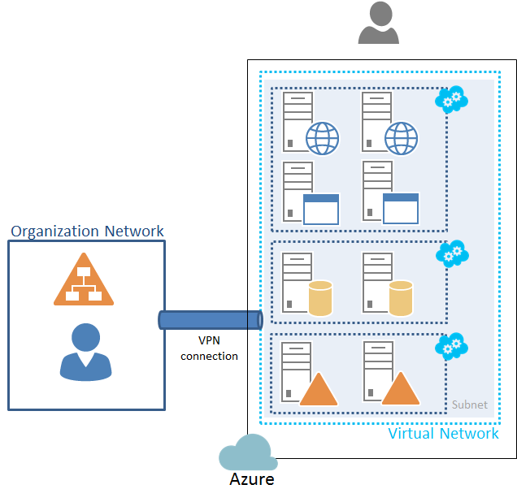

​Bien, bien, bien… como decirlo suavemente: SharePoint 2013 y Azure a priori no se llevan bien.

No obstante con un poquito de atención a los detalles es relativamente fácil montar una granja SharePoint 2013 sobre Azure, siempre desde el enfoque IAAS (Infraestructure As A Service).

Para tener éxito en esta labor, es preciso tener presentes unos ciertos matices que, de momento, son limitaciones de Azure y que si no los tenemos en cuenta en la fase de planificación de la granja, nos pueden dar muchos quebraderos de cabeza.

No es el objetivo, ni mucho menos, de este artículo el explicar cómo configurar correctamente una granja SharePoint 2013 sino más bien, presentar una serie de recomendaciones a la hora de afrontar una instalación de una granja SharePoint 2013 distribuida sobre máquinas virtuales en Azure.

**Las malditas IOPS vs SQL Server**

Al afrontar una instalación de una granja SharePoint 2013 el primer hito es configurar un servidor SQL Server que proporcione un rendimiento adecuado. Los estándares normales de configuración OnPremise, donde la instalación por defecto suele funcionar bien no se aplican.

Es muy importante recordar, y la documentación de Azure se extiende en explicarlo, que cada virtual disk de Azure está limitado a 500 IOPS (Operaciones de Entrada / Salida por Segundo), por lo que es más importante que nunca aprovisionar al servidor de SQL Server con suficientes discos duros para poder distribuir nuestras bases de datos de servicio y contenido en función de su uso.

Esto es:

- Si todas las bases de datos están sobre un mismo virtual disk tenemos 500 IOPS.
- Si las BD de servicio están en un virtual disk y las de contenido en otro, tenemos 1000 IOPS.
- Si tenemos una BD de contenido con un uso intensivo y le damos un virtual disk para ella sola, esa BD tiene 500 IOPS a su disposición.

REPARTE y DISTRIBUYE!, Vale la pena.

Resumiendo, hay que saber evaluar cuantas BD vamos a tener, que uso tendrán y tener dos dedos de frente para distribuirlas en diferentes discos virtuales, teniendo siempre en cuenta que dependiendo del tipo de máquina Azure que hayamos elegido para el Servidor SQL, tendremos la posibilidad de montar más o menos virtual disks.

**SharePoint, el invitado de piedra.**

A SharePoint 2013, realmente, le da igual estar OnPremise que en Azure. La instalación y la configuración es la misma. Como recomendación personal, nunca usaría las plantillas de Azure para el servidor/es de SQL ni para los servidores miembros de la granja SharePoint porque siempre me han ofrecido un rendimiento muy pobre. En su lugar suelo elegir la plantilla de Windows Server 2012 más actualizada y sobre ella instalo la versión de SQL Server 2012 o SharePoint 2013 que me interese. Poco más que añadir salvo ¡Cuidado con la cache!

**¡Con la cache hemos topado!**

Es vital recordar que los servidores que se montan en Azure vienen con el firewall cerradísimo. Aparte de los puertos estándar que se suelen abrir para SharePoint y/o SQL ahí que acordarse de abrir los puertos desde el 22233 al 22236 en todos los servidores SharePoint de la granja, porque seguro que no quieres problemas con el Distributed Cache Service.

**¿Dónde estará mi token? (Singin)**

Si tienes previsto montar varios frontales de una aplicación WEB de SharePoint en un ecosistema Azure,  salvo que sea una aplicación extremadamente simple, olvídate del balanceador de carga de Azure (AKA Traffic Manager). Está reportado que fallan a la hora de transportar el token de sesión en el momento de balanceo.

Quieres montarlo, perfecto, balancea bien, aparentemente… pero espero que no te importe volver a introducir las credenciales si el Traffic Manager decide mover tu sesión a otro frontal… Por lo demás…

Para una aplicación con autenticación, no lo uses. Existen soluciones de terceros que se integran con Azure que solventan este problema, pero el balanceador nativo no es para el tipo de aplicaciones que se suelen desarrollar sobre SharePoint.

**¡SQL HA OA, OMG! (¡Cuantas Siglas!)**

En los tiempos que corren creo que estamos todos de acuerdo que la mejor solución para montar una alta disponibilidad del backend de SQL para SharePoint es Always On, si estamos OnPremise.

¿Tenemos el SQL en Azure? Mal… A día de hoy puedes montar un clúster HA Always On (High Availability con Always On) de SQL en Azure, con la salvedad que no puedes asignarle una IP al servicio del clúster (ya avise de que íbamos mal), pero este hándicap se puede salvar de dos formas que yo conozca, pero ninguna  es buena al 100%

Las soluciones que conozco y propongo son:

- Montas los servidores SQL en un grupo de disponibilidad diferente al de los Servidores de la granja SharePoint y configuras un EndPoint en el grupo de disponibilidad de SQL que redirija al servidor SQL principal y al secundario como failover.

Esta solución parece buena, salvo por el pequeño matiz de que estas ofreciendo el clúster SQL con una IP pública disponible desde todo internet.

- Configuras el clúster AlwaysOn en el mismo grupo de disponibilidad que la granja SharePoint, pero como no le puedes registrar una IP y un nombre como punto de entrada al clúster en Azure tienes que engañar a SharePoint.

El workaround consiste en configurar en SharePoint todas las bases de datos para que usen como Primary Database Server el nodo principal de SQL y como Secondary Database Server el nodo secundario, como si en SQL hubiéramos configurado un Mirror o un LogShipping. En la práctica funciona y realmente la respuesta ante fallos que proporciona el tener un servicio de clúster monitorizando los SQL y poniendo on-line las BD de failover frente a un mirror o un log Shipping vale la pena el esfuerzo.

Esta última solución es la que suelo implementar y la que recomiendo, me parece más segura desde el punto en el que no está accesible desde internet y además es fácil configurar SharePoint modificando la propiedad 'FailOver Database Server' de todas las bases de datos desde un script PowerShell.

**Entonces, ¿me subo a Azure?**

Sí, claro. Azure es una gran solución para desplegar soluciones IAAS multiserver complejas y olvidarte de la gestión de tu CPD. No es la panacea y su arquitectura ofrece retos que los profesionales de IT debemos afrontar y superar, pero las contraprestaciones que ofrece en muchos casos se ven superadas por los costes y esfuerzos de mantener las infraestructuras OnPremise, sumándole que la escalabilidad frente a picos de sobrecarga es muy superior a lo que cualquiera podemos y estamos dispuestos a afrontar en nuestros servidores locales.

En conclusión, Azure es una herramienta más a disposición de los profesionales de IT y conociéndola y midiendo adecuadamente las expectativas, Azure se puede exprimir y obtener grandes resultados; muchas veces superiores a los esperados de las 'más robustas' instalaciones OnPremise, que cuando las analizamos y comparamos con Azure, se ruborizan por sus carencias.

**Luis Emilio López**
 SharePoint IT Manager en Encamina
 [llopez@encamina.com](mailto:llopez@encamina.com) 
[http://www.encamina.com](http://www.encamina.com/)

