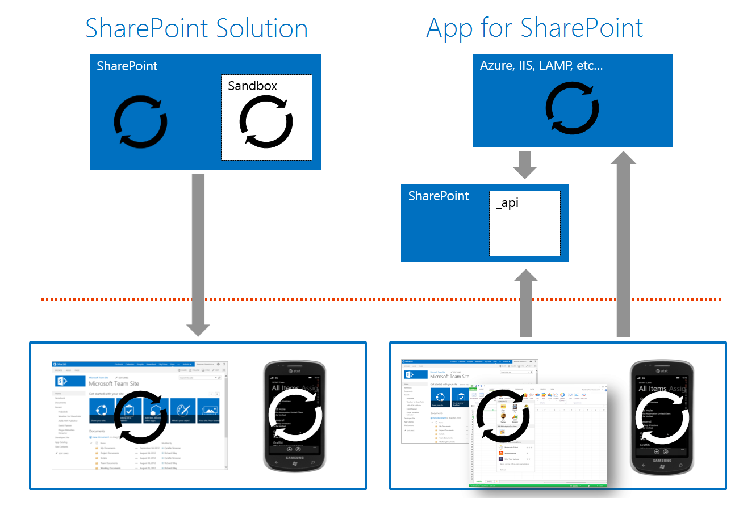

​SharePoint es una plataforma empresarial con diversas funcionalidades como puede ser Gestión Documental, Social Enterprise, Comunidades y sitios, Gestión de Contenido, Búsquedas, Inteligencia de negocio, desarrollo de soluciones, aplicaciones, flujos de trabajo, etc.

Los clientes suelen empezar por implementar su intranet con SharePoint, con sus sitios departamentales y demás, aprovechando las funcionalidades que tiene el producto para cambiar la forma de trabajar de la compañía e introducir el concepto de Colaboración en ella.

Por el camino de todo este proceso, que se puede implementar de una forma sencilla, empiezan a aparecer las necesidades de incluir en los procesos las reglas de negocio de la compañía, que podemos hacerlo mediante flujos de trabajo o extendiendo la plataforma implementando lo que llamamos Soluciones de SharePoint.

Hasta aquí, nuestras herramientas de desarrollo pasan por el navegador y las funcionalidades que SharePoint tiene out-of-the-box para personalizar la plataforma que permiten hacer casi un 70-80% de lo que las empresas necesitan para su Intranet, a tener que implementar flujos de trabajo, metadatos empresariales, tipos de contenido, WebParts con funcionalidades específicas y demás artefactos que SharePoint permite implementar mediante Visual Studio.

Lo normal es que implementemos ese conjunto de funcionalidades extras utilizando una Solución de SharePoint, empaquetada desde Visual Studio, y os pongo un ejemplo:

Un cliente quiere una gestión documental, que sea transversal a toda la compañía, con flujos de trabajo asociados a tipos de documentos específicos y con la automatización de algunos campos de los metadatos de los documentos.

Nos podríamos plantear, casi sin ningún problema, implementar estas funcionalidades con lo que en SharePoint se llama un No-Code Solution que implicaría crear los tipos de contenido (algo similar a un tipo de documento), metadatos y flujos de trabajo con el navegador o con SharePoint Designer. La desventaja de todo esto que es perdemos el foco de que todo desarrollo conlleva cambios y que con este tipo de soluciones no podemos poner los controles adecuados para tener un control de versiones de esos cambios o poder realizar un conjunto de pruebas adecuadas.

Lo habitual es implementar esta necesidad usando Visual Studio de la siguiente forma:

- Una característica de SharePoint que cree las columnas y los tipos de contenido. Hay que tener en cuenta que cuando hayan cambios en las columnas o en los tipos de contenido, hay que realizar las oportunas actualizaciones del esquema de SharePoint.
- Para automatizar los valores de las columnas, JSLink (renderizado en cliente) en las columnas o, lo que me parece la solución más elegante, crear campos personalizados con la lógica de negocio necesaria para el automatismo. Por ejemplo, necesitamos que un campo consulte un servicio web y se rellene con el número de registro que le corresponda, o, necesitamos que un campo se rellena con el valor del campo departamento al que pertenece el usuario.
- Los flujos de trabajo se implementan con Visual Studio, asociados a un tipo de contenido. La idea es que se use donde se use ese tipo de contenido, tenga asociado el proceso de negocio que le corresponda.
- Si necesitamos personalizar las vista de los documentos, podemos incluir JSLink que nos permita controlar desde el lado de cliente como se renderiza la información.

Esto al final se convierte en un paquete de solución de SharePoint o wsp, con el que podemos desplegar para que se creen automáticamente todo este contenido y ponerlo disponible para el usuario. Por su puesto, con un control de versiones y, si fuera necesario, entorno de Pre-Producción, integración continua, etc.

Todo esto respaldado por una API gigantesca con diversos sabores:

- Modelo de Objetos de Servidor, con todas las funcionalidades que SharePoint nos ofrece.
- Modelo de Objetos de Cliente .NET, limitadas las funcionalidades por seguridad.
- Modelo de Objetos de Cliente JavaScript, limitadas las funcionalidades por seguridad.
- API REST/OData, limitadas las funcionalidades por seguridad.
- Modelo de Objetos de Cliente Silverlight y Windows Phone, limitadas las funcionalidades por seguridad.

Esta API nos permite extender la plataforma e incluir lógica de negocio dentro de los procesos que se ejecutan en SharePoint. Pero ¿qué pasa cuando necesitamos almacenar grandes cantidades de filas en una lista o lógica de negocio que conlleva un almacenamiento de la información relacional?

Empezamos con las dudas y la primera es: SharePoint NO es una base de datos relacional aunque se puede simular. Tened claro que el almacenamiento de SharePoint, aunque al final sea SQL Server, no es el que nos permite tener un modelo de datos relacional, como mucho, lo podemos encajar en un tipo de almacenamiento NoSQL.

La siguiente es que las listas y bibliotecas de documentos de SharePoint tienen unos límites que Microsoft no recomiendo sobrepasar. Hablamos de unos 5.000 elementos que se pueden mostrar por vista de lista y unos 50.000 permisos exclusivos en ellas. No hay problema, los usuarios dicen que no van a tener más de 5 registros por mes y que estamos sobrados con esos límites. JA JA JA Los usuarios siempre mienten!

¿Y por qué os cuento esto? En SharePoint 2013 nació un nuevo modelo de desarrollo llamado Aplicaciones de SharePoint, del que he tenido el placer de escribir un libro (http://www.campusmvp.es/catalogo/Product-Todo-sobre-Aplicaciones-para-SharePoint,-Office-y-Office-365\_181.aspx) junto con algunos amigos. Modelo en el que creemos y parece ser el futuro del modelo de desarrollo para SharePoint. Modelo que tenemos que empezar a aprender y aplicar a nuestros desarrollos, en la medida de lo posible.

Microsoft recomienda hacer todo con Aplicaciones si tenemos SharePoint 2013 y pienso que ni tanto ni tampoco. En estos momentos, el modelo de Aplicaciones no permite cumplir con todos los requisitos que los usuarios piden a SharePoint, pero si con muchos que, por suerte o por desgracia, ya estamos usando y están generando quebraderos de cabeza por problemas de rendimiento y mantenibilidad.

Siendo fríos, calculadores y pensando en que este modelo es el futuro, habría que tener en cuenta los siguientes casos para elegir uno u otro:

- En SharePoint Online, prácticamente tenemos que ir al modelo de Aplicaciones. Aunque podemos implementar Soluciones Sandbox o inyectar JavaScript, nos estamos limitando bastante en el ámbito de aplicación de la lógica de negocio y las constantes actualizaciones de Office 365 no ofrecen garantía de poder modificar el DOM con JavaScript y que funcione en nuevas versiones, como ya lo estamos sufriendo. Adicionalmente, no es recomendable desplegar soluciones Sandbox con código ya que Microsoft las considera como "deprecadas".
- Si hablamos de gestión documental que necesita lógica de negocio, para establecer procesos de ECM o soluciones Records Management, esto tiene que ser una Solución si o sí. Entre las bondades de SharePoint se encuentra la gestión documental, los tipos de contenidos, la gestión de registros, y todo lo que tenga que ver con el Enterprise Content Management (http://blogs.encamina.com/negocios-sharepoint/2014/04/14/el-valor-de-una-plataforma-de-gestion-de-contenido-empresarial/). Con el modelo de aplicaciones tendríamos que desarrollar funcionalidades que SharePoint ya tiene y que podemos extender con una Solución de SharePoint bien implementada.
- Para aplicaciones con modelos de datos relacionales o grandes cantidades de filas no pretendas usar listas porque tarde o temprano te saltarás los límites, gana en salud desarrollando una Aplicación.
- Una organización madura en SharePoint empieza a implementar aplicaciones LOB (Line of Business) o soluciones departamentales en la Intranet, y en un 90% deberíamos de elegir una Aplicación pensando en ASP.NET MVC, LightSwitch, Access o PHP. Da igual la tecnología y esa es la clave de las aplicaciones para que todo forme parte de nuestra Intranet. Para el otro 10% solemos desarrollar pequeños WebParts con consultas a datos externos o Business Conectivity Services.

**¿Pero qué pasa con los equipos de desarrollo?**

Buena pregunta porque pienso que los equipos de desarrollo de SharePoint no están preparados para dar el salto al modelo de Aplicaciones. Esto que parece una desventaja, puede ser una gran ventaja y os explico el por qué.

Una Aplicación es, básicamente, una web con cierta funcionalidad implementada a nivel de servidor o cliente, sin importar la tecnología que se use en cada caso. Eso quiere decir, que un desarrollador de SharePoint que lleva desde la versión 2007 implementando WebPart, Features, Event Receiver, Worflows y demás artefactos de SharePoint, no tiene los conocimientos adecuados para el desarrollo con HTML5, JavaScript, ASP.NET MVC, que son tecnologías actuales de desarrollo. Pero si juntamos a estos buenos desarrolladores de SharePoint con buenos desarrolladores de tecnologías actuales, a los que no les tenemos que enseñar SharePoint, conseguimos el equipo ideal.

El modelo de Aplicaciones de SharePoint nos permite abstraer de la plataforma a desarrolladores de Front-End que, por ejemplo, están desarrollando una SPA (Simple Page Application) con AngularJS y, con una buena organización del proyecto, permitir que un buen desarrollador de SharePoint ponga todo su conocimiento en aquellos puntos en los que es necesario integrar la Aplicación con la plataforma.

Con esto no quiero decir que los nuevos desarrolladores de SharePoint no tengan que conocer el producto, en realidad quiero decir que el conocimiento avanzado que es necesario para hacer una buena solución de SharePoint y que se consigue con muchos años de experiencia y dolor con el producto no es tan importante para avanzar en la mayoría del código de la aplicación.

Como toda evolución natural, un desarrollador de SharePoint tendrá que conocer de HTML5, JavaScript o la tecnología que se use para el desarrollo de las aplicaciones, además del conocimiento que se presupone de SharePoint. Vamos, lo que en estos momentos consideramos un Super-Developer. Mientras tanto, tenemos que ser capaces de juntar estos dos perfiles y que cada uno aprenda lo mejor o necesario del otro para caminar por este nuevo camino.

**Alberto Díaz Martin**
 MVP SharePoint
 [adiazcan@hotmail.com](mailto:adiazcan@hotmail.com) 
 @adiazcan
 [http://geeks.ms/blogs/adiazmartin](http://geeks.ms/blogs/adiazmartin)

[http://blogs.encamina.com/negocios-sharepoint/](http://blogs.encamina.com/negocios-sharepoint/)

