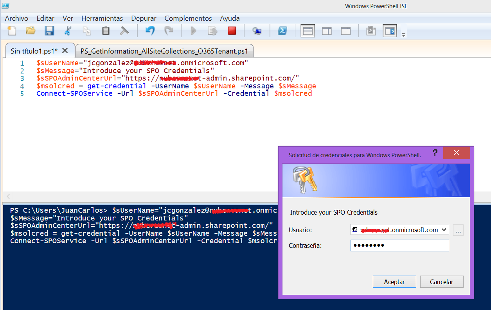
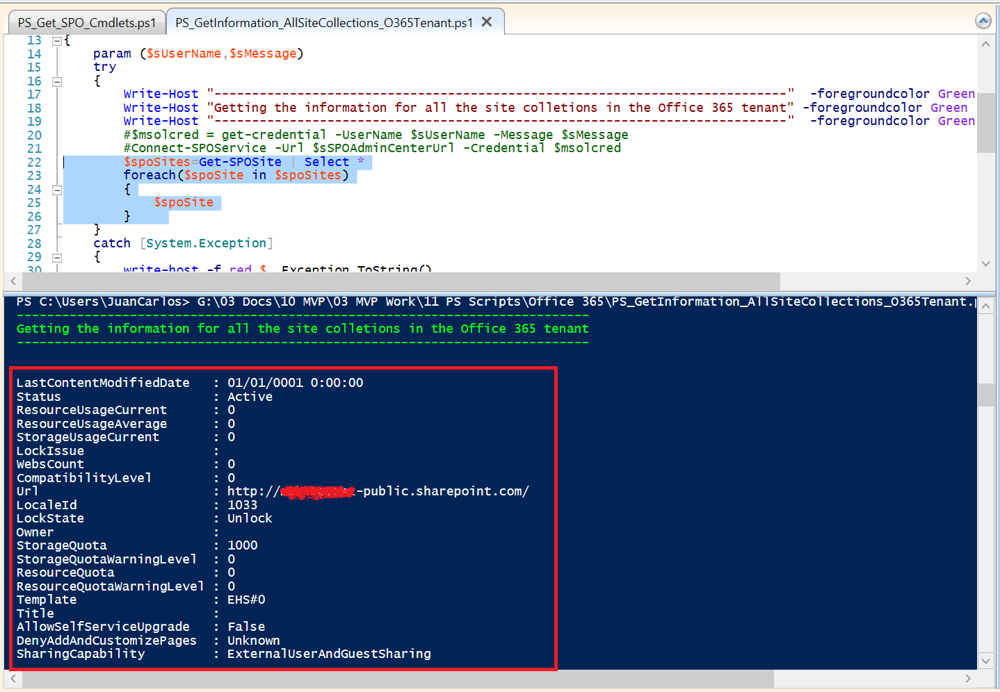
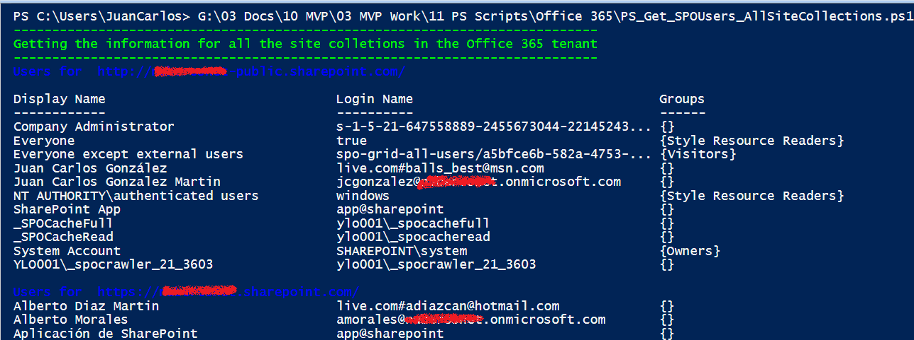
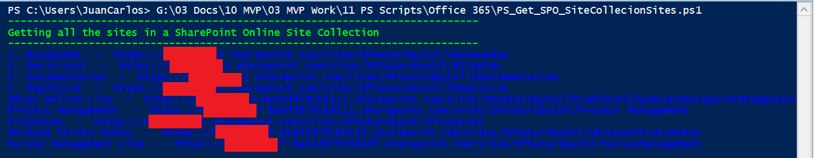

En este artículo veremos algunas de las posibilidades de administración de SharePoint Online a través de la interfaz de línea de comandos y el uso de PowerShell. Como se verá en el artículo, a pesar de las "aparentes" limitaciones que el reducido número de comandos PowerShell disponibles para SharePoint Online supone, estas se pueden superar por medio del uso del modelo de objetos en cliente (CSOM) desde PowerShell.

**Preparando el entorno para administrar SharePoint Online con PowerShell**

Para poder administrar SharePoint Online por medio de PowerShell [necesitamos cumplir una serie de pre-requisitos](http://office.microsoft.com/en-us/sharepoint-help/set-up-the-sharepoint-online-management-shell-environment-HA102919087.aspx?CTT=5&amp;origin=HA102915057) que pasan por:

- Descargar e instalar [Windows Management Framework 3.0](http://office.microsoft.com/en-us/sharepoint-help/redir/XT102919063.aspx?CTT=5&amp;origin=HA102919087).
- Descargar e instalar [SharePoint Online Management Shell](http://office.microsoft.com/en-us/sharepoint-help/redir/XT102919083.aspx?CTT=5&amp;origin=HA102919087).


Una vez que tenemos listo el entorno de Administración de SharePoint Online con PowerShell, el siguiente paso consiste en elegir la herramienta de Administración que se va a utilizar. Las posibilidades son dos:

- El propio SharePoint Online Management Shell, disponible una vez se cumplen los pre-requisitos  necesarios para la administración de SharePoint Online.
- La aplicación ISE (Integrated Shell Script Environment) disponible no solo en las versiones ce servidor de Windows, sino también en las versiones cliente. Esta aplicación proporciona capacidades avanzadas para crear (incluyendo soporte de intellisense, depuración de scripts, etc) y ejecutar scripts PowerShell.


A título particular, os recomiendo utilizar PowerShell ISE. En cualquier caso, elijáis la herramienta que elijáis para poder administrar SharePoint Online tendréis que escribir y ejecutar una secuencia mínima de comandos PowerShell que os permitirán conectaros a un tenant particular de SharePoint Online:

```
$sUserName="<YourOffice365Account>"
```

```
$sMessage="Introduce your SPO Credentials"
```

```
$sSPOAdminCenterUrl="https://<YourDomain>-admin.sharepoint.com/" 
```

```
$msolcred = get-credential -UserName $sUserName -Message $sMessage
```

```
Connect-SPOService -Url $sSPOAdminCenterUrl -Credential $msolcred
```

La ejecución de la secuencia anterior produce como resultado la petición de credenciales de acceso al tenant de SharePoint Online en Office 365:



A partir de aquí, ya estamos listos para poder hacer uso de los comandos PowerShell disponibles para SharePoint Online. Pero antes, os recomiendo obtener un listado rápido de los mismos mediante la siguiente secuencia PowerShell:

```
$spoCmdlets=Get-Command | where {$_.ModuleName -eq "Microsoft.Online.SharePoint.PowerShell"}
```

```
Write-Host "There are " $spoCmdlets.Count " Cmdlets in SharePoint Online"
```

```
$spoCmdlets
```

Si ejecutáis el script anterior, obtendréis que se dispone de un total de 30 comandos PowerShell para SharePoint Online.

**Notas:**

- Os recomiendo revisar este artículo sobre el [uso de Windows PowerShell ISE en Windows 8](http://geeks.ms/blogs/jcgonzalez/archive/2014/03/07/powershell-como-hacer-uso-del-ise-en-windows-8.aspx).
- El número de comandos PowerShell disponible para SharePoint Online puede variar en el tiempo, ya que Microsoft puede añadir nuevos comandos.


**Uso de los comandos PowerShell por defecto para SharePoint Online**

Como se puede deducir del listado de comandos PowerShell disponibles por defecto para SharePoint Online, con los mismos se pueden hacer actividades como por ejemplo:

Listar todas las colecciones de sitios disponibles en un tenant de SharePoint Online y su información detallada:

```
        $spoSites=Get-SPOSite | Select *
```

```
        foreach($spoSite in $spoSites)
```

```
        {
```

```
            $spoSite
```

```
        }
```

La salida correspondiente por pantalla releva el tipo de información que nos proporciona el comando Get-SPOSite para cada colección de sitios:



- Listar todos los usuarios de todas las colecciones de sitios de un tenant de SharePoint Online.


```
        $spoSites=Get-SPOSite | Select *
```

```
        foreach($spoSite in $spoSites)
```

```
        {
```

```
            Write-Host "Users for " $spoSite.Url -foregroundcolor Blue
```

```
            Get-SPOUser -Site $spoSite.Url
```

```
            Write-Host
```

```
        }     
```

En este caso, para cada sitio disponible en el tenant de SharePoint Online se visualiza el nombre para mostrar del usuario, el login de usuario y el grupo de SharePoint al que pertenece:



- O bien crear una nueva colección de sitios en un tenant de SharePoint Online:


```
        $sSiteColTitle="SPO PowerShell Site Col"
```

```
        $sSiteColUrl="https://<Office365Domain>.sharepoint.com/sites/SPOPowerShellSiteC"
```

```
        $sOwner="<Office365UserLogin>@<Office365Domain>.onmicrosoft.com"
```

```
        $sLocaleID=3082
```

```
        $iTemplateID="STS#0"
```

```
        $iStorageQuota=1024
```

```
        New-SPOSite -Title $sSiteColTitle -Url $sSiteColUrl -Owner $sOwner -LocaleId $sLocaleID -Template $iTemplateID -StorageQuota $iStorageQuota 
```

**Uso del modelo de objetos en cliente desde PowerShell**

Más allá de lo que podemos hacer con los comandos PowerShell disponibles por defecto para SharePoint Online, podemos hacer uso del Modelo de Objetos en Cliente lo que incrementa notablemente las posibilidades de administrar y operar SharePoint Online desde la interfaz de línea de comandos. Para poder hacer uso del Modelo de Objetos en Cliente en PowerShell tenemos que seguir las siguientes pautas:

- En primer lugar, necesitamos disponer de los ensamblados del modelo de objetos en cliente que podemos obtener o bien de una instalación de SharePoint 2013 o bien a partir del [SharePoint Online Client Components SDK](http://www.microsoft.com/en-us/download/details.aspx?id=42038) y del [SharePoint Server 2013 Client Components SDK](http://www.microsoft.com/en-ie/download/details.aspx?id=35585).
- Una vez que tenemos disponibles los ensamblados, tenemos que cargar los mismos en el entorno de ejecución de PowerShell utilizando la siguiente secuencia de comandos que hacen uso de Add-Type para agregar un ensamblado a partir de la ruta del mismo:


```
        Add-Type -Path "<CSOM Path>\Microsoft.SharePoint.Client.dll"
```

```
        Add-Type -Path "<CSOM_Path>\Microsoft.SharePoint.Client.Runtime.dll"
```


- A partir de aquí, sólo hay que seguir las reglas conocidas en el uso del Modelo de Objetos en Cliente:


    - Definir en primer lugar un objeto de tipo ClientContext a partir de la Url de una Colección de Sitios de SharePoint Online.
    - Indicar unas credenciales de conexión validas a la Colección en cuestión.
    - Comenzar a realizar operaciones en la Colección teniendo en cuenta que en primer lugar hay que inicializar las operaciones mediante el método Load() de ClientContext para a continuación proceder a ejecutar dicha operación con el método ExecuteQuery().


Por ejemplo, el siguiente script PowerShell muestra como listar todos los sitios bajo una Colección de Sitios en SharePoint Online:

```
$host.Runspace.ThreadOptions = "ReuseThread"
```

```
 
```

```
#Definition of the function that gets all the site collections information in a SharePoint Online tenant
```

```
function Get-SPOSitesInSC
```

```
{
```

```
    param ($sSiteColUrl,$sUsername,$sPassword)
```

```
    try
```

```
    {    
```

```
        Write-Host "----------------------------------------------------------------------------"  -foregroundcolor Green
```

```
        Write-Host "Getting all the sites in a SharePoint Online Site Collection" -foregroundcolor Green
```

```
        Write-Host "----------------------------------------------------------------------------"  -foregroundcolor Green
```

```
     
```

```
        #Adding the Client OM Assemblies        
```

```
        Add-Type -Path "<CSOM Path>\Microsoft.SharePoint.Client.dll"
```

```
        Add-Type -Path "<CSOM_Path>\Microsoft.SharePoint.Client.Runtime.dll"
```

```
 
```

```
        #SPO Client Object Model Context
```

```
        $spoCtx = New-Object Microsoft.SharePoint.Client.ClientContext($sSiteColUrl) 
```

```
        $spoCredentials = New-Object Microsoft.SharePoint.Client.SharePointOnlineCredentials($sUsername, $sPassword)  
```

```
        $spoCtx.Credentials = $spoCredentials 
```

```
 
```

```
        #Root Web Site
```

```
        $spoRootWebSite = $spoCtx.Web
```

```
        #Collecction of Sites under the Root Web Site
```

```
        $spoSites = $spoRootWebSite.Webs
```

```
 
```

```
        #Loading operations        
```

```
        $spoCtx.Load($spoRootWebSite)
```

```
        $spoCtx.Load($spoSites)
```

```
        $spoCtx.ExecuteQuery()
```

```
 
```

```
        #We need to iterate through the $spoSites Object in order to get individual sites information
```

```
        foreach($spoSite in $spoSites){
```

```
            $spoCtx.Load($spoSite)
```

```
            $spoCtx.ExecuteQuery()
```

```
            Write-Host $spoSite.Title " - " $spoSite.Url -ForegroundColor Blue
```

```
        }
```

```
        $spoCtx.Dispose()
```

```
    }
```

```
    catch [System.Exception]
```

```
    {
```

```
        write-host -f red $_.Exception.ToString()   
```

```
    }    
```

```
}
```

```
 
```

```
#Required Parameters
```

```
$sSiteColUrl = "https://<YourSharePointSiteCollectionUrl>" 
```

```
$sUsername = "<YourSPOUser>" 
```

```
#$sPassword = Read-Host -Prompt "Enter your password: " -AsSecureString  
```

```
$sPassword=convertto-securestring "<SPOUserPasswrod>" -asplaintext -force
```

```
 
```

```
Get-SPOSitesInSC -sSiteColUrl $sSiteColUrl -sUsername $sUsername -sPassword $sPassword
```

La salida por pantalla correspondiente es la que se muestra a continuación:



**Conclusiones**

El uso de PowerShell para administrar y trabajar con SharePoint Online es posible no sólo a través de los comandos PowerShell proporcionados por defecto, sino también a partir de las posibilidades del uso del Modelo de Objetos en Cliente desde scripts y funciones PowerShell. De esta forma se habilitan escenarios interesantes en el trabajo con SharePoint Online ya que se pueden automatizar tareas como la creación de contenedores de información (Colecciones de Sitios, Sitios, Listas, Bibliotecas de Documentos), carga masiva de documentación, migración desde SharePoint On-Premise, y finalmente el despliegue de soluciones personalizadas.


**Juan Carlos González Martín**
 MVP de SharePoint Server | Arquitecto de Soluciones en LKS
 [jcgonzalezmartin1978@hotmail.com](mailto:jcgonzalezmartin1978@hotmail.com) | jc.gonzalez@lks.es
 @jcgm1978
 http://geeks.ms/blogs/jcgonzalez

 
 
import LayoutNumber from '../../../components/layout-article'
export default LayoutNumber
