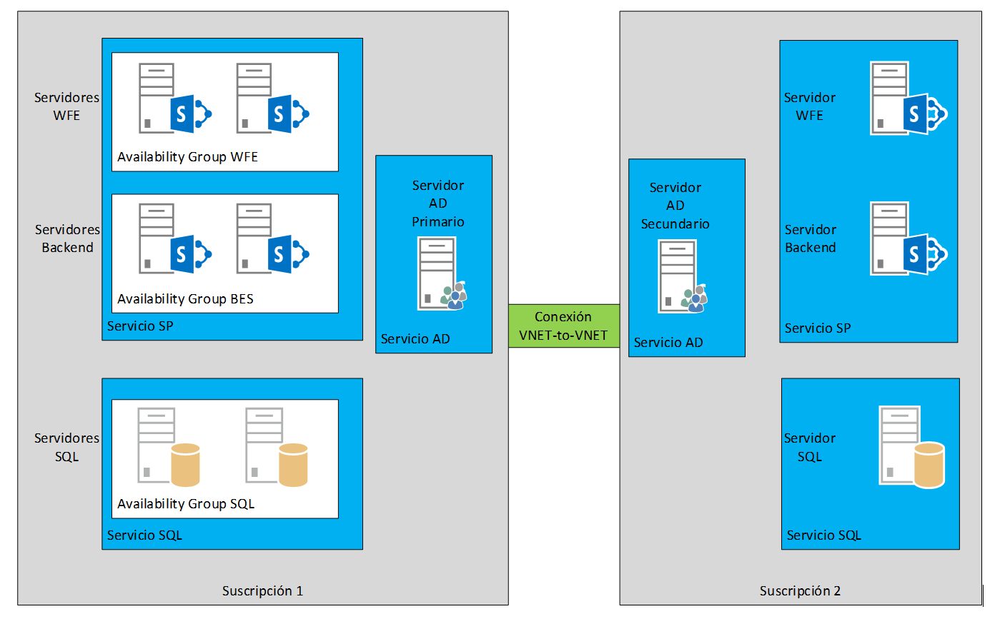
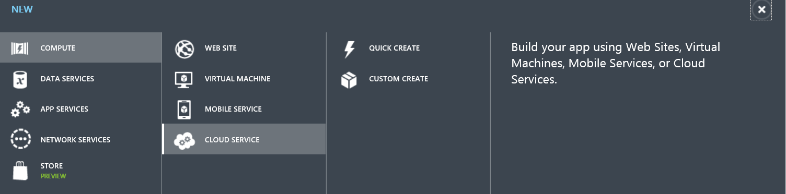
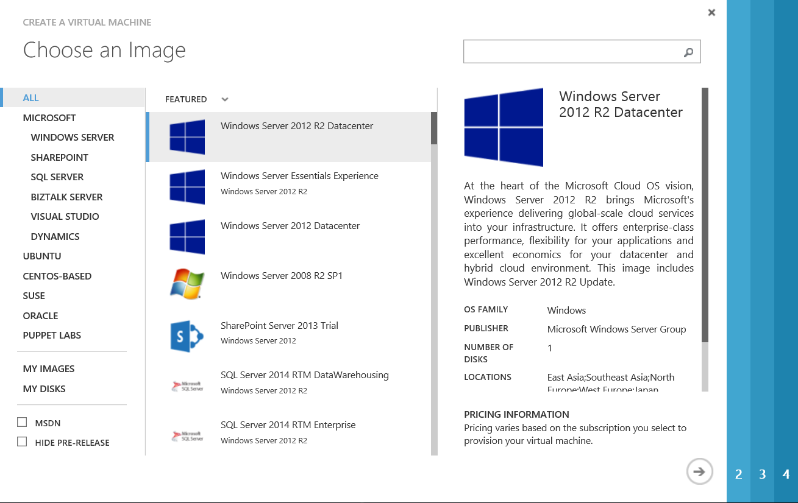
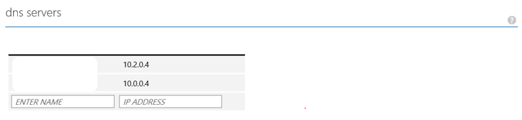
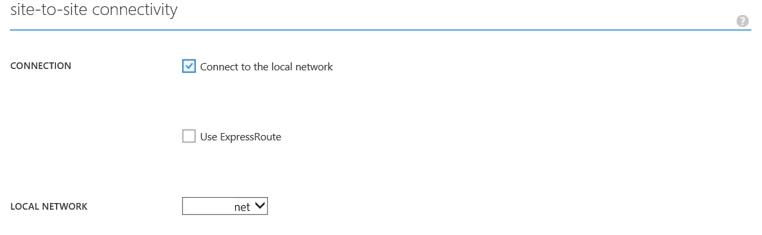
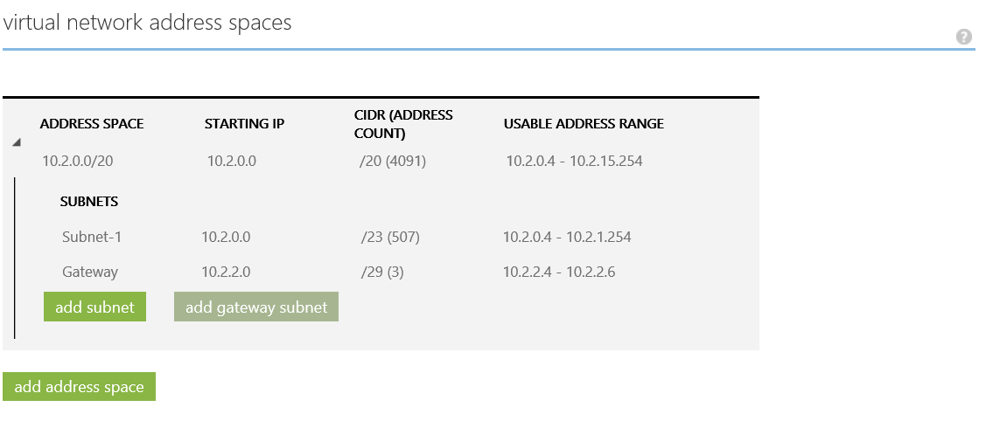
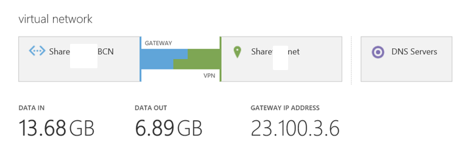

​Azure es una de las grandes apuestas actuales de Microsoft, y de cara al aprovechamiento de los recursos (sobre todo económicos) de una empresa, presenta grandes ventajas ante una arquitectura On-Premise, especialmente respecto a la facilidad que nos brinda a la hora de hacer crecer nuestra arquitectura conforme a los requisitos y/o disponer de más potencia ante picos puntuales. Del mismo modo, esto nos permite el disponer de plataformas "preconfiguradas" como recurso ante caídas de sistemas.

Azure se ha colocado en muy poco tiempo a la altura, si no por encima, del resto de grandes plataformas cloud, en cuanto a funcionalidad, y mantiene un ritmo de actualizaciones que permite visualizar en un futuro muy corto funcionalidades que no están disponibles en ninguna de las actuales, pero al igual que SharePoint en sus inicios es un entorno que requiere de pequeños "trucos" que nos hagan más fácil el utilizar sus recursos. El dar a conocer estos trucos y procedimientos es la idea principal de este artículo en forma de lecciones aprendidas.

Como ejemplo a seguir, vamos a montar una infraestructura en dos suscripciones. La arquitectura será la mostrada en el siguiente diagrama:

En esta arquitectura utilizamos varios de los recursos importantes de Azure:

- Grupos de disponibilidad: Al disponer varios servidores en un mismo grupo de disponibilidad, nos aseguramos que nunca estén sobre el mismo host físico, de manera que ante actualizaciones de la plataforma, nuestros servidores nunca serán rebotados de forma simultánea.
- Conexiones VNET-to-VNET o Point-to-VNET: Estas conexiones nos permiten la conexión entre nuestra suscripción y nuestra arquitectura On-Premise, o bien entre diferentes suscripciones
- Servicios en la nube (Cloud Services): Se considera el Cloud Service como cada una de las capas (tier) de una aplicación multicapa, agrupando los servidores que realizan una función definida (WebRole, WorkerRole. En nuestro ejemplo, SP, SQL y AD).

Por último, para sincronizar nuestras granjas, se establecerá una sincronización a nivel de SQL con Log Shipping para permitir que la granja secundaria actúe como Disaster Recovery. Esta configuración tiene la ventaja a nivel de costes que es posible tener todas las máquinas apagadas (mientras no sea necesario instalar actualizaciones y/o ponerla en servicio) exceptuando el SQL. Para el ejemplo propuesto la granja secundaria esta simplificada, pero en el ejemplo real sería posible montar una estructura gemela a la de la granja primaria. El único coste que tendría esta arquitectura sería a nivel de almacenamiento (Storage) y de tráfico de red a través de la conexión entre suscripciones. En la práctica sería como tener el doble de servidores en nuestra arquitectura a un coste prácticamente idéntico. Como desventaja presenta el hecho de que al instalar actualizaciones/nuevos desarrollos en nuestra arquitectura primaria, también hay que realizar la misma acción en la secundaria, por lo que cobra especial relevancia el uso de un correcto Plan de Gobierno. Esta desventaja puede ser mitigada usando scripts de arranque/parada de la granja secundaria y de despliegue.

**Truco**

Es posible acelerar nuestro despliegue realizando la generación de la red, servicios en la nube, grupos de disponibilidad y máquinas virtuales por medio de scripts PowerShell contra las conexiones de Azure y ejecutándolos (con los cambios pertinentes) contra ambas suscripcioines

**Prerrequisitos:**

- Dos suscripciones a Azure (Suscripcion1 y Suscripcion2).
- Hemos descargado el certificado digital de Azure para poder acceder por PowerShell.
- Comprobar que desde el panel de suscripciones podemos cambiarnos de una a otra sin problemas.
- Dibujar nuestra arquitectura (esto no es imprescindible, pero ayuda).

**Creación del grupo de Afinidad**

Un grupo de afinidad se usa para agrupar todos los servicios en nube juntos, de forma que internamente se distribuyan en hosts cercanos, maximizando el rendimiento. Todo el escenario será generado por tanto dentro de tan solo un servicio de afinidad por subscripción.

Para generar nuestro nuevo grupo, seleccionaremos Settings o configuración, según el idioma seleccionado. Una vez dentro, seleccionar grupos de afinidad (Affinity Groups), y pulsar en +Add. Para cada grupo de afinidad, es necesario dar un nombre específico (en nuestro ejemplo subscripcion1) y seleccionar una región geográfica. A España le corresponde la región Europa Norte.

Esta operación será necesario replicarla en la segunda subscripción.

**Creación del almacenamiento**

Todas las unidades que tengamos dentro de nuestro ejemplo las crearemos dentro de una sola cuenta de almacenamiento, aunque en entornos reales el almacenamiento podemos distribuirlo dentro de diferentes cuentas de almacenamiento. En cada subscripción podemos disponer de hasta 5 cuentas de almacenamiento, y un máximo de 100 Tb en cada una. Conviene tener en cuenta que estos límites son revisados muy a menudo por Microsoft, y en muchos casos no son límites reales. Debido a esto, y si por la casuística de la implementación que estamos creando consideramos necesario ampliar alguno de los límites, la opción más adecuada consiste en ponerse en contacto con los administradores de Microsoft, pulsando en el menú de la subscripción, en la opción "Contact Microsoft Support".

Para crear la cuenta de almacenamiento, seleccionar en el menú lateral la opción Storage o almacenamiento, y pulsar sobre +New en la parte inferior. Aquí, seleccionamos creación rápida, e introducimos:

- URL. Por ejemplo storage1.core.windows.net.
- Localización o Grupo de Afinidad. Seleccionamos el que hemos creado en el paso anterior.
- Tipo de redundancia. Las opciones son:
    - Localmente redundante. Tiene una copia de seguridad en el mismo CPD.
    - Geo redundante. Tiene una copia de seguridad en otro CPD de otra área geográfica.
    - GeoRedundante de lectura.
    - Redundancia de zona: Para nuestro ejemplo seleccionaremos redundancia local. Es conveniente estudiar con cuidado que opción de redundancia seleccionamos, puesto que tiene influencia en la facturación.

De nuevo, como en los pasos anteriores, este paso hay que hacerlo también en la segunda subscripción.

**Creación de la infraestructura de red**

Hay que tener en cuenta que ambas redes (suscripción uno y suscripción dos) no pueden estar en el mismo rango de red, por lo que vamos a crear ambas redes con subsegmentos distintos. Para ello:

- Pulsar sobre el  de la esquina inferior derecha. Seleccionar network services –&gt; Virtual network à Custom create. Darle un nombre (en nuestro caso Suscripcion1) y seleccionar un área geográfica (a España le corresponde North Europe).
- En el siguiente paso, dar un nombre al DNS, a pesar de no haberlo creado aún, y seleccionar la primera IP libre de nuestro rango. Hay que tener en cuenta que Microsoft reserva las tres primeras IPs de nuestro rango, por lo que habrá que seleccionar la 4ª. Por ejemplo, del rango 10.0.x.x, la IP del servidor DNS será la 10.0.0.4.
- Seleccionar el rango de IPs que utilizaremos. Para el ejemplo basta con disponer de 256 direcciones.

Al aceptar, se montará la red. Posteriormente repetir en la suscripción 2, teniendo en cuenta la precaución de cambiar el rango de IPs.

**Importante**

En caso de **NO**asociar la dirección del DNS en este paso, posteriormente nos puede dar problemas para asociarlo a la red.

**Creación de los servicios en nubes (Cloud Services)**

A continuación podemos crear los servicios en nube. Para ello, en cada suscripción, crearemos los tres servicios en nube que hemos dibujado. Para ello, en el menú lateral, seleccionar Cloud Services, y pulsar sobre el menú inferior en +new. El sistema abrirá la ventana para crear un nuevo servicio en nube.

Como siempre, es recomendable seleccionar la creación custom. Pulsar sobre Custom Create, y seleccionar el grupo de afinidad, y la url de acceso. Todas las máquinas que están dentro de un mismo Cloud Services serán accesibles a través de una única URL, por lo que no pueden coexistir aplicaciones web, y se distingue entre ellas por medio del puerto asociado.

**Creación de las máquinas**

En este punto, y para el ejemplo mostrado, se modifican los pasos según el número de máquinas a crear. Para el ejemplo mostrado, debemos crear por subscripción:

Subscripción 1

- 1 máquina A1. Donde alojaremos nuestro AD.
- 6 máquinas A5, donde alojaremos nuestra granja SharePoint y nuestro SQL.

Subscripción 2

- 1 máquina A1 para el AD.
- 3 máquinas A5 para SharePoint y SQL.

La elección del tamaño A5 no es gratuito. Existe una limitación impuesta de 20 cores máximo por subscripción, por lo que el uso de máquinas A4, que en principio parecen más adecuadas para montar una infraestructura SharePoint, con 8 cores \* 6 máquinas + 1 = 49 cores, por lo que no podríamos crearlas todas en esta suscripción, o tendríamos que solicitar el aumento del límite.

Truco

Aunque es posible crear las máquinas ya montadas, es recomendable la creación de máquinas básicas con el SO, y posteriormente realizar la instalación de cada sistema server manualmente, y con la licencia propia. De esta forma no se nos facturará por el uso de las licencias.

Para la creación de cada una de las máquinas, seleccionaremos en la parte inferior +New à Compute à Virtual Machine à From Gallery

En el segundo paso, hay que introducir:

- Release Date: Elegir siempre el último, excepto en casos excepcionales en los que no queramos específicamente un kb de una fecha. Suele haber al menos un par de snapshots.
- Nombre de la máquina virtual.
- Tier o Capa: Tipo de máquina virtual. Las básicas son más baratas pero a cambio tienen limitaciones como que no pueden hacer un escalado automático, lo cual es muy útil en algunas aplicaciones.
- Usuario y Password: Administrador local de la máquina creada. Existen nombres reservados como Administrador o Admin que NO pueden ser utilizados (se sobreentiende que es porque Microsoft los utiliza internamente).

En el tercer paso hay que seleccionar:

- Cloud Service: Hay que elegir uno de los creados anteriormente, aunque ofrece la opción de crear uno nuevo de forma automática.
- Opcional. Nombre de Cloud Service (en caso de no elegir uno de los creados).
- Opcional. Región/Grupo de Afinidad/Red virtual (en caso de no elegir uno de los creados).
- Storage Account: Elegir el que se creó en un paso anterior.
- Conjunto de disponibilidad: es extremadamente importante que, en la primera máquina creada de cada conjunto, lo creemos para evitar que ambas máquinas virtuales recaigan en el mismo host, y de este modo la granja estará disponible incluso en el caso de que el host sea reiniciado para mantenimiento.
- Nombre del Conjunto de disponibilidad: En el caso de seleccionar crear uno es necesario introducirlo.

En el cuarto paso, tan solo es necesario asegurarse que está marcada la opción de instalar el agente, y es posible instalar otros agentes, o antivirus, directamente en la máquina. Aceptar y tras unos minutos estarán nuestras máquinas disponibles.

En este paso es recomendable NO PERSONALIZAR LAS MÁQUINAS. Tan solo es necesario crearlas conforme a nuestro diagrama original. En los siguientes pasos configuraremos cada una de nuestras máquinas.

**Asignación de IPs fijas (Opcional)**

De forma nativa, Azure asigna las IP por un DHCP, de forma que en caso de parar las máquinas, estas vuelve a coger la IP según el orden de arranque. En caso de reinicio las máquinas mantienen su IP, pero si se paran y arrancan de nuevo, pueden coger una IP incorrecta.

Para evitar los errores que pueden surgir a partir de estos cambios, es posible "designar" la IP que debe coger cada máquina, pero en caso de aplicar esta opción, es necesario aplicarla en **todas** las máquinas de cada grupo de afinidad/red virtual. En caso de que al intentar arrancar la IP estuviese cogida, el sistema no podría arrancar la MV.

La reserva de IP privada no es posible realizarlo por medio de la interfaz, por lo que es necesario realizarla por medio de PowerShell, con la siguiente orden:

**Set-AzureStaticVNetIP -VM $staticVM -IPAddress 10.7.115.55 | Update-AzureVM**

**Creación del controlador de AD primario**

Para crear el controlador primario, es necesario acceder a la máquina virtual, e instalar el rol de controlador de dominio. Una vez instalado, promocionar el servidor y configurar el dominio según deseemos.

**Conexión entre las subscripciones**

Esta es la parte más "divertida" de este artículo, y es como crear una conexión entre nuestras dos subscripciones. Recapitulando, tenemos creadas las redes virtuales, los servicios de nube, los conjuntos de disponibilidad, y las máquinas virtuales. Para que ambas granjas puedan ser sincronizadas, y podamos utilizar una como respaldo de la otra, es necesario que ambos controladores pertenezcan al mismo dominio, y por lo tanto tienen que tener conexión directa entre ellos. Para ello, vamos a crear una conexión VNET-to-VNET entre ambas subscripciones.

Antes de comenzar, en la subscripción 2 vamos a registrar el servidor DNS de la subscripción primaria. Esto nos permitirá en el siguiente paso establecer nuestro controlador de AD de la subscripción 2 como controlador secundario del mismo dominio, y por ende nos dará resistencia ante caídas de la granja primaria. Para ello, nos iremos a Redes (Networks), pulsaremos sobre nuestra red creada (recordemos que estamos en la subscripción 2) y pulsaremos configuración (Settings). A media página disponemos de un apartado "Servidores DNS" donde podremos grabar el controlador ya creado en la subscripción 1 (por IP).

Una vez realizado esto, es necesario añadir cada red como red local en la otra subscripción. Para ello:

1. En la parte inferior de la pantalla, pulsar en Nuevo. Seleccionar Servicio de Red (Network Service) y posteriormente Red Virtual (Virtual Network). Seleccionar añadir Red Local.
2. En la siguiente página, introducir el nombre que queramos dar a la nueva red. Para el ejemplo la denominaremos VNET1 y VNET2.
Como Dirección IP para el dispositivo VPN, deberemos utilizar  la IP del Gateway, pero como en este momento aún no hemos creado el Gateway, podemos poner cualquier dirección IP, y posteriormente retornar a esta ventana para asignar la IP correspondiente cuando Azure la genere.
3. En el apartado de especificar el direccionamiento, deberemos poner exactamente el mismo direccionamiento que configuramos originalmente para la red a la que queremos conectar. Esto es, cuando estemos configurando la conexión desde la Suscripción 1, deberemos poner el direccionamiento configurado en la red de la Subscripción 2
4. Repetir los pasos para configurar como red local en la otra subscripción
5. Una vez realizado el paso anterior, podemos ir a la red creada y pulsar en la página de configuración. Bajo el apartado conectividad sitio a sitio (site-to-site connectivity) seleccionar conectar a una red local, y seleccionar la red que configuramos anteriormente (VNET2 en la subscripción 1, VNET1 en la subscripción 2). 
6. En el siguiente apartado, denominado espacios de direcciones de red virtual (virtual network address spaces) pulsar sobre añadir subred de Gateway, y pulsar salvar al final de la página.  
7. Repetir los mismos pasos en la otra subscripción

En este punto, aún no hemos conectado ambas redes, puesto que no hemos establecido el Gateway de conexión. Para ello, desde el nombre del servicio de red, en la portada (Dashboard), deberemos pulsar en la parte inferior, deberemos pulsar sobre la opción Crear puerta de enlace à Puerta de enlace dinámica. Al pulsar, el sistema necesitará un periodo aproximado de unos 15 minutos para terminar de crearlo, y el sistema mostrará un icono de conexión en amarillo. A continuación, es posible repetir la creación de la puerta de enlace en la segunda subscripción. No es necesario esperar a que finalice la creación de una para empezar la creación de la otra.

En algún momento, el panel de control de la red mostrará una IP de la puerta de enlace. Apuntar esta IP puesto que la usaremos posteriormente, indicando claramente a que subscripción pertenece.

Una vez tengamos ambas IPs, deberemos volver a la pantalla de configuración de la dirección IP de la VPN. Para ello, pulsando en el menú lateral networks, pestaña "Redes Locales",  seleccionar la red que creamos como local (VNET2 en la subscripción 2) y añadir la dirección IP **del gateway de la red remota que queremos conectar**. Esto es, las direcciones que cogimos anteriormente tenemos que colocarlas cruzadas (la de Gateway 2 en la subscripción 1 y la del Gateway 1 en la subscripción 2).

Por último, deberemos establecer la misma clave compartida a ambos gateways. Para ello, la forma más fácil es mediante PowerShell. En este ejemplo, lanzamos la configuración para nuestras redes creadas:

**Set-AzureVNetGatewayKey -VNetName VNet2 -LocalNetworkSiteName Subscripcion1 -SharedKey A1b2C3D4**

**Set-AzureVNetGatewayKey -VNetName VNet1 -LocalNetworkSiteName Subscripcion2 -SharedKey A1b2C3D4**

Otra opción es cambiar la clave compartida pulsando en redes, seleccionamos nuestra red (subscripción1) y pulsando en la parte inferior en gestionar clave (Manage Key).

Si todo ha ido bien, el sistema mostrará la conexión entre redes en verde, y empezará a mostrar el traspaso de datos entre ambas subredes.

En caso de que la conexión quede mostrándose en amarillo, es recomendable parar y volver a arrancar todas las máquinas de la granja. Una buena prueba del funcionamiento es intentar hacer ping desde cualquiera de las máquinas de la infraestructura hacia la IP de una de las máquinas de la otra subscripción.

**Creación del controlador de AD Secundario**

Como ahora tenemos conexión entre ambas subscripciones, podemos configurar nuestra máquina controladora de AD de la subscripción 2 como controlador secundario para el dominio que establecimos anteriormente. Para instalar correctamente el controlador secundario, localizado en la subscripción 2, repetimos los pasos realizados para la creación del controlador primario, pero indicando que el servidor será un controlador secundario de dominio, indicando que el servidor primario es el creado en la subscripción 1.

**Creación de las granjas SharePoint**

Cae fuera del alcance de este artículo el indicar como realizar la instalación de una granja SharePoint, puesto que los pasos son los mismos que realizaríamos en una instalación On-Premise, pero queremos dejar dos recomendaciones:

- Utilizar siempre un procedimiento automatizado de instalación, bien mediante scripts PowerShell o bien mediante herramientas como *AutoSPInstaller.*
- Instalar de forma estricta los servicios que se vayan a necesitar, y **siempre** utilizando la política de mínimos privilegios, que nos garantice la seguridad de nuestra granja.

Para profundizar en el diseño e implementación de una granja SharePoint en Azure, yo recomiendo el whitepaper [SharePoint 2013 on Windows Azure Infrastructure Services](http://www.microsoft.com/en-us/download/details.aspx?id=38428)

**Sincronización entre las granjas**

En este punto del ejemplo, nos quedaría sincronizar ambas granjas de forma que, en caso de caída de la granja primaria, podamos levantar la secundaria de una forma ágil para seguir prestando servicio a nuestros usuarios, y especialmente con la menor pérdida de datos posible. Para ello utilizaremos la sincronización por ***Log Shipping*** a nivel de SQL.

Desgraciadamente, el espacio del que disponemos en cada revista es limitado, por lo que esta configuración, y los próximos pasos los ejecutaremos en el siguiente número.

**Próximos pasos**

El escenario propuesto necesitaría de entre una y tres jornadas para montarlo completamente. Una vez establecido y funcionando, los siguientes pasos que se podrían realizar con ella dependen de los objetivos que nos propongamos:

- Podemos establecer un EndPoint público para permitir que la granja sirva un sitio hacia internet, o bien establecer otra conexión vnet-to-vnet para conectarla a nuestra red interna de forma que sirva como intranet.
- Podemos gestionar el tráfico con un traffic manager.

A partir de aquí, ¡¡vuestra imaginación y los requisitos de los usuarios marcan el límite!! Espero que no se os haya hecho muy pesado, y si alguien necesita ayuda adicional, puede contactarme a través de mis perfiles o correo electrónico. ¡¡Gracias a todos los que hayáis aguantado hasta el final!

**Fabián Calvo**
 Team leader
 [fcalvo@encamina.com](mailto:fcalvo@encamina.com) 
 @fcvspain
 [http://www.encamina.com](http://www.encamina.com/)

 
 
import LayoutNumber from '../../../components/layout-article'
export default LayoutNumber
