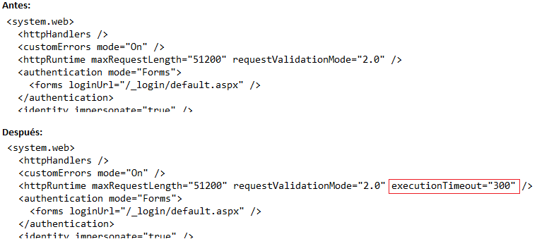
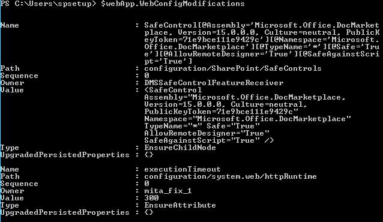
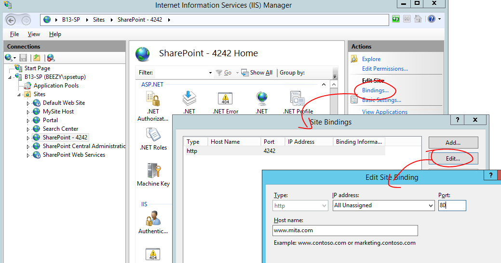
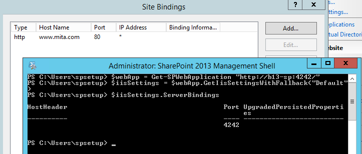
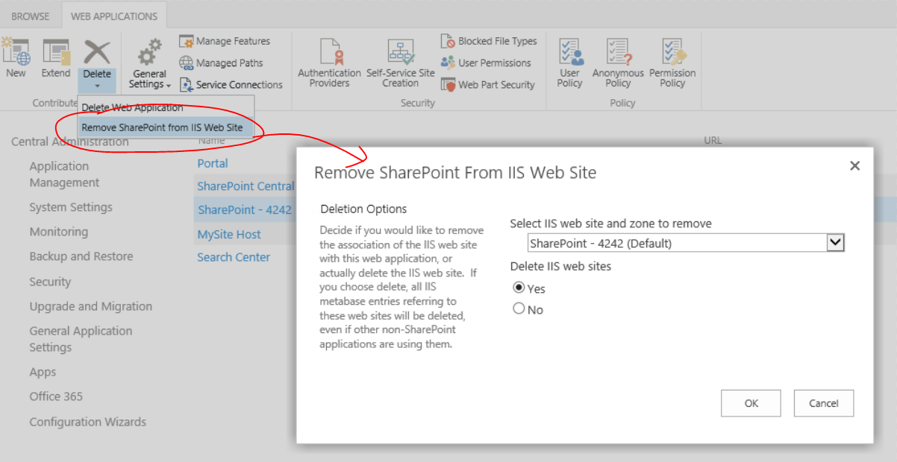
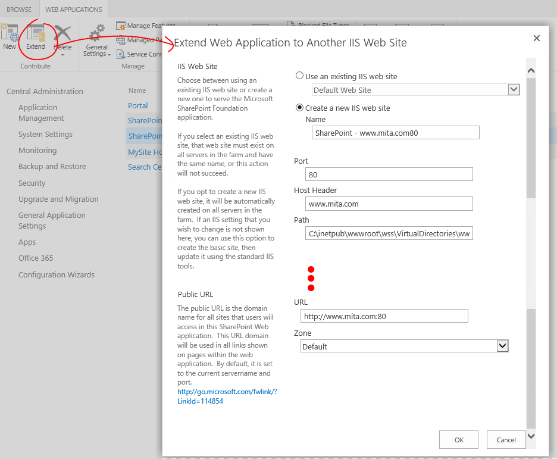
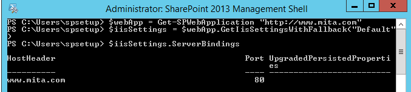
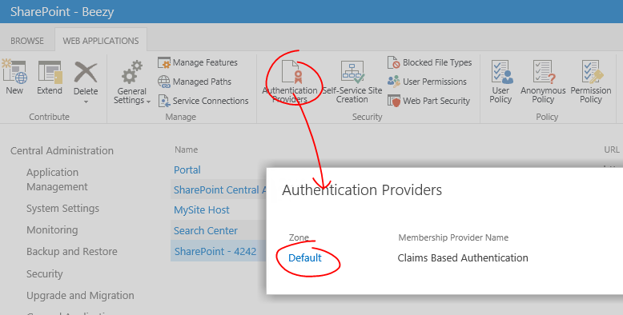

​

SharePoint es un producto fantástico en cuanto a configuración y escalabilidad se refiere. Todas las configuraciones y todas las acciones que realizamos en el entorno mediante la Administración Central se almacenan en sus bases de datos para ser aplicadas en todas las máquinas que forman parte del conjunto o granja de servidores. Por ejemplo, si configuramos el correo, una plantilla de formulario, una cuenta administrada, la ejecución de un job… o un sinfín de opciones más, éstas quedan registradas en las bases de datos de SharePoint y se propagan a todos los servidores de la granja necesarios (los que tengan activados los roles o servicios correspondientes).

Y en el caso de las aplicaciones web, no es necesario crearlas una vez por servidor, ya que se crean de forma centralizada y los cambios se distribuyen a todos los servidores que tienen el servicio de aplicación web activo. Imaginaros un entorno con 10 frontales web… ¡sería una locura tener que crear una aplicación 10 veces!

A la hora de escalar nuestra granja para añadir más servidores, éstos cogen todos estos parámetros de configuración automáticamente según el rol que le hayamos dado al servidor o los servicios que hayamos activado. Y si el servidor es un frontal web, replicará todas las aplicaciones con toda la configuración que le hayamos dado. De esta forma, es rápido y sencillo escalar nuestros entornos.

Para mantener esta homogeneidad y que todo funcione correctamente, Microsoft recomienda que todos nuestros despliegues de personalizaciones se automaticen en paquetes WSP. Estos paquetes se despliegan sobre todos los servidores de la granja necesarios de manera automática. Si añadimos un nuevo servidor a la granja, SharePoint le desplegará también los WSP que necesite sin que sea necesaria nuestra intervención.

Los desarrolladores están cada vez más concienciados en hacer sus despliegues mediante paquetes de solución WSP, ya que son la forma correcta de hacer que todas las personalizaciones, artefactos y código se distribuyan correctamente por todos los servidores. Pero los administradores de IT no lo tienen tan fácil. Hay numerosas operaciones de configuración que puede ser necesario repetir en todas las máquinas de la granja, como editar un web.config, añadir una entrada en el registro de Windows, cambiar algún archivo, etc. Es posible realizar cualquiera de estas acciones de forma manual, pero lo recomendable es intentar automatizarlas para que se desplieguen por toda la granja. De esta forma ahorraremos tiempo evitando repetir una misma acción en varias máquinas y reduciremos el error humano. Además de este despliegue automático, es necesario buscar los mecanismos que hagan que estos cambios se repliquen solos cuando añadamos nuevos servidores a la granja.

En este artículo nos centraremos en diversos mecanismos que nos permitirán configurar el IIS de manera automática, haciendo que los cambios se desplieguen en todas las máquinas necesarias y que se repliquen cuando se añadan nuevos servidores. Modificar parámetros a mano en el IIS no es una buena práctica, existen mecanismos en SharePoint para automatizarlos y almacenarlos en las bases de datos de configuración. Los cambios manuales están sujetos al error humano, ya que podemos cometer errores si tenemos que replicarlos en todas las máquinas. Además, no quedan registrados en ningún lugar. Si no los documentamos bien, podemos olvidar que los hicimos y no se replicarán cuando decidamos añadir nuevos servidores a nuestra granja. A continuación veremos cómo abordar las configuraciones más importantes en el IIS:

**Edición del web.config**

Los cambios en el web.config pueden realizarse usando el objeto SPWebConfigModification, que contiene las propiedades y métodos necesarios para añadir nuevos nodos y editar los existentes.

Cuando modificamos el web.config de una aplicación usando este objeto, los cambios se almacenan en un listado en la base de datos de configuración y se propagan en todos los servidores en los que existe la aplicación. Además, si añadimos servidores nuevos en un futuro, SharePoint les hará estos cambios automáticamente, ya que los tiene almacenados. Otra gran ventaja es que disponemos de operaciones para eliminar los cambios de este listado, lo que propiciará que se eliminen estas modificaciones del web.config en todos los servidores.

Este objeto se encuentra en el namespace Microsoft.SharePoint.Administration y puede usarse desde el modelo de objetos o desde PowerShell. Como el artículo está destinado principalmente a administradores de IT, veremos los ejemplos con PowerShell.

Para ilustrar el uso de este comando haremos un ejemplo práctico. Vamos a añadir un atributo al nodo "httpRuntime" llamado "executionTimeout" con un valor de 300 (Imagen 1).



Primero cargamos el Snap-in con los cmdlet de SharePoint y creamos un objeto SPWebConfigModification. No existe un cmdlet de PowerShell para esta operación, así que hay que crear un nuevo objeto usando el modelo de objetos con el cmdlet New-Object:

```
Add-PSSnapin Microsoft.SharePoint.PowerShell
```

```
$webConfigMod = New-Object Microsoft.SharePoint.Administration.SPWebConfigModification
```

Una vez tenemos creado el objeto, asignaremos las propiedades:

```
$webConfigMod.Path = "configuration/system.web/httpRuntime"
```

```
$webConfigMod.Type = 1
```

```
$webConfigMod.Name = "executionTimeout"
```

```
$webConfigMod.Value = 300
```

```
$webConfigMod.Sequence = 0
```

```
$webConfigMod.Owner = "mita_fix_1"
```

Estas propiedades contienen el cambio que necesitamos. Son las siguientes:

**Path**: Es la ruta XPath al elemento del web.config que queremos modificar. En el ejemplo vamos a modificar un nodo llamado httpRuntime, que está dentro de system.web, que está dentro de configuration. En la Imagen 1 puede visualizarse la ubicación.

**Type**: es el tipo de modificación a realizar. Esta propiedad es del tipo SPWebConfigModificationType y puede tener 3 posibles valores:

- **EnsureChildNode**: Especifica que la modificación del web.config creará un nodo hijo en el nodo especificado en el valor Path. Valor = 0.
- **EnsureAttribute**: Especifica que la modificación del web.config creará un atributo en el nodo especificado en el valor Path. Valor = 1.


- **EnsureSection**: Especifica que la modificación del web.config creará un nodo único. Valor = 2


En este caso, se ha especificado el Type = 1 para crear un nuevo atributo dentro de httpRuntime, tal y como puede verse en la Imagen 1.

**Name**: el nombre de la sección o atributo que queremos crear/modificar. En este caso, queremos crear e atributo de nombre executionTimeout.

**Value**: el valor a darle al atributo que hemos creado. En este caso, queremos darle 300.

**Sequence**: si creamos múltiples modificaciones con SPWebConfigModification sobre un mismo atributo, la propiedad Sequence indica la prioridad, siendo 0 el más prioritario. En este caso sólo hay una modificación, así que hemos dejado el valor 0, que dará preferencia sobre próximas modificaciones.

**Owner**: sirve para identificar quién realizó esta modificación. El valor puede ser arbitrario. Se recomienda dar distintos valores en esta propiedad porque puede ser útil a posteriori para encontrar una modificación para eliminarla. Yo suelo asignar un valor distinto en cada modificación para tenerlas a todas identificadas.

Tras asignar todas las propiedades, debemos obtener la aplicación web con el cmdlet Get-SPWebApplication y añadirle la modificación:

```
$webApp = Get-SPWebApplication "http://b13-sp:4242/"
```

```
$webApp.WebConfigModifications.Add($webConfigMod)
```

A continuación, haremos un Update de la aplicación para que guarde estos cambios:

```
$webApp.Update()
```

Y, por último, debemos decirle al objeto SPWebService (el servicio padre de todos los SPWebApplication) que aplique estos cambios en toda la granja:

```
$webApp.parent.ApplyWebConfigModifications() 
```

De esta forma, veremos cómo los web.config de esta aplicación web se actualizan en todos los servidores de la granja añadiendo este cambio. El script completo sería:

```
Add-PSSnapin Microsoft.SharePoint.PowerShell
```

```
$webConfigMod = New-Object Microsoft.SharePoint.Administration.SPWebConfigModification
```

```
$webConfigMod.Path = "configuration/system.web/httpRuntime"
```

```
$webConfigMod.Name = "executionTimeout"
```

```
$webConfigMod.Value = 300
```

```
$webConfigMod.Sequence = 0
```

```
$webConfigMod.Type = 1
```

```
$webConfigMod.Owner = "mita_fix_1"
```

```
$webApp = Get-SPWebApplication "http://b13-sp:4242/"
```

```
$webApp.WebConfigModifications.Add($webConfigMod)
```

```
$webApp.Update()
```

```
$webApp.parent.ApplyWebConfigModifications() 
```

Como hemos dicho, estos cambios se registran en un listado en la base de datos de configuración para poder replicarse en todos los servidores existentes y futuros de la granja. Podemos consultar el listado llamando a la propiedad WebConfigModifications de la aplicación web:

```
$webApp.WebConfigModifications
```

Lo que nos listará las modificaciones guardadas (Imagen 2).



Si quisiéramos borrar una modificación, debemos buscarla en este listado y eliminarla. Para ello es útil el valor que hemos dado en la propiedad Owner, que permitirá encontrar la modificación que queramos rápidamente. Para eliminar la modificación anterior, buscamos el owner "mita\_fix\_1", lo eliminamos del listado y actualizamos el objeto SPWebService:

```
$modifications = $webApp.WebConfigModifications | ? {$_.Owner -eq "mita_fix_1" }
```

```
foreach ($mod in $modifications) { $webApp.WebConfigModifications.Remove($mod) }
```

```
$webApp.Update()
```

```
$webApp.parent.ApplyWebConfigModifications() 
```

Tras ejecutar esto, la modificación desaparecerá de los web.config de todos los servidores.

**Cambiar/asignar encabezado de host y puerto**

El encabezado de host (host header) de una aplicación y su puerto pueden cambiarse fácilmente desde la consola del IIS. Por ejemplo, tengo una aplicación sin encabezado de host y con puerto 4242 y la quiero cambiar por el encabezado de host [www.mita.com](http://www.mita.com/) y puerto 80 (ver Imagen 3):



Aunque sea un paso sencillo y tentador, no se debe hacer así por tres razones: SharePoint tiene almacenado internamente la configuración de la aplicación web cuando ésta se creó. Si se cambia manualmente estos parámetros, no se replicarán al resto de servidores que tengan esta aplicación web. Además, en determinados escenarios, SharePoint podría sobrescribir estos valores automáticamente. Y por último, cuando se añadan nuevos servidores a la granja, SharePoint creará las aplicaciones con la configuración original que tenía registrada, lo que hará que haya diferencias entre frontales web que debían ser exactamente iguales.

Existe un truco para obtener la configuración de encabezado de host y puerto que SharePoint tiene registrado para una aplicación web, es ejecutar las siguientes líneas de PowerShell:

```
$webApp = Get-SPWebApplication "http://b13-sp:4242/"
```

```
$iisSettings = $webApp.GetIisSettingsWithFallback("Default") 
```

```
$iisSettings.ServerBindings 
```

Si seguimos el ejemplo anterior, aunque haya cambiado el encabezado de host y Puerto manualmente, SharePoint sigue teniendo almacenada internamente la configuración original (Imagen 4):



Como hemos dicho, este cambio no se ha realizado correctamente y podemos tener problemas en el futuro, ya que SharePoint tiene almacenada una configuración distinta a la que hay realmente en el IIS.

Para cambiar estos parámetros y dejar los cambios registrados en SharePoint, debemos des-extender y re-extender la aplicación web. Al des-extender se eliminará la conexión con el sitio web de IIS. Cuando volvamos a extender la aplicación, se creará un nuevo sitio en el IIS con los nuevos parámetros de encabezado de host, puerto y seguridad que especifiquemos. Estos cambios quedarán correctamente registrados en SharePoint.

Si ya tenemos la aplicación extendida para varias zonas, bastará con des-extender de la zona para la que queramos cambiar el encabezado de host y puerto.

Debemos seleccionar la aplicación en la Administración Central, pulsar el desplegable de "Delete" en la cinta y hacer clic en "Remove SharePoint from IIS Web Site". En el cuadro de diálogo, seleccionaremos la zona para la que queramos cambiar el encabezado de host y puerto (en mi caso la zona "Default", la única que tengo) y eliminaremos. Si sólo teníamos contenido de SharePoint, podemos marcar la opción "Yes" para que elimine el sitio físico del IIS, ya que es más limpio crearlo de nuevo al re-extender. Si tenemos alguna personalización (no es recomendable) podemos marcar "No" y luego usaremos ese sitio para crear la aplicación (ver Imagen 5):



A continuación, pulsamos el botón “Extend” y rellenamos los parámetros que queramos de encabezado de host, puerto, seguridad y conexiones para crear la aplicación en la zona para la que habíamos eliminado (en mi caso la Default) (Imagen 6):



Si no habíamos borrado el anterior sitio web del IIS, podemos asignarlo marcando la opción "Use an existing IIS web site". Eso sí, antes hay que cambiarle manualmente el encabezado de host y puerto al sitio desde el panel del IIS.

Una vez hayamos hecho esto, hay que comprobar que se haya actualizado la nueva URL en las asignaciones de acceso alternativas (Administración Central &gt; Administración de Aplicaciones &gt; Configurar Asignaciones de Acceso Alternativas) y si no es el caso, cambiarla por la nueva para la zona que hemos re-extendido.

Tras este cambio, si volvemos a ejecutar las líneas de PowerShell, veremos que el nuevo encabezado de host y el nuevo puerto han quedado registrados en SharePoint (ver Imagen 7). Estos cambios se replicarán en todos los servidores frontal web y también se asignarán en futuros servidores que se añadan a la granja.



Podéis consultar el proceso con más detalle en TechNet:

[http://technet.microsoft.com/en-us/library/cc262366(v=office.15).aspx](http://technet.microsoft.com/en-us/library/cc262366%28v=office.15%29.aspx)

**Cambiar seguridad en la aplicación**

Existen vías alternativas en la Administración Central para cambiar la seguridad de nuestras aplicaciones sin que sea necesario hacer un cambio a mano en el panel de IIS o en el web.config. Las más importantes son:

**Proveedor de autenticación**: podemos cambiar el proveedor de autenticación desde la sección de "Administración de Aplicaciones" de la Administración Central. Marcamos la aplicación deseada y pulsamos el botón "Proveedores de autenticación" en la cinta. Esto despegará los proveedores de autenticación que tengamos en cada zona (cada zona es un sitio de IIS con su web.config). Haciendo clic en uno de ellos, accederemos a la página en la que podremos editar la autenticación y cambiar entre Windows (con autenticación NTLM, Kerberos o básica), FBA u otro proveedor (ver Imagen 8):



Hay que tener en cuenta que la configuración de FBA u otro proveedor distinto a Windows necesitan varias configuraciones adicionales en el web.config de la aplicación. Recordad **no** implementarlas a mano y usar las técnicas vistas en la anterior sección.

**Acceso anónimo**: podemos habilitar el acceso anónimo desde la misma sección a la que hemos accedido para cambiar el proveedor de autenticación. Junto a los distintos tipos de autenticación, veremos una sección para habilitar el acceso anónimo. No hay que configurarlo nunca a mano en el IIS ya que, además de que no se desplegará al resto de servidores, no funcionará correctamente el acceso anónimo.

**Cambio de la cuenta del pool de aplicación**: no se debe cambiar la cuenta de un pool de aplicación (application pool) del IIS de una aplicación SharePoint de forma manual en el panel de administración del IIS. La forma correcta de hacer este cambio es en la Administración Central -&gt; Seguridad -&gt; Configurar Cuentas de Servicio. Aquí podremos seleccionar el pool de la aplicación web o aplicación de servicio que deseemos y cambiar la cuenta que lo ejecuta.

**Conclusiones**

Hemos visto las técnicas más comunes para automatizar cambios en el IIS y evitar la edición manual. En la medida de lo posible, hay que evitar estos cambios manuales, ya que pueden causarnos muchos problemas si se nos olvida implementarlos en algún servidor o si añadimos nuevos servidores a la granja.

Aunque estas sean las recomendaciones, pueden existir cambios que sean más complicados de automatizar. Si se llega a este punto, me gustaría animar al lector a que intente buscar soluciones alternativas a la edición manual jugando con todas las herramientas que ofrece el entorno. Cuantas menos configuraciones manuales tengamos, mucho mejor funcionará nuestra granja. Quiero proponer rápidamente una serie de opciones que conviene investigar para estos casos y como ayuda general para automatizar cambios:

- Podemos forzar cambios en el web.config, en archivos del servidor e incluso en el registro de Windows desde una solución WSP. Incluso se puede hacer un WSP que añada opciones a la Administración Central que nos permitan hacer cambios comunes, llamar a servicios o cmdlets que hagan cambios, o cualquier cosa que se nos ocurra.
- Muchas de las configuraciones que se hacen en el panel de administración de IIS tienen traducción en el web.config, intentad buscar el cambio que se hace en el web.config para propagarlo con el objeto SPWebConfigModifications (como se ha explicado en este artículo).
- SI hay que hacer cambios sobre alguna propiedad del pool de aplicación, quizás puedas usar el objeto SPApplicationPool, que permite cambiar alguna de las propiedades.
- Cuando se desarrolla en ASP.NET, es muy típico almacenar en el web.config nodos del tipo "add key" dentro del nodo "appSettings" para guardar variables (por ejemplo datos de conexión, nombres de usuario, nombres de servidor, enlaces…). En el caso de SharePoint os propongo una solución alternativa más limpia, el uso de property bags ([http://social.technet.microsoft.com/wiki/contents/articles/11126.sharepoint-2010-introduction-to-property-bags.aspx](http://social.technet.microsoft.com/wiki/contents/articles/11126.sharepoint-2010-introduction-to-property-bags.aspx)). Incluso hay proyectos en CodePlex para crearlas desde la Administración Central (pbs2010.codeplex.com).


Espero que el artículo os sirva de ayuda si queréis abordar cambios similares. Usando estas técnicas conseguiremos granjas más limpias y escalables.


**Miguel Tabera**
 MVP de SharePoint Server
 miguel.tabera@outlook.com
 @migueltabera
 [www.sinsharepointnohayparaiso.com](http://www.sinsharepointnohayparaiso.com/)

 
 
import LayoutNumber from '../../../components/layout-article'
export default LayoutNumber
