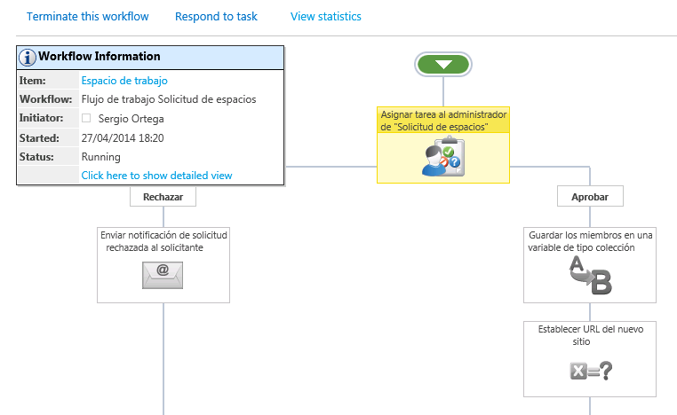

import ArticleHeader from '../../../components/article-header'

<ArticleHeader frontmatter={props.pageContext.frontmatter} />


​Nintex es un conjunto de productos que cubre la gran mayoría de los flujos de trabajo, gestión de procesos de negocio y formas relacionadas con escenarios de SharePoint. Ha simplificado la creación de flujos de trabajo, facilitando la creación a cualquier usuario, con una sencilla interfaz gráfica totalmente integrada en SharePoint que permite crear flujos de trabajo en minutos.

Las principales características de Nintex son las siguientes:

Diseño rápido, fácil y sin código

Nintex proporciona una interfaz muy amigable  y fácil de usar, basta con arrastrar, soltar y configurar las diferentes cajas de acciones. No hay solución de código para los usuarios de negocio, analistas y programadores, lo que hace que Nintex sea totalmente transparente y muy visual. Gracias a esta presentación sencilla y sin código, se puede prescindir del departamento de IT para realizar los flujos de trabajo, con lo que se aumenta la cobertura de personal que puede llegar a realizar y gestionar los flujos.

Acciones definidas por el usuario

Estas acciones conocidas como Nintex UDA (User Defined Actions) proporcionan un método escalable para implementar la lógica de negocio reutilizable a través de sus flujos de trabajo. Esto puede ser útil cuando se reutiliza un proceso de flujo de trabajo a través de múltiples sitios o cuando se crea un complejo conjunto de acciones de flujo de trabajo que los usuarios finales pueden configurar y reutilizar fácilmente.

Gestión del estado en tiempo real

Permite gestionar en cualquier momento el estado del flujo. Se puede visualizar rápidamente en que parte se encuentra parado el flujo, ver las estadísticas de las diferentes acciones y detectar cualquier posible error.

Integración total con SharePoint

El diseñador de Nintex Workflow trabaja directamente en SharePoint y no requiere de una instalación en cliente, esta es una gran victoria, ya que elimina el software de cliente, así como el control de IT y la gestión necesaria para implementar este programa.

Conexión con otros sistemas

Permite crear cuentas de usuario en Active Directory, Exchange Server y Office Communications Server.

Lectura y escritura de datos de Microsoft Dynamics CRM.

Establece el calendario y elementos de tarea en Exchange Server.

Proporciona un fácil acceso a datos y procesos de la línea de negocio y sistemas externos a través de servicios web, SQL, LDAP, XML, BizTalk y middleware comunes y otras interfaces abiertas.

Conexión entre Nintex Workflow y Office 365

Nintex Live extiende Nintex Workflow para conectar SharePoint con Office 365 y un número potencialmente infinito de servicios basados en la nube como Yammer, Twitter, Bing,…

Capacidades móviles

El móvil se ha convertido en un negocio en marcha  y Nintex no se ha quedado atrás en este sector, ya que ahora ofrece la aplicación de Nintex Mobile para sacar más partido de sus procesos comerciales ya que permiten que los usuarios interactúen con estos cuando están fuera de la oficina.

Diseño de formularios

Nintex Forms es un diseñador basado en la web que permite crear formularios en SharePoint de forma rápida y sencilla. Después se pueden emplear dichos formularios en la mayor parte de los dispositivos móviles a través de internet, estés donde estés y en cualquier momento. Nintex Forms se integra a la perfección con Nintex Workflow con el fin de automatizar los procesos comerciales y de proporcionar sofisticadas aplicaciones de SharePoint.

Rápida rentabilidad de la inversión

Nintex es un producto que proporciona una rápida rentabilidad de la inversión, dado que nos permite agilizar la creación de procesos, detectar rápidamente los cuellos de botella y aumentar la eficiencia, esto puede reducir drásticamente los costes.

Constantes de Nintex

Nintex nos proporciona la capacidad de crear constantes y poder gestionarlas a nivel de sitio, colección de sitios o granja. Pueden utilizarse en los flujos de trabajo de una manera muy similar a las variables, con la diferencia de que como su propio nombre indica "son constantes", por lo que tienen un valor definido y se pueden utilizar tanto para guardar unas credenciales, una cadena de conexión, un texto,…

Las constantes nos pueden ser muy útiles a la hora de mover los flujos de trabajo entre entornos diferentes, ya que si las utilizamos no tendremos la necesidad de tener que realizar cambios en el flujo, simplemente cambiaremos el valor de las constantes según nos interese.

**Un caso práctico: Solicitud de espacios**

Para ver todo el escenario de montaje y despliegue de un flujo de trabajo con Nintex, se plantea a modo de ejemplo realizar un flujo de trabajo para solicitar un espacio de trabajo, ocio, proceso o subproceso en SharePoint. Estos espacios pueden ser plantillas de sitio propias de SharePoint o personalizadas. En esta solicitud tendremos en cuenta dos perfiles, uno será el usuario solicitante y otro el usuario administrador encargado de gestionar la aprobación del flujo de trabajo. El usuario solicitante deberá definir los permisos del espacio solicitado indicando los usuarios que tendrán el rol de propietarios y los que tendrán el rol de miembros.

Creación de la lista

En primer lugar hay que crear una lista a la que se le asociará el flujo de trabajo y donde quedarán guardados los diferentes elementos de las solicitudes. Los campos que hemos utilizado en este caso son los siguientes:


Creación del formulario

Una vez creada la lista podemos configurar un formulario de Nintex para la solicitud, clicando sobre el icono de Nintex Forms que nos aparece en la Ribbon de la lista.


Por defecto nos aparece el formulario con la plantilla de Nintex Forms, pero esta plantilla se puede cambiar accediendo a la administración central de SharePoint y en el apartado "Nintex Forms Management" seleccionamos "Manage device layouts". En esta página tenemos la opción de importar la plantilla del formulario en formato XML.  Configurar una plantilla nos aporta mucha agilidad a la hora de crear los diferentes formularios, ya que algunas características como el logotipo o los estilos del formulario se mantienen de forma estática en todos los formularios corporativos. Nintex Forms también nos ofrece la posibilidad de configurar el formulario para diferentes plataformas móviles como iPhone, Ipad, Android, Windows Phone,…

Para realizar la migración de formularios entre diferentes entornos, Nintex Forms nos ofrece una solución muy sencilla gracias a los botones de Importar y Exportar que se encuentran en la Ribbon.


Creación del flujo de trabajo

El siguiente paso será crear el flujo de trabajo asociado a la lista de solicitudes, esto se puede realizar desde la Ribbon de Nintex Form o desde la Ribbon de la lista, clicando en ambas sobre el botón de "Configuración del flujo de trabajo". Ahora empezamos a construir el flujo de trabajo arrastrando, soltando y configurando las diferentes cajas de acciones que necesitemos.

Cuando tengamos el flujo construido podemos configurar desde el apartado "Workflow settings" la manera en que se iniciará (al crearse o modificarse una solicitud, o manualmente desde las opciones del elemento).

El último paso para que empiece a funcionar el flujo es publicarlo, esto se hace desde el botón publicar disponible en la Ribbon.

Al igual que Nintex Forms, para migrar los flujos de trabajo entre entornos se hace fácilmente con los botones de Importar y Exportar.


Flujo de trabajo corriendo

Cuando se realiza una solicitud se puede ver en tiempo real el estado en el que se encuentra el flujo. Nintex nos ofrece una interfaz muy similar a la del diseñador de flujos, pero en este caso no se permite editar, muestra el conjunto de cajas del flujo y muestra de color verde aquellas acciones que ya se hayan completado y en color amarillo la acción en la que se encuentre actualmente. Las cajas de color gris representan las acciones que aún no se han ejecutado. Es una manera muy visual de ver rápidamente en qué punto se encuentra el flujo y detectar cualquier tipo de error. Desde esta página el administrador puede terminar el flujo de trabajo, responder a la tarea y ver las estadísticas del flujo.



Webparts de Nintex Workflow

Nintex nos ofrece dos Web Parts muy útiles para el escenario de solicitudes que hemos puesto de ejemplo, una muestra las tareas que un usuario tiene asignadas y la otra muestra las solicitudes que ha realizado el usuario.

Flujos de trabajo de sitio

A parte de poder crear un flujo de trabajo asociado a una lista, Nintex nos permite crear un flujo de trabajo a nivel de sitio. Los flujos de sitio se pueden programar en el tiempo para que se ejecuten diariamente, semanalmente,… Esto puede ser muy útil por ejemplo si queremos recopilar las estadísticas de un sitio de SharePoint y guardarlas en base de datos, además permite configurar un formulario de inicio, y se podría utilizar para enviar una notificación por correo a los usuarios.

**Despliegue automático de flujos de trabajo y constantes**

Cuando estamos ante un proyecto en el cual se desarrollan una gran cantidad de procesos diferentes, a la hora de mover nuestros flujos de trabajo de entornos de desarrollo a entornos de producción nos encontramos con un coste significativo si dicha tarea la tenemos que realizar manualmente importando y exportando los flujos. Por esta razón es una buena práctica añadir el despliegue de los flujos a nuestra solución de Visual Studio.

Publicar un flujo de trabajo

Para realizar el despliegue del flujo de trabajo sobre una lista de SharePoint, lo que haremos será llamar al método que publica el flujo en la activación de la característica a nivel de sitio.

En primer lugar se tiene que añadir la referencia a la dll de Nintex Workflow y una referencia web al web service de Nintex con la dirección: "\_vti\_bin/nintexworkflow/workflow.asmx", a esta referencia web la hemos llamado "WorkflowWS".

Una vez añadidas las referencias este sería el código necesario para la publicación del flujo:

using Nintex.Workflow;

```
//RUTA DONDE SE ENCUENTRA EL FLUJO DE TRABAJO
```

```
private const string filewfname = "NWSolicitudEspacios\\Espacios.nwf";
```

```
//NOMBRE DE LA LISTA DONDE SE VA A PUBLICAR EL FLUJO DE TRABAJO
```

```
private const string listname = "Solicitud de espacios";
```

```
//NOMBRE DEL FLUJO DE TRABAJO
```

```
private const string wfname = "Flujo de trabajo Solicitud de espacios";
```

```
//DIRECCIÓN DEL WEB SERVICE DE NINTEX WORKFLOW
```

```
private const string WFServiceUrl = "_vti_bin/nintexworkflow/workflow.asmx";
```

```
 
```

```
public override void FeatureActivated(SPFeatureReceiverProperties properties)
```

```
{
```

```
             PublishNWF(properties, filewfname, listname, wfname);
```

```
       }
```

```
public static void PublishNWF(SPFeatureReceiverProperties properties, string filewfname, string listname, string wfname)
```

```
        {
```

```
            try
```

```
            {
```

```
                SPWeb web = (SPWeb)properties.Feature.Parent;
```

```
               
```

```
                byte[] nwfFile = GetWorkflowNWF(properties, filewfname);
```

```
                //CONSTRUCCIÓN DE LA URL DEL WEB SERVICE DE NINTEX A PARTIR DEL SITIO DONDE SE ACTIVE LA CARACTERÍSTICA
```

```
                string webServiceUrl = web.Url;
```

```
                if (!webServiceUrl.EndsWith("/"))
```

```
                    webServiceUrl += "/";
```

```
                webServiceUrl += WFServiceUrl;
```

```
                SPSecurity.RunWithElevatedPrivileges(delegate()
```

```
                {
```

```
 
```

```
                    //DECLARACIÓN DEL WEB SERVICE DE NINTEX
```

```
                    WorkflowWS.NintexWorkflowWS service = new WorkflowWS.NintexWorkflowWS();
```

```
                    service.Url = webServiceUrl;
```

```
                    service.UseDefaultCredentials = true;
```

```
                    //LLAMADA AL MÉTODO DE PUBLICAR WORKFLOW
```

```
                    service.PublishFromNWF(nwfFile, listname, wfname, true);
```

```
                });
```

```
            }
```

```
     catch (Exception ex)
```

```
            {
```

```
                throw ex;
```

```
            }
```

```
private static byte[] GetWorkflowNWF(SPFeatureReceiverProperties properties, string filewfname)
```

```
        {
```

```
            using (Stream nwfFile = properties.Definition.GetFile(filewfname))
```

```
            {
```

```
                byte[] buffer = new byte[1024];
```

```
                using (MemoryStream memoryStream = new MemoryStream())
```

```
                {
```

```
                    int read;
```

```
                    while ((read = nwfFile.Read(buffer, 0, buffer.Length)) > 0)
```

```
                    {
```

```
                        memoryStream.Write(buffer, 0, read);
```

```
                    }
```

```
 
```

```
                    return memoryStream.ToArray();
```

```
                }
```

```
            }
```

```
        }
```

Además de publicar el flujo de trabajo, el SDK de Nintex nos permite realizar muchas otras acciones como eliminar un flujo de trabajo o publicar y programar un flujo de trabajo a nivel de sitio.

Publicar una constante

Al igual que con la publicación del flujo de trabajo, se tienen que añadir las referencias de Nintex Workflow a nuestro proyecto. En esta ocasión llamaremos al método de creación de constantes en la activación de la característica a nivel de Site Collection.

En el ejemplo se muestra como crear una constante de tipo String y otra de tipo Credencial:

```
private void CreateSiteCollectionWorkflowConstants(SPSite site)
```

```
        {
```

```
             //DECLARACIÓN DE LAS CREDENCIALES
```

```
            var cred = new CredentialValue(Constantes.WorkflowConstants.admuser, Constantes.WorkflowConstants.admpwd);
```

```
     if (cred == null) return;
```

```
            var serializer = new XmlSerializer(typeof(CredentialValue));
```

```
            var sb = new StringBuilder();
```

```
            using (var sw = new StringWriter(sb))
```

```
            {
```

```
                serializer.Serialize(sw, cred);
```

```
            }
```

```
            var valueCred = sb.ToString();
```

```
 
```

```
             //LLAMADA AL MÉTODO PARA CREAR LAS CREDENCIALES
```

```
             //WorkflowConstant(string title, string description, CredentialValue value, bool sensitive, Guid siteId, Guid webId, WorkflowConstant.WorkflowConstantType type, bool adminOnly)
```

```
            var credConstante = new WorkflowConstant ("AdminCred", "Administrador de la colección de sitios de SharePoint", valueCred, true, site.ID, Guid.Empty, WorkflowConstant.WorkflowConstantType.Credential, false);
```

```
 
```

```
//LLAMADA AL MÉTODO UPDATE PARA PUBLICAR LAS CREDENCIALES
```

```
credConstante.Update();
```

```
 
```

```
             //LLAMADA AL MÉTODO PARA CREAR LA CONSTANTE DE TIPO STRING
```

```
// WorkflowConstant(string title, string description, string value, bool sensitive, Guid siteId, Guid webId, WorkflowConstant.WorkflowConstantType type, bool adminOnly)
```

```
            var stringConstante = new WorkflowConstant ("Variable String", "Variable de ejemplo de tipo String", Constantes.WorkflowConstants.variableString, false, site.ID, Guid.Empty, WorkflowConstant.WorkflowConstantType.String, false);
```

```
 
```

```
//LLAMADA AL MÉTODO UPDATE PARA PUBLICAR LA CONSTANTE DE TIPO STRING
```

```
     stringConstante.Update();
```

```
 }
```

**Conclusión**

NINTEX, como suite de soluciones de trabajo, resulta una herramienta extremadamente útil para nuestro entorno SharePoint, mejorando la productividad en diferentes aspectos.

Como último punto, nos planteamos la idoneidad del producto en las diferentes casuísticas que podemos encontrarlo. Dentro de todas las soluciones, NINTEX Workflows, podemos situarlo en la siguiente escala:


Resulta sorprendente como una solución de Workflows bajo SharePoint Designer prácticamente se descarta cuando hablamos del soporte a procesos críticos de negocio, tanto por las actividades disponibles como las capacidades de gobiernos del proceso. De la misma forma, para procesos simples y de baja criticidad, una suite BPM completa de mercado como AgilePoint, por ejemplo, resultaría bastante más pesada que en el caso de SharePoint Designer.

Finalmente, NINTEX, por ser un producto ligero y hospedado bajo SharePoint, nos ofrece una cobertura muy interesante para el proyecto de criticidad media, con todos los monitores y capacidades que el producto ofrece, descritas a lo largo del presente artículo.


**Sergio Ortega**
SharePoint Consultant at The Birchman Group
[sergio.ortegamartin@birchmangroup.com](mailto&#58;sergio.ortegamartin@birchmangroup.com) 
[ttp://birchman4sharepoint.wordpress.com](http&#58;//birchman4sharepoint.wordpress.com/)

