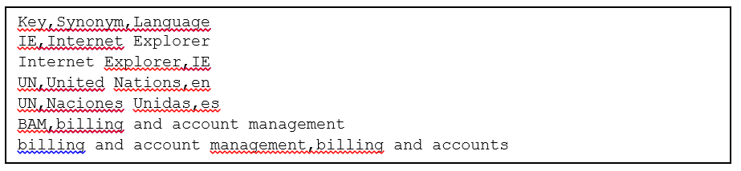
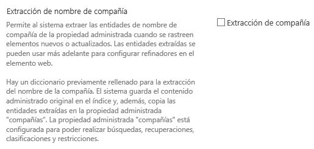
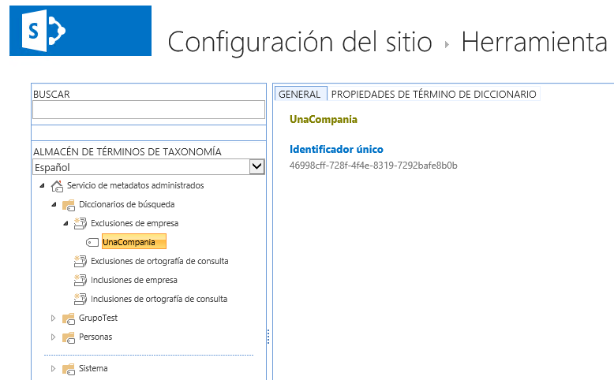
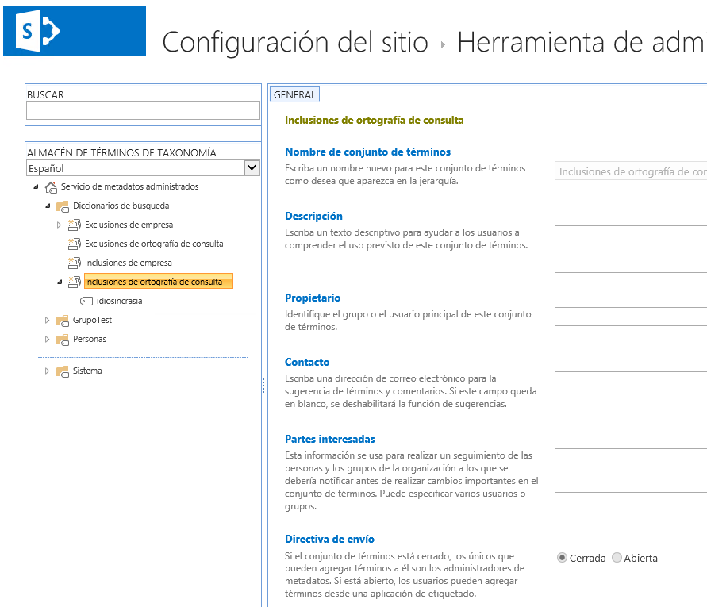
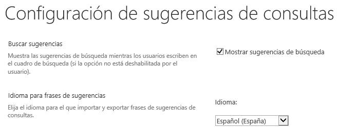
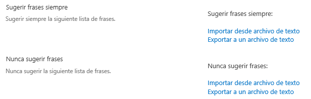
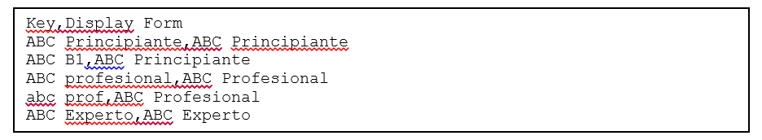
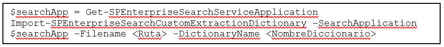

​Este artículo es la continuación de "Ajuste de la Relevancia en el Motor de Búsqueda de SharePoint 2013" publicado en CompartiMOSS No. 20 (http://www.compartimoss.com/revistas/numero-20/ajuste-de-la-relevancia-en-el-motor-de-busqueda-de-sharepoint-2013).

Aunque estrictamente hablando, los diccionarios no permiten modificar la relevancia en el Motor de Búsqueda de SharePoint 2013, si es posible mejorar la experiencia de uso de las búsquedas influyendo indirectamente en la relevancia. Por ejemplo, definiendo diccionarios de sinónimos se puede lograr que los resultados se ajusten mejor a lo esperado.

Un Diccionario personalizado (Custom Dictionary) es un archivo o configuración creado por un Administrador de SharePoint para especificar palabras que el interpretador de un determinado idioma  en el Motor de Búsqueda debe tratar como indivisibles al momento de indexación y consulta. En general, los Diccionarios del Motor de Búsqueda de SharePoint no son creados por defecto cuando se instala el servidor, y deben ser establecidos para cada lenguaje en el que se necesite que la Búsqueda se comporte de forma particular.

SharePoint 2013 utiliza diferentes diccionarios para ajustar los resultados de una consulta, convirtiéndose de hecho en una forma para modificar la relevancia de los resultados producidos por el Motor de Búsqueda. En SharePoint 2013 se pueden utilizar diccionarios para Sinónimos, Extracción de Nombres de Compañías, Correcciones de Ortografía, Sugerencias y Extractores de Entidades personalizados.

**Diccionario de Sinónimos**

Por medio de la utilización de Diccionarios de Sinónimos, un Administrador puede especificar palabras o frases que se pueden utilizar en lugar de las que utiliza el usuario en la consulta. Un Sinónimo se puede utilizar comúnmente para expandir acrónimos (siglas que se pronuncian como una palabra, y que por el uso acaba por incorporarse al léxico habitual), pero también se pueden usar para incluir automáticamente variaciones de un término de búsqueda utilizado por la terminología específica de una organización.

El diccionario de Sinónimos permite realizar dos labores:

- Reemplazo de palabras o frases: Se pueden designar una o más palabras o frases que reemplazan una palabra o frase particular. Por ejemplo, si el término "USA" aparece en una búsqueda, el sistema puede buscar también por resultados que incluyan "Estados Unidos". Para realizar esto, es necesario insertar un "Grupo de Reemplazo"(Replacement set) en el archivo de Sinónimos.
- Sinónimos para palabras o frases: Un administrador puede especificar palabras o frases que tengan el mismo significado de una palabra o frase utilizada como término de búsqueda. Por ejemplo, se puede definir que "casa" y "hogar" son sinónimos el uno del otro. Por lo tanto, una consulta que utilice cualquiera de los dos, devolverá resultados que contienen ambos. Sinónimos se realizan insertando "Grupos de Expansión" (Expansion set) en el diccionario.

Un Diccionario de sinónimos es un archivo separado por comas (.csv) que define los términos y sus sinónimos correspondientes. Opcionalmente es posible definir a que lenguaje aplica el sinónimo. Para definir más de un sinónimo para un término es necesario crear entradas múltiples en el Diccionario. También, si un sinónimo debe funcionar en ambas direcciones; por ejemplo, si "hogar" también debe devolver resultados que se refieren a "casa", es necesario crear dos entradas en el Diccionario.

Todos los caracteres de Unicode se pueden utilizar como términos para sinónimos, lo mismo que subrayado ("\_"), guiones ("-") y apostrofes porque ellos son tratados como caracteres. No es posible utilizar caracteres que no sean Unicode como "#" y "/". El mapeo entre llaves de entrada en el Diccionario y términos de búsqueda no es sensible a mayúsculas/minúsculas.

El archivo .csv tiene que tener columnas definidas para "Key", "Synonym" y "Language" (en inglés) y ser separado por comas. Si el archivo contiene caracteres que estén en la tabla ASCII limitada, tales como diacríticas, deben ser codificados como UTF-8. Las columnas a utilizar son:

- "Key": Contiene el termino (una o varias palabras) que originan el sinónimo. No debe haber espacios al principio o al final del término en todas las columnas.
- "Synonym": Es el sinónimo (una o varias palabras) que el motor de búsqueda debe utilizar para entregar sus resultados.
- "Language" (opcional): Indica la abreviación utilizada para indicar el lenguaje al que aplica el sinónimo. Si la columna está vacía, se aplica a todos los idiomas.

Cree el archivo con un editor de texto ASCII (Notepad) en un sitio local en un front-end de la granja de SharePoint. Un ejemplo de archivo de Diccionario de sinónimos se indica en la Imagen 1.

No es posible exportar el Diccionario de sinónimos utilizado por SharePoint 2013. Si es necesario hacer cambios en el, es necesario utilizar el Diccionario original, modificarlo y desplegarlo de nuevo, por lo que es indispensable guardar el diccionario utilizado originalmente. Un administrador de SharePoint puede desplegar el diccionario utilizando el siguiente cmdlet desde una aplicación de consola de PowerShell para SharePoint:

"&lt;Ruta&gt;" indica la ruta completa hacia el archivo .csv del Diccionario.

**Extracción de Nombres de Compañías**

El sistema de búsqueda de SharePoint puede extraer nombres de compañías desde el contenido indexado. Por ejemplo, si el nombre de una compañía se encuentra en un documento y el sistema ha sido configurado para Extracción de Nombres de Compañías, el nombre es mapeado en la Propiedad Manejada llamada "companies". Esta propiedad se puede utilizar para crear refinadores basados en nombres de compañías en la WebPart de refinadores de la página de resultados.

SharePoint dispone de un Diccionario prefabricado por Microsoft que incluye un número muy grande de compañías en el mundo. Es posible agregar nombres adicionales para que sean extraídos o prevenir que algunos nombres lo hagan utilizando listas de Inclusión y Exclusión de Compañías (Company Inclusion y Company Exclusion).

El Motor de Búsqueda puede extraer nombres de compañías si se cumplen las siguientes condiciones:

La configuración "Extracción de nombre de compañía" debe estar chequeada en las Propiedades Manejadas del Motor de Búsqueda (no lo está por defecto). Los Nombres de compañías se extraen del contenido completo con el que la Propiedad está asociada, inclusive si el contenido las tiene marcadas con la etiqueta de "&lt;no index&gt;". La propiedad mostrada en la Imagen 3 se puede encontrar a nivel de Administración Central de SharePoint - Administración de Búsquedas - Esquema de búsqueda - abra la Propiedad administrada llamada "companies", o a nivel de Administración de cada Colección de Sitios - Esquema (sección de "Buscar")

- El nombre de la compañía tiene que existir en el Diccionario original proporcionado por Microsoft, o en la lista de Inclusiones de Compañías.
- Se debe ejecutar un rastreo completo de la información.

El Diccionario con nombres de compañías Incluidas y Excluidas se maneja desde el Servicio de Metadatos Administrados de SharePoint 2013. La lista de compañías incluida originalmente no se puede exportar ni modificar de ninguna manera. La configuración la debe realizar un Administrador de SharePoint que tenga suficientes derechos en el Servicio de Metadatos Manejados. Desde la Administración Central, abra la ventana de administración del Servicio de Metadatos Administrados y en el Grupo "Diccionarios de búsqueda" incluya y/o excluya los nombres necesarios en forma de Términos, como muestra la Imagen 4.

**Corrección de ortografía en consultas**

Si un usuario utiliza una consulta que aparentemente tiene algún error de escritura, la página de resultados puede incluir correcciones ("Se refiere a?"). Por ejemplo, si se utiliza el término "idiosincracia", el sistema puede sugerir como corrección "idiosincrasia". El Motor de Búsqueda crea correcciones automáticamente para una consulta cuando los usuarios han hecho clic una o más veces sobre el resultado generado para una consulta por lo menos seis veces. Las correcciones son generadas diariamente para cada Fuente de Resultados y para cada Colección de Sitios, por lo tanto, pueden ser diferentes para cada una de ellas.

El Diccionario que configura la Inclusión y Exclusión de correcciones se almacena también en el Servicio de Metadatos Administrados. La configuración debe ser realizada por un Administrador con suficientes derechos en el Servicio. Desde el Grupo "Diccionarios de búsqueda", utilice "Inclusiones de ortografía de consulta" y "Exclusiones de ortografía de consulta". Los Términos utilizados dependen también del idioma seleccionado en el Servicio; note que la "Directiva de envío" está cerrada por defecto y no se puede cambiar.

Para términos en la lista de "Exclusiones de ortografía de consulta" nunca se mostraran correcciones. Aunque las listas en el Servicio de Metadatos se pueden modificar, las correcciones generadas automáticamente por el sistema ni se pueden exportar ni se pueden modificar. Cuando se incluye algún término, puede demorar hasta 10 minutos para que las correcciones comiencen a funcionar.

**Sugerencias de consultas**

Las Sugerencias de consultas son frases que el sistema de búsqueda utiliza para guiar al usuario cuando comienza a escribir una consulta. Estas sugerencias pueden ser desactivadas y modificadas en SharePoint 2013. Las Sugerencias ayudan a los usuarios a encontrar información rápidamente mostrándole consultas que han sido realizadas anteriormente. Por ejemplo, cuando el usuario escribe "ventas", puede escoger entre varias consultas anteriores que han realizado otros usuarios relacionadas con "ventas".

El Motor de Búsqueda crea las Sugerencias automáticamente para una consulta cuando otros usuarios han hecho clic sobre uno o más resultados por lo menos por seis veces. Las Sugerencias son generadas diariamente para cada Origen de Resultados y cada Colección de Sitios, por lo que las Sugerencias generadas pueden ser diferentes en cada parte de SharePoint.

La Sugerencias están activadas por defecto en SharePoint, pero se pueden desactivar desde la Administración Central -  Administración de búsquedas - Sugerencias de consulta (incluyendo el idioma que se prefiere para las sugerencias):

Se pueden configurar dos tipos de Sugerencias: "Sugerir frases siempre" y "Nunca sugerir frases", que, como sus nombres indican, permiten agregar frases que siempre o nunca se van a mostrar. Las frases configuradas se aplican a todos los Orígenes de Datos y todas las Colecciones de Sitios de forma unificada.

La configuración se basa en uno o más archivos de textos que contienen las frases, y que luego se podrán importar en SharePoint. Es necesario tener un archivo separado para las frases que se sugieren siempre y otro para las que nunca se sugieren. También es necesario tener un archivo separado para cada idioma utilizado. El lenguaje determina la forma en que las Sugerencias son procesadas por el Motor de Búsqueda internamente, pero todas las Sugerencias son siempre mostradas o contenidas para todos los lenguajes cuando el usuario entra la consulta. Cada frase se debe crear en una línea separada en el archivo de texto y guardada utilizando codificación UTF-8. Los archivos se pueden importar en el Motor de Búsqueda desde la Administración Central - Administración de búsquedas - Sugerencias de consulta.

Cuando se importa un archivo con frases de Sugerencias, se sobrescriben todas las Sugerencias ya existentes, pero no las que se han creado automáticamente, que persisten en el sistema. Para editar las Sugerencias existentes, se puede exportar el archivo, modificarlo, y subirlo de nuevo a SharePoint.

Un Administrador de SharePoint puede utilizar también el cmdlet de PowerShell para SharePoint "Import-SPEnterpriseSearchPopularQueries" ([http://technet.microsoft.com/en-us/library/jj219665.aspx](http://technet.microsoft.com/en-us/library/jj219665.aspx)) para realizar la misma configuración que con la Interfaz de Usuario, aunque el cmdlet permite algo más de control, pudiéndose especificar por ejemplo a que Origen de Contenido y Colección de Sitio se debe aplicar el archivo de Sugerencias.

Con PowerShell también se pueden agregar frases una por una. El cmdlet "New-SPEnterpriseSearchLanguageResourcePhrase" ([http://technet.microsoft.com/en-us/library/ff608062.aspx](http://technet.microsoft.com/en-us/library/ff608062.aspx)) permite añadir una frase al tiempo. Adicionalmente, el cmdlet tiene un parámetro "QuerySuggestionSubstitution" que se puede utilizar para el mapeo de términos. Por ejemplo, si la frase es "automóvil" es posible agregar un mapeo a "carro o automóvil", de tal forma que la frase "carro" se mostrara como una Sugerencia, pero cuando el usuario selecciona esta Sugerencia, la consulta final será "carro o automóvil".

**Extractores de Entidades Personalizados**

Para utilizar entidades personalizadas (palabras o frases) como refinadores de búsqueda, es necesario crear primero un Diccionario de Entidades de Extracción Personalizadas y desplegarlo. De esta forma, se puede crear una Propiedad Administrada para utilizar las Entidades Personalizadas y ejecutar un rastreo completo. Cuando el rastreo termina, la WebPart de navegadores en la página de resultados se puede configurar para utilizar las Entidades Personalizadas como refinador.

A los archivos de Entidades de Extracción Personalizadas se les da mantenimiento fuera de SharePoint, y cuando están listos, se importan en el sistema para hacerlos disponibles para el Motor de Búsqueda. Hay diferentes tipos de Diccionarios que se pueden crear: Word, Word Part, Word Exact o Word Part Exact, como la siguiente tabla (extraída de MSDN) indica:

| **Custom entity extractor / custom entity extractor dictionary** | **Description** | **Example** | **Dictionary name to use in Windows PowerShell** | **Managed property that will contain the extracted entity** |
| --- | --- | --- | --- | --- |
| **Word Extraction** | Case-insensitive, dictionary entries matching tokenized content, maximum 5 dictionaries. | The entry "anchor" matches "anchor" and "Anchor," but not "anchorage" | Microsoft.UserDictionaries.EntityExtraction.Custom.Word.n    [where n = 1,2,3,4 or 5] | WordCustomRefiner1  WordCustomRefiner2  WordCustomRefiner3  WordCustomRefiner4  WordCustomRefiner5 |
| **Word Part Extraction** | Case-insensitive, dictionary entries matching un-tokenized content, maximum 5 dictionaries. | The entry "anchor" matches "anchor," "Anchor" and "anchorage" | Microsoft.UserDictionaries.EntityExtraction.Custom.WordPart.n    [where n = 1,2,3,4 or 5] | WordPartCustomRefiner1  WordPartCustomRefiner2  WordPartCustomRefiner3  WordPartCustomRefiner4  WordPartCustomRefiner5 |
| **Word Exact Extraction** | Case-sensitive, dictionary entries matching tokenized content, maximum 1 dictionary. | The entry "anchor" matches "anchor," but not "Anchor" or "Anchorage" | Microsoft.UserDictionaries.EntityExtraction.Custom.ExactWord.1 | WordExactCustomRefiner |
| **Word Part Exact Extraction** | Case-sensitive, dictionary entries matching un-tokenized content, maximum 1 dictionary. | The entry "anchor" matches "anchor" and "anchorage," but not "Anchor" | Microsoft.UserDictionaries.EntityExtraction.Custom.ExactWordPart.1 | WordPartExactCustomRefiner |

**Tabla 1.- Extractores de Entidades Personalizados para el Motor de Búsqueda de SharePoint 2013.**

Para crear un Extractor de Entidades es necesario crear un archivo .csv que contenga las columnas "Key" y "Display Form". Asegúrese de utilizar comas como el separador de las columnas. Si el archivo contiene caracteres que no sean ASCII tales como diacríticas, tienen que ser codificados como UTF-8. Guarde el archivo en uno de los servidores de Front-end de la granja de SharePoint. Las columnas a utilizar deben ser:

- Columna "Key" - Contiene el termino (una o varias palabras) a ser incluidas como Entidades Personalizadas. Se puede utilizar más de una llave por línea. Asegúrese de no dejar espacios en blanco antes o después de la llave
- Columna "Display Form" (Opcional) - Contiene el nombre del refinador de búsqueda. Si la columna no tiene contenido, el término extraído se mostrara como el refinador en la misma forma en la que aparece en el contenido original. La columna de Display Form permite controlar y estandarizara la forma en que los refinadores se muestran en la Interfaz

Como ejemplo, una organización llamada "ABC" tiene un sistema de certificación con tres niveles: ABC Principiante, ABC Profesional y ABC Experto. La empresa necesita extraer estas Entidades de tal forma que puedan ser utilizadas como refinadores en la página de resultados de búsqueda. Sin importar si las palabras aparecen en minúsculas o mayúsculas en el contenido original, los refinadores se deben mostrar tal y como la empresa los ha especificado. Para este ejemplo, el archivo del Diccionario de Extracción de Entidades sería similar al siguiente:

Un Administrador del Motor de Búsqueda de SharePoint puede utilizar PowerShell para SharePoint para ejecutar el siguiente comando e instalar el archivo de Extracción de Entidades:

En donde:

- &lt;Ruta&gt; especifica la ruta completa al archivo .csv conteniendo el Diccionario a ser importado.
- &lt;NombreDiccionario&gt; es el nombre del tipo de Diccionario de Extracción tal como indica la Tabla 1.

**Límites de los Diccionarios**

Para garantizar el uso óptimo de la memoria de los servidores de la granja de SharePoint, la eficiencia del proceso de búsqueda y rapidez de los resultados, no se deben sobrepasar los siguientes límites en los Diccionarios del Motor de Búsqueda de SharePoint:

| **Limite** | **Valor Máximo** | **Tipo de Limite** | **Notas** |
| --- | --- | --- | --- |
| **Número de entradas de sinónimos** | 1 millón | Soportado | Exceder este límite puede resultar en uso incremental de memoria y subidas en el tiempo de respuesta.  |
| **Número de entradas en un Diccionario de Extracción de Entidades** | 1 millón | Soportado | Exceder este límite puede resultar en uso incremental de memoria y subidas en el tiempo de respuesta. |
| **Número de entradas en un Diccionario de búsqueda (Metadatos Administrados)** | 5,000 términos por tenant | Limite fijo | Límite del número de términos permitidos para Diccionarios de inclusiones y exclusión para la corrección de ortografía y Extracción de Nombres de Compañías. Es posible utilizar más términos que este número en el Servicio de Metadatos Administrados, pero el sistema de búsqueda puede utilizar solamente  5000 términos por tenant. |

**Tabla 2.- Límites de los diccionarios de búsqueda.**

**Conclusión**

Los Diccionarios del Motor de Búsqueda permiten adaptar los resultados de las consultas de forma fácil y rápida. Existen varios tipos de Diccionarios que se pueden utilizar en SharePoint 2013, incluyendo Sugerencias de consulta y Sinónimos. Los Diccionarios consisten en archivos que se pueden subir al sistema por medio de PowerShell, y Diccionarios predefinidos en el Servicio de Metadatos Administrados.

**Gustavo Velez**
 MVP de SharePoint Server
 [gustavo@](mailto:gustavo@gavd.net)gavd.net 
 [http://www.gavd.net](http://www.gavd.net/)

