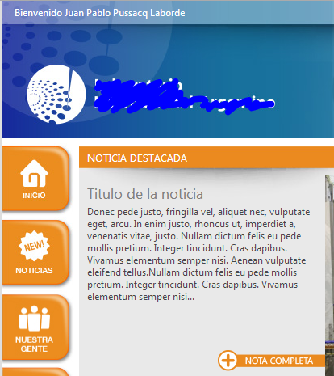
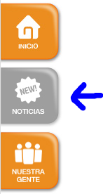
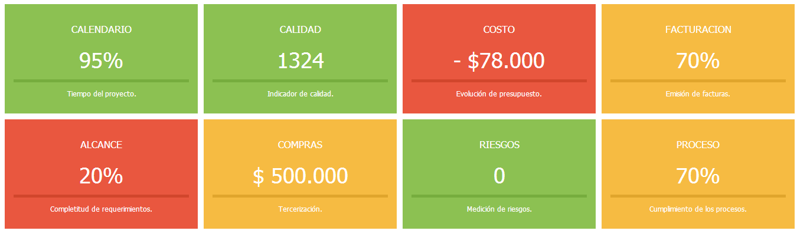
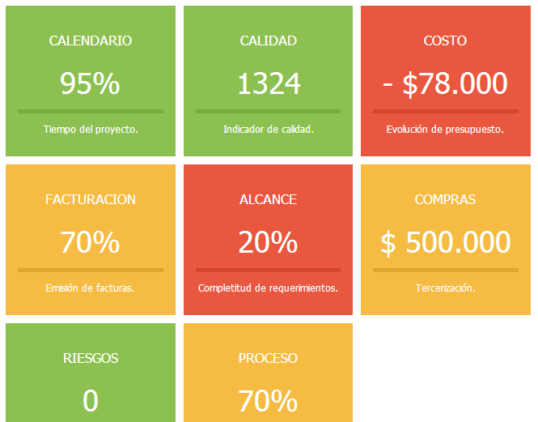

​En artículos anteriores hicimos una introducción acerca de cómo incorporar en SharePoint 2010 los estilos creados por un diseñador gráfico. Nos basamos en algunas hipótesis como el uso de SharePoint Foundation, páginas maestras, hojas de estilo y modelo de objetos de cliente para JavaScript. Se recomienda leer la [parte 1](/revistas/numero-16/diseno-grafico-en-sharepoint-foundation-2010) y la [parte 2](/revistas/numero-19/diseno-grafico-en-sharepoint-foundation-2010-ii) antes de continuar. También les recomiendo leer los [ejemplos de CAML con Client Object Model](/revistas/numero-17/ejemplos-caml-client-object-model-javascript), porque los utilizo para obtener datos de listas.

En esta tercera etapa, vamos a trabajar con dos casos puntuales:

- Botonera gráfica en reemplazo del Inicio Rápido.
- Tablero de control con indicadores gráficos.

**Botonera gráfica en reemplazo del Inicio Rápido**


Lo primero que vamos a mostrar es cómo agregar una botonera con imágenes que reemplace al tradicional Inicio Rápido. Esta botonera se verá en todas las páginas. Para ello modificamos la página maestra y agregamos algunos estilos. El resultado final se ve en esta imagen:



El siguiente código muestra el agregado de la botonera en la página maestra:

```
<div id="botonera_izquierda">
```

```
<div id="menu">
```

```
<ul id="nav">
```

```
<li><a href="/"></a></li>
```

```
<li><a href="/Lists/Noticias"></a></li>
```

```
<li><a href="/Lists/Personal"></a></li>
```

```
<li><a href="/Polticas"></a></li>
```

```
<li><a href="/Formularios"></a></li>
```

```
<li><a href="/Lists/Busquedas"></a></li>
```

```
<li><a href="/Lists/Menu"></a></li>
```

```
<li><a href="/Revistas/"></a></li>
```

```
<li><a href="/"></a></li>
```

```
<li><a href="/Capacitaciones"></a></li>
```

```
</ul>
```

```
</div>
```

```
</div>
```

El código debe ser agregado justo antes de esta línea:

```
<div id="s4-leftpanel-content">
```

Por otro lado, agregamos los siguientes estilos en nuestra hoja de estilos:

```
#s4-leftpanel {   width: 95px !important;}
```

```
#s4-leftpanel-content { display: none; }
```

```
.s4-ca { margin-left: 95px; }
```

Un detalle más, queremos que los botones cambien a otra imagen en el momento en que pasamos el mouse por sobre ellos (hover), tal como se ve en la siguiente imagen:



Con ese fin agregamos en la página maestra, el siguiente código jQuery:

```
<script type="text/javascript">
```

```
$('#nav a img').hover(
```

```
function() {
```

```
    $(this).attr('src', $(this).attr('src').replace('static', 'over') );
```

```
},
```

```
function() {
```

```
    $(this).attr('src', $(this).attr('src').replace('over', 'static') );
```

```
}
```

```
);
```

```
</script>
```

**Tablero de control con indicadores gráficos**

Cómo segundo ejemplo del día, vamos a agregar unos indicadores gráficos que se vean como los de la siguiente imagen:



Estos indicadores serán generados a partir de información en listas usando CAML. En este caso usaremos una página de aplicación en C# con código de servidor por un tema de rendimiento, pero también podría ser JavaScript con Client Object Model. Dentro de nuestra página ASP.Net llamaremos a una hoja de estilos además de crear el DIV "contenido":

```
<asp:Content ID="Main" runat="server" contentplaceholderid="PlaceHolderMain" >
```

```
  <div runat="server" ID="contenido"  />
```

```
  <link href="agea_telefonia_dashboard.css" type="text/css" rel="stylesheet" id="stylesheet" />
```

```
</asp:Content>
```

```
<asp:Content ID="PageTitle" runat="server" contentplaceholderid="PlaceHolderPageTitle" >
```

```
   Panel de Control
```

```
</asp:Content>
```

```
<asp:Content ID="PageTitleInTitleArea" runat="server" contentplaceholderid="PlaceHolderPageTitleInTitleArea" >
```

```
   Panel de Control
```

```
</asp:Content>
```

Leeremos la información vía CAML. No voy a mostrar en el código la lectura de información porque está muy relacionada con la lógica del negocio y no es más que lecturas típicas en CAML. Lo que si mostraré es cómo incorporar esos valores dentro de dos DIVs pensados para estructurar la información:

- DIV dash01 para el valor del indicador 1.
- DIV dash01\_detalle para el detalle del indicador 1.
- Y así sucesivamente.


```
contenido.InnerHtml =  "<div class='semaforos'>";
```

```
contenido.InnerHtml += "<div id='dash01' class='" + luz_indicador_1 + " dash'><p class='titulo'>CALENDARIO</p><p class='valor'>" + x_equipos_sin_linea + "</p><p class='leyenda'>Tiempos del Proyecto</p></div>";
```

```
contenido.InnerHtml += "<div id='dash02' class='" +
```

```
Continuar el armado de DIVs para el resto de los indicadores.      
```

```
contenido.InnerHtml += "</div>";
```

```
contenido.InnerHtml += "<div id='dash01_detalle' class='detalle'>" + detalle_indicador_1 + "</div>";
```

```
contenido.InnerHtml += "<div id='dash02_detalle' class='detalle'>" + 
```

Continuar el armado de DIVs de detalle para el resto de los indicadores. Agregaremos además algo de código jQuery para que al presionar sobre un indicador, nos muestre la información de detalle. Para ello llamamos a los scripts correspondientes de ASPX:

```
Page.ClientScript.RegisterClientScriptInclude("dash_jquery", ResolveUrl("./jquery-1.8.2.min.js"));
```

```
Page.ClientScript.RegisterClientScriptInclude("dash_script", ResolveUrl("./dashboard.js"));
```

```
Page.ClientScript.RegisterStartupScript(this.GetType(), "dash_script", "asignar_botones();", true);
```

Y este es nuestro código jQuery "dashboard.js":

```
function asignar_botones () {
```

```
      $( document ).ready(function() {
```

```
            $(".dash").click(function() {
```

```
                  var panel = "#" + $(this).attr('id') + "_detalle";
```

```
                  $(".detalle").css("display","none");
```

```
                  $(panel).slideDown( "slow" ).css("overflow","visible");
```

```
                  $(".dash").removeClass("dash_selected");
```

```
                  $(this).addClass("dash_selected");
```

```
            });
```

```
      });
```

Por último nos queda incorporar nuestra hoja de estilo, cuidando que el diseño sea responsive y se adapte al ancho de la pantalla, como se ve en esta imagen (en una pantalla más angosta que la anterior):



```
.dash { border: solid white 2px; }
```

```
.dash_selected { border: solid #333333 2px; }
```

```
.semaforos div {
```

```
      float: left;
```

```
      width: 22%;
```

```
      margin: 3px;
```

```
      padding: 15px 15px 10px 15px ;
```

```
}
```

```
.semaforos {
```

```
      font-family: tahoma;
```

```
      text-align: center;
```

```
      cursor: pointer;
```

```
}
```

```
.verde { background-color: #8CC152; }
```

```
.rojo {background-color: #E9573F; }
```

```
.amarillo { background-color: #F6BB42;}
```

```
.gris{ background-color: #C8C8C; }
```

```
.valor {
```

```
      color: #fff;
```

```
      font-weight: 500;
```

```
      font-size: 36px;
```

```
      margin-top: 20px;
```

```
      margin-bottom: 10px;
```

```
}
```

```
.titulo {
```

```
      color: #fff;
```

```
      font-size: 17px;
```

```
      font-weight: 500;
```

```
}
```

```
.leyenda {
```

```
      border-top: solid white 5px;
```

```
      padding-top: 12px;
```

```
      color: #fff;
```

```
      font-size: 12px;
```

```
      height: 65px;
```

```
}
```

```
.verde .leyenda { border-top-color: #76AD3E;}
```

```
.rojo .leyenda {  border-top-color: #D1462C;}
```

```
.amarillo .leyenda { border-top-color: #E0A52C; }
```

```
.gris .leyenda { border-top-color: #737373; }
```

```
.detalle {
```

```
      border-left: solid #E6E9ED 10px;
```

```
      width: 95%;
```

```
      height: 200px;
```

```
      margin: 5px;
```

```
      padding: 5px;
```

```
      font-size: 11px;
```

```
      font-family: tahoma;
```

```
      clear: both;
```

```
      display:none;
```

```
}
```

```
.detalle span {
```

```
      font-size: 11px;
```

```
      font-family: tahoma;
```

```
}
```

```
.detalle a {
```

```
      padding: 5px;
```

```
      font-size: 11px;
```

```
}
```

**Conclusión**

Esta fue la tercera entrega de esta colección de artículos dedicada a demostrar cómo se puede trabajar en SharePoint junto a un diseñador gráfico profesional. En mi opinión, esto es muy valorado por los clientes. Finalmente, les presento otra imagen del resultado final, ya vieron una en el artículo anterior. Espero como siempre que haya sido útil y cualquier duda me consultan.


**Juan Pablo Pussacq Laborde**
SharePoint MVP
Blog: [http://surpoint.blogspot.com/](http://surpoint.blogspot.com/) 
Facebook: [http://facebook.com/surpointblog/](http://facebook.com/surpointblog/) 
Twitter: [http://twitter.com/jpussacq/](http://twitter.com/jpussacq/)

 
 
import LayoutNumber from '../../../components/layout-article'
export default LayoutNumber
