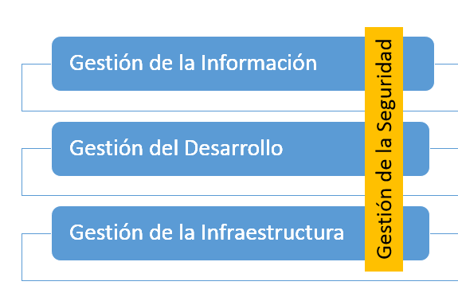
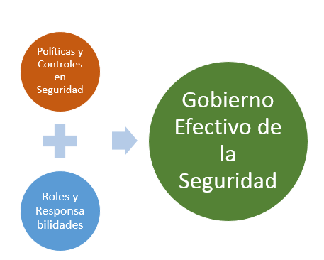
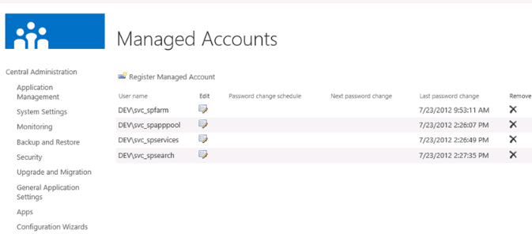
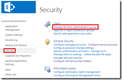
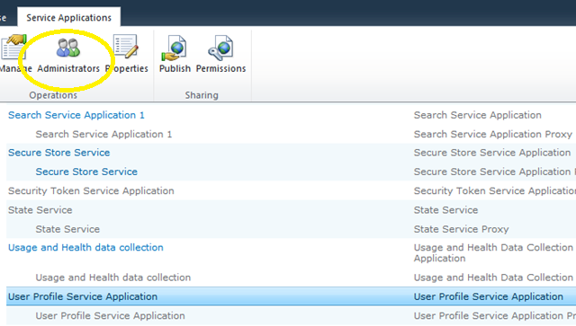
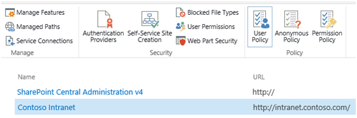
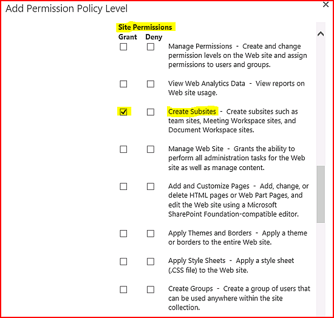
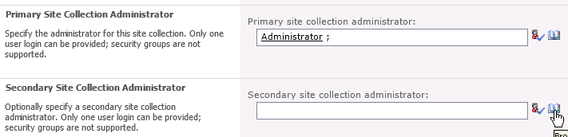
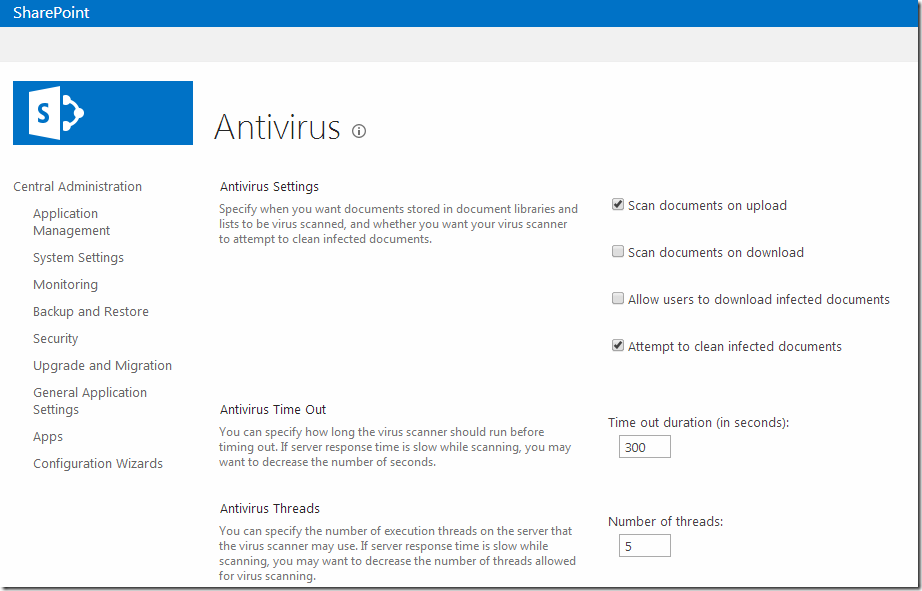

​Gobernabilidad es uno de los pocos conceptos de la administración de SharePoint que parecen tener muchos adeptos, pero pocos prácticos. A pesar que las organizaciones están seguras que un correcto gobierno de la plataforma, ayudará a su real potencial, son muy pocas las que logran llevar a un nivel madurez adecuado. A pesar que los tópicos del Gobierno en SharePoint nos acercan a tres ejes fundamentales (Gestión de la Información, Gestión del Desarrollo y Gestión de la Infraestructura), es innegable que una forma de acercarnos a este "gobierno adecuado", es a través de la gestión de la seguridad, la que a su vez puede ser transversal a los ejes de gobierno antes mencionados.

Si realizamos un seguimiento a la Gobernabilidad de Seguridad nos encontraremos con diferentes controles que debemos considerar, donde la clave es definir: Políticas y Roles.

La política establece el control explícito que debemos realizar según las necesidades de nuestra organización, además considerando las buenas prácticas del producto. En resumen, son puntos de focos a considerar para "Gobernar", y atribuidos a roles específicos en la organización.

En el conjunto tendremos una plataforma segura, estable, y gobernada en cuanto a la seguridad.

A continuación generamos un repaso de algunos elementos funcionales y configuraciones que debiésemos considerar en un Gobierno Seguridad de SharePoint, y en la generación de Políticas y Roles.

**Gobierno Seguridad TI**

- **El rol de SQL Server**, en esta parte es fundamental. Entre los elementos a considerar en un Gobierno de Seguridad están.
    - Bloqueo de Puertos estándar. Implica el cambio de TCP 1433 en un puerto definido por los administradores de SQL.
    - Configuración de SQL Alias. Además de administrar la seguridad, esta política nos permite flexibilizar futuros movimientos de bases de datos a instancias distintas.

Esta es una buena forma de independizar el papel que tienen el administrador de SQL, de los administradores de SharePoint.

- **"Pass Phrase" de Instalación**. Los administradores se deben asegurar que el "santo y seña" de Instalación quede salvaguardado, sólo por los administradores de la Granja, independizando de esa forma el ámbito que tienen los administradores de bases de datos.

**Contar con un Plan de Cuentas adecuado**, que cumplan con las definiciones establecidos como requisitos en la documentación del producto. Estas cuentas deben estar correctamente definidas e identificadas en el escenario de Administración Central. Esta misma característica permitirá la habilitación del cambio de contraseña automático por parte de la propia Farm, esto en función de las programaciones de restablecimiento de contraseñas configuradas de forma individual por cada una de las cuentas de servicio. Esta funcionalidad de cambio de contraseña, permite no romper ninguna política corporativa relacionada con la caducidad de cuentas, y mantiene la posibilidad de recambio de password.

- **Delegación a Personas, de la Administración de la Granja**. Es fundamental que los usuarios administradores de la granja, sean declarados en roles de "personas", y no necesariamente se utilicen las cuentas de servicios o administradas. Por ese motivo es que tenemos la posibilidad de administrar a este grupo selecto de personas, en un grupo independiente de "Administradores de la Granja".

 
A pesar que los Administradores de Granja, con Control Total, pueden recaer en pocas personas, siempre existe la necesidad que un equipo más completo tenga privilegios de operación sobre la Administración Central. De todas maneras, vale la pena indicar, que pertenecer al Grupo de Administradores de Granja, opera, pero no necesariamente implica permisos sobre operaciones con PowerShell o en la creación de Bases de Datos de Contenido.

- **Administración delegada de aplicaciones de servicio**: Otra de las políticas posibles de definir es definir en forma pormenorizada a los administradores de las aplicaciones de servicio. Esto permitirá que los administradores de la granja puedan delegar ciertas operaciones en cada una de las aplicaciones de servicio, y así independizar la posibilidad de configurar cada una de las necesidades de servicio.

 
En ocasiones el grupo de TI, necesitará del apoyo o complemento de otras áreas que integran sistemas. Así es el caso de la Administración de BCS o Secure Store Services, donde administradores distintos a SharePoint aportarán datos importantes para la conexión a datos externos.

- Manejar una correcta**administración de las Políticas de Seguridad aplicada a los usuarios para la Aplicación Web** es fundamental, para entender las restricciones o atribuciones que podemos realizar a usuarios en Aplicaciones Web determinadas, y sus zonas de publicación. Este tipo de funcionalidad permite, por ejemplo de Restringir operaciones funcionales a usuarios, en ciertas zonas de una ubicación web (intranet, extranet, u otro), a pesar que en las colecciones de sitios el permiso esté otorgado. Contrariamente, permite otorgar obligatoriamente, los permisos de diferente nivel, a usuarios que no lo tienen en las colecciones de sitios en su interior.

> Esta funcionalidad permitirá crear diferentes políticas, además de personalizar las ya existentes por defecto.

> La utilización de esta funcionalidad, es fundamental, por ejemplo; para otorgar privilegios de "Full Read" a la cuenta de servicio encargada del Rastreo de la Cuenta de Servicio en el servicio de Búsqueda.

- **Definición de Administradores de la Colección de Sitios**. Este quizás es uno de los elementos funcionales más utilizados en la entrega regular de la creación de Colecciones de Sitios. Sin embargo, que política definir en cuanto  de la forma de entrega, es una discusión que en muchas organizaciones no ocurre. En este escenario, los administradores de la Granja, deben definir Administradores Principal y Secundario, pero la pregunta es ¿Quiénes deben ser esos administradores? Hay 3 combinaciones claras, que dependen del nivel de restricción que queremos definir en las Soluciones de los usuarios. Como una analogía simple, finalmente aquí determinamos quien obtiene "las llaves" de esta nueva casa.
    - Opción A: Los dos administradores son delegados en el área de TI. Eso significa restringir el papel de administración de la colección a los usuarios del "negocio", que finalmente sólo tendrán control como "Propietarios" de los sitios.
    - Opción B: Estas dos "llaves" son entregadas al área Usuaria, dejando completamente en manos de los usuarios el control funcional (Activación de Características), y el control de Contenidos (A un usuario Administrador de Colección de Sitio, no es posible restringir permisos, a menos que sea por una Política de Aplicación Web). Esto restringe el acceso al área TI, y los deja con poca capacidad de soporte funcional sobre los sitios.
    - Opción C: Una de las más utilizadas, considera compartir las "llaves", de tal manera que tanto el Equipo TI, como los usuarios compartan la Administración.

- **Antivirus para SharePoint**. A pesar de que Usuarios y Servidores pueden tener una buena protección con antivirus de Estaciones de Trabajo y Sistemas Operativos, no podemos desconocer el papel que significa contar con AntiVirus para SharePoint. Estos softwares tienen la habilidad de entender el modelo de objeto de SharePoint, de tal manera que puedan detectar el “movimiento” de archivos infectados hacia o desde los usuarios. Sin embargo, para utilizarlos, SharePoint necesariamente debe “autorizar” su operación y es por esto, que necesariamente, además de la instalación de estos productos en todos los servidores SharePoint de la Granja, se deben definir un conjunto de configuraciones.

Los administradores de la Granja deben definir, entre otros:

    - La posibilidad de escanear los archivos en la subida a SharePoint.
    - La posibilidad de escanear los archivos en la bajada a los usuarios.
    - Permitir a los usuarios bajar documentos infectados
    - Permitir que los documentos infectados sean limpiados por el software.

**Juan Andrés Valenzuela**
 MVP de SharePoint Server
 [jandresvalenzuela@outlook.com](mailto:jandresvalenzuela@outlook.com) 
@jandresval
 [http://jandresval.wordpress.com](http://jandresval.wordpress.com/)

