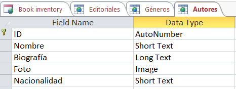
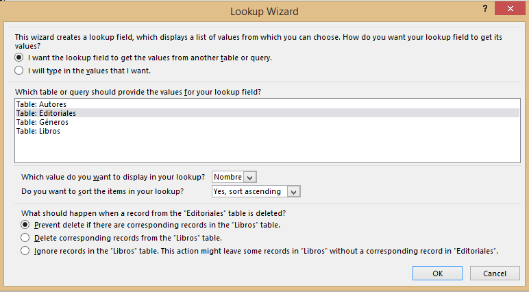

import ArticleHeader from '../../../components/article-header'

<ArticleHeader frontmatter={props.pageContext.frontmatter} />

​En la SPC14 Microsoft ya anunció la "muerte" de InfoPath, el inicio del "periodo de gestación" de los Forms over SharePoint Lists (FoSL) y las alternativas actuales y futuras a aplicaciones o servicios para la creación de formularios en SharePoint.

Una de las alterEnativas que presentó Microsoft como actualmente ya disponibles son las que llamó "Apps Forms" y que en realidad todos conocemos como Access Services. Bueno, de hecho no todos lo conocemos, ya que la simple palabra "Access" nos suele generar cierto rechazo por sonar anacrónica y fuera de lugar, aunque deberíamos darle una oportunidad a Access 2013, ya que (si no lo conocéis) os sorprenderá cómo puede crear formularios de datos relacionales desde SharePoint en una interface que se encuentra a caballo entre la interface web más moderna y los detalles Access más clásicos.

Este artículo pretende mostrar un sencillo ejemplo de cómo crear una aplicación de formularios basada en Access Services 2013, mostrando sus principales características, ventajas y limitaciones.

Ante todo comentar que las App Forms generadas con Access Services, aunque se pueden alimentar de fuentes externas de datos (importaciones de datos), se almacenan completamente en el propio interior del fichero Access, el front-end de formularios que genera también es interno a Access y no puede ser utilizado para front-end externo de otros entornos, y los datos se almacena en el SQL Server configurado en el servicio. Por lo tanto, al ser un entorno aislado, no puede utilizarse para interactuar con Workflows de SharePoint ni nada parecido. La única integración que tendrá con SharePoint es que desde el Sitio podremos crear y visualizar las Apps renderizadas como en formato web.

Como buen amante de la literatura, voy a utilizar como ejemplo la construcción de una aplicación para la gestión del inventario de una biblioteca, que además nos brindará un buen entorno para aplicar diversos niveles de vínculos relacionales.

Para ello vamos a crear 4 tablas distintas. 3 secundarias (Editoriales, Autores y Géneros) y una principal (Libros) que se alimentará mediante lookups de dichas tablas  secundarias.

Antes de crear un nuevo App Form, es prerrequisito indispensable tener instalado en nuestra máquina el Access 2013, que será nuestra herramienta de trabajo y con la que publicaremos el front-end diseñado en SharePoint. Para crear la App podemos hacerlo directamente desde SharePoint o desde el propio Access, ambos caminos nos conducirán finalmente a la edición desde el cliente Access.

Para iniciar la creación del formulario desde SharePoint, iremos a los Site Settings y pulsaremos en "Add an app"

Aquí buscaremos la Access App y crearemos una nueva pulsando sobre el icono correspondiente, tecleando el nombre de la App y pulsando en el botón de "Create". Transcurridos unos segundos, esto nos llevará a una página donde nos informará que la App de Access se ha creado correctamente y que deberíamos empezar a trabajar en ella (Añadir tablas) desde el cliente de Access.

Para iniciar la creación del formulario desde Access, deberemos ir al menú "Nuevo" desde el cliente de Access y seleccionar la plantilla "Custom Web App" para iniciar un App Form en blanco. Si pulsáramos en "Blank desktop database" estaríamos creando un fichero local de Access de los de toda la vida. El resto de opciones son plantillas ya pre-fabricadas para empezar una App Form con algo de contenido inicial (puede venirnos bien si lo que queremos construir tiene como base alguno de los contenidos de esas plantillas).

Una vez hayamos pulsado en "Custom web app" debemos introducir el nombre de nuestra aplicación y la localización de la misma (URL del site donde la vamos a publicar). Al pulsar en "Create" generará la App en el site indicado de SharePoint y podremos iniciar la edición de nuestro formulario.

Tanto si hemos creado la Access App por SharePoint o por Access, accederemos a una pantalla dentro del nuestro Access Cliente, donde nos indicará que debemos empezar a crear tablas para la base de datos Access. Estas tablas se pueden crear a partir de fuentes externas ya existentes (Un propio documento de Access, Un documento Excel, Conexión ODBC a BD, un documento .csv o una SharePoint List), pero en nuestro ejemplo vamos a centrarnos en crear las tablas manualmente desde cero, y así podremos trabajar desde la base.

Por lo tanto, pulsaremos en el enlace (un tanto escondido a simple vista) de la columna de texto derecha, donde indica "add a new blank table".

Empezaremos creando una de las tablas secundarias. Por ejemplo, Editoriales. Una vez dentro del editor de campos de una tabla, veremos que el campo ID nos viene ya creado como "key". A partir de aquí podemos insertar nombres de nuevos campos en las filas posteriores, y seleccionar entre los diversos tipos de campos disponibles (que se aprecian en la siguiente imagen).

En este ejemplo, para la tabla de Editoriales, tan solo requiere crear un campo (Nombre) de tipo Short Text.

Veremos que en la zona inferior de la pantalla, nos aparece un cuadro de propiedades relativo al campo actualmente seleccionado. En ella podremos configurar diversos aspectos (según el tipo de campo), como la longitud del mismo (en caso de tipo string), el formato de la fecha (en caso de tipo data), el valor por defecto del campo, insertar reglas de validación y el mensaje de alerta en caso de no cumplir dicha validación, si el campo es obligatorio (requerido) o no, y si el campo requiere indexación o no. Este panel de configuración es esencial para conseguir que nuestros campos y formularios se muestren y comporten de la forma deseada.

Una vez tengamos el campo "Nombre" creado y configurado correctamente, pulsaremos en el botón de Guardar, momento en el cual nos aparecerá una nueva ventana para solicitar el nombre de la tabla. Lo introducimos y pulsamos OK.

A continuación crearemos la segunda tabla secundaria, Géneros, que será igual de sencilla que la de editoriales, con un único campo con el nombre del género del libro (Short Text)

La tercera tabla secundaria, la de Autores, tendrá algo más de entidad, pues aparte del nombre del autor (Short Text), insertaremos también su Biografía (Long Text), su Foto (Image) y su Nacionalidad (Short Text).

Finalmente crearemos la tabla principal de Libros, que contendrá los campos de Título (Short Text), Año Publicación (Short Text), Portada (Image) y las referencias a las tablas secundarias de Autor, Editorial y Género (Lookups)

Hay que tener en cuenta que al definir un campo de Lookup, nos aparecerá un Wizard donde podremos indicarle fácilmente si queremos crear valores propios o basarnos en una tabla ya existente, y en este último caso, seleccionar la tabla, el campo de la misma a vincular y el tipo de relación que tendrán los elementos vinculados, a elegir entre:

- No dejar eliminar un elemento de la tabla de destino, si tiene elementos creados en la tabla origen con el valor que se quería eliminar (Si tengo un libro de "Santiago Posteguillo" no me dejaría borrar dicho autor).
- Borrar los elementos de la tabla origen vinculados al elemento borrado de la tabla destino (si elimino el autor "Orson Scott Card" me borraría también todos sus libros).
- Desvincular cualquier relación en el borrado de elementos de la tabla destino (si borro a un autor, sus libros permanecerán en la tabla "Libros").

En nuestro ejemplo, he usado siempre la primera relación (la más fuerte), pues no me interesa que se borren múltiples registros de libros por borrar algún registro de las tablas secundarias.

También debo advertiros de que en el caso de que hayáis creado previamente la tabla principal (Libros) con campos tipo "Short Text" y posteriormente las tablas secundarias (Autores, Editoriales, Géneros…), si posteriormente cambias esos campos por "Lookup" a dichas tablas, puede que observes un comportamiento extraño en la entrada de datos del formulario de lista de la tabla principal. A mí me ocurrió que me pedía los números enteros (ID) de los Autores y Editoriales, en lugar de hacer un Intellisense del texto en sí. Para solucionar este "bug" tendríamos que editar la vista en cuestión en el Access, eliminar los campos y volverlos a introducir desde el listado lateral de campos existentes. Al hacer esto, veréis que os vuelve a solicitar los nombres (y no los números) de los campos de tipo lookup.

Llegados a este punto, ya tenemos construidas todas las tablas de nuestra aplicación. Veremos que si navegamos por ellas, se nos han creado 2 vistas por defecto para cada una de ellas.

La vista "List" nos permitirá crear nuevos elementos mediante un formulario de introducción de datos, visualizar un listado de todos los elementos creados, visualizar el detalle del elemento seleccionado en el listado de elementos (con los metadatos que elijamos en el editor de vistas) e incluso visualizar sus elementos relacionados y crear directamente elementos relacionados desde esta vista (por ejemplo visualizar/crear los libros de una editorial concreto).

La vista Datasheet nos permitirá editar y modificar rápidamente los registros de una tabla, como si de un Excel se tratara.

Access nos permite modificar estas 2 vistas existentes o crear nuevas vistas para nuestras tablas. Teniendo en cuenta que dichas vistas forman una parte importante del resultado final de la aplicación, es altamente aconsejable retocarlas (o crear nuevas si así se requiere) para facilitar la lectura y navegación de los datos que almacena nuestra aplicación.

Para modificar una vista de una tabla existente, tendremos que navegar a la lista deseada en nuestra pestaña base del cliente Excel, y seleccionar "Edit" en el menú desplegable del icono de settings de la vista ya existente. Si en lugar de eso pulsamos en el icono del "+" a la derecha de las vistas existentes, crearemos una vista nueva.

Una vez estemos en modo edición/creación de vista, veremos que podemos arrastrar con el ratón cualquier campo disponible en la tabla actual o tablas relacionadas.

El editor de vistas es realmente fluido y a parte del drag & drop de campos, permite también redimensionarlos, eliminarlos y modificarlos de la forma más intuitiva posible. Por ejemplo, para redimensionar el campo "Foto" de la vista "List" de la tabla de Autores, tan solo tendremos que pulsar con el ratón encima del campo y "coger" el cuadradito de la esquina para arrastrarlo y redimensionar el campo a nuestro antojo. Veremos como el listado se va restructurando a medida que añadimos, movemos o redimensionamos campos de forma totalmente automática. Este es uno de los componentes más "cools" de las Access Apps, y el que dice que también tendrán los FoSL.

También hay que considerar que si vinculamos otras tablas a la tabla actualmente seleccionada, se nos creará un listado con elementos vinculados en la zona inferior de nuestra vista de la tabla. Su función será mostrar los elementos relacionados con el elemento que se esté visualizando en ese momento (por ejemplo, si estamos en Editoriales, y seleccionamos una en concreto, se nos mostrarían aquí todos los libros de dicha editorial). Esta visualización de datos de otra tabla se puede configurar pulsando con el botón derecho encima del nombre de su pestaña, pudiendo seleccionar parámetros tales como la tabla origen, el campo que la vincula, una selección de un total de 4 campos a mostrar de la tabla vinculada, la vista a la que vincula, y el campo y tipo de ordenación por el que queremos que nos muestre el listado de elementos relacionados.

Cada vez que guardamos los cambios, podremos observar los resultados en la App publicada vinculada automáticamente entre Access y SharePoint.

A continuación os muestro cómo modifiqué la vista "List" de la tabla de "Libros", y el resultado visual final de la misma. Os invito a jugar de la misma forma y comprobar por vosotros mismos los resultados.

De esta forma rápida y sencilla, hemos podido construir una simple, pero llamativa base de datos de libros por autor, editorial y género. Lo cierto es que el resultado visual de las mismas, teniendo el juego que da el editor de vistas, está bastante conseguido y permitirá cumplir a la perfección con la finalidad de nuestras aplicaciones de bases de datos relacionales.

Se nos acaba el espacio para explicaros más detalles de la construcción de formularios con Access Services, aunque antes de finalizar quisiera comentar que el editor permite crear también fácilmente desplegables en cascada (Cascading dropdowns), aplicar formato condicional a los campos (como ocultarlos en determinadas condiciones y cambiar su color de fondo) y aplicar lógica de campos al estilo InfoPath mediante la inclusión de macros con flujo de condiciones y acciones al más puro estilo workfows de SharePoint Designer. Para crear una macro, tendremos que ir a una vista de una tabla y pulsar el botón izquierdo del ratón. Se nos abrirá una ventana con las opciones de configurar los datos del campo, configurar su formato (visible, invisible…), y el icono de insertar una macro.

Una vez dentro del Editor de macros, podremos elaborar nuestra lógica para cada campo al construir un flujo de ejecución de determinadas acciones en base a una serie de condiciones.

Como punto final, os dejo una pequeña tabla con las principales ventajas y desventajas del uso de Access Services. Lo podríamos resumir como que es altamente recomendable para aplicaciones de gestión de datos relacionales auto-contenidas (que no interactúen con Workflows u otros circuitos/interfaces corporativos).

| **PROS** | **Contras** |
| --- | --- |
| <ul><li>Access 2013 se integra perfectamente con SharePoint (crea una App en el site).</li><li>Ideal para gestionar tablas de datos relacionales.</li><li>Interface amigable. No requiere código (wizard para macros).</li><li>Plantillas de tablas disponibles para acelerar la creación de nuevos forms.</li><li>Se pueden paquetizar las aplicaciones y subirlas a la Microsoft App Marketplace</li><li>Admite una gran variedad de lógica, formato condicional (Macros) y cascading dropdowns.</li><li>Permite obtener datos de fuentes externas.</li></ul> | <ul><li>Un Workflow no puede acceder a los campos del formulario.</li><li>No incorpora seguridad interna (vistas, campos…).</li><li>La App resultante pertenece a la BD del propio fichero Access y no se puede utilizar como frontend de una fuente de datos externa a ella (SharePoint List, por ejemplo).</li><li>Seguramente encontremos reticencias por parte de los clientes a utilizar Access por resultar un concepto un tanto anacrónico.</li></ul> |

Hasta aquí la introducción básica sobre las App Forms. Quedaría mucho por detallar todavía, pero como diría aquél gran autor (Michael Ende), eso sería otra historia que deberíamos contar en otra ocasión.

**Ignasi Tebé**
 SharePoint Professional
 [ignasitt@gmail.com](mailto&#58;ignasitt@gmail.com)

[http://www.sharepointer.info](http&#58;//www.sharepointer.info/)

