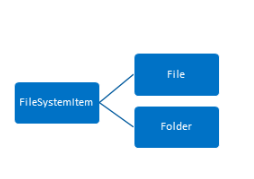
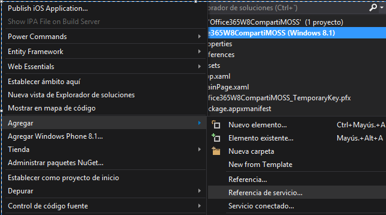
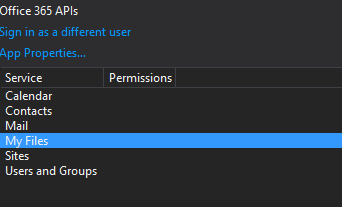
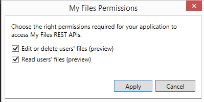
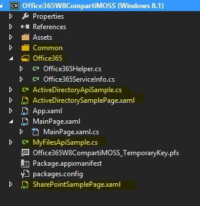
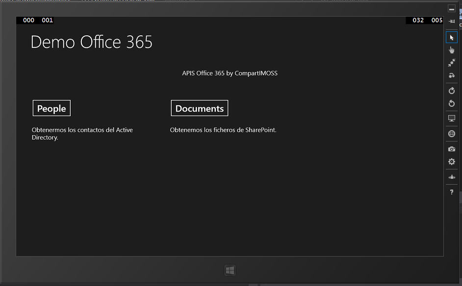
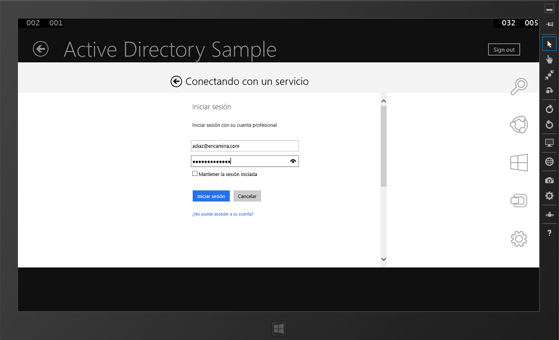
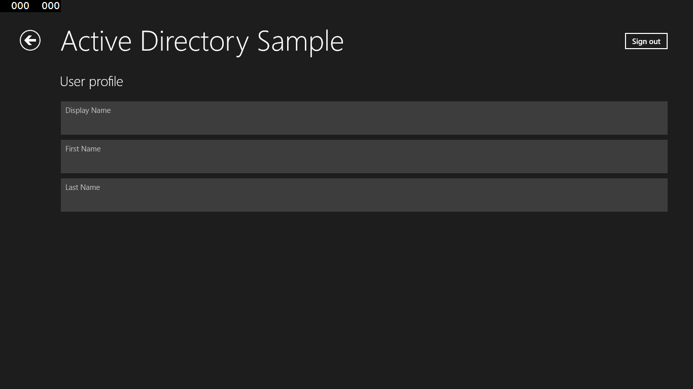

​**Nota:**Estas API's están en fase de Preview y pueden sufrir alguna modificación cuando se lance la versión definitiva. Naturalmente, no se recomienda el uso de ninguna de estas API's en un entorno de producción.

**Introducción**

Tal y como comentamos en el anterior número de CompartiMOSS, estas nuevas API's de Office 365 tienen como finalidad facilitarnos nuestros desarrollos para la plataforma de productividad de Microsoft en la nube. Y de la misma forma que se ha desarrollado API REST en SharePoint, se van a implementar servicios REST para acercar Office365 a nuestros desarrollos.

**Desgranando las API's de Ficheros SharePoint**

La API REST de Ficheros representa un rediseño del almacenamiento de archivos y gestión de ficheros en SharePoint. La API de Archivos permite acceder y manipular tanto  el contenido de los documentos de Office como los documentos almacenados en mensajes de correo electrónico, calendario, contactos y datos de SharePoint.

La API de ficheros tiene como principal utilidad establecer una forma simple y sencilla de acceder a los ficheros y carpetas independientemente de la plataforma donde este utilizada. Esta API contiene acciones sobre dos elementos ficheros y carpetas, para facilitar su uso han establecido 3 entidades: FileSystemItem, File y Folder.

- FileSystemItem — Clase base que encapsula las operaciones básicas y propiedades de las entidades del sistema de archivos.
- File — Tipo de entidad que define los archivos del sistema de archivos. Hereda de FileSystemItem.
- Folder — Tipo de entidad que define las carpetas del sistema de archivos. Hereda de FileSystemItem.

La definición de las entidades es la siguiente:

- **FileSystemItem:**

| **Nombre** | **Tipo** | **Descripción** | **Creación** | **Update** | **Null** |
| --- | --- | --- | --- | --- | --- |
| Id | Guid | Id del Item | No | No | No |
| Etag | String | ETag del item | No | No | No |
| Name | String | Nombre del item | Requerido | Si | No |
| Url | String | Path Absoluto | No | No | No |
| TimeLastModified | Fecha/Hora | Hora de Modificado | No | No | No |
| CreatedBy | Usuario | Usuario  | No | No | No |
| TimeCreated | Fecha/Hora | Fecha de Creación | No | No | No |
| LastModifiedBy | Usuario | Usuario que ha modificado | No | No | No |
| Size | Entero | Número de bits del documento | No | No | No |

- **File**: Tiene las mismas propiedades de FileSystemItem.
- **Folder:**

| **Nombre** | **Tipo** | **Descripción** | **Creación** | **Update** | **Null** |
| --- | --- | --- | --- | --- | --- |
| Children | Collección de FileSystemItem | Ficheros y carpetas que están incluidas dentro de esta carpeta | No | Si | si |
| ChildrenCount | Entero | Número de ficheros que tiene esa carpeta | No | No | No |

- **Operaciones con ficheros:**

Tenemos las siguientes endpoints disponibles:

- **Obtener todos los ficheros y carpetas en la biblioteca por defecto:**

| GET ../\_api/files |
| --- |

- **Obtener el contenido del fichero:**

| GET ../\_api/files(&lt;file\_path&gt;)/download |
| --- |

La devolución de esta petición es el propio fichero.

- **Obtener las propiedades del fichero:**

| GET ../\_api/files(&lt;file\_path&gt;)  |
| --- |

- **Obtener la propiedad del fichero:**

| GET ../\_api/files(&lt;file\_path&gt;)/&lt;property\_name&gt;  |
| --- |

- **Crear un fichero:**A la hora de creación de un fichero tenemos dos opciones: crear un fichero en blanco o crear un fichero con contenido. Para crear un fichero en blanco tendremos que enviar la siguiente estructura JSON en el body de la petición Ajax.

| \{  '\_\_metadata':  \{  'type':'MS.FileServices.File'  \},  Name : '&lt;FileName&gt;'  \} |
| --- |

Realizaremos la siguiente petición:

| POST../\_api/files |
| --- |

Para crear un fichero con contenido tendremos que enviar en el cuerpo de la solicitud enviaremos un vector de bits  y realizar la siguiente petición:

| POST ../\_api/files/Add(string name, boolean overwrite) |
| --- |

Si ha ido todo de forma correcta la API nos devuelve las propiedades del fichero recién creado.

- **Actualizar el contenido de un fichero:**Para actualizar el contenido de un fichero, basta con realizar la petición anterior, pero en el body enviamos el contenido modificado.
- **Eliminar un fichero**

| DELETE ../\_api/files(&lt;file\_path&gt;)  |
| --- |

**Operaciones con carpetas**

Disponemos de las siguientes opciones:

- **Obtenemos las propiedades de la carpeta:**

| GET ../\_api/files(&lt;folder\_path&gt;) |
| --- |

- **Obtener una propiedad de una carpeta:**

| GET ../\_api/files(&lt;folder\_path&gt;)/&lt;property\_name&gt;  |
| --- |

- **Obtener el contenido de una subcarpeta:**

| GET ../\_api/files(&lt;folder\_path)&gt;/SubCarpeta |
| --- |

- **Crear una carpeta:**

| POST../\_api/files |
| --- |

- **Eliminar una carpeta**

| DELETE ../\_api/files(&lt;folder\_path&gt;)  |
| --- |

- **Mover un fichero:**

| POST ../\_api/files(&lt;file\_path&gt;)/MoveTo(&lt;file\_path&gt;, overwrite=true) |
| --- |

- **Copiar un fichero:**

| POST ../\_api/files(&lt;file\_path&gt;)/CopyTo(&lt;file\_path&gt;, overwrite=true) |
| --- |

**Nota**: Para las opciones Mover un fichero y Copiar un fichero, la biblioteca destino no puede ser distinta que la biblioteca donde está el fichero.

**Operaciones en la Consulta**

Tanto en las operaciones de ficheros como en las carpetas podemos añadir diversos parámetros en la consulta a realizar como son indicar el número de ítems que nos devuelve la consulta, como establecer el orden en el que se devuelve la petición. Para ello realizaremos las peticiones de la siguiente forma:

- **$orderby:**

| GET ../\_api/files?$orderby=&lt;orderbyfield&gt;   |
| --- |

- **$top:**

| GET ../\_api/files?&top=&lt;row\_limit&gt; |
| --- |

**Desgranando la API Graph de AzureActive Directory**

La API Graph de Azure Active Directory proporciona acceso programático a Azure AD a través de los extremos de la API de REST. Las aplicaciones pueden usar la API Graph para hacer operaciones de creación, lectura, actualización y eliminación (CRUD) en objetos y datos de directorio. Por ejemplo, la API Graph permite realizar las siguientes operaciones comunes en un objeto de usuario:

- Crear un usuario.
- Obtener las propiedades detalladas de un usuario.
- Actualizar las propiedades de un usuario, como su ubicación, número de teléfono, o cambiar su contraseña.
- Consultar la pertenecía a grupos de un usuario.
- Deshabilitar la cuenta de un usuario o eliminarla por completo.

**Operaciones con usuarios**

- **Crear usuario:**

Para la creación de un usuario realizaremos la siguiente petición POST:

| https://graph.windows.net/mytenantdomain/users?api-version=2013-04-05 |
| --- |

Donde tendremos que sustituir mytenantdomain por el nombre de nuestro dominio. En esa petición tendremos que enviar en el cuerpo de la solicitud un formato JSON como el siguiente:

| \{  "accountEnabled": true,  "displayName": "Adrian Díaz",  "mailNickname": "adiaz",  "passwordProfile": \{ "password" : "xxxxx", "forceChangePasswordNextLogin": false \},  "userPrincipalName": "adiaz@encamina.com"  \} |
| --- |

- **Obtener usuario:**Para obtener el usuario podremos utilizar cualquiera de las siguientes uris, el parámetro de la de la cadena de consulta de api-version es obligatorio.

| https://graph.windows.net/mytenantdomain/users?api-version=2013-04-05  https://graph.windows.net/mytenantdomain/users/&lt;objectId&gt;?api-version=2013-04-05  https://graph.windows.net/mytenantdomain/users/&lt;userPrincipalName&gt;?api-version=2013-04-05 |
| --- |

**Nota:** El URI sin una especificación de usuario devolverá todos los usuarios en el directorio. Para obtener un usuario específico, especifica la propiedad objectId o userPrincipalName del usuario en el URI de solicitud

- **Actualizar usuario:**Para actualizar un usuario disponemos de dos opciones bien indicando el ObjettID o el User Principal Name

| PATCH https://graph.windows.net/mytenantdomain/users/&lt;objectId&gt;?api-version=2013-04-05  PATCH https://graph.windows.net/mytenantdomain/users/&lt;userPrincipalName&gt;?api-version=2013-04-05 |
| --- |

En el cuerpo de la solicitud enviaremos un JSON con las propiedades que deseamos modificar. Por ejemplo para modificar el departamento y la ubicación del usuario seria de la siguiente forma:

| \{  "department":"Development",  "usageLocation":"ES"  \} |
| --- |

- **Eliminar usuario**

| DELETE https://graph.windows.net/mytenantdomain/users/&lt;objectId&gt;?api-version=2013-04-05  DELETE https://graph.windows.net/mytenantdomain/users/&lt;userPrincipalName&gt;?api-version=2013-04-05 |
| --- |

Si la operación ha ido correctamente la API REST nos devolverá un código de estado 204 Sin Contenido

- **Obtener grupos a los que pertenece el usuario**

| GET [https://graph.windows.net/mytenantdomain/users/&lt;objectId||userPrincipalName&gt;/$links/directReports?api-version=2013-04-05](https://graph.windows.net/mytenantdomain/users/%3CobjectId||userPrincipalName%3E/$links/directReports?api-version=2013-04-05) |
| --- |

Para recuperar las personas que dependen directamente de un contacto, especifica "contacts" como el conjunto de recursos. También puedes especificar "directoryObjects" como el conjunto de recursos en el URI de solicitud; por ejemplo, https://graph.windows.net/contoso.onmicrosoft.com/directoryObjects/5e624f44-d38d-4943-b07c-2bad078f52ff/directReports?api-version=2013-04-05. Solo se puede usar objectId cuando el conjunto de recursos es "contacts" o "directoryObjects".

- **Resetear la contraseña del usuario.**Tendremos que realizar la siguiente petición:

| PATCH https://graph.windows.net/mytenantdomain/users/&lt;objectId&gt;?api-version=2013-04-05  PATCH  https://graph.windows.net/mytenantdomain/users/&lt;userPrincipalName&gt;?api-version=2013-04-05 |
| --- |

Dentro del cuerpo de la solicitud de la petición tendremos que enviar un JSON donde tenga una propiedad "passwordProfile". Esta propiedad debe de tener un valor válido que contiene una contraseña que cumple la directiva de complejidad de contraseñas del inquilino.

| \{  "passwordProfile":  \{  "password":"Test123456",  "forceChangePasswordNextLogin":false  \}  \} |
| --- |

**Nota:** En todas las peticiones hay que enviar dentro de la cabecera la Autentificación, que no es más que un token de portador emitido por el Control de acceso de Azure. Este token se genera en cuanto la aplicación que estamos implementando se autentifique contra el Active Directory.

**Ejemplo: Utilizar estas API's en una aplicación Windows 8.1**

**Requisitos Previos**

- Visual Studio 2013.
- Descargar Office 365 API Tools bien directamente desde esta dirección [http://visualstudiogallery.msdn.microsoft.com/7e947621-ef93-4de7-93d3-d796c43ba34f](http://visualstudiogallery.msdn.microsoft.com/7e947621-ef93-4de7-93d3-d796c43ba34f) o directamente desde Nuget.

**Manos a la obra**

Una vez tenemos instalada las Office 365 API Tools, abrimos Visual Studio, creamos un proyecto Aplicaciones de la Tienda-&gt; Aplicaciones Windows-&gt; Aplicación Vacía. A continuación, a nuestro proyecto le vamos a añadir la conexión a los servicios REST de API 365. Para añadirlos, nos dirigimos al Explorador de soluciones, Agregar Servicio conectado tal y como se muestra en la siguiente imagen:

Aparecerá el Administrador de servicios. Selecciona Office365 e introduce el login de tu cuenta. Una vez autentificado contra el Tenant de Office365 podrás ver una lista de 6 servicios: Calendar, Contacts, Mail, My Files, Sites y Users/Groupst. Inicialmente, la columna Permisos a la derecha de cada servicio estará vacía. En nuestro ejemplo vamos a seleccionar primero My Files y posteriormente Users/Groups. Una vez seleccionado pulsamos Aceptar (Imagen 2).

Dado que no están establecidos los permisos, al tratarse de una versión preview, estos se solicitan por pantalla. En nuestro caso, vamos a otorgar todos los permisos para poder ver todas las opciones que vienen incluidas y que hemos visto en este artículo.

Una vez hemos añadido la API a nuestro proyecto revisamos la estructura de nuestro proyecto que quedará de la siguiente forma:

Tal y como hemos remarcado en la imagen, se han añadido dos carpetas: Common y Office365. Además de una serie de archivos XAML donde están las pantallas para poder comprobar la potencia de estas APIs.

Si analizamos los ficheros que se han añadido:

- Office365ServiceInfo: En esta clase disponemos del modelo que se utiliza para obtener la información para cada una de las APIs, para el caso de Active Directory tendremos el siguiente método:

public static async Task&lt;Office365ServiceInfo&gt; GetActiveDirectoryServiceInfoAsync()

Devuelve información sobre el servicio de Active Directory, incluida su token de acceso.  En caso de error, este método se mostrará un mensaje de error al usuario, y devolverá una instancia de Office365ServiceInfo cuya propiedad HasValidAccessToken se establece en "false".

En el caso de SharePoint tendremos el siguiente método:

public static async Task&lt;Office365ServiceInfo&gt; GetSharePointOneDriveServiceInfoAsync()

Este método devuelve información sobre el servicio de SharePoint, incluyendo su token de acceso en caché. Para cada SharePoint, el ID de recurso y la API será diferente para cada inquilino. En caso de error, al igual que en el servicio de Active Directory se muestra un mensaje de error y devolverá  una instancia de Office365ServiceInfo instancia cuya propiedad HasValidAccessToken se establece en "false".

- Office365Helper: Implementa una clase para ayudarnos en nuestros desarrollos. Entre las funciones que están implementadas:  ClearCache, GetToken, SaveInCache, etc.
- ActiveDirectoryApiSample y MyFilesApiSample: En estas clases están las funciones que llaman a la API REST correspondiente.
- Ficheros XAML: En estos ficheros están la representación de los datos que nos envían las API's correspondientes.

Una vez analizado el código, en la página principal de nuestra aplicación (MainPage.xaml) tendremos que añadir la funcionalidad para poder ir a las ventanas que nos ha descargado las herramientas tools de Office 365.

En primer lugar modificaremos el XAML de MainPage.xam añadiendo el siguiente código dentro del GRID que hay por defecto:

| &lt;TextBlock Grid.Row="0" x:Name="pageTitle" Text="Demo Office 365" Style="\{StaticResource HeaderTextBlockStyle\}"  IsHitTestVisible="false" TextWrapping="NoWrap" VerticalAlignment="Bottom" Margin="50,0,30,40"/&gt;  &lt;StackPanel Grid.Row="1"&gt;  &lt;TextBlock TextWrapping="Wrap" Margin="30,30,30,50" FontSize="20"  HorizontalAlignment="Center"&gt;  APIS Office 365 by CompartIMOSS  &lt;/TextBlock&gt;  &lt;Grid Margin="30,0,10,30"&gt;  &lt;Grid.ColumnDefinitions&gt;  &lt;ColumnDefinition Width="\*" /&gt;  &lt;ColumnDefinition Width="\*" /&gt;  &lt;ColumnDefinition Width="\*" /&gt;  &lt;/Grid.ColumnDefinitions&gt;  &lt;StackPanel Grid.Column="0" Margin="20,20,20,20"&gt;  &lt;Button x:Name="buttonPeople" FontSize="30" Click="ButtonPeople\_OnClick"&gt;People&lt;/Button&gt;  &lt;TextBlock TextWrapping="Wrap" Margin="0,30,0,0" FontSize="20" Text="Obtenermos los contactos del Active Directory." /&gt;  &lt;/StackPanel&gt;  &lt;StackPanel Grid.Column="1" Margin="20,20,20,20"&gt;  &lt;Button x:Name="buttonDocuments" FontSize="30" Click="ButtonDocuments\_OnClick"&gt;Documents&lt;/Button&gt;  &lt;TextBlock TextWrapping="Wrap" Margin="0,30,0,0" FontSize="20" Text="Obtenemos los ficheros de SharePoint." /&gt;  &lt;/StackPanel&gt;  &lt;/Grid&gt;  &lt;/StackPanel&gt; |
| --- |

A continuación implementamos la funcionalidad de los dos botones. La funcionalidad de estos botones es muy simple, navegará a la opción de la API seleccionada.

| private void ButtonPeople\_OnClick(object sender, RoutedEventArgs e)  \{  this.Frame.Navigate(typeof(ActiveDirectorySamplePage));  \}    private void ButtonDocuments\_OnClick(object sender, RoutedEventArgs e)  \{  this.Frame.Navigate(typeof(SharePointSamplePage));  \}   |
| --- |

Una vez añadido estas modificaciones, compilamos y si todo ha ido bien visualizaremos la siguiente pantalla:

Al pulsar sobre cada opción: People o Documents, se mostrarán las distintas vistas añadidas donde visualizamos la información solicitada a la API correspondiente. Una vez pulsamos sobre cualquier opción, en primer lugar, nos pedirá autenticación sobre Office365 para lo cual se muestra una pantalla de login como la siguiente:

Una vez autentificado visualizaremos los datos solicitados a la API correspondiente.

**Conclusión**

Office 365 es un producto clave dentro de la estrategia que está trazando Satya Nadella para hacer competencia a Google y Apple. Dentro de esta estrategia Microsoft está haciendo especial hincapié en el acceso desde cualquier dispositivo y en la productividad. Y en estos dos puntos estas nuevas API's tienen gran importancia, primero porque Office 365 es la principal herramienta de productividad y segundo porque están implementando herramientas para poder hacer uso de Office 365 desde cualquier plataforma/dispositivo. Otro de las grandes ventajas que llevan estas API's es que facilitan entornos híbridos. El poder hacer uso de esta API en nuestros desarrollos pueden facilitar a las empresas a migrar determinados servicios al Cloud.

**Referencias:**

- [http://msdn.microsoft.com/EN-US/library/office/dn605900(v=office.15).aspx](http://msdn.microsoft.com/EN-US/library/office/dn605900%28v=office.15%29.aspx) [http://blogs.msdn.com/b/officeapps/archive/2014/03/12/announcing-office-365-api-tools-for-visual-studio-preview.aspx](http://blogs.msdn.com/b/officeapps/archive/2014/03/12/announcing-office-365-api-tools-for-visual-studio-preview.aspx)
- [http://msdn.microsoft.com/es-es/library/azure/hh974476.aspx](http://msdn.microsoft.com/es-es/library/azure/hh974476.aspx)

**Adrián Diaz Cervera**
Sharepoint Architect at Encamina
MVP de SharePoint Server
[http://blogs.encamina.com/desarrollandosobresharepoint](http://blogs.encamina.com/desarrollandosobresharepoint) 
[http://geeks.ms/blogs/adiazcervera](http://geeks.ms/blogs/adiazcervera)     
[adiaz@encamina.com](mailto:adiaz@encamina.com) @AdrianDiaz81

