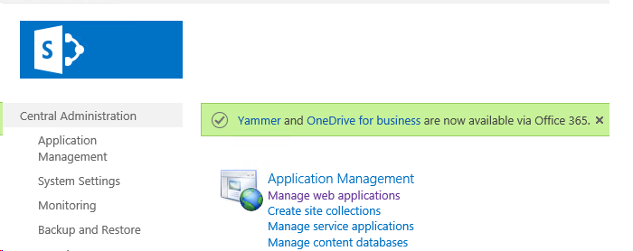
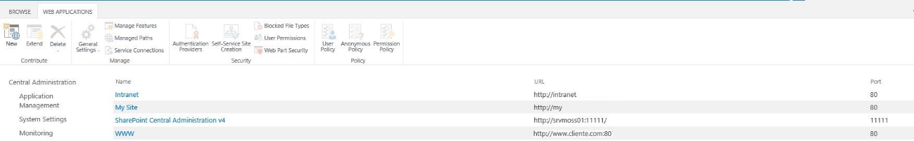
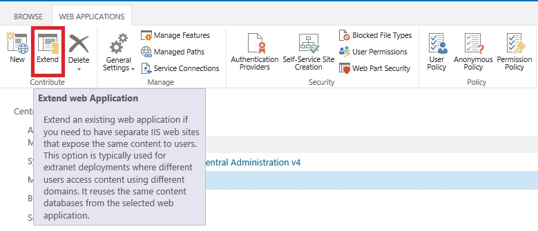
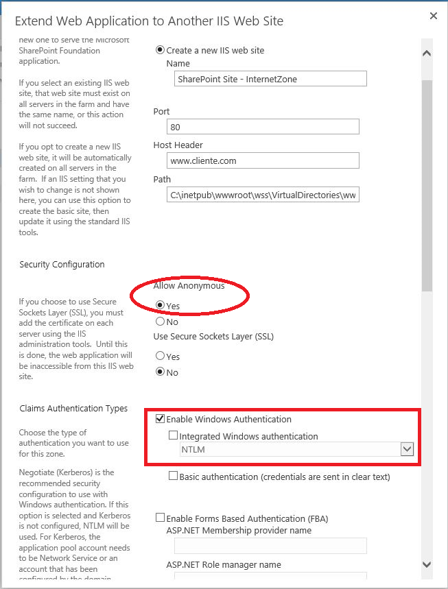
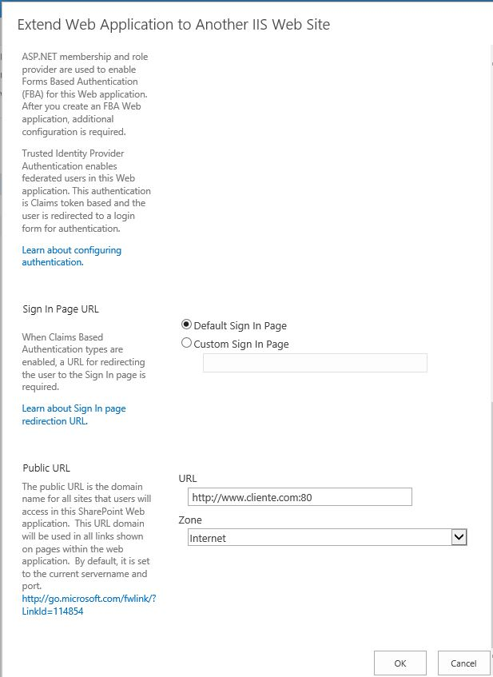
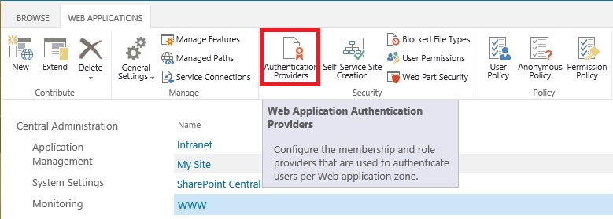
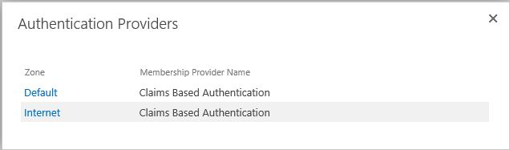
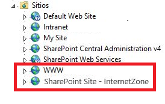
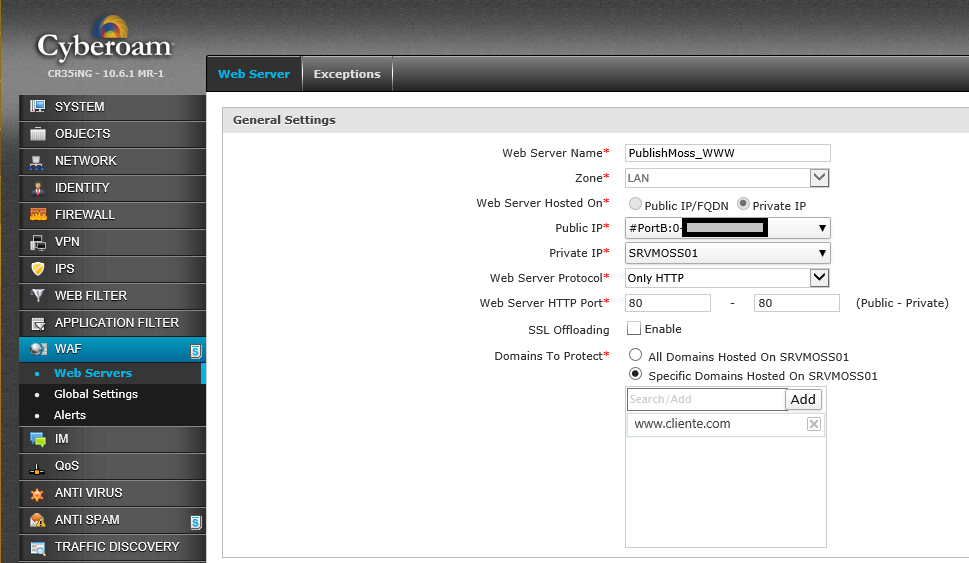

​Mi parte de este proyecto ha sido preparar la infraestructura de SharePoint de nuestro cliente para que el equipo de desarrollo tenga una buena infraestructura donde trabajar y nuestro cliente tenga además de su sitio Web Publico una intranet corporativa. Esto hace que debamos hilar fino con la infraestructura, un sitio publicado en Internet y los datos internos del cliente en los mismos servidores, sin servidores de DMZ y otras buenas prácticas que deberíamos cuidar al hacer esto, pero bueno… la crisis es así y por suerte SharePoint nos ayuda bastante a poder hacer esto posible.

Como complemento a esto tenemos un Cluster de Firewalls Next Generation de Cyberoam con la característica WAF que nos permitirá publicar nuestro site y aportar seguridad, QoS, IPS y otras medidas de seguridad.

**Preparemos SharePoint**

Lo primero es instalar SharePoint 2013, crear Service Accounts, Web Applications, Contents Databases, yo a veces soy un poco "paranoico" así que intento tomar todas las medidas de seguridad que sean posibles, prácticas y aplicables. Entre otras cosas la intranet tiene su Web Application, que la ejecuta un usuario específico, con su usuario Owner de Site Collection propio y la misma receta para el sitio público.

Evidentemente toda la parte que corresponde a servicios de SharePoint, Service Application Pools, etc. se ejecutan con usuarios diferentes al de la intranet y el sitio público.

Ya tenemos nuestra site collection en marcha con una plantilla de SharePoint para Publishing, responde internamente perfectamente en http://www.cliente.local, el cliente y el equipo de desarrollo han trabajado sobre el site desde la red del cliente y ha llegado la hora de la verdad, hay que ponerlo en internet y que responda a http://www.cliente.com ¿cómo lo hacemos?

Lo primero es desde SharePoint extender nuestra Web Application para habilitar el acceso anónimo al site, desde dentro los usuario han estado accediendo validados pero lo último que necesitamos es tan siquiera la posibilidad de que salte un cartel de validación en internet, primero porque quedaría muy feo y según así no tenemos ni la tentación de un ataque de fuerza bruta o por diccionario.

Extendemos nuestra Web Application desde la Administración Central de SharePoint, definimos el nombre de nuestro nuevo Sitio Web en el IIS, Le damos un nombre, puerto de escucha (80) y Host Header (www.cliente.com) gracias al Host Header podremos hacer un par de cosas cuanto menos curiosas, una de ellas es que http://www.cliente.local y http://www.cliente.com estén en el puerto 80 y el IIS nos haga el favor de mostrarnos la web. Pero para mí lo mejor es que cuando publique en internet bien desde un Proxy Inverso (ISA Server, Forefront TMG, etc.) o un Firewall con filtrado de Header podremos usar el puerto 80 para múltiples sites en una única IP Publica y aseguraremos que nuestros IIS o servidores web solo respondan a la petición del puerto 80 pero además con el nombre publico adecuado, Solo veremos nuestro sitio web de SharePoint si la petición llega a www.cliente.com en el puerto 80, no vale la IP y el puerto, por valer no vale ni http://localhost.

En esta definición, especificaremos que corresponde este Site de IIS a la Zona de Internet y habilitaremos el acceso anónimo, todo esto nos permitirá definir un comportamiento distinto para el acceso interno del cliente para cargar contenido, así como el acceso desde internet para visualizarlo.

**Capturas y Pasos a realizar**

- Vamos a Administración Central --&gt; Manage web applications:

- Tenemos nuestra lista de Web applications:

- Clicamos nuestra Web applications y luego en Extend:

Ahora debemos introducir los datos del nuevo sitio en el IIS, lo más importante es definir puerto, host header, permitir el acceso anónimo, deshabilitar la autenticación integrada, url y seleccionar la zona que usaremos para esta url.

A continuación se muestran el resto de configuraciones necesarias al extender la aplicación web:

​

Una vez SharePoint termina el proceso podremos comprobar como nuestra web application ahora dispone de 2 zonas definidas en ***Authentication Provideres***

Si luego deseamos modificar algo podremos venir aquí y seleccionar la zona que deseamos modificar.

Otro cambio que podremos observar es que ahora en nuestro IIS encontraremos un nuevo site definido y que se ejecutara bajo el mismo Web Application Pool que nuestro primer sitio.

Esto que hemos realizado lo podemos aplicar también para nuestra Intranet, pero en este caso por ejemplo podríamos habilitar la validación por formulario para la zona de Extranet que será la que publicaremos al exterior.

Ahora nuestro cliente acede a su sitio público para cargar contenido de forma natural, http://www.cliente.local ve y tiene todas las características para editar su sitio, pero desde internet solo ven el contenidos publicado al entrar en http://www.cliente.com y no hay forma de que se pueda entrar desde fuera al /\_layaouts/settings.aspx porque directamente devuelve un 401.

**Configuraciones en el Firewall**

Los firewalls están cambiando y nos estamos encontrando con dispositivos que ya no solo abren y cierran puertos, ahora inspeccionan tráfico, IPS, etc. y algunos como este Cyberoam nos hacen de proxy inverso, 1 IP publica y múltiples sites publicados en el puerto 80 así nuestros visitantes no tienen que recordar puertos en nuestras urls o el cliente pagar por servicios de ISP para empresa con alto coste.

Esto es bastante sencillo si tenemos la característica de WAF activada en nuestro firewall Cyberoam, solo es cuestión de definir la interfaz que tiene nuestra IP publica el host que tiene la IP privada (Nuestro SharePoint), protocolo (HTTP/HTTPS), si tenemos traducción de puerto (Eje. Publicamos en internet el 80, pero en nuestro servidor en el 8080) y especificamos el header o nombre de dominio con el que publicamos nuestro site, esto es lo que nos permitirá crear tantas publicaciones de sitios necesitemos externamente sobre el puerto 80 en nuestro firewall (Proxy Inverso).

Nos me extenderé sobre la configuración del Firewall principalmente porque cada fabricante tiene un proceso distinto para alcanzar esto, pero el concepto es igual, solo cambia la forma de conseguirlo.

**Conclusión**

Como vemos, es posible con un despliegue mínimo de infraestructura crear un entorno bastante robusto y seguro para hospedar nuestro sitio de SharePoint On-Premise y nuestra intranet ambos expuestos a accesos externos. De esta forma podemos extender aún más las posibilidades de una organización para explotar al máximo las cualidades y capacidades de SharePoint.

**Jorge Luis González Yánez**
 Responsable de Ingeniería y Sistemas
 [jorgelgy@hotmail.com](mailto&#58;jorgelgy@hotmail.com)

