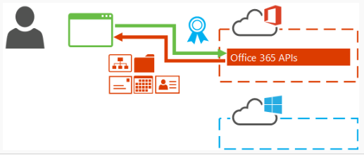

​Si echamos la vista al evento Connect() de Microsoft (evento en el que se presentó la nueva versión de Visual Studio) hay dos grandes novedades en cuanto a desarrollo. La primera las mejoras incluidas en Visual Studio para realizar aplicaciones multiplataforma ya sea a través de Apache Cordova (HTML5, JavaScript y CSS3) o bien a través de Xamarin (realizando aplicaciones nativas haciendo uso de C#/F#). La segunda de las novedades es tener preparados nuestros desarrollos para que sean fácilmente escalables.

Dada estas dos premisas dentro de nuestro entorno diario está claro donde más nos repercute: Office365. Cada vez salen muchas más novedades para Office365 que no disponemos directamente en nuestra versión OnPremise. Novedades como el App Launcher, Office Delve, Office Video, Office365 API's etc... Por lo que más pronto que tarde tendremos que pensar en la forma en la que podemos utilizar todas estas novedades en nuestros desarrollos.

Partiendo de estas cuestiones, en este artículo vamos a ver como poder realizar aplicaciones multiplataforma haciendo uso de Xamarin y que consuman los servicios que nos facilita Office 365.

**¿Qué es Xamarin?**

Xamarin es una herramienta para los desarrolladores de aplicaciones móviles, y la novedad de esta herramienta es la capacidad que tiene para que el desarrollador escriba su App en lenguaje C#/F# y el mismo código sea traducido para ejecutarse en iOS, Android y Windows Phone. Xamarin se puede integrar bien con Visual Studio o desarrollar las aplicaciones con su propio IDE Xamarin Studio.

La primera propuesta de desarrollo era la siguiente: desarrollar una interfaz de usuario nativa con los controles de cada plataforma, consiguiendo de esta forma la gran experiencia nativa que estábamos buscando, y a nivel de lógica de la aplicación en vez de desarrollar cada App con lenguajes diferentes como C++, Java u Objective C, desarrollar usando C# para todas, compartiendo por tanto la lógica de negocio de las aplicaciones para las tres plataformas móviles.  Esto se consigue gracias a que Xamarin es compatible con los PCL's (Portable Class Library). Propicia que podamos compilar una librería solo una vez con unos mismos parámetros y dicha librería pueda ser utilizada desde la aplicación de Windows Phone, iOS e Android de Xamarin.


Esta forma de desarrollo tiene como principal ventaja, el uso de un único lenguaje para todas las aplicaciones pero tiene como gran inconveniente que tenemos que desarrollar la interfaz gráfica en cada una de las plataformas. Esto es un problema porque aunque la mayor parte del desarrollo se realice en C#, necesitaremos conocer las particularidades de cada plataforma.

En Xamarin, conocedores de esta problemática, han evolucionado su producto sacando Xamarin Forms. Este tipo de proyecto lo que hace es que desarrollemos una única interfaz, siendo esta UI la misma en cada uno de los dispositivos en los que se visualiza, es decir, el desarrollo ahora quedaría de la siguiente forma:


**¿Cómo integrarlo con Office 365?**

En los artículos anteriores hemos visto como incluir estas API's dentro de desarrollos ASP.NET o Windows 8 es muy sencillo, prácticamente es transparente para el desarrollador. Pero como he comentado en la introducción el objetivo actual es que cualquier desarrollo se pueda utilizar  en cualquier dispositivo y cualquier plataforma. Para poder utilizar las API's de Office 365 en cualquier tipo de proyecto se necesita autenticar la aplicación con Office 365 con el fin de obtener acceso a los datos de sus usuarios. La autenticación de la aplicación incluye tres pasos: crear el contexto de Office 365, obtener el token de acceso, y  a continuación ya podemos realizar las peticiones a la API de Office365 que deseemos acceder (Service Calendar, Contacts, Mail, y MyFiles son las servicios por el momento).

**Proceso de Autenticación**

Nuestro cliente que haga uso del servicio de Discovery de Office 365 debe de realizar el siguiente flujo para poder validad la App que estamos desarrollando:

1. Registrar su aplicación en el Portal de la Administración de Azure y configurar el código de la aplicación con el ID de cliente y redirigir URI. Luego, en el Portal de la Administración de Azure, configurar los permisos para la aplicación. Para más detalles de cómo realizarlo [http://blogs.encamina.com/desarrollandosobresharepoint/2014/11/11/registrar-una-aplicacion-en-el-portal-de-azure/](http&#58;//blogs.encamina.com/desarrollandosobresharepoint/2014/11/11/registrar-una-aplicacion-en-el-portal-de-azure/)

2. Su aplicación obtiene  el email del usuario. Entra en contacto con Servicio de Discovery con la dirección de correo electrónico y a los recursos que la aplicación quiere acceder.


3. La aplicación se comunica con el servicio de autorización AD de Azure y  el usuario se autentica y da el consentimiento sobre los recursos a los que tiene acceso (en el supuesto de que no se haya concedido el consentimiento antes). AD Azure emite un código de autorización.


4. Su aplicación obtiene el código de autorización. Azure devuelve un token de acceso.


5. Su aplicación se comunica con el  Service Discovery usando el token de acceso. Service Discovery regresa respuesta HTTP con identificadores de recursos y URI de acceso para las API's de Office 365.


6. Su aplicación envia el token de actualización Azure AD,  en este token se solicita el acceso a la API de Office 365 junto son sus recursos. Finalmente el AD Azure devuelve un token de acceso para el recurso especificado, junto con un token de actualización.


7. La aplicación ahora puede llamar a la Oficina 365 APIs utilizando el URI del Discovery Service  y el token de acceso.



**¿Cómo lo implementamos?**

**Requisitos Previos:**

- Visual Studio 2013 Service Pack 2 (mínimo).
- Instalado Xamarin para Visual Studio 2013.
- Cuenta de Office365.
- Subscripción de Azure.


Para tener un entorno preparado para esta aplicación seguir los pasos del siguiente link:  [https://github.com/OfficeDev/DevCampTraining/blob/master/02.Setting%20up%20the%20Environments/hands-on-lab.md](https&#58;//github.com/OfficeDev/DevCampTraining/blob/master/02.Setting%20up%20the%20Environments/hands-on-lab.md)

**Objetivo:**

Vamos a desarrollar una aplicación Android en la cual se nos pedirá por pantalla el Alias de la cuenta de correo que deseamos encontrar dentro de nuestro Exchange Online. Para llevar a cabo este desarrollo implementamos dos proyectos: 1 Portable Class Library y una aplicación Xamarin.Android

**Manos a la obra:**

1. Iniciamos VS 2013 y creamos un proyecto de PCL (Portable Class Library): "Aplicaciones de escritorio -&gt; Biblioteca de clases".


2. Seleccionamos los proyectos en los que se puede utilizar esta librería. En nuestro caso además de seleccionar .NET Framework 4.5, Windows 8 y Windows Phone 8.1, seleccionaremos también Xamarin.IOS y Xamarin.Android.


3. Para facilitarnos la autentificación existe un paquete en Nuget que nos abstrae de implementar de forma manual todo el proceso anterior. Para ello en nuestra solución instalaremos el paquete Nuget Active Directory Authentication Library (ADAL). Esta librería va por la versión 3.0 (en fase previa).


**NOTA:** La versión que soporta acceso a PCL es la que está en fase previa, se ha anunciado que en futuras versión incluirá soporte para Xamarin.Forms. Se recomienda solamente poner en producción paquetes Nuget que están en estado Estable.

4. Instalaremos el paquete de Nuget JSON.Net para transformar las peticiones realizadas a la API de Office 365 en clases de C#.

5. A continuación dentro del proyecto añadiremos una clase CompartiMOSS donde incluiremos la autentificación contra Office 365 y la llamada a la API de Graph para obtener los emails que responden a este alias. El primer paso que tenemos que hacer es llamar al ADAL para solicitar las credenciales al usuario por pantalla.

```
AuthenticationContext authContext = new AuthenticationContext(commonAuthority);
```

```
if (authContext.TokenCache.ReadItems().Count() > 0)
```

```
 authContext = new AuthenticationContext(authContext.TokenCache.ReadItems().First().Authority);
```

```
authResult = await authContext.AcquireTokenAsync(graphResourceUri, clientId, returnUri, parent);
```

Obtenido el token de acceso ya podemos realizar llamadas a las APIs de Office 365 de la siguiente forma:

```
string graphRequest = String.Format(CultureInfo.InvariantCulture, "{0}/{1}/users?api-version={2}&$filter=mailNickname eq '{3}'", graphResourceUri, authResult.TenantId, graphApiVersion, alias);
```

```
HttpClient client = new HttpClient();
```

```
HttpRequestMessage request = new HttpRequestMessage(HttpMethod.Get, graphRequest);
```

```
request.Headers.Authorization = new AuthenticationHeaderValue("Bearer", authResult.AccessToken);
```

```
HttpResponseMessage response = await client.SendAsync(request);
```

```
string content = await response.Content.ReadAsStringAsync();
```

```
jResult = JObject.Parse(content);
```


6. Nos crearemos otra clase, User.cs que es la clase donde almacenaremos la información obtenida del servicio REST. Esta clase tendrá información relativa del usuario.

7. Una vez ya tenemos nuestra librería, el siguiente paso es crearnos la aplicación en el dispositivo que deseamos utilizar. Para este ejemplo vamos a crear una App de Android. Agregamos nuevo proyecto Android-&gt; Blank App (Android).


En este nuevo proyecto, agregamos el paquete NuGet de ADAL y añadimos la referencia al PCL creado anteriormente quedando una estructura del proyecto como la siguiente:


Ahora en el proyecto nos queda añadirle la Interfaz gráfica y añadirle la funcionalidad que hemos implementado el PCL. Para agregar la UI a nuestra aplicación vamos a la carpeta Resources/layous/Main.axml y le añadimos los componentes que nos hacen falta para nuestro desarrollo. En esta caso añadiremos diversos un EditText y varios TextView a dicho fichero. Para finalizar con el desarrollo dentro del fichero MainActivity.cs agregamos la llamada a la librería implementada anteriormente:

```
protected override void OnCreate(Bundle bundle)
```

```
       {
```

```
           SetContentView(Resource.Layout.Main);
```

```
           Button button = FindViewById<Button>(Resource.Id.searchButton);
```

```
           button.Click += async delegate
```

```
           {
```

```
               EditText searchTermText = FindViewById<EditText>(Resource.Id.searchTermText);
```

```
               TextView statusResult = FindViewById<TextView>(Resource.Id.statusResult);
```

```
               TextView givenResult = FindViewById<TextView>(Resource.Id.givenResult);
```

```
               TextView surnameResult = FindViewById<TextView>(Resource.Id.surnameResult);
```

```
               TextView upnResult = FindViewById<TextView>(Resource.Id.upnResult);
```

```
               TextView phoneResult = FindViewById<TextView>(Resource.Id.phoneResult);
```

```
              
```

```
               List<User> results = await PCL.CompartiMOSS.CompartiMOSS.SearchByAlias(searchTermText.Text, new AuthorizationParameters(this));
```

```
              
```

```
                   statusResult.SetTextColor(Color.Green);
```

```
                   givenResult.SetText(results[0].givenName, TextView.BufferType.Normal);
```

```
                   surnameResult.SetText(results[0].surname, TextView.BufferType.Normal);
```

```
                   upnResult.SetText(results[0].userPrincipalName, TextView.BufferType.Normal);
```

```
                   phoneResult.SetText(results[0].telephoneNumber, TextView.BufferType.Normal);
```

```
               
```

```
           };
```

```
       }
```

Si ejecutamos nuestra aplicación observamos que nos solicita la autenticación contra Office 365 de la siguiente forma:


**Conclusión**

En este artículo hemos realizado una introducción al desarrollo de aplicaciones Nativa haciendo uso de Xamarin. Hemos comprobado una de sus grandes ventajas: el compartir la lógica de negocio entre las diversas plataformas. También hemos visto

**Referencias:**

- [**http://msdn.microsoft.com/en-us/office/office365/howto/discover-service-endpoints**](http&#58;//msdn.microsoft.com/en-us/office/office365/howto/discover-service-endpoints)
- [**http://www.cloudidentity.com/blog/2014/10/30/ADAL-NET-V3-PREVIEW-PCL-XAMARIN-SUPPORT/?utm\_content=bufferb39be&utm\_medium=social&utm\_source=linkedin.com&utm\_campaign=buffer**](http&#58;//www.cloudidentity.com/blog/2014/10/30/ADAL-NET-V3-PREVIEW-PCL-XAMARIN-SUPPORT/?utm_content=bufferb39be&amp;utm_medium=social&amp;utm_source=linkedin.com&amp;utm_campaign=buffer)
- [**http://msdn.microsoft.com/en-us/office/office365/howto/authenticate-and-use-services**](http&#58;//msdn.microsoft.com/en-us/office/office365/howto/authenticate-and-use-services)
- [**http://blogs.encamina.com/desarrollandosobresharepoint/2014/11/11/registrar-una-aplicacion-en-el-portal-de-azure/**](http&#58;//blogs.encamina.com/desarrollandosobresharepoint/2014/11/11/registrar-una-aplicacion-en-el-portal-de-azure/)


**Adrián Diaz Cervera**
SharePoint Architect at Encamina
MVP SharePoint Server
[http://blogs.encamina.com/desarrollandosobresharepoint](http&#58;//blogs.encamina.com/desarrollandosobresharepoint) 
[http://geeks.ms/blogs/adiazcervera](http&#58;//geeks.ms/blogs/adiazcervera)       
[adiaz@encamina.com](mailto&#58;adiaz@encamina.com) @AdrianDiaz81

