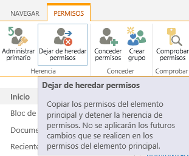

​Cuando ingresa a SharePoint (intranet, portal, extranet, etc…) a su sitio de trabajo habitual, está ingresando a la colección de sitios que lo contiene, muchas veces navega por el sitio principal de la colección, todas las colecciones de sitios deben tener un sitio principal, en la mayoría de ocasiones es llamado Home, Casa, Inicio, el nombre de la compañía, etc... Este sitio de nivel superior es la raíz de la colección de sitios.

**Importante que se tenga en cuenta**

- Herencia de permisos: cuando cualquier elemento de la imagen 1 (Sitio1, subsitio, lista, ítem…) está Heredando permisos, esto significa que obtiene los permisos del elemento inmediatamente arriba de él.
- Permisos Exclusivos: cuando el elemento tiene permisos exclusivos, esto significa que el elemento maneja de forma independiente su esquema de seguridad.

¿Qué sucede cuando dejo de heredar permisos?

Cambia el esquema de permisos del elemento a permisos exclusivos, haciendo una réplica inicial de los permisos el elemento al que estaba heredando.

¿Qué sucede cuando tengo un elemento con permisos exclusivos y vuelve a heredar permisos?
 Este elemento pierde todo el esquema de permisos que tenía y adopta el esquema de permisos del elemento inmediatamente superior a él.

El estándar de SharePoint dicta que al crear un nuevo sitio, este tiene dos opciones, la primera es heredar los permisos, de lo contrario, crear permisos exclusivos para este sitio (inicialmente nos propone que creemos 3 grupos de seguridad para manejar los permisos "Visitantes, integrante y dueños").  A la hora de crear una nueva lista, biblioteca o  un nuevo ítem, documento, evento…., estos heredan los permisos predeterminadamente.

Haciendo referencia la "imagen 1" en la parte superior tenemos el sitio de primer nivel, por ser el sitio de nivel superior en el encontrara una sección en la configuración del sitio llamada "Administración de la colección de Sitios" y en la sección "Usuarios y permisos" se encuentra la opción de agregar los administradores de la colección de sitios (únicamente se encuentra en el sitio de primer nivel).

**Administración de permisos en sitios y apps**

Los permisos de los demás elementos se manejan de la misma forma, ingresando a la administración de permisos del elemento, verifique si está heredando permisos y según su requerimiento maneje los premisos heredados o desherede el elemento y maneje permisos exclusivos.

Para administrar los permisos del sitio, valla a *Configuración del sitio -&gt; Usuarios y permisos - Permisos del sitio* (puede navegar hasta allí si es propietario del sitio).

- Para administrar los permisos de la lista, valla a *Configuración de la lista -&gt; Usuarios y permisos - Permisos para esta lista* (puede navegar hasta allí si es propietario de la lista)

En la interfaz de administración de permisos del sitio se puede evidenciar si algún elemento tiene permisos exclusivos, y acceder a la administración de los permisos de ese elemento desde el vínculo “administrar Permisos” que están frente al nombre de cada elemento.

**Configuración solicitud de acceso**

Opss… estamos trabajando en ello!

Cuando la creación de sitios es constante y los sitios tienen un alto nivel colaborativo, el ingreso o asignación de permisos puede ser un cuello de botella, para evitar esto se convierta en un problema, SharePoint nos provee tres opciones de solicitud de acceso. (Puede seleccionar la opción que se ajuste mejor a su ambiente)

- La primera permite que los usuarios que tengan un nivel de permiso colaborativo puedan compartir archivos y carpetas, esto hace posible que usuarios que NO tengan permisos en el sitio accedan y colaboren en documentos o carpetas específicas.
- La segunda permite que los usuarios inviten a otros a pertenecer al grupo de integrantes del sitio y así obtener acceso colaborativo en el sitio.

La tercera permite que los usuarios que ingresen al sitio y no tengan permisos, soliciten acceso exponiendo la razón por la cual es necesario su ingreso, todas las solicitudes serán enviadas al usuario que se defina por sitio, el cual podrá decidir si da o no acceso al sitio.

**Nota:** Esta configuración será realizada únicamente por un usuario que sea propietario del sitio o tenga un nivel de permiso mayor a este, los sitios que están heredando permisos también heredan esta configuración.

**Niveles de permisos**

Los permisos indispensables que debe conocer son:

| **Nombre del permiso** | **Descripción** |
| --- | --- |
| Control total | Tiene control total. |
| Diseño | Puede ver, agregar, actualizar, eliminar, aprobar y personalizar. |
| Editar | Puede agregar, editar y eliminar listas; puede ver, agregar, actualizar y eliminar elementos de lista y documentos. |
| Colaborar | Puede ver, agregar, actualizar y eliminar elementos de lista y documentos. |
| Leer | Puede ver páginas y elementos de lista, y descargar documentos. |

Son los permisos más comunes, existen muchos más, en este sitio puede verlos todos. [Ver sitio](http&#58;//office.microsoft.com/es-es/sharepoint-server-help/informacion-sobre-los-niveles-de-permisos-HA102772313.aspx)

No obstante los permisos existentes en ocasiones no cubren nuestros requerimientos, pero eso no es impedimento para nosotros, ¿Por qué?, porque podemos crear nuestros propios niveles de permisos, un ejemplo común es el siguiente: se requiere que en una biblioteca de documentos los usuarios puedan cargar documentos, editarlos, compartirlos pero NO eliminarlos, para este requerimiento debemos crear un nuevo nivel de permiso.

En este caso el nivel de permiso "Colaboración –eliminar" permite hacer lo mismo que el permiso "Colaborar" menos eliminar documentos, siendo así, podemos utilizar la opción *copiar nivel de permisos* y quitar el la opción de Eliminar elementos en la lista de acciones.

***Nota:*** para acceder la opción copiar nivel de permisos ingrese a Configuración del sitio -&gt; Usuarios y permisos – Permisos del sitio -&gt; Permisos – Niveles de permisos -&gt; [seleccione el permiso a copiar].

**Grupos de SharePoint**

Los grupos nos permiten dejar de manejar los permisos individualmente (a nivel de usuario) y comenzar a manejar conjuntos de usuarios, lo que hace mucho más fácil la administración, cuando creamos grupos, lo más relevante es seleccionar que usuarios deben ir en cada grupo y que nivel de permisos tendrá este grupo en el sitio.

SharePoint nos provee unos grupos predeterminados con su nivel de permiso, grupos como: Visitantes, Integrantes y Propietarios (grupos nombrados anteriormente).

Como pasa en los "niveles de permisos", existen muchos grupos más, y tampoco es impedimento para nosotros si estos grupos no cumplen nuestros requerimientos, porque también podemos crear grupos si lo necesitamos, es más, si los grupos están creados en el AD de la organización podemos utilizarlos dentro de SharePoint y asignarles permisos cuando los asignamos a un sitio o App.

**Fernando Chiquiza**
 Consultor SharePoint
 [djchiquiza@hotmail.com](mailto&#58;djchiquiza@hotmail.com) 
@fchiquiza
 [http://fernando-chiquiza.blogspot.com/](http&#58;//fernando-chiquiza.blogspot.com/)

