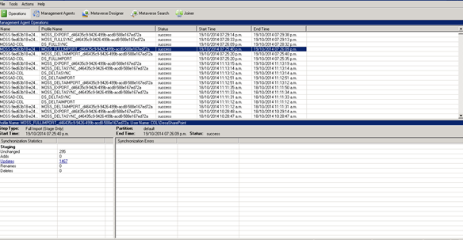

import ArticleHeader from '../../../components/article-header'

<ArticleHeader frontmatter={props.pageContext.frontmatter} />

​En este artículo hablaremos del FIM (Forefront Identity Manager) y sus beneficios en la sincronización de usuarios en SharePoint 2010.

**Que es Forefront Identity Manager**

En su versión básica (como la que tenemos con el miisclient.exe en SharePoint 2010) es usado para importar y exportar datos entre sistema de identidades.

**Para que nos sirve en SharePoint**

Nos sirve para ver (en línea) la ejecución de todas las operaciones que ocurren durante el proceso de sincronización cuando ejecutamos el servicio de User Profile (en la administración central de SharePoint).

**Cuáles son los pasos a continuación**

Los pasos que tenemos que seguir para usar FIM en SharePoint 2010 son los siguientes:

- Abrimos la administración central de SharePoint (en este caso 2010 y ejecutamos el servicio de User Profile (ya previamente configurado).

- Iniciamos la ejecución del servicio (en este caso sincronización completa)

- Para esto (dentro del servidor donde tenemos la administración central de SharePoint instalada) llegamos al path:

C:\Program Files\Microsoft Office Servers\14.0\Synchronization Service\UIShell\

- Y ejecutamos miisclient.exe (para el caso de SharePoint 2010, en SharePoint 2013 estará en la carpeta 15).

- Si nos damos cuenta nos muestra cuantos usuarios se adicionan y se actualizan.
- Si presionamos sobre update nos aparece el listado de usuarios actualizados.

- Y termina la ejecución (tanto del FIM como de la sincronización de perfiles)

- En caso de error sale una pantalla como la siguiente, en la cual nos aparecen los usuarios con error y el motivo del error.

Espero que este artículo sea de mucha utilidad.

**Enrique Rhenals Bárcenas**
 MCP SharePoint 2010 y 2013
[erhenalsb@hotmail.com](mailto&#58;erhenalsb@hotmail.com)
@enriquerhenals
 [http://enriquerhenalsb.blogspot.com](http&#58;//enriquerhenalsb.blogspot.com/)

