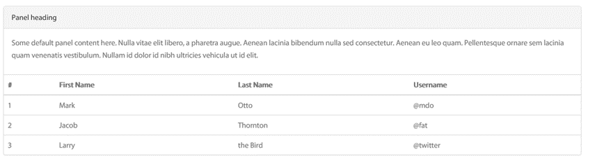
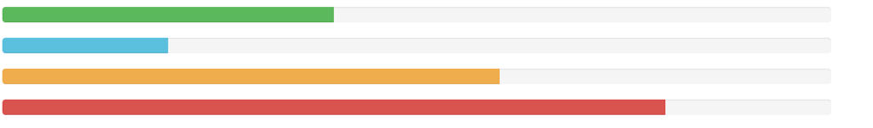
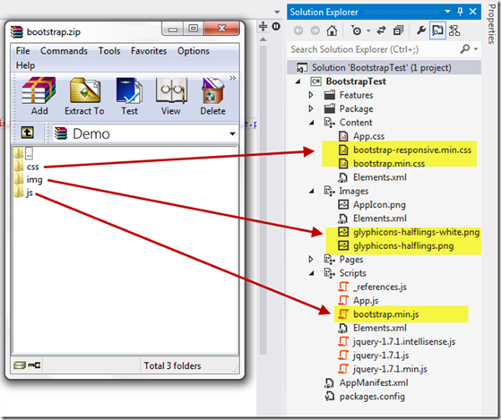
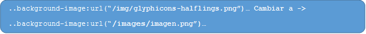

​A lo largo de este artículo hablaremos de Bootstrap como Framework para personalizar sitios de SharePoint Online y de SharePoint OnPremises, pero ¿Qué es Bootstrap? Bootstrap es un Framework muy completo que permite crear interfaces web con CSS y JavaScript que adaptan la interfaz dependiendo del tamaño del dispositivo en el que se visualice de forma nativa, es decir, automáticamente se adapta al tamaño de un ordenador o de una Tablet sin que el usuario tenga que hacer nada, esto se denomina diseño adaptativo o Responsive Design.

Aun ofreciendo todas las posibilidades que ofrece Bootstrap a la hora de crear interfaces web, los diseños creados con Bootstrap son simples, limpios e intuitivos, esto les da agilidad a la hora de cargar y al adaptarse a otros dispositivos.

El Framework trae varios elementos con estilos predefinidos fáciles de configurar: Botones, Menús desplegables, Formularios incluyendo todos sus elementos e integración jQuery para ofrecer ventanas y tooltips dinámicos.

Entre muchas de las posibilidades que ofrece Bootstrap podemos ver un claro ejemplo en la siguiente dirección: [http://www.ancadia.com/Pages/horizonscodes.aspx](http://www.ancadia.com/Pages/horizonscodes.aspx). Citando un ejemplo, con el siguiente código podemos crear una tabla:

```
<div class="panel panel-default">
```

```
  <!-- Default panel contents -->
```

```
  <div class="panel-heading">Panel heading</div>
```

```
  <div class="panel-body">
```

```
    <p>...</p>
```

```
  </div>
```

```
  <!-- Table -->
```

```
  <table class="table">
```

```
    ...
```

```
  </table>
```

```
</div>
```



O bien<br />con otro simple código podemos crear algo más complejo como las tan buscadas y<br />utilizadas barras de progreso:

```
<div> 
```

```
               class="progress">
```

```
               <div> 
```

```
               class="progress-bar" 
```

```
               role="progressbar" 
```

```
               aria-valuenow="60" 
```

```
               aria-valuemin="0" 
```

```
               aria-valuemax="100" 
```

```
               style="width: 60%;"
```

```
               <span class="sr-only">60% Complete</span>
```

```
               </div>
```

```
</div>
```


Y como resultado obtenemos:



Es muy fácil hacer diseños dinámicos dentro del Bootstrap ya que todo el código esta predefinido. Hasta aquí todo bien para los diseñadores Web, **¿Pero qué tiene que ver esto con las Apps de SharePoint?**

Como ya sabemos las Apps de SharePoint 2013 se basan al igual que las Web en HTML, CSS3 y JavaScript, la idea de integrar un Bootstrap dentro del desarrollo de Apps es genial, ya que nos adelantaría muchísimo el trabajo a nivel de interface y además podemos crear aplicaciones muchos más profesionales y dinámicas.

También es importante conocer que hay muchísimos desarrolladores trabajando para Bootstrap, la buena noticia es que podemos encontrarnos con ciertos desarrollos profesionales que podemos adaptar fácilmente a nuestra App una vez esté integrada. Es mucho más fácil integrar CSS y JavaScript a un Bootstrap que a una App o Web que se está desarrollando desde cero, esto es debido a que el Bootstrap ya trae una estructura claramente definida y muy simple.

La idea es muy buena pero ¿Cómo lo hacemos?

- El primer paso es crear nuestra App dentro de Visual Studio sin ningún código.
- Luego procederemos a descargar el Bootstrap que más nos convenga:


| **Versión** | **Descripción** | **Precio** | **Enlace de Descarga** |
| --- | --- | --- | --- |
| **Twitter Boostrap** | Es el Bootstrap convencional y original con las herramientas básicas de diseño. | Gratis | http://getBootstrap.com/ |
| **Ancadia Horizons** | Este Boostrap ya está adaptado completamente a SharePoint y además incluye herramientas de diseños para una apariencia más profesional de nuestra app como: Parallax , Modern UI y Flat Design. | $75 | http://www.ancadia.com/horizons |


- Una vez descargado Bootstrap procedemos a descomprimirlo en nuestro disco.
- Copiar el contenido de la carpeta CSS a la carpeta "Content" de la aplicación que ha creado en Visual Studio. Es importante copiar solo los ficheros  "-min."
- Copiamos el contenido de la carpeta \IMG  del boostrap a la carpeta "Images" de la aplicación.
- Para finalizar copiamos la carpeta \JS del Bootstrap a la carpeta "scripts" de la aplicación.




De esta forma, hemos vinculando los ficheros copiados a nuestra aplicación.

- Hasta ahora hemos visto cómo y dónde hay que copiar los ficheros necesarios para ejecutar el Bootstrap dentro de nuestra App, ahora debemos hacer funcionar esos ficheros. Lo primero que debemos hacer es agregar la siguiente referencia del Bootstrap debajo de la siguiente etiqueta: "PlaceHolderAdditionalPageHead" dentro de nuestra App:


```
<link rel="Stylesheet" type="text/css" href="../Content/Bootstrap-responsive.min.css" />
```

```
<link rel="Stylesheet" type="text/css" href="../Content/Bootstrap.min.css" />
```

```
<script type="text/javascript" src="../Scripts/Bootstrap.min.js"></script>
```

**Retoques finales**

Bootstrap utiliza dos archivos de imágenes que definen los iconos. Estos archivos de imagen fueron copiados en el paso anterior a la App justo en la carpeta \img. Como ya sabemos a diferencia del Bootstrap, SharePoint guarda las imágenes de la App en la carpeta "\Images":

- Crearemos una carpeta nueva llamada "\Images" haciendo uso del Explorador de Soluciones en Visual Studio.
- Editamos el archivo "Bootstrap.min.css" que se encuentra dentro de nuestra App (específicamente en la carpeta "Content")
- Luego hacemos una búsqueda con la palabra clave "IMG" dentro del fichero, a continuación encontrara la referencia que necesitamos modificar y simplemente cambiamos la ruta \img por \images.




**Conclusión**

Existen varios Frameworks costosos y complejos en el mercado como por ejemplo KENDO UI, que nos brindan funciones muy atractivas como el poder hacer gráficas y conexiones a la base datos. Pero con esta solución podemos obtener casi el 90% de esas funciones brindadas por estos Frameworks de una manera gratuita o muy bajo coste sin la necesidad de volver aprender a programar en nuevos entornos. Adicionalmente al ser un sistema abierto nos permitirá integrar códigos de terceros que pueden potenciar nuestra aplicación.


**Darwin Castro Marín**
 Microsoft Certified Solutions Expert 
[darwin.castro@ancadia.com](mailto:darwin.castro@ancadia.com)
 @ancadiasystems
 http://www.ancadia.com

