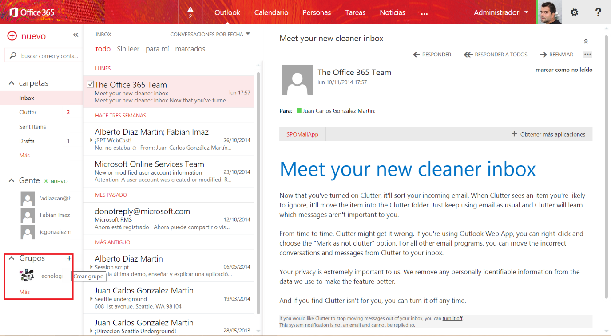
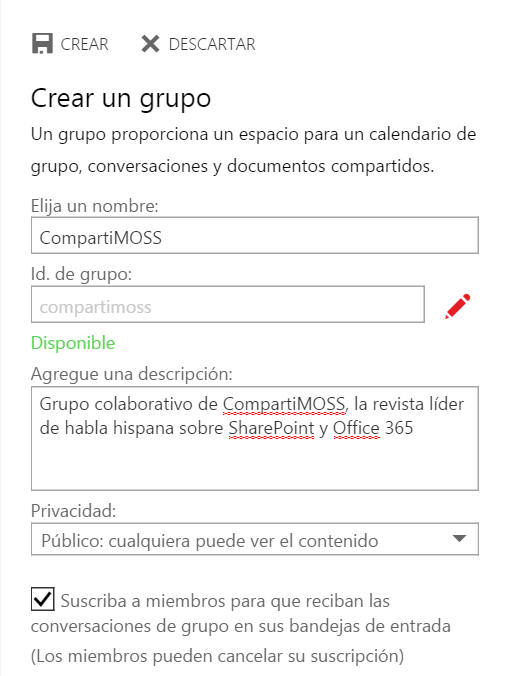
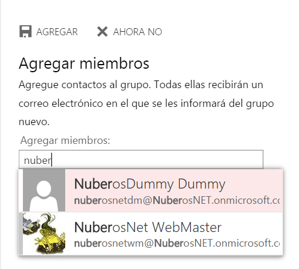
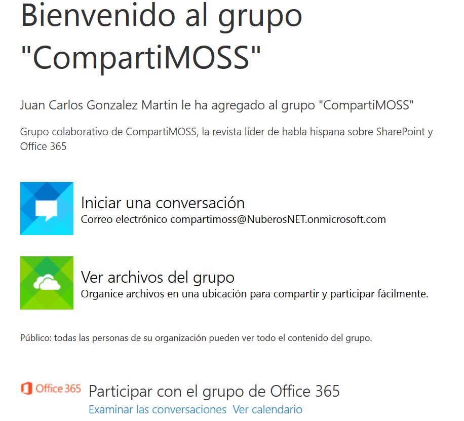
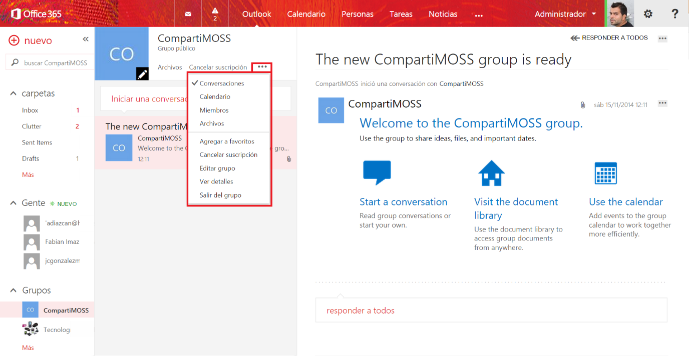
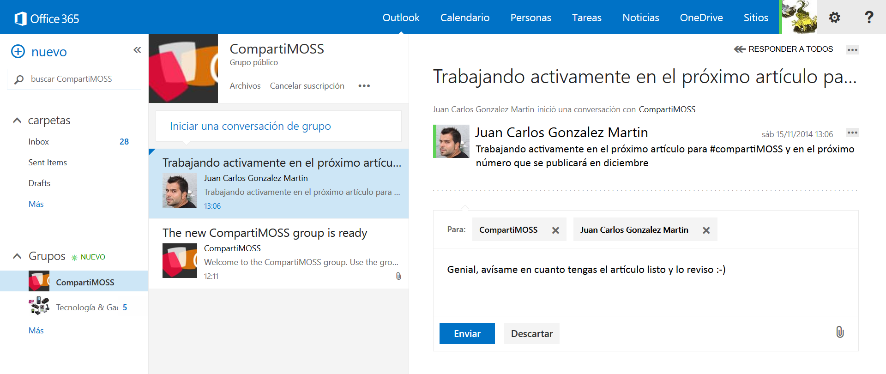
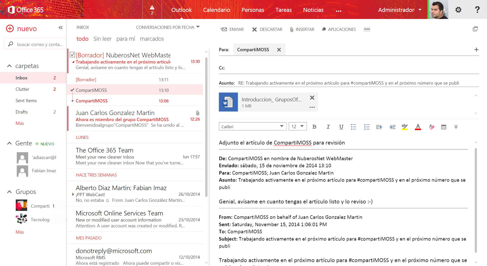
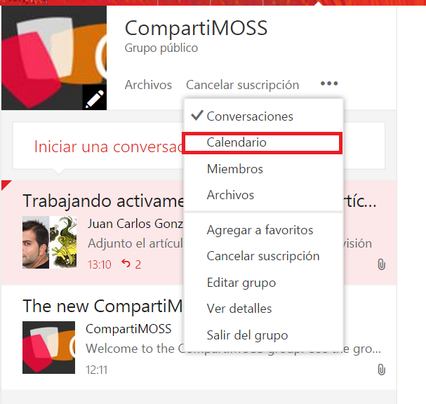
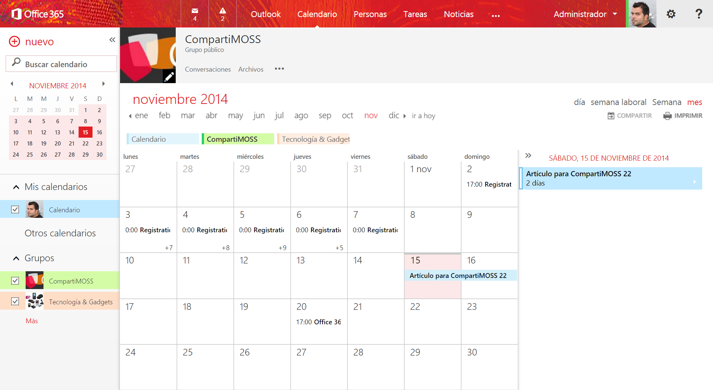
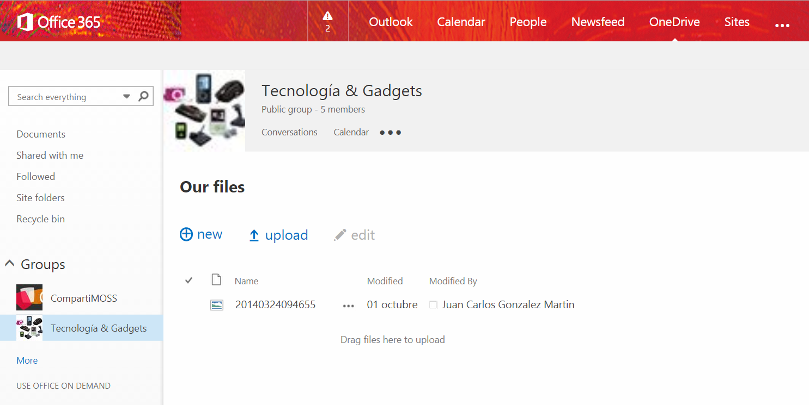

​Desde un punto de vista puramente conceptual, un Grupo se define como un espacio de trabajo compartido para e-mail, conversaciones, archivos y eventos de calendario en el que los miembros de un grupo pueden colaborar de forma rápida, productiva y sencilla a través de una interfaz de usuario simple y que permite que el usuario esté en todo momento centrado en la actividad que tiene lugar en el Grupo.

Aunque el anuncio de la disponibilidad de los Grupos de Office 365 se realizó el pasado mes de septiembre, la disponibilidad de los mismos no es global a día de hoy en Office 365, sino que se está liberando de forma gradual empezando por aquellos tenants de Office 365 en el que se ha habilitado la característica de "First Release" que permite disponer de las nuevas funcionalidades y novedades liberadas en Office 365 antes de que estén disponibles de forma global para todos los tenants de Office 365.

**Creación de un Grupo de Office 365**

La característica de Grupos de Office 365 está disponible, por el momento, a través del OWA de cada usuario de Office 365. Para poder crear un Grupo de Office 365 dese el OWA (**Nota:** Microsoft está liberando de forma incremental una serie de comandos PowerShell para poder trabajar con Grupos de Office 365 por medio de la línea de comandos), basta con realizar los siguientes pasos:

Accedemos al OWA de Office 365 y localizamos en el menú vertical la sección Grupos desde la que podemos ver un listado de Grupos en los que estamos participando bien porque los hemos creado nosotros o porque nos hemos suscrito a los mismos. Desde aquí podremos crear un nuevo Grupo haciendo clic en el botón "+".

La creación del Grupo se realiza a través de un panel que se habilita en el mismo momento en el que hacemos clic en la opción de Crear grupo. En este panel tendremos que completar la información relativa al nombre del grupo, el identificador del mismo, su descripción y si se trata de un grupo público o privado. Una vez estemos listos, pulsamos “CREAR” para que se proceda a crear el nuevo Grupo de Office 365.

- Cuando el Grupo de Office 365 está listo, podremos empezar añadir integrantes al mismo. Por el momento, sólo se pueden añadir como miembros a usuarios de nuestro tenant de Office 365, no siendo posible añadir usuarios de otros tenants de Office 365 o usuarios externos. Para añadir los usuarios al Grupo, basta con pulsar el botón “AGREGAR”.

Como resultado de añadir los integrantes al Grupo, se generan una serie de correos electrónicos de notificación a cada usuario indicando que forma parte del Grupo y además proporcionando una serie de instrucciones para empezar a colaborar en el mismo.

- Con estas configuraciones iniciales del se muestra la página principal del Grupo desde la que podremos comenzar a crear conversaciones, personalizar el Grupo (añadiendo un logotipo identificativo) o bien acceder a las funciones de administración del Grupo.

**Trabajo colaborativo en un Grupo de Office 365**

El trabajo colaborativo en un Grupo de Office 365 se basa en los siguientes elementos:

- Creación de conversaciones en el mismo de forma directa o bien a través del correo electrónico asociado al Grupo.
- Creando eventos en el Calendario del Grupo, disponible desde el momento en el que el Grupo es creado.
- O bien compartiendo información en el espacio colaborativo asociado al Grupo que es una Colección de Sitios de SharePoint Online.

Desde la perspectiva conversacional, la experiencia de creación de un diálogo es la misma que podemos encontrar en cualquier plataforma o herramienta social del mercado como Yammer, LinkedIn, etc. En este sentido, cada Grupo cuenta con un muro donde se pueden ver las conversaciones que están teniendo lugar y desde el que es posible añadir nuevas conversaciones o bien realizar comentarios en conversaciones existentes:

- La respuesta a la conversación se puede realizar directamente desde el propio Grupo o bien a través del correo de notificación que cada integrante del Grupo recibe desde el mismo momento en el que se crea una conversación.

- Por supuesto, en estas conversaciones se puede agregar no solo texto, sino que también se puede adjuntar archivos a la misma.

- Y como se puede apreciar en la Imagen 6, en la bandeja de entrada se reciben todos los mensajes relativos a las conversaciones del Grupo. Estos mensajes se pueden eliminar de la bandeja sin que sean borrados del Grupo como sucede con cualquiera de las plataformas sociales del mercado.

**Calendario de Grupo**

Los Grupos de Office 365 incorporan un calendario de Grupo en el que se pueden ir programando los distintos eventos relacionados con la actividad del mismo. Para acceder al calendario:

- Desde las opciones de configuración del Grupo (parte superior del muro), hacemos clic en la opción "Calendario".

- A continuación se muestra el calendario del Grupo de Office 365 en el que cada integrante del Grupo puede añadir nuevas citas, solapar dicho calendario con su calendario personal, etc.

De la misma forma que un Grupo de Office 365 dispone de un Calendario, cada Grupo cuenta con un espacio de documentación que es una colección de sitios que cuenta con una biblioteca de documentos en la que se puede ir cargando documentación del grupo. Precisamente es esta característica la que a día de hoy tiene mucho margen de mejora no solo desde el punto de vista de experiencia de usuario, sino también de gobernanza y control. Para acceder al sitio asociado al Grupo, basta con hacer clic en la opción “Archivos” disponible en el menú de opciones del Grupo .

**Conclusiones**

Siguiendo con su estrategia de aportar valor de forma continua a Office 365, Microsoft liberó el pasado mes de septiembre una nueva característica denominada Grupos destinada a facilitar el trabajo colaborativo en torno a una misma temática desde el OWA y proporcionando elementos de valor añadido como el Calendario de Grupo, el Sitio de Grupo y la integración a nivel de mensajería con Exchange Online.

**Juan Carlos González Martín**
MVP SharePoint de SharePoint Server | Arquitecto de Soluciones en LKS
E-Mail de Contacto: [jc.gonzalez@lks.es](mailto&#58;jc.gonzalez@lks.es)   
Twitter: @jcgm1978
Blog: [http://geeks.ms/blogs/jcgonzalez](http&#58;//geeks.ms/blogs/jcgonzalez) 
Web: [www.lks.es](http&#58;//www.lks.es/)

