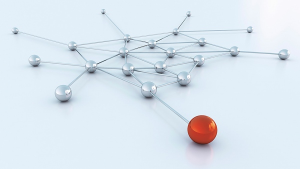
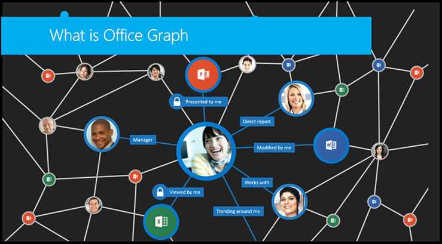
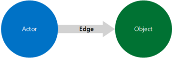
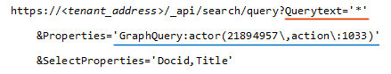
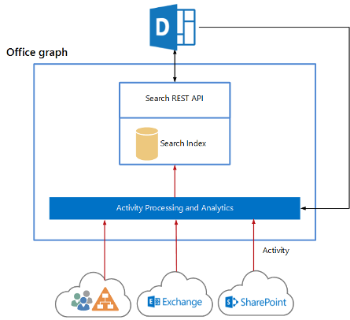
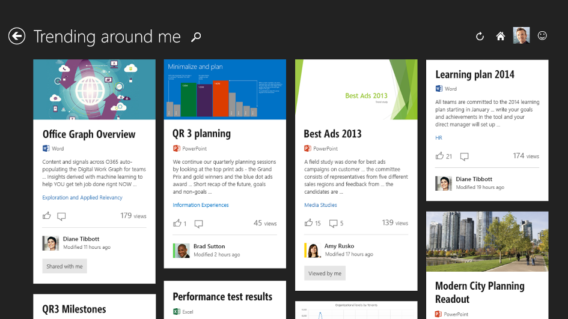
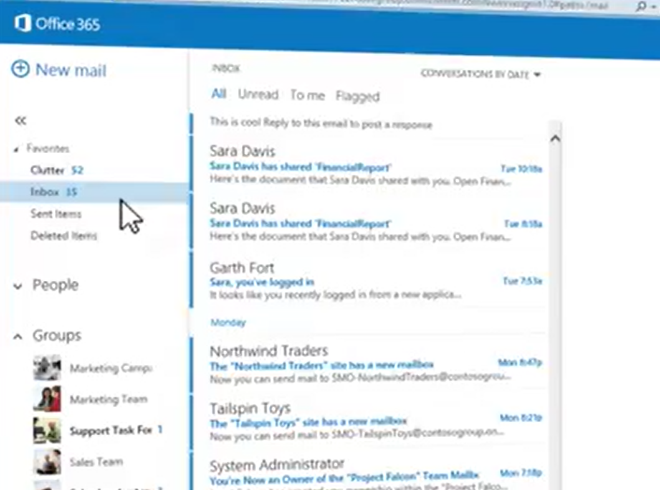

import ArticleHeader from '../../../components/article-header'

<ArticleHeader frontmatter={props.pageContext.frontmatter} />

​Como muchos de vosotros seguramente ya habréis visto u oído, Microsoft ha lanzado hace un par de meses algo llamado Office Delve, disponible inicialmente en Office 365 (planes "E"), "cosa" muy relacionada con algo llamado Office Graph y Machine Learning. En la misma línea unos días antes de liberar este artículo se ha anunciado Office Clutter como herramienta que también utiliza la misma tecnología base. Este artículo va dirigido a aquellos que todavía no habéis tomado contacto con estas herramientas o queréis saber de qué va esto de Graph, Delve y Clutter.

**Machine Learning**

Antes de hablar de Delve debemos hablar de Graph, y antes de hablar de Graph debemos hablar de Machine Learning, pero sobre este último podríamos escribir páginas y páginas sin acercarnos todavía a describir su capacidad y potencial. Entrando en materia podemos definir Machine Learning como una rama de la inteligencia artificial donde el objetivo principal es aprender y analizar señales pasadas con el objetivo de predecir las futuras. Esto que ha quedado tan bonito escrito y tan poco claro a nivel conceptual no es más que (y nada menos)  un conjunto de algoritmos destinados a buscar los patrones por los cuales una información origen se transforma en una información destino, y quiero recalcar que lo importante no es la transformación en sí misma sino la búsqueda del patrón que lleva a que un origen se transforme o catalogue en un destino de forma predecible.

Aunque a simple vista esta tarea harto complicada podría tener un beneficio poco tangible, en realidad abre las puertas a un beneficio mucho mayor llamado "Generalización", que no es otra cosa que aplicar los patrones obtenidos en un "pequeño" conjunto de información e intentar obtener esos patrones de cambio en la información, con el objetivo de predecir cómo se transformará o agrupará en los futuros conjuntos. Existen muchos ejemplos en los que lo podríamos aplicar esta lógica de autoaprendizaje del software, pero imaginaros el potencial que puede tener en cosas tan variopintas como predecir resultados de las elecciones basándonos en encuestas pasadas y los resultados que realmente se obtuvieron (de ahí obtendríamos nuestro patrón de información origen e información destino) o los patrones por los cuales un conjunto de células se transforman de "buenas" en "malas". Si os interesa este tema en particular tenéis más detalle y ejemplo adicional en una publicación reciente en mi Blog: [http://blogs.encamina.com/everyware/2014/11/07/un-poco-de-machine-learning-o-la-imitacion-binaria-de-el-agua-moja/](http&#58;//blogs.encamina.com/everyware/2014/11/07/un-poco-de-machine-learning-o-la-imitacion-binaria-de-el-agua-moja/)

**Office Graph**

Siguiendo con lo nuestro y ahora que tenemos una noción superficial de lo que es Machine Learning, es más fácil entender Office Graph, ya que Graph es la implementación de Microsoft de Machine Learning. Esta implementación, disponible por ahora sólo en Office 365, utiliza los algoritmos base definidos en Machine Learning con el objetivo de buscar la relación entre 3 grandes entidades como son Personas, Actividades y Contenidos. La forma en que esta información se "une", aunque ya sabemos que lo correcto sería hablar sobre el patrón que vincula unas entidades con otras, es mediante la búsqueda y aplicación de señales entre  Outlook, OneDrive, SharePoint y Yammer. Por ahora solo actúa sobre estos cuatro orígenes, pero cabe esperar la integración con Lync, Skype for Business, OneNote, los adjuntos del correo y el contenido de los enlaces publicados en todas las herramientas mencionadas anteriormente.

**En las tripas de Graph**

Seguramente una de las características más importantes de Graph es que permite realizar consultas mediante GQL (Graph Query Language) que está aún en fase beta. Está diseñado para realizar las consultas al modelo de Graph vía el API REST de las búsquedas de SharePoint Online y funciona devolviendo los elementos de una entidad que cumplen con una condición en particular.

Graph descubre el vínculo entre las entidades mediante la conjunción de 3 elementos que son el Actor (quién o "Actor"), la Acción (qué o "Edge") y el Objeto (dónde u "Object"). De esta forma podríamos obtener relaciones simples del tipo "Javier ha modificado Carta.docx" (actor, acción y objeto), u otras más complejas como "Alberto está trabajando con Articulo\_CompartiMOSS.pptx" (en este caso la acción no es simple sino que intrínsecamente implica varias iteraciones).

La sintaxis de estas consultas se construye como:

Donde QueryText es la entidad donde quieres realizar la búsqueda y es obligatoria, GraphQuery es el filtro que quieres aplicar (la acción que quieres obtener) y es opcional, y la última parte corresponde a los datos que quieres que te retorne la consulta.

https://&lt;direccion\_tenant&gt;/\_api/search/query?Querytext='\*'&amp;Properties='GraphQuery:ACTOR(ME\,OR(action\:1001\,action\:1003))'

Por ejemplo, si quiero obtener todos los elementos (\*) que han sido vistos o modificados por mí esta sería la llamada (Modificado = acción 1003 y Visto = acción 1001):

No quiero extender estas líneas con cientos de ejemplos de código pero sería pecado no dejaros [este enlace](http&#58;//msdn.microsoft.com/en-us/office/office365/howto/query-Office-graph-using-gql-with-search-rest-api) donde tenéis toda la sintaxis y multitud de ejemplos para empezar a jugar.

**Office Delve**

Si has llegado hasta aquí, imagino que ya sospechas lo que es Office Delve: es la primera herramienta que brinda al usuario información vinculada o relacionada con sus intereses sin necesidad de estar buceando en los repositorios donde yace esa información dentro de 365 (Exchange Online, OneDrive, SharePoint y Yammer). Para ello realiza consultas a Office Graph y otorga un interfaz más amigable y el posible "rankeado" de los resultados obtenidos. Esto quiere decir que por ejemplo, para preparar una reunión sobre Delve que tenemos la semana próxima con los colegas y también autores de esta revista, Alberto Diaz y Adrián Diaz, Delve nos ahorra tiempo en lo que se refiere a la búsqueda de material que necesitamos ya que devolverá contenidos referentes a algunas presentaciones que ya comparto internamente, mis post en Yammer sobre esta materia y algunos documentos que ya he compartido internamente. Y lo mejor de todo esto es que estos colegas no han tenido que hacer nada para que Delve les recomiende esta información, sino que ahí está la "inteligencia" de Graph buscando vínculos entre compañeros de trabajo y vínculos entre información que trata del mismo asunto.

Otra cosa importante que provee Delve es que nos permite utilizarlo como un motor de búsqueda estándar pero agregando una capa donde el usuario es el centro y la frontera de la información al mismo tiempo. Con esto quiero decir que podría realizar una búsqueda sobre un tema en particular y agregar refinamientos (al modo SharePoint) del tipo “que me haya gustado” (Likes en Yammer) o que “son tendencia” (en base a vistas y votaciones en SharePoint y Yammer).

**Office Clutter**

Anunciada su liberación por Microsoft este mismo mes, Office Clutter es la implementación de Graph para la Bandeja de Entrada (léase Outlook Online). Su objetivo es "limpiar" o mejor dicho, centrar la atención del usuario en lo realmente importante que llega por correo. Lo más significativo que debemos tener en cuenta es que el mismo tipo de algoritmos de Machine Learning que hemos comentado hasta ahora pueden ser también utilizados para centrar la atención en la bandeja de entrada. Básicamente Clutter mueve elementos no importantes de nuestra Bandeja de Entrada hacia un cajón desastre (Clutter Folder) con el objetivo de que nos centremos en lo realmente importante. Todos tranquilos! Clutter viene desactivado por defecto. Su funcionamiento se basa en valorar nuestro comportamiento con determinado correo y catalogarlo en importante o no según el asunto, cómo vienen los mensajes dirigidos hacia nosotros (To, CC, etc.), la temática, etc. De más está decir que Clutter funcionará mejor cuanto más lo utilicemos (esto es un corolario en Machine Learning) y Microsoft nos garantiza que esta información no será jamás compartida ya que es privada y personalizada para cada individuo. Una vez que el correo ha pasado al Clutter Folder, sea porque nosotros mismos lo hemos movido ahí o porque Clutter lo ha catalogado así, seguimos teniendo control total sobre ese correo por lo que podemos marcarlo como importante, moverlo, en fin, realizar cualquier acción como con cualquier otro mensaje. Por último mencionar que Clutter también funciona con los clientes de escritorio de Outlook pero su activación/desactivación se realiza por OWA (por ahora) y para los escépticos deciros que esto se puede realizar en cualquier momento. Para aquellos que no pueden esperar y quieren ver esto en funcionamiento ya mismo [aquí tenéis un vídeo](https&#58;//www.youtube.com/watch?v=uML5kmH5DYE) que lo resume.

**El futuro de Delve y Clutter**

Aunque parece que para el caso de Graph el futuro se vislumbra positivo y el espectro de aplicación es inmenso, podríamos decir que no está tan claro para el caso de Delve y Clutter. A mi entender existen dos grandes barreras que ambos deben tumbar y que podemos identificar claramente, aunque muy a mi pesar son contrapuestas:

- La primera es la necesidad de ampliar las fronteras de Delve hacia todo el resto de 365 e incluso hacia algunos servicios de Azure y  el resto del mundo. Cuanto mayor sea el rango de acción Delve (y por ende también aplica para Graph) mejor será la capacidad y acierto que tendrá en sus resultados. Parece muy obvia la necesidad de que su alcance incluya contenidos de Lync, CRM Online, PowerBI, o los resultados prevenientes de otros servicios afines como Azure SQL Databases, WebSites o Media Services por citar algunos. Lo que no parece tan obvio, y afortunadamente es público el cambio de visión de Microsoft en este aspecto, es incluir resultados externos a la nube de Microsoft, como podrían ser los foros de opinión que cada uno preferimos, las webs de noticias preferidas, los resultados de búsquedas en otros motores, etc. Desde mi modesto punto de vista creo que la solución está en seguir invirtiendo y ampliando el rango de acción por parte de Microsoft por un lado, y la apertura de mente hacia el resto de plataformas y tecnologías por otro, cosas en las que no cabe duda Microsoft está dando pasos muy específicos y positivos en los últimos tiempos.
- La segunda barrera y que probablemente es más psicológica que otra cosa, está del lado del usuario, ya que en algún momento podría interpretar que Delve y/o Clutter están atropellando los límites de su privacidad en la búsqueda de las relaciones entre la información, o en la catalogación de la misma. Estoy totalmente de acuerdo en que nos metemos en un terreno pantanoso donde la lógica y el sentido común se enfrentan al modo en que cada uno comparte información y la visibilidad u objetivo con el que se ha compartido esa información. Sin ánimo de buscar el debate en este aspecto (seguramente terminaríamos en el punto de partida) debemos ser conscientes y saber que aquí nada sucede de forma mágica, por lo que la información sobre la que se apoya Graph es información a la que de un modo u otro ha podido acceder y que cualquier persona con el tiempo y la paciencia necesarias hubiera sido capaz de vincular e hilar. Por este motivo creo que no debería ser este tema una barrera para el desarrollo y aceptación de Delve y Clutter, pero es verdad que la línea que separa lo que consideramos privado y público es muy fina y cambia de forma muy sutil en cada individuo, patrones que serán todo un reto de descubrir por parte de Graph.

**Para terminar…**

Todos hemos visto inventos que vienen y van, algunos caen por el camino y otros llegan para quedarse. El Machine Learning lleva más de 30 años entre nosotros y sigue insistiendo y tomando distintas formas y nombres pero su objetivo es el mismo: hacer que las máquinas "piensen" en pro de hacernos la vida más fácil. Más que pensar que esto es una  demostración fehaciente de vagancia humana deberíamos verlo como parte de la evolución, y si alguien no lo ve así está en todo su derecho, pero no olvides a aquellos que dijeron que "esto de los cajeros automáticos va a fracasar porque todo el mundo quiere sacar su dinero del banco interactuando con un cajero físico", o "es imposible controlar a distancia un robot en la superficie de Marte", o aquellos otros que dijeron que "una máquina nunca será capaz de construir un coche".

Otro tema es que tardemos más o menos en utilizar popularmente sus ventajas, lo que está directamente relacionado con lo inteligente y útil que sea su aplicación, pero todo parece indicar que iremos a más en este aspecto. Desde mi humilde opinión no veo tan lejano recibir información de mis colegas y comparativas en tiempo real sobre el phablet de última generación que estuve viendo esta mañana en un escaparate a través de mis Google Glasses, y si esa información perdura y tiene importancia solo y hasta que haga la compra o la deseche, estará todo dicho.

**Javier Menéndez Pallo**
Director Oficina Centro – España y Portugal 
ENCAMINA
[jmenendez@encamina.com](mailto&#58;jmenendez@encamina.com)

