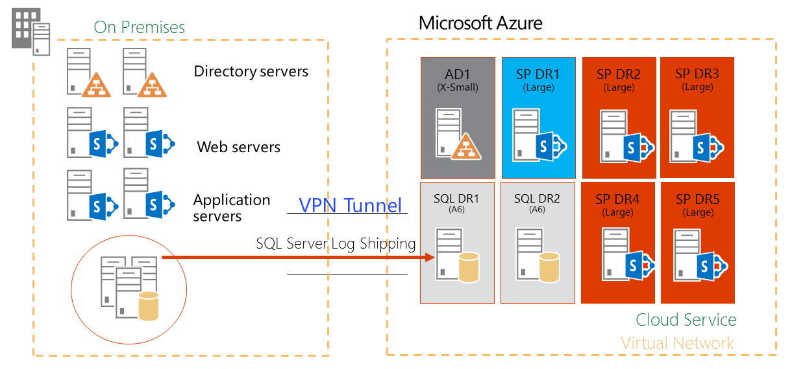
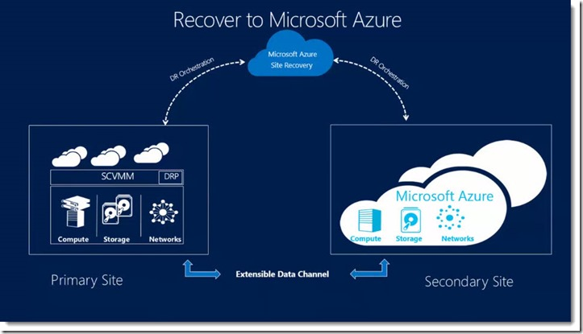

​Actualmente tenemos dos versiones de SharePoint, SharePoint 2013 y SharePoint Online, con algunas funcionalidades de diferencia, bien porque nos encontramos con ciertos límites del entorno de ejecución en la nube, bien porque se han desarrollado nuevas funcionalidades que no han llegado a la versión On-Premises.

**¿Por qué tener SharePoint 2013 en la nube?**

A estas alturas, todos tenemos claros los ahorros de coste que supone usar la nube como servicio o a modo de infraestructura, eso sí, desde el punto de vista de SharePoint, hay que tener claro que el modo servicio, SharePoint Online, limita su extensibilidad y las personalizaciones, extensiones o desarrollos actuales no son compatibles. Si hablamos de control, coste y eficiencia, tenemos:

- SharePoint On-Premises nos obliga a administrar y gestionar el hardware/software
- SharePoint IaaS, nos abstrae del hardware y nos permite centrarnos en el software, manteniendo el acceso a todas las opciones de desarrollo y despliegue
- SharePoint Online (SaaS) nos abstrae tanto del hardware como del software, a cambio de un entorno limitado de extensibilidad.

Nuestra primera opción debería de ser SharePoint Online pero por el camino nos encontraremos opciones en la que nos debemos de plantear un modelo híbrido, bien con SharePoint totalmente On-Premises o a modo de Iaas, por ejemplo, en Azure.

**Plataforma de desarrollo y pruebas**

SharePoint tiene fama de monstruo de las galletas y se come todos los recursos de hardware que se ponen a su disposición. Si desarrollamos soluciones para SharePoint necesitas tener un SharePoint instalado por cada desarrollador, lo que nos lleva a tener un mínimo de 16Gb de RAM por máquina virtual.

Un entorno de pruebas o Pre-Producción, debería de ser un entorno similar al de Producción, lo que nos podría llevar a 4, 5 o 6 servidores.

¿Tenemos infraestructura suficiente dar soporte a estas necesidades? ¿Cuántas horas de pruebas necesitamos?

Por qué no llevarnos estos entornos a la nube y aprovecharnos de un coste reducido cuando no estén en uso, facilidad en el aprovisionamiento y mayor seguridad al no tener a nuestros partners desarrollando en nuestro datacenter.

**Plataforma de intranet y colaboración**

Cuando SharePoint Online no cumple con nuestros requisitos de negocio, no tenemos otra que usar la versión On-Premises. Plantearse tener esta misma versión en modo IaaS, soportado por Microsoft en Azure, es más que viable y supone ahorres de coste y de administración, además de agregar un nivel adecuado de seguridad.

**Recuperación ante desastres de una granja On-Premises en Azure**

Azure tiene todas las capacidades para convertirse en nuestro datacenter secundario en una zona geográfica segura. Dependiendo del [modelo de recuperación](http://technet.microsoft.com/en-us/library/ff628971%28v=office.15%29.aspx) que necesitemos, mantendremos los costes controlados en función de los recursos que estemos consumiendo. Muy a tener en cuenta que, en caso de desastre, la elasticidad de la nube es un punto a favor para garantizar la respuesta ante el aumento de la carga de trabajo.

Además, uno de los últimos servicios disponibles en Azure permite mantener una infraestructura de [recuperación de sitios](http://azure.microsoft.com/es-es/services/site-recovery/) o máquinas virtuales desde On-Premises a Azure.

Desde el punto de vista de SharePoint, es un modelo más sencillo y administrable de mantener las réplicas de nuestro datacenter principal en Azure, o de máquinas o servicios sencillos, se encuentren donde se encuentren.

**Sitios públicos de SharePoint en Azure**

SharePoint es una de las principales plataformas de publicación de contenido web, pero SharePoint Online no cubre todas las capacidades que tenemos en SharePoint On-Premises. Si nuestro sitio web necesita extensibilidad o escalabilidad, SharePoint Online no cubre nuestras necesidades y la opción la encontramos en SharePoint On-Premises.

Utilizar la infraestructura de Azure para tener los servidores públicos de la organización, nos permite aprovecharnos de la seguridad de los datacenters de Microsoft y la elasticidad que nos permite es escalado de la infraestructura. Todo esto para centrarnos en construir un buen sitio y no gastar recursos en construir una buena infraestructura.

**Conclusiones**

El principal reto que nos encontraremos para subirnos a la nube es el cálculo del coste, dependiendo de los servicios que usemos, tendremos una serie de variables que compondrán el gasto mensual que tendremos que pagar. Teniendo claro cómo podemos estimar estos costes, por ejemplo, mediante el cálculo de la telemetría de los servicios que estamos usando actualmente en nuestro datacenter, se nos abre un camino directo hacia Azure donde encontraremos infinidad de ventajas a nivel de costes y mantenimiento. Teniendo claro que la opción más clara es caminar hacia SharePoint Online, no siempre es la más adecuada ante las necesidades de los usuarios pero no hay que perder de vista que no siendo en Online, SharePoint 2013 gana ventajas en Azure.

**Alberto Diaz Martin**
 MVP SharePoint
 [adiazcan@hotmail.com](mailto:adiazcan@hotmail.com) 
 @adiazcan 
 [http://geeks.ms/blogs/adiazmartin](http://geeks.ms/blogs/adiazmartin)

