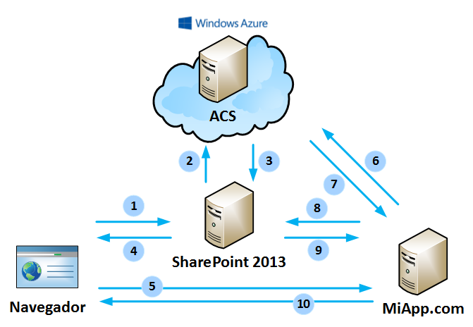
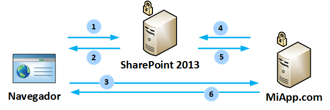

​A estas alturas todos sabemos más o menos que es el modelo de aplicaciones en la nube (*cloud* *app model*) que trajo SharePoint 2013. Se trata de que el código de las aplicaciones de SharePoint ya no se ejecuta en el proceso de SharePoint (uno de los procesos w3wp.exe de IIS) sino en otra ubicación, fuera de SharePoint. De esta manera se asegura la estabilidad de la granja de SharePoint, ya que el código a medida está físicamente separado de SharePoint.

También sabemos que existen dos principales tipos de aplicaciones de SharePoint 2013: SharePoint-hosted y provider-hosted. Hasta hace poco existía una tercera solución, auto-hosted, pero nunca salió de la versión "Preview" y fue abandonada en junio de 2014. Las aplicaciones SharePoint-hosted solamente pueden contener código JavaScript, ya que se ejecutan en el navegador, mientras las aplicaciones provider-hosted son las verdaderas *cloud apps* de SharePoint 2013.

Sin embargo, es poco conocido que las aplicaciones de SharePoint 2013, y aquí me refiero a las provider-hosted, pueden tener **dos modalidades en cuanto a nivel de seguridad**. Una modalidad, la más conocida actualmente es aquella en la que la aplicación y SharePoint utilizan el servicio Access Control Service (ACS) en la nube. La gran mayoría de ejemplos de apps de SharePoint 2013 son ejemplos de esta modalidad, llamada *low-trust* o de baja confianza. Pero, en los entornos on-premise existe otra modalidad llamada *high-trust* o de alta confianza.

En un proyecto reciente me he visto metido con mucho detalle en la arquitectura de aplicaciones high-trust. Debido a que hay poco conocimiento de este tipo de aplicaciones, he decidido compartir con vosotros lo que he aprendido construyéndolas, ya que son muy adecuadas para hacer aplicaciones on-premise en entornos corporativos.

**Aplicaciones Low-Trust**

En el modelo de aplicaciones low-trust de SharePoint, entre el servidor de SharePoint y el servidor donde está la aplicación existe un componente de Azure, llamado ACS, que hace de mediador para que SharePoint "se fíe" de las llamadas que hace nuestra aplicación hacia él. El flujo de la autorización queda explicado en el diagrama siguiente.

1. El usuario abre una página de SharePoint en la que está incrustado el WebPart de la aplicación MiApp.com (un IFRAME).
2. SharePoint detecta que hay que autorizar la aplicación y para ello necesita un token de contexto, firmado por ACS. Pide un token a ACS.
3. ACS firma el token con un secreto que solo conocen SharePoint y la MiApp.com y lo devuelve a SharePoint.
4. SharePoint usa el token para incluirlo en la petición que va a realizar dentro del IFRAME (la WebPart). Devuelve el HTML de la página al usuario.
5. Al tener un IFRAME, el navegador realiza la petición a la URL de MiApp.com. La URL incluye el token de contexto.
6. La aplicación recibe la petición HTTP. Extrae el token de la petición y comprueba la firma del token con el secreto que tiene la aplicación. De esta manera la aplicación sabe que la petición viene de SharePoint y es válida. Para acceder a SharePoint mediante CSOM o REST, la aplicación necesita un token de acceso. Dentro del token de contexto recibido, se encuentra un token de refresco. MiApp.com hace una petición a ACS pasándole el token de refresco.
7. ACS verifica que el token de refresco es válido para el origen de la petición. Si es así, le devuelve un token de acceso a SharePoint, válido durante unas horas.
8. MiApp.com realiza una petición a SharePoint para obtener los datos a mostrar. Incluye el token de acceso en la petición.
9. SharePoint comprueba la validez del token de acceso y devuelve los datos que la aplicación le ha pedido.
10. La aplicación renderiza el HTML que se va a visualizar en el IFRAME y lo devuelve al navegador.

Lo más extraordinario de esta danza de peticiones entre el navegador, SharePoint, ACS y la aplicación es que es totalmente transparente para el usuario y que no requiere de ninguna configuración previa para que ACS funcione. Lo único que se necesita es que haya conectividad entre la aplicación, SharePoint y ACS que está en Internet y que haya confianza entre SharePoint y ACS.

Sin embargo, en entornos on-premise es frecuente que las máquinas dentro del datacenter no tengan conectividad hacia Internet, por lo que no podríamos utilizar ACS para la autorización de acceso a SharePoint. Además, lo que es peor, una instalación de SharePoint on-premise utiliza certificados autofirmados (self-signed) para firmar tokens, que no se aceptan en ACS. Configurar ACS para granjas de SharePoint on-premise es posible, pero implica demasiado trabajo (sustituir el certificado autofirmado por un certificado SSL, registrar el certificado en Azure Active Directory que tiene relación de confianza con ACS).

Sin embargo, disponemos de otra modalidad: high-trust apps.

**Aplicaciones High-Trust**

Las aplicaciones High-Trust no usan intermediario para hablar con SharePoint, como ACS, sino que se identifican mediante certificados digitales con el sistema de clave pública y privada. SharePoint puede validar que un token proveniente de la aplicación sea válido porque dispone de la clave pública del certificado.

El flujo de la autorización high-trust o también llamada Server-to-Server (S2S) queda explicado en el diagrama siguiente.

1. El usuario abre una página de SharePoint en la que está incrustado el WebPart de la aplicación MiApp.com (un IFRAME).
2. SharePoint devuelve el HTML de la página al usuario.
3. Al tener un IFRAME, el navegador realiza la petición a la URL de MiApp.com.
4. La aplicación recibe la petición HTTP. Para acceder a SharePoint mediante CSOM o REST, la aplicación necesita un token de acceso. La aplicación construye el token de acceso y lo firma con la clave privada de su certificado. Incluye este token en la petición a SharePoint.
5. SharePoint comprueba la validez del token de acceso con la clave pública del certificado de la aplicación y devuelve los datos que la aplicación le ha pedido.
6. La aplicación renderiza el HTML que se va a visualizar en el IFRAME y lo devuelve al navegador.

Comparado con el modelo low-trust, la autorización high-trust es más sencilla. La propia aplicación construye su propio token de acceso. Por esto mismo llamamos "high-trust" a este modelo: SharePoint "se fía" de lo que le dice la aplicación, sobre todo en la parte de los permisos del usuario. Mientras en una aplicación low-trust SharePoint prepara un token de contexto, que incluye los datos del usuario actual, una aplicación high-trust rellena la parte de usuario y SharePoint confía en que es correcta. Veremos ejemplos de esta confianza en los artículos siguientes de esta serie.

Sin embargo, alta confianza no quiere decir confianza total. La aplicación puede hacer como mucho lo que quien instala la aplicación le permite, igual que en las aplicaciones low-trust. Lo único que cambia es que la aplicación puede hablar directamente con SharePoint, de servidor a servidor, para acceder a datos y pasar tokens de acceso.

Para más detalles, cabe decir que tanto aplicaciones low-trust como high-trust implementan la autorización siguiendo el estándar OAuth, usando diferentes tipos de flujos de autorización de OAuth recogidos en el estándar.

**Conclusión**

Hemos visto que disponemos de dos modelos de autorización de aplicaciones de SharePoint 2013: low-trust y high-trust. Low-trust utiliza un intermediario en Azure ACS y es muy adecuado para aplicaciones que se van a distribuir en la tienda de SharePoint o se van a instalar en Office 365. High-trust es más adecuado para aplicaciones corporativas ya que simplifica el flujo de autorización y permite mayor flexibilidad en las credenciales del usuario.

En los próximos artículos veremos cómo configurar una aplicación high-trust en SharePoint 2013 on-premise y cómo podemos mezclar diferentes tipos de autenticación para SharePoint y para la aplicación.

**Edin Kapić**
 Arquitecto SharePoint – MVP de SharePoint Server
 [edin.kapic@spenta.es](mailto:edin.kapic@spenta.es)
 @ekapic
 [http://www.spenta.es](http://www.spenta.es/)

