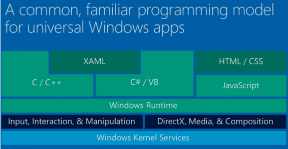

​Algunas de las preguntas típicas que nos solemos hacer los desarrolladores con frecuencia a la hora de abordar una solución de movilidad sobre SharePoint son: ¿se verá nuestra Intranet con el iPad?, ¿tiene un diseño adaptable?, ¿será compatible con todos los dispositivos?

Estas y otras preguntas, forman cada vez más, parte de los requisitos esenciales en todos los proyectos informáticos. A continuación describiremos algunos métodos para llevarlo a cabo tanto en SharePoint 2010 como en SharePoint 2013.

Vamos a diferenciar estas alternativas en 2 grupos o familias que serían:

- Aplicaciones Personalizadas
- Personalización de la interfaz

Las acciones que llevaremos a cabo serán modificar la representación de la información para poder adaptarla según el dispositivo. Estamos limitados en cuanto a que la interfaz no puede ser totalmente personalizada, pero conseguimos nuestro objetivo de una manera rápida y sencilla. Las herramientas que usaremos serán:

- Device Channels  (no disponible en SharePoint 2010)
- CSS Media Queries

**Device Channels**

Esta nueva característica solo disponible en SharePoint 2013, nos permite representar nuestra Intranet de diferentes maneras dependiendo del dispositivo, forma parte de las características de publicación y nos permite modificar los estilos, imágenes y otros aspectos sin variar la Url, y a través del User Agent, se hace la detección del dispositivo.

**Css Media Queries**

Este módulo de CSS3 permite crear  estilos específicos para cada tamaño, de manera que en una sola hoja de estilos podemos agregar todas las casuísticas dependiendo del tipo de resolución, sin tener en cuenta el dispositivo.

**Aplicaciones Personalizadas**

En este apartado, las acciones serán crear una aplicación totalmente personalizada, pero que consuma los datos de nuestra Intranet, de manera que podamos crear interfaces nativas que nos permite mejorar la experiencia de usuario, aunque por otro lado necesitaremos más tiempo para conseguir nuestro objetivo. Las herramientas, tecnologías de desarrollo y formas de consumo de la información que usaremos serán:

**Tipos de Aplicaciones**

- App Híbrida  - Apache Cordova /PhoneGap.
- App Universal Windows - W8 & WP8.
- App Nativa Multiplataforma – Xamarin.

**Tecnología de Desarrollo**

- JavaScript
- C#

**Consumo de la información**

- SharePoint 2013: Servicio API REST, JSOM (Modelo Objeto JavaScript) y CSOM (Modelo Objeto Cliente)
- SharePoint 2010: Servicio SOAP, API REST (Limitado), JSOM (Modelo Objeto JavaScript) y CSOM (Modelo Objeto Cliente)

**Publicación en los Market Place**

- Es necesario tener cuenta y licencia para publicar en el market de aplicaciones de las distintas plataformas

**Como crear una App Híbrida Apache Cordova /PhoneGap**

Cuando hablamos de App Híbrida nos referimos a una aplicación Web que la encapsulamos en una aplicación móvil. Esto nos permite emular la capa visual de cada dispositivo a través de un WebView o capa que los Frameworks nombrados anteriormente nos permiten acceder a la mayoría de funcionalidades del dispositivo en el que estamos corriendo la aplicación.

A través de estas funcionalidades podemos construir nuestra capa de presentación con la funcionalidad, y acceder a la mayoría de eventos de nuestro dispositivo pudiendo a su vez, consumir la información de nuestro SharePoint:

**Como Empezar**

- Herramientas:
    - Visual Studio 2013 Update 3  + Aplicaciones Hybridas Multi Dispositivo para Visual Studio CTP2.0.
- Tener a mano las referencias de la  API:
    - [http://cordova.apache.org/docs/en/4.0.0/guide\_support\_index.md.html#Platform%20Support](http://cordova.apache.org/docs/en/4.0.0/guide_support_index.md.html#Platform%20Support)
- Seguir la documentación publicada en MSDN:
    - [http://msdn.microsoft.com/en-us/library/dn771545.aspx](http://msdn.microsoft.com/en-us/library/dn771545.aspx)

**Como crear una App Universal Windows (WP8 & W8)**

Cuando hablamos de App Universal hablamos de aplicaciones creadas para Windows  y Windows Phone que comparten código, controles, estilos y otros componentes entre dos proyectos de Visual Studio. Esto permite desarrollar más rápidamente la aplicación y que sea más fácil de mantener. Una vez tenemos una aplicación de una de las 2 plataformas, es sencillo poder crear una aplicación para la otra, y aunque compartimos código, siempre nos permite poder diferenciarlas en el caso de controles no soportados, por ejemplo.

Ejemplo

Como Empezar:

- Herramientas:
    - Visual Studio 2013 Update 2  + Window App Certification Kit + Windows Phone 8.1 SDK
- Tener a mano las referencias de la  API:
    - [http://msdn.microsoft.com/en-us/library/windows/apps/br211377.aspx](http://msdn.microsoft.com/en-us/library/windows/apps/br211377.aspx)
- Seguir la documentación publicada en el sitio de desarrollo para Windows:
    - [http://dev.windows.com/en-us/develop/building-universal-windows-apps](http://dev.windows.com/en-us/develop/building-universal-windows-apps)

**Como crear una App Nativa Multiplataforma – Xamarin**

Cuando hablamos de App Multiplataforma, nos referimos a una aplicación que es capaz de mostrar controles nativos a partir del código que escribamos. En el caso de Android sería Java, en el caso de iOS sería Objective C o Swift, y en el caso de Windows Phone sería C# y Xaml.  Xamarin por su parte, es una plataforma de desarrollo que nos permite desarrollar nuestras aplicaciones desde código C#  y poder compilarlo y *paquetizarlo* al resto de plataformas móviles  como Android, iOS y Windows Phone.

Podemos compartir la capa de datos, negocio o servicio, y sólo nos quedaría personalizar la capa de presentación para cada plataforma como vemos en la siguiente imagen. Viendo esta problemática es cómo surgió la nueva característica: Xamarin-Forms.

**Xamarin Forms**

Esta nueva funcionalidad surgió hace poco y lo que nos permite es desarrollar interfaces de diseño nativas con código C# compartido entre todas las plataformas. Con un mismo código, tenemos 3 capas de diseño iguales, una para cada plataforma.

Como Empezar

- Herramientas:

Visual Studio 2013 Update 2 + Xamarin for Visual Studio + Xamarin Bussiness Licence

- Tener a mano las referencias de la  API:
    - http://developer.xamarin.com/guides/
- Seguir la documentación publicada en el sitio de desarrollo para Xamarin:
    - [http://developer.xamarin.com/](http://developer.xamarin.com/)

**En resumen…**

El resumen de las opciones que tenemos para movilizar SharePoint son las siguientes:

| Solución | Tecnología | Pros | Contras |
| --- | --- | --- | --- |
| **Device Channels**   | HTML5 + CSS3 | <ul><li>Master Page y CSS específico por dispositivo</li><li>Estructura única aislada , por dispositivo</li></ul> | <ul><li>Tener que crear toda la estructura y tener que&#160; mantenerla para cada dispositivo.</li><li>No disponible en SharePoint 2010</li></ul> |
| **CSS Media Queries** | HTML5 + CSS3 | <ul><li>Estándar web , fácil de mantener y modificar</li><li>Centralizado en una hoja de estilos.</li></ul> | <ul><li>No permite distinguir por tipo de dispositivo</li><li>Todo debe ser personalizado y adaptado a SharePoint. </li></ul> |
| **App Híbrida**  **-** **Apache Cordova /PhoneGap**   | HTML5 + CSS3 | <ul><li>Estándar web , fácil de mantener y modificar</li><li>Capa de Acceso a funciones del dispositivo</li><li>Multiplataforma</li></ul> | <ul><li>Capa Visual no nativa</li><li>Peor rendimiento que una APP Nativa</li><li>No accesibles todas las funciones del dispositivo</li></ul> |
| **App Universal Windows W8 & WP8**     | XAML + C#  HTML5 + Javascript | <ul><li>Compartición de Capa Visual y capa de datos</li><li>Proyectos aislados pero compartiendo código</li></ul> | <ul><li>No es multiplataforma</li><li>Solo funciona en dispositivos W8 y WP8</li></ul> |
| **App Nativa Multiplataforma - Xamarin**   | C# | <ul><li>Multiplataforma</li><li>APP Nativa</li><li>Sin Necesidad de aprender otros lenguajes</li><li>Compartición de código</li></ul> | <ul><li>Limitado a los controles por defecto o crear controles personalizados</li><li>Lentitud al depurar</li></ul> |

**Conclusiones**

A través de los ejemplos mostrados, podemos concluir que tenemos muchas maneras y diferentes tecnologías para mostrar la información de nuestro SharePoint. Todas ellas son válidas, solamente hay que buscar las más adecuada dependiendo de nuestros requisitos. En el próximo artículo hablaremos sobre cómo crear una App y como consumir información de nuestro SharePoint.

**Rubén Toribio**
 SharePoint Architect en Necsia
 @rtoribiog

**Jorge Serrano**
 Microsoft MVP en Necsia
 @J0rgeSerran0

