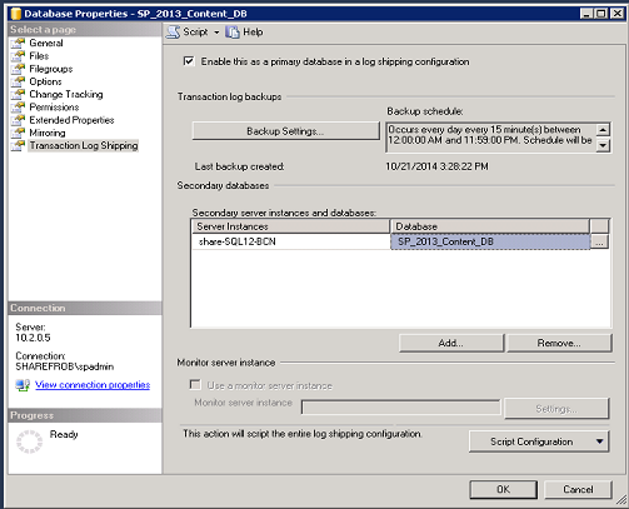
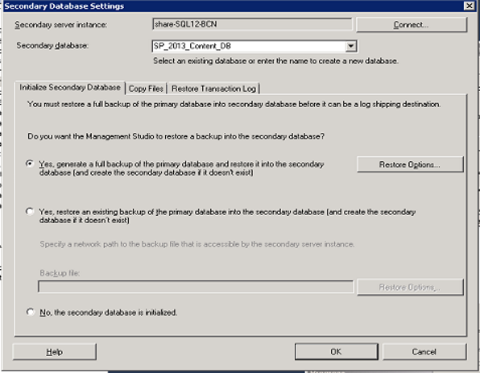
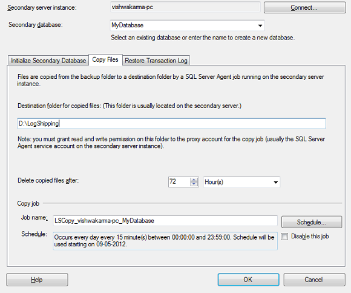
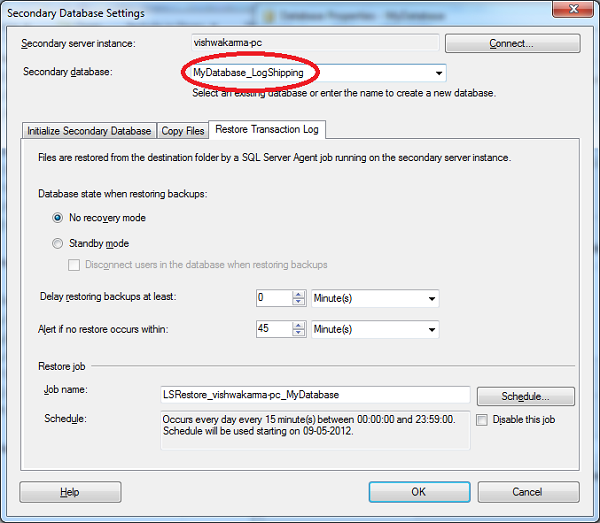
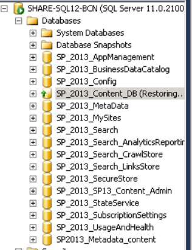
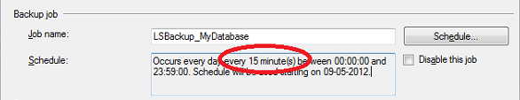
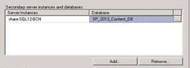

import ArticleHeader from '../../../components/article-header'

<ArticleHeader frontmatter={props.pageContext.frontmatter} />

​Tal y como mencionaba en mi artículo anterior, una vez establecida la arquitectura replicada, había que hacer algo con ella, y una de las opciones era el establecimiento de replicación entre granjas.

**Como establecemos Log Shipping**

Para establecer la replicación por Log Shipping, es necesario realizar las siguientes acciones:

1. Eliminar la aplicación web de contenido configurada originalmente.
2. Apagar los servidores de SharePoint de la granja secundaria.
3. Acceder al SQL Manager desde la granja primara.
4. Conectar el SQL Manager con la granja secundaria.
5. Para cada una de las bases de datos a replicar:

> a. Pulsar con el botón derecho sobre la BBDD correspondiente, y seleccionar *propiedades*.
> 
> b. En el cuadro que se abre a continuación, seleccionar la última opción en la izquierda, denominada *Transaction Log Shipping*.
> 
> c. En la ventana, seleccionar "*Configure this database as a primary database for a Log Shipping Configuration*".

> A continuación, configurar las opciones de backup a utilizar. En este paso se recomienda crear, en la unidad de logs, tanto del servidor origen como en el servidor destino, un directorio compartido denominado "LogShiping"
> 
> d. En la parte inferior, denominada "*Secondary Databases*", pulsar sobre el botón Add. Esto permitirá añadir contra la base de datos que vamos a replicar. Se recomienda, para las bases de datos de contenido borrar la base de datos de destino para comprobar que la replicación se ha llevado la última versión del origen. La ventana que aparecerá es la siguiente:

> Seleccionar la primera opción. En la segunda pestaña, “*Copy Files*”, seleccionar I:LogShipping, según el nombre de directorio seleccionado.

> En la tercera pestaña, denominada “*Restore Transaction Log”*, seleccionar None. Esto dejará la base de datos destino permanentemente en modo restauración, por lo que recibirá las modificaciones efectuadas cada vez que se realice el backup de origen (de forma estándar, cada 15 minutos).

6. Al pulsar aceptar, el sistema mostrará un cuadro de dialogo donde veremos cómo se hace un backup de origen, se exporta al servidor secundario, y se restaura, mostrando este la base de datos en estado *Restoring*.

7. Acceder a las bases de datos de origen, y para el job de backups (este paso es para evitar perdida de datos durante la configuración en destino).

8. Para cada una de las bases de datos que estén en estado restoring, lanzar el siguiente comando desde una ventana de comandos de SQL:

*RESTORE DATABASE database WITH RECOVERY*

**Pasos necesarios solo para la aplicación WEB (no para las bbdd de aplicaciones de servicio)**

9. A continuación, levantar los servidores de SharePoint de la granja destino, y configurar una nueva aplicación web. En la especificación de la base de datos de contenido, introducir el nombre de la base de datos restaurada (en el ejemplo, SP\_2013\_Content\_DB) y no seleccionar nombre de host. En caso contrario, la aplicación web no reconocerá las colecciones de sitios ya configuradas en la base de datos exportada.

10. Tras la creación, en la opción de administración de aplicaciones à Administrar bases de datos, debe aparecer la base de datos asociada con la nueva aplicación web, y las colecciones de sitios correctamente inventariadas.

11. Acceder a la nueva aplicación web y comprobar que el contenido mostrado es el mismo que en el origen.

Con esta última comprobación, queda demostrado que el log shipping está correctamente configurado. A continuación, es necesario para de nuevo los servidores de SharePoint, y volver a habilitar el backup de las base de datos de origen para que el log shipping quede funcionando. Las bases de datos deben aparecer en destino como Restoring.

**Procedimiento de Balanceo por Disaster Recovery**

El procedimiento de Balanceo por Disaster Recovery será necesario en caso de fallo catastrófico de la granja principal. Este procedimiento consistirá en arrancar la granja secundaria, restaurando las bases de datos de contenidos y de aplicaciones de servicio. Para ello:

Para cada base de datos en estado *Restoring*:

1. En el servidor de origen, deshabilitar el job de replicación accediendo desde sql a DatabaseàPropertiesàLog Shipping replication à Backup Settings à Disable this job .

2. Lanzar la orden *RESTORE DATABASE database WITH NO RECOVERY*.

3. Arrancar los servidores de SharePoint-

4. Una vez estén todos los servidores levantados, acceder a la Administración Central.

5. [Solo para las aplicaciones web] acceder a administración de aplicaciones à bases de datos de servicio.

6. Seleccionar cada aplicación web a comprobar, y verificar que en la base de datos asociada (la cual debe ser la que hemos restaurado) aparecen correctamente al menos una colección de sitios.

7. En caso de que alguna base de datos no se haya montado correctamente, lanzar la siguiente orden en powershell:

| `Mount-SPContentDatabase``"MyDatabase"` `-DatabaseServer``"MyServer"` `-WebApplication <a href=``"http://sitename/"``>http://sitename</a>` |
| --- |

El orden correcto de aplicación de este procedimiento es levanter primero las bases de datos de las aplicaciones de servicio, y posteriormente levantar las bases de datos de las aplicaciones web.

**Procedimiento de Actualización de la granja secundaria**

Este procedimiento se deberá ejecutar cada vez que se requiera instalar nuevas versiones de las soluciones desplegadas en la granja. Para ello:

1. Aplicar el mecanismo de disaster recovery hasta tener la granja secundaria operativa.
2. Instalar las actualizaciones de las soluciones y comprobar que las aplicaciones web responden correctamente.
3. Una vez comprobada la correcta aplicación de las actualizaciones, apagar los servidores de la granja SP comenzando por los frontales.
4. Para cada base de datos que deba ser sincronizada:
    1. Volver a activar el job de replicación en el SQL de origen.
    2. Comprobar que las bases de datos se ponen en modo replicación (puede tardar unos minutos, hasta que se lance la siguiente replicación).
    3. En caso de no ponerse en modo replicación, borrar la base de datos destino del logshipping y volver a añadirla.

**Procedimiento de Balanceo hacia la granja Principal**

Una vez solucionado el motivo que nos obligó a enviar el tráfico de los usuarios hacia la granja secundaria, es necesario volver a balancear este tráfico hacia nuestra granja principal. Para garantizar que no se pierde trabajo de una granja a otra, mi recomendación es establecer de nuevo el log shipping desde la granja secundaria hacia la principal, de forma que todas las bases de datos en la granja principal sean actualizadas con los contenidos generados en el tiempo entre el desastre y su resolución. Una vez replicadas estas bases de datos, será posible volver a pasar el tráfico a la granja principal, y reestablecer el log shipping como estaba configurado originalmente.

**Nota Importante:**

Aunque el establecimiento de una granja secundaria es un mecanismo de seguridad importante, en modo alguno esto puede sustituir a un adecuado dimensionamiento de la granja principal,

**Procedimiento de Balanceo hacia la granja Principal**

Una vez solucionado el motivo que nos obligó a enviar el tráfico de los usuarios hacia la granja secundaria, es necesario volver a balancear este tráfico hacia nuestra granja principal. Para garantizar que no se pierde trabajo de una granja a otra, mi recomendación es establecer de nuevo el log shipping desde la granja secundaria hacia la principal, de forma que todas las bases de datos en la granja principal sean actualizadas con los contenidos generados en el tiempo entre el desastre y su resolución. Una vez replicadas estas bases de datos, será posible volver a pasar el tráfico a la granja principal, y reestablecer el log shipping como estaba configurado originalmente.

**Nota Importante:**

Aunque el establecimiento de una granja secundaria es un mecanismo de seguridad importante, en modo alguno esto puede sustituir a un adecuado dimensionamiento de la granja principal, conforme a las mejores prácticas, y a un adecuado mantenimiento según un plan de gobernanza adecuado. Para profundizar en estos contactos recomiendo leer los artículos de mis amigos Alberto Días, Juan Carlos Gonzalez y Miguel Tabera.

**Fabián Calvo**
 Team leader
 [fcalvo@encamina.com](mailto&#58;fcalvo@encamina.com) 
@fcvspain
 [http://www.encamina.com](http&#58;//www.encamina.com/)

