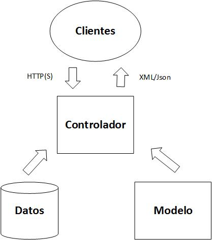

​SharePoint siempre ha sido un sistema abierto a aceptar modificaciones por medio de programación y que expone todos sus componentes e información al mundo exterior por medio de un API (Application Programming Interface) muy poderoso. Ese es, probablemente, uno de los factores más importantes para su aceptación empresarial. Aunque SharePoint siempre ha tenido una API remota (basada en Servicios Web), es decir, que permite crear software que interactúa con el servidor sin que sea indispensable instalar los programas localmente, no fue hasta la versión 2010 cuando Microsoft le incluyo un API remoto basado en REST (Representational State Transfer).

REST, como se explica más adelante en detalle, es un protocolo abierto y público que permite intercambiar información entre dos sistemas informáticos remotamente. En los últimos años, REST se ha convertido en el estándar para intercambio de información por excelencia, siendo utilizado por todos los grandes fabricantes de software (Amazon, Google, etc.), incluyendo a Microsoft. REST, fuera de ser un protocolo práctico y fácil de utilizar, soluciona los problemas técnicos de rapidez de ejecución bajo carga y transparencia a través de Internet que otros protocolos de Servicios Web, como SOAP, WSCL y BEEP, presentan.

A su vez, Microsoft ha creado un Framework de programación para crear servicios REST llamado WebAPI, basado en ASP.NET e integrado en Visual Studio. De esta forma, es fácil construir servicios que accedan una gran cantidad de clientes, incluyendo navegadores y dispositivos móviles.

**REST**

Representational State Transfer, REST, es el acronímico de moda cuando se habla de conectar sistemas informáticos diversos de forma remota. REST es un protocolo abierto y publico definido por el W3C (World Wide Web Consortium) Technical Architecture Group, la misma organización que define los protocolos de HTTP, HTML y CSS, entre otros.

Aunque en pocas palabras se puede definir a REST como un Framework para enviar comandos a un servidor por medio del URL y recibir respuesta en forma de XML, el protocolo es más complejo que solamente esto:

REST es Cliente-Servidor. Esto significa que el protocolo parte del principio de que la comunicación se realiza entre dos sistemas, uno que solicita operaciones y otro que las provee, y que existe un contrato entre los dos que especifica en que formato tanto los comandos como los resultados serán enviados para que los dos sistemas se comprendan entre ellos.

REST no mantiene el estado (Stateless), es decir, cuando el servidor realiza la operación solicitada, "olvida" toda la información relacionada con el cliente. Esto implica que tanto la consulta como la respuesta tienen que contener toda la información relevante: no se permite, por ejemplo, realizar consultas escalonadas como una unidad, en las que una consulta se basa parcialmente en los resultados de la operación. En este caso, cada consulta se maneja independientemente, y las subsecuentes operaciones tienen que ser iniciadas por el cliente. También como una consecuencia de esta regla, REST no es transaccional de ninguna manera.

REST permite cachear la información enviada por el servidor. Todo servidor REST debe estar en capacidad de enviarles a los clientes información sobre si es posible cachear la respuesta, y por cuanto tiempo. Esto le permite a las aplicaciones cliente mantener una copia de la respuesta localmente evitando otras consultas, hasta que el tiempo de expiración (dado por el servidor) termina.

REST utiliza una interface de comunicación. Por definición, el protocolo que utiliza REST es HTTP(S) por medio de un URI (Uniform Resource Identificator). Popularmente se puede decir que REST utiliza un URL (Uniform Resource Locator) para enviar las consultas, pero eso es técnicamente incorrecto. Un URI es un subset de un URL, pues solamente contiene información sobre el recurso a utilizar ("../contratos/1") y no en donde encontrarlos ("http://servidor/contratos/1"). También, y como consecuencia de utilizar HTTP, es necesario utilizar solamente los verbos definidos por ese protocolo (GET, PUT, etc.) y no es posible definir verbos personalizados. Otra consecuencia de utilizar HTTP es que tanto las consultas como las respuestas tienen que ser creadas en XML o en alguno de sus dialectos (Json, por ejemplo) para que puede atravesar proxies, gateways, etc.

OData (Open Data Protocol) está íntimamente relacionada con REST. Este protocolo, que también es abierto y público, permite la creación y consumo de consultas REST. Que es, como se puede utilizar y programar OData se trata en la segunda parte de este artículo.

Finalmente, REST utiliza básicamente XML como lenguaje de comunicación, aunque es posible configurar el protocolo para que utilice JSON. JSON (JavaScript Object Notation) es un formato de intercambio de información, basado en XML, fácil de leer y entender por humanos, y fácil de generar por computadores pues utiliza convenciones que son familiares a lenguajes de programación de la familia de "C" (CSharp, C++, Java, Perl, Phyton, etc.). Además, JSON utiliza menos ancho de banda que XML por el hecho de ser menos "locuaz".

**WebAPI**

ASP.NET WebAPI es el Framework de Microsoft para crear servicios HTTP y REST. Es bastante similar a ASP.NET MVC (Model View Controller) pues contiene enrutadores, controladores, acciones, filtros e inyección de dependencias, aunque no forma parte del Framework MVC. WebAPI es una parte básica de la plataforma ASP.NET y puede ser utilizada con cualquier tipo de aplicaciones, incluyendo las creadas utilizando MVC, aplicaciones Web y aplicaciones Windows. También puede ser utilizada para la creación de aplicaciones de Servicios Web.

WebAPI es una excelente Framework para exponer data y servicios a diferente tipos de dispositivos, además de ser open source y una plataforma ideal para construir servicios REST sobre el Framework .NET. A diferencia de servicios REST creados con WCF (Windows Communication Foundation), utiliza y expone todas las características de HTTP y el desarrollador no necesita definir ningún tipo de configuraciones especiales para que el software funcione con diferentes dispositivos.

Aunque WebAPI se puede utilizar con Visual Studio 2012 instalando el Framework adicionalmente a la instalación básica, Visual Studio 2013 lo instala por defecto. La versión actual de WebAPI, 2.0, forma parte de todas las versiones de Visual Studio 2013, hasta el update 4. Microsoft ha anunciado que la versión 2.2 del WebAPI, que soporta las características de la última versión de OData (4.0), formará parte de Visual Studio en la próxima versión.

Aunque servicios REST se pueden programar también con WCF, WebAPI proporciona todos los elementos básicos por medio de las plantillas de Visual Studio, aligerando y facilitando considerablemente la creación de servicios. Aunque no existen cifras oficiales de Microsoft, se pueden encontrar pruebas de carga en Internet ([http://blogs.msdn.com/b/fkaduk/archive/2014/01/07/rest-wcf-vs-webapi-throughput.aspx](http&#58;//blogs.msdn.com/b/fkaduk/archive/2014/01/07/rest-wcf-vs-webapi-throughput.aspx) por ejemplo) que muestran que la capacidad de respuesta de servicios creados con WebAPI, aunque estadísticamente ligeramente inferior a los creados con WCF, no difieren significativamente, pero las ventajas que ofrece en rapidez de programación la señalan como la herramienta indicada para la creación de servicios REST.

Básicamente un servicio REST creado con WebAPI consiste de dos componentes principales: Modelos y Controladores. Un servicio Web puede tener uno o más modelos y uno o más controladores. A diferencia de un programa MVC, un servicio creado con WebAPI no necesita Viewers (un servicio Web no tiene interface propia):



Los Clientes envían consultas al Controlador utilizando HTTP(S) y reciben respuestas en forma de XML o JSON. El Modelo es una clase de .NET que ofrece una representación de las entidades que el servicio maneja. Los Datos puede ser cualquier tipo de repositorio: bases de datos, otros servidores como SharePoint o CRM, archivos, etc. El Controlador es el corazón del sistema: accede a los Datos y los procesa utilizando su lógica interna transformándolos en las entidades definidas por el Modelo. El Framework de WebAPI se encarga de manejar toda la comunicación con los Clientes, el ruteo de las consultas al Controlador apropiado, la validación de las consultas, etc.


**Creación de un Servicio REST con WebAPI 2**

El siguiente ejemplo ha sido pensado para que sea lo más sencillo posible, de tal forma que se pueda demostrar lo fácil que es crear un servicio REST con el WebAPI. Por simplicidad, inicialmente el ejemplo solamente utiliza como fuente de datos un array creado en el mismo servicio, pero en los siguientes artículos se irá ampliando para acceder datos externos provenientes de SharePoint. El ejemplo y las imágenes han sido creados utilizando Visual Studio 2013 Update 4 y C#, pero cualquier versión de Visual Studio 2013 (y Visual Basic) producirá los mismos resultados.

- Inicie Visual Studio. Seleccione "Nuevo proyecto" y luego seleccione la plantilla "Web" – "Aplicación web ASP.NET". Asígnele un nombre al proyecto.


En la ventana de Nuevo proyecto, seleccione "Empty" como plantilla y "Web API" en la sección de "Agregar carpetas y referencias principales para:". Si la casilla de "Host en la nube" esta seleccionada, deselecciónela pues se va a crear el proyecto localmente. Igualmente, seleccione "Sin autenticación" desde el botón "Cambiar autenticación", si es que el botón está activado.


- La plantilla de Visual Studio crea toda la estructura del proyecto, incluyendo carpetas para los controladores y modelos, y todas las referencias iniciales necesarias. Note que si en el punto anterior se selecciona la plantilla "Web API", Visual Studio crea un sitio completo y totalmente funcional de MVC que funciona con el Web API. Este proyecto puede ser interesante como punto de partida para un sitio funcional y como método de aprendizaje, pero no es práctico para crear un nuevo servicio REST desde el principio.
- Seleccione la carpeta "Models" en el Explorador de soluciones y utilizando el menú contextual (botón derecho del ratón) seleccione "Agregar" – "Clase". Asígnele un nombre a la nueva clase (en el ejemplo se llama "Elemento").
- En la ventana de la nueva clase, bajo la definición de la clase, agregue el código que se muestra a continuación:


```
public class Elemento
```

```
{
```

```
    public Elemento()
```

```
    {
```

```
    }
```

```
 
```

```
    public Elemento(int Id, string Nombre, string Categoria, decimal Precio)
```

```
    {
```

```
        this.Id = Id;
```

```
        this.Nombre = Nombre;
```

```
        this.Categoria = Categoria;
```

```
        this.Precio = Precio;
```

```
    }
```

```
 
```

```
    public int Id { get; set; }
```

```
    public string Nombre { get; set; }
```

```
    public string Categoria { get; set; }
```

```
    public decimal Precio { get; set; }
```

```
}
```

El Modelo "Elemento" define las entidades que el servicio va a utilizar, en este caso, una llamada "Elemento" que tiene como propiedades un identificador, nombre, categoría y precio. La clase además tiene un constructor que inicializa los valores de la entidad.

- Seleccione la carpeta "Controllers" en el Explorador de soluciones y utilizando el menú contextual (botón derecho del ratón) seleccione "Agregar" – "Controlador".
- En la ventana de Scaffold seleccione "Controlador de Web API 2 – en blanco". Asígnele un nombre al nuevo archivo respetando el final del nombre que debe ser como esta predefinido ("Controller"). En el ejemplo se llama "ElementosController".


- En<br />la nueva ventana, bajo la definición de la clase, agregue el siguiente código:


```
public class ElementosController : ApiController
```

```
{
```

```
    private static List<Elemento> myElementos = Inicializador();
```

```
 
```

```
    private static List<Elemento> Inicializador()
```

```
    {
```

```
        List<Elemento> ElementosIniciales = new List<Elemento>();
```

```
        ElementosIniciales.Add(new Elemento(1, "aaa", "111", 1.1M));
```

```
        ElementosIniciales.Add(new Elemento(2, "bbb", "222", 2.2M));
```

```
        ElementosIniciales.Add(new Elemento(3, "ccc", "333", 3.3M));
```

```
        return ElementosIniciales;
```

```
    }
```

```
 
```

```
    public IEnumerable<Elemento> GetAllElementos()
```

```
    {
```

```
        return myElementos;
```

```
    }
```

```
 
```

```
    public IHttpActionResult GetElemento(int id)
```

```
    {
```

```
        Elemento unElemento = myElementos.Where(e => e.Id == id).First();
```

```
        if (unElemento == null)
```

```
        {
```

```
            return NotFound();
```

```
        }
```

```
        return Ok(unElemento);
```

```
    }
```

```
}
```

Note que la clase hereda de "ApiController" en lugar de "Controller" como lo hace un programa basado en MVC. Inicialmente, como se indicó anteriormente, se define un array con valores fijos para el ejemplo. Dos métodos definen las acciones que el servicio Web va a realizar: retornar todos los Elementos de la Lista genérica (GetAllElementos) y retornar un Elemento específico indicando su identificador como parámetro de entrada (GetElemento). El primer método devuelve el array completo y el segundo utiliza una función lambda para encontrar el elemento solicitado. Note que se utilizan dos métodos especiales ("NotFound" y "Ok") que el WebAPI se encargara de renderizar apropiadamente como códigos de HTML (404 y 200) en la respuesta al cliente.

Abra el archivo "App\_Start" – "WebApiConfig.cs" y observe en la línea 19 como se ha definido la ruta de acceso a los métodos (endpoints): "api/{controller}/{id}". Esto significa que el framework del WebAPI reemplazara "{controller}" con el nombre del archivo que contiene el Controlador, y "{id}" con el identificador que se encuentre en el URL

**Testeo del Servicio Web**

En principio ya se tiene un servicio REST totalmente funcional. Inicie el proyecto desde Visual Studio (F5 o "Depurar" – "Iniciar depuración"). Visual Studio compila el proyecto y lo hostea utilizando IIS Express utilizando un puerto que se puede definir en las Propiedades del proyecto, sección "Web" – "Url del proyecto", o utilizando el que Visual Studio mismo le asigne de forma aleatoria. Note que el navegador mostrará un mensaje indicando "Error HTTP 403.14 – Forbiden", que se puede negar pues un servidor REST no tiene interface de usuario, solamente es necesario que este configurado correctamente en IIS (o en IIS Express, como lo hace Visual Studio)

En el navegador utilice el URL "http://localhost:[NumeroPuerto]/api/elementos". Internet Explorer no muestra los resultados sino que permite descargarlos en un archivo separado o abrir el archivo ("elementos.json") directamente. Firefox si muestro el resultado directamente en la pantalla. Si se utiliza el botón de "Abrir" en Internet Explorer, el resultado aparecerá en Visual Studio mismo (si no es que otro programa ha sido configurado para abrir archivos con extensión .json):


- De igual forma, utilizando el URL "http://localhost:[NumeroPuerto]/api/elementos/1", el servicio retornara los valores del Elemento solicitado:


Aunque Internet Explorer no es la mejor herramienta para testear Servicios REST, otros navegadores, como Firefox, disponen de mejores posibilidades para ver e interactuar con los resultados. Por ejemplo, Firefox muestra los resultados directamente en la pantalla sin necesidad de descargar y abrir un archivo como en IE.

Probablemente la mejor herramienta actualmente para depurar y trabajar con servicios REST es Fiddler ([http://www.telerik.com/fiddler](http&#58;//www.telerik.com/fiddler)). Esta herramienta permite no solo interceptar las consultas y respuestas y mostrarlas en diferentes formatos, sino que también permite crear y enviar consultas directamente al servicio sin necesidad de crear una aplicación cliente especializada, entre otras muchas cosas.

La siguiente figura muestra Fiddler enviando una consulta (pestaña "Composer") al servicio acabado de crear. Note que se está usando el verbo "GET" y el URL creado por IIS Express y Visual Studio ("http://localhost:33497") junto con el URI que llama al servicio ("/api/elementos"):


Para<br />ver la respuesta del servicio, utilice la pestaña “Inspectors” de Fiddler. Es<br />posible renderizar la respuesta en XML, en Json o verla tal como la envía el<br />servicio (“Raw”). Adicionalmente, Fiddler ofrece mucha más información al<br />respecto, como por ejemplo los cookies utilizados.


**Operaciones CRUD con el Servicio REST**

Hasta ahora, el ejemplo solamente permite hacer consultas para ver todos los elementos, o solo uno de ellos. Pero REST permite realizar todas las operaciones CRUD (Create, Read, Update, Delete) con la información.

Amplíe la clase "ElementosController" con los siguientes tres métodos:

```
public HttpResponseMessage PostElemento([FromBody] int ElementoId)
```

```
{
```

```
    Elemento nuevoElemento = new Elemento();
```

```
    nuevoElemento.Id = ElementoId;
```

```
    myElementos.Add(nuevoElemento);
```

```
    HttpResponseMessage myRespuesta = 
```

```
Request.CreateResponse(HttpStatusCode.Created);
```

```
    myRespuesta.Headers.Location = new Uri(Request.RequestUri + "/" +
```

```
            (nuevoElemento.Id).ToString());
```

```
    return myRespuesta;
```

```
}
```

```
 
```

```
public void PutElemento(int id, [FromBody] string Nombre)
```

```
{
```

```
    Elemento myElemento = myElementos.Where(e => e.Id == id).First();
```

```
    myElemento.Nombre = Nombre;
```

```
}
```

```
 
```

```
public void DeleteElemento(int id)
```

```
{
```

```
    myElementos.Remove(myElementos.Where(e => e.Id == id).First());
```

```
}
```

El primer método crea un nuevo elemento en el array y devuelve una respuesta del tipo "HttpResponseMessage" indicando el resultado final de la operación. Note en este método una de las restricciones de Json: solamente se puede enviar un parámetro decorado como "FromBody", lo que obliga a crear primero el elemento solamente con su identificador como en el ejemplo, y luego, en operaciones subsiguientes, agregarle la información adicional (Nombre, Categoría y Precio). Hay principalmente dos formas de solucionar la limitación:

- Enviar un objeto serializado que contenga toda la información, en este caso un objeto del tipo "Elemento".
- Enviar los parámetros separados como QueryString.


El segundo método modifica un Elemento existente, utilizando como parámetros su identificador y el valor del campo a modificar. Aquí vale la misma restricción descrita anteriormente: solamente se puede enviar un valor utilizando la decoración de "FromBody".

Finalmente el tercer método elimina un Elemento utilizando como parámetro de entrada el identificador del elemento. En estos dos últimos métodos se utiliza una consulta Lambda para encontrar rápidamente el elemento a modificar o eliminar. Los tres métodos utilizan los verbos estándar de HTML para las operaciones a realizar: POST para crear un elemento, PUT para modificarlo y DELETE para eliminarlo. El WebAPI se encarga de enrutear las consultas a los métodos respectivos, por ejemplo la consulta POST al método "PostElemento".

La Figura 8 muestra la consulta enviada al Servicio por medio de Fiddler.


En la Figura se puede ver que el valor esperado por el método (el valor del Identificador) se envía tanto en la consulta como en el Cuerpo de la consulta ("Body") y que se está utilizando un verbo "POST". También es indispensable indicar que el "Content-Type" es del tipo "application/json", como se ve en la figura.

Para modificar (y eventualmente eliminar) un elemento, la consulta es muy similar, necesitando solamente modificar el verbo y el body. La Figura 9 muestra una consulta para modificar el Nombre de un elemento:


**Conclusión**

SharePoint 2013 y SharePoint Office 365 utilizan extensivamente REST como medio de comunicación para manipular información. La creación de Servicios REST se ha simplificado considerablemente desde la aparición del Framework WebAPI de Microsoft, que se integra perfectamente en Visual Studio 2013 y permite la creación de servicios REST rápida e intuitivamente, haciendo que los desarrolladores se dediquen a escribir solamente el código que importa, es decir, la lógica del servicio mismo, y no pierdan tiempo creando y modificando configuraciones que se pueden realizar automáticamente.


**Gustavo Velez**
 MVP de SharePoint Server
 [gustavo@](mailto&#58;gustavo@)gavd.net
 [http://www.gavd.net](http&#58;//www.gavd.net/)

