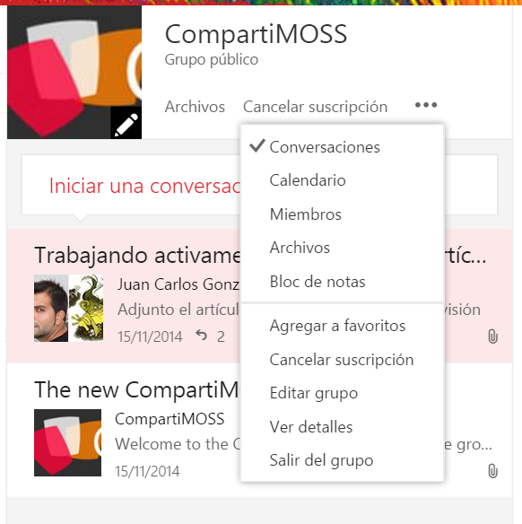
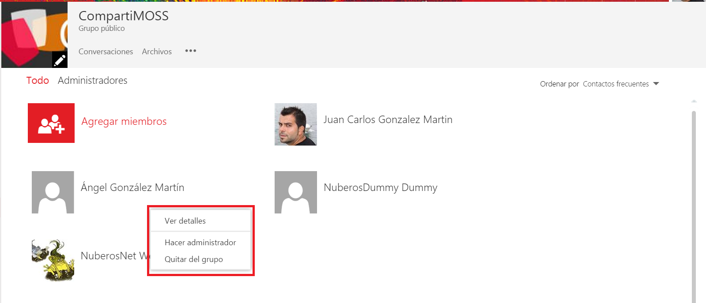
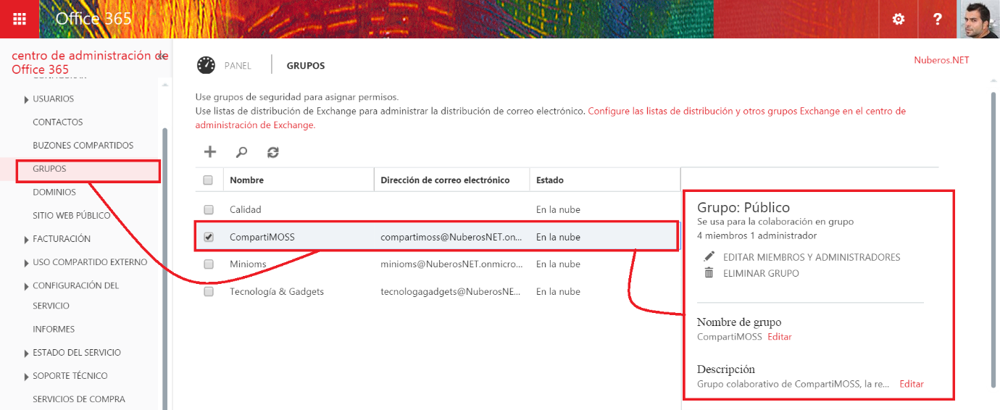
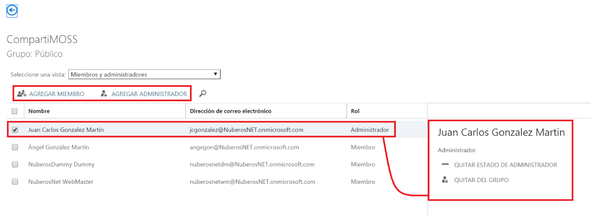
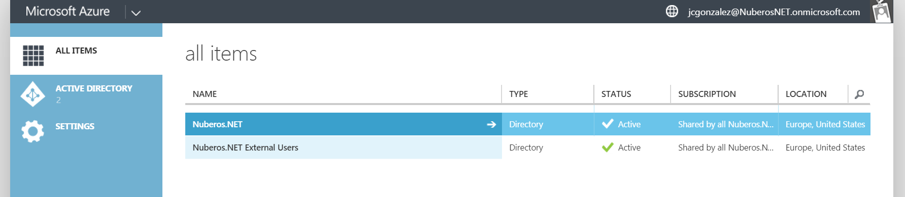
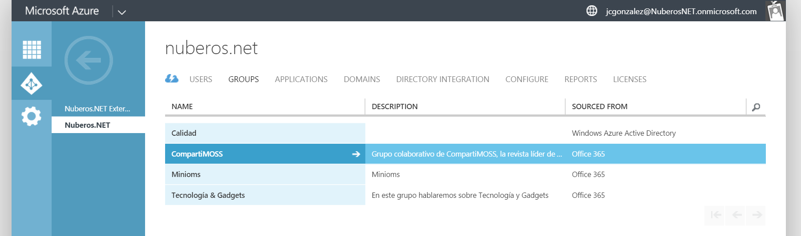
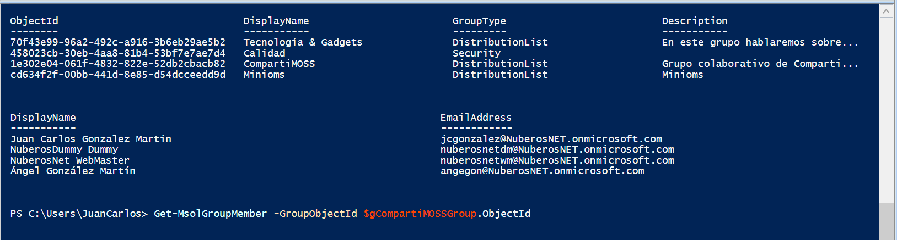

​La funcionalidad de Grupos de Office 365 facilita el trabajo colaborativo entre personas de una organización dotándoles de funcionalidad de valor añadido como muro conversacional, experiencia de usuario completamente integrada en Outlook Web App (OWA) en Office 365 y capacidades adicionales como calendario de grupo, sitio de SharePoint Online dónde ir dejando los documentos del grupo, etc. Adicionalmente, los Grupos de Office 365 cuentan con opciones adicionales de configuración como se verá en el presente artículo.

**Opciones de configuración para Grupos de Office 365**

Desde el punto de vista de configuración, un Grupo de Office 365 se puede manejar de tres formas diferenciadas:

- Desde la interfaz de usuario del Grupo en OWA.
- Desde la sección Grupos del portal de Administración de Office 365, ya que un Grupo de Office 365 viene a ser un tipo especial de grupo de directorio activo definido bajo el concepto de "Colaboración en grupo".
- Desde las opciones de administración del servicio de Azure AD asociado a Office 365 que nos permite administrar el Directorio Activo vinculado a cada tenant de Office 365.
- La interfaz de línea de comandos proporcionada por PowerShell.


**Posibilidades de configuración en el propio Grupo**

Desde el acceso a un Grupo en OWA, un usuario administrador del mismo puede acceder a todas las opciones de configuración disponibles como por ejemplo:

- Acceder al listado de miembros suscritos al Grupo así como a la información de los administradores del Grupo. Desde la página de miembros del Grupo se pueden añadir nuevos miembros.
- Ver los detalles del Grupo y editarlo.




Si vemos estas opciones en detalle:

- Al editar el Grupo, tendremos la posibilidad de cambiar toda la información que originalmente se indicó en su creación: nombre, descripción, idioma para el grupo, o el idioma del grupo. En cambio, no podremos cambiar el estado del grupo de "´Publico" a "Privado".
- La página de "Miembros" nos muestra los integrantes actuales del Grupo a la vez que nos permite realizar operaciones de administración típicas como añadir nuevos miembros al Grupo, eliminar un miembro del Grupo o hacer a un miembro existente Administrador del Grupo.




**Posibilidades de configuración a través** **del portal de Administración de Office 365**

Las mismas opciones que se han visto en la sección anterior están disponibles a través del portal de Administración de Office 365. En concreto, la opción "GRUPOS" del menú vertical del portal da acceso a todos los Grupos que se han creado en el tenant, lo que incluye los Grupos relativos a colaboración en grupo objeto del presente artículo:



Como se puede apreciar en la Imagen 2, al seleccionar un Grupo definido para colaboración en grupo se habilita un panel desde el que se pueden hacer las mismas operaciones comentadas:

- Editar el nombre y descripción del Grupo.
- Acceder a la información de los miembros del Grupo, así como añadir nuevos miembros, actualizar la información de miembros existentes (incluyendo su rol) o bien eliminar miembros del grupo.




**Posibilidades de configuración a través**  **del portal de Microsoft Azure**

Finalmente, la última posibilidad para administrar  y configurar Grupos de Office 365 haciendo uso de la interfaz de usuario viene dada por el portal de Microsoft Azure ya que desde el pasado mes de diciembre es posible administrar el directorio activo (DA) de Azure asociado a un tenant de Office 365 haciendo uso del portal de Microsoft Azure:

- Para acceder al DA de Azure asociado al tenant, sólo hay que hacer clic en el enlace Azure AD del menú vertical del portal de Administración de Office 365 de forma que a continuación se muestra el portal de Microsoft Azure que permite administrar la suscripción correspondiente (y gratuita) vinculada al tenant de Office 365 y desde dónde se puede gestionar el servicio de Azure AD del tenant.




- Como se aprecia en la Imagen 5, la suscripción de Microsoft Azure asociada al tenant de Office 365 únicamente cuenta con el servicio de Azure AD en el que por defecto se encuentra definido el DA del tenant de Office 365 y dónde es posible agregar Directorios Activos adicionales en caso de que sea necesario.
- Si se hace clic en el AD asociado al tenant de Office 365, de nuevo se puede acceder (como en los apartados anteriores) a la información relativa a los Grupos creados en el tenant.




- En el caso de Azure AD, dado un Grupo definido para trabajo colaborativo no es posible realizar los mismos tipos de configuración vistos hasta ahora: editar / eliminar miembros existentes y añadir nuevos miembro. Sólo es posible visualizar la información del Grupo y la de los miembros que forman parte del Grupo.


**Posibilidades de configuración a través**  **de PowerShell**

Como alternativa a la gestión y configuración de Grupos con la interfaz de usuario, Office 365 permite manejar los Grupos haciendo uso de PowerShell y los comandos por defecto definidos por Microsoft que se pueden encontrar en el siguiente artículo de soporte: [https://support.office.com/es-es/article/Usar-PowerShell-para-administrar-grupos-aeb669aa-1770-4537-9de2-a82ac11b0540](https://support.office.com/es-es/article/Usar-PowerShell-para-administrar-grupos-aeb669aa-1770-4537-9de2-a82ac11b0540). Además de estos comandos específicos para Grupos, es posible utilizar comandos estándar PowerShell para Office 365 para trabajar con cualquier tipo de grupo como los comandos Get-MsolGroup y Get-MsolGroupMember. El siguiente script PowerShell muestra cómo obtener todos los Grupos de un tenant de Office 365 y los miembros de un Grupo particular del tenant:

```
#Conexión a Office 365
```

```
$sUserName="<Usuario_Offce365>"
```

```
$sMessage="Introduce your Office 365 Credentials"
```

```
$msolcred = get-credential -UserName $sUserName -Message $sMessage
```

```
connect-msolservice -credential $msolcred
```

```
#Comandos PowerShell específicos para trabajar con Grupos de Office 365
```

```
Get-MsolGroup
```

```
$gCompartiMOSSGroup=Get-MsolGroup | Where {$_.DisplayName -eq "CompartiMOSS"}
```

```
Get-MsolGroupMember -GroupObjectId $gCompartiMOSSGroup.ObjectId | Format-Table DisplayName,EmailAddress 
```

La salida por pantalla correspondiente es la que se muestra en la Imagen 7.



**Conclusiones**

Además de las posibilidades de colaboración que los Grupos añaden a una organización, es posible administrarlos y configúralos de diversas formas haciendo uso de la interfaz de usuario o de PowerShell. A día de hoy, las posibilidades de gestión que brinda la interfaz de usuario son mucho más sencillas que las que proporciona PowerShell.


**Juan Carlos González Martín**
MVP SharePoint de SharePoint Server | Cloud & Productivity Advisor en MVP CLUSTER
E-Mail de Contacto: [juancarlos.gonzalez@fiveshareit.es](mailto:juancarlos.gonzalez@fiveshareit.es)    
Twitter: @jcgm1978
Blog: [https://jcgonzalezmartin.wordpress.com/](https://jcgonzalezmartin.wordpress.com/)

